# ALSCL 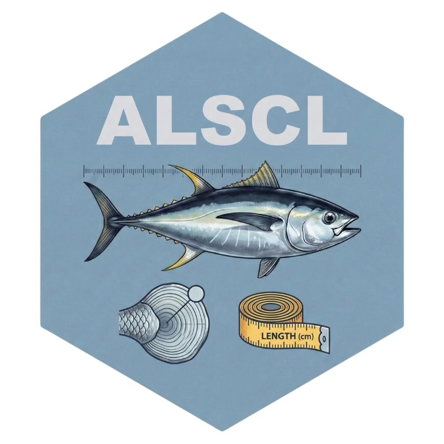

<!-- badges: start -->
[](https://github.com/Linbojun99/ALSCL)
[](https://www.gnu.org/licenses/gpl-3.0)
<!-- badges: end -->

**Age-based and Length-based Statistical Catch-at-Length Models for Fish Stock Assessment**

ALSCL is an R package for fitting statistical catch-at-length models to fishery-independent survey data using [TMB](https://github.com/kaskr/adcomp) (Template Model Builder). See the [User Guide vignette](vignettes/ALSCL_User_Guide.Rmd) and the paper:

> Zhang, F. & Cadigan, N. G. (2022). An age- and length-structured statistical catch-at-length model for hard-to-age fisheries stocks. *Fish and Fisheries*, 23, 1121–1135. [doi:10.1111/faf.12673](https://doi.org/10.1111/faf.12673)

## Overview

Estimating cohort dynamics from length-based data is a long-standing challenge in fisheries stock assessment, especially for hard-to-age species where otolith reading is unreliable or unavailable. Traditional age-structured catch-at-length models (ACL) convert numbers-at-age to numbers-at-length via a fixed age-length key, but cannot account for **length-dependent processes** — such as size-selective fishing mortality and individual growth variability — within each cohort.

Meanwhile, the increasing availability of high-quality **fishery-independent survey data** (survey catch-at-length, weight-at-length, maturity-at-length) has created opportunities for stock assessment models that rely solely on survey data, avoiding the well-known uncertainties in fisheries-dependent catch reporting.

The **ALSCL** package addresses both challenges by providing two integrated models:

- **ACL** (Age-structured Catch-at-Length) — the classical approach that tracks population dynamics in age space $N(a, t)$ and projects to length via an age-length probability matrix (**pla**). Fast and well-suited when growth is predictable.
- **ALSCL** (Age- and Length-Structured Catch-at-Length) — a hybrid model that simultaneously tracks the **three-dimensional dynamics** across time, age, and length $N(l, a, t)$. Growth is modeled via a **transition matrix** $\mathbf{G}$ that explicitly represents how individuals move between length bins over each time step. ALSCL estimates fishing mortality at length ($F_l$) directly, with $F_a$ derived as a secondary output.

Simulation studies using yellowtail flounder (*Limanda ferruginea*) and bigeye tuna (*Thunnus obesus*) operating models demonstrate that ALSCL outperforms ACL by providing more accurate estimates of age-based population dynamics when length-dependent processes are important (Zhang & Cadigan, 2022).

Estimation is performed via maximum likelihood with the objective function calculated in TMB and minimized in R via `stats::nlminb()`. The package includes a comprehensive suite of diagnostic visualization, model comparison, retrospective analysis, and simulation tools.

## Getting help

- For questions about how to use ALSCL or interpret the model results, please post on the [Discussion board](https://github.com/Linbojun99/ALSCL/discussions).
- For bug reports or feature requests, please post in the [Issue tracker](https://github.com/Linbojun99/ALSCL/issues).
- See the [User Guide vignette](vignettes/ALSCL_User_Guide.Rmd) for a comprehensive bilingual (English/Chinese) walkthrough with worked examples.

## Citation

Zhang, F. & Cadigan, N. G. (2022). An age- and length-structured statistical catch-at-length model for hard-to-age fisheries stocks. *Fish and Fisheries*, 23, 1121–1135. [doi:10.1111/faf.12673](https://doi.org/10.1111/faf.12673)

Please cite the above paper if you use ALSCL in a publication so that we can track how it is being used.

---

## Table of Contents

- [Overview](#overview)
- [Getting help](#getting-help)
- [Citation](#citation)
- [Installation](#installation)
- [Mathematical Framework](#mathematical-framework)
- [Quick Start](#quick-start)
- [Data Format](#data-format)
- [Species Presets](#species-presets)
- [Parameter Customization](#parameter-customization)
- [Diagnostic Plots](#diagnostic-plots)
- [Model Comparison](#model-comparison)
- [Theming & Customization](#theming--customization)
- [Output Structure](#output-structure)
- [Function Reference](#function-reference)

---

## Installation

```r
# Install dependencies
install.packages(c("TMB", "reshape2", "ggplot2", "patchwork", "ggridges", "cowplot"))

# Install from GitHub
devtools::install_github("Linbojun99/ALSCL")
library(ALSCL)
```

---

## Mathematical Framework

The following notation follows Zhang & Cadigan (2022) and Supplements A–B of the original paper.

### Population Dynamics

The core of ACL is classical age-structured cohort dynamics:

$$n_{a+1,\, t+1} = n_{a,t}\, e^{-Z_{a,t}}$$

$$Z_{a,t} = F_{a,t} + M_{a,t}$$

where $n_{a,t}$ is population abundance at age $a$ in time step $t$; $Z_{a,t}$, $M_{a,t}$, and $F_{a,t}$ are the total, natural, and fishing mortality rates. A **plus group** accumulates fish at maximum age $A$:

$$n_{A,t} = n_{A-1,\, t-1}\, e^{-Z_{A-1,\, t-1}} + n_{A,\, t-1}\, e^{-Z_{A,\, t-1}}$$

### Fishing Mortality Structure

Fishing mortality is modeled on the log scale with a **separable AR(1) × AR(1) covariance** across ages and years. $\log(F_{a,t})$ follows a multivariate normal distribution with constant mean $\mu_F$ and separable covariance:

$$\text{Cov}\!\bigl(\log F_{a,t},\;\log F_{a-i,\, t-j}\bigr) = \frac{\sigma_F^2 \;\phi_A^{|i|}\;\phi_T^{|j|}}{\bigl(1 - \phi_A^2\bigr)\bigl(1 - \phi_T^2\bigr)}$$

so that $\text{Corr}\!\bigl(\log F_{a,t},\;\log F_{a-i,\,t-j}\bigr) = \phi_A^{|i|}\,\phi_T^{|j|}$, where $\phi_A$ and $\phi_T$ are the age and time autocorrelation coefficients. The parameters to estimate are $\mu_F$, $\sigma_F^2$, $\phi_A$, and $\phi_T$. Natural mortality $M_{a,t}$ is assumed known.

### Recruitment

Log-recruitment follows an **AR(1)** process over time:

$$r_t = \bar{r}\, e^{\text{dev}_t}, \quad \text{dev}_{t+1} = \varphi_r\, \text{dev}_t + \varepsilon_t, \quad \varepsilon_t \sim N(0, \sigma_r^2)$$

where $\bar{r}$ is median recruitment, $\varphi_r$ is the autoregressive coefficient, and $\sigma_r$ is the standard deviation of temporal variation.

### Initial Conditions

Initial numbers-at-age derive from an equilibrium age distribution:

$$n_{a,1} = r_1\, e^{-Z_{\text{init}}(a-1)}\, e^{\varepsilon_a}, \quad a = 1, \ldots, A$$

where $Z_{\text{init}}$ governs the initial age structure, and $\varepsilon_a \sim N(0, \sigma_{\text{init}}^2)$.

### Age-to-Length Conversion (ACL)

Numbers at age are transferred to numbers at length via the **age-length probability matrix** $\mathbf{P}$:

$$\mathbf{n}_{l|t} = \mathbf{P} \cdot \mathbf{n}_{a|t}$$

Each element $p_{l,a} = \Pr\!\bigl(LB_l < X_a \leq UB_l\bigr)$ where $X_a \sim N(\mu_a, \sigma_a^2)$, and mean length-at-age follows the **von Bertalanffy growth function**:

$$\mu_a = L_\infty\!\bigl(1 - e^{-k(a - a_0)}\bigr), \qquad \sigma_a = \mu_a \cdot cv_l$$

where $L_\infty$, $k$, and $a_0$ are von Bertalanffy parameters, and $cv_l$ is the coefficient of variation of length-at-age.

> **Numerical stability (Supplement A):** Computing $p_{l|a}$ via `pnorm()` can cause TMB auto-differentiation errors when probabilities approach zero (e.g., small length bins for old fish). The package uses a **4th-order Taylor series approximation** of the standard normal PDF $\varphi(z)$, expanded about the midpoint $M = (L+U)/2$ (Zhang & Cadigan, 2022, Eq. A2):
>
> $$\int_L^U \varphi(z)\,dz \approx \varphi(M) \Bigl[ d_1 + \tfrac{1}{6}(M^2 - 1)\,d_3 + \tfrac{1}{120}(M^4 - 6M^2 + 3)\,d_5 \Bigr]$$
>
> where $d_k = (U-M)^k - (L-M)^k$, and $L$, $U$ are the standardized length bin bounds. This provides stable gradients across all age–length combinations, avoiding the numerical issues with the built-in `pnorm()` in TMB's auto-differentiation framework.

### Growth Transition Matrix (ALSCL)

ALSCL replaces the fixed age-length key with a **growth transition matrix** $\mathbf{G}$ that models how individuals move between length bins over each time step:

$$\mathbf{n}_{l|t+1} = \mathbf{G} \cdot \text{diag}\!\bigl(e^{-Z_{l,t}}\bigr) \cdot \mathbf{n}_{l|t}$$

Each element $G_{ij}$ gives the probability of growing from length bin $j$ into length bin $i$ over one time step, constructed from the von Bertalanffy expected growth increment and an associated CV for growth variability ($cv_{\text{grow}}$). This formulation enables length-based population dynamics without requiring a fixed age dimension, making it particularly suitable for hard-to-age species where individual growth variability is high or length-dependent selectivity is important.

### Derived Quantities

From numbers-at-length, the model computes:

$$b_{l,t} = n_{l,t} \cdot w_l, \quad sb_{l,t} = b_{l,t} \cdot \text{mat}_l, \quad B_t = \sum_l b_{l,t}, \quad SSB_t = \sum_l sb_{l,t}$$

where $w_l$ and $\text{mat}_l$ are weight and maturity at the midpoint of length bin $l$.

### Observation Model

Survey catch-at-length data follow a **lognormal** observation model:

$$SN_{l,t} = q_l \cdot n_{l,t} \cdot e^{\varepsilon_{l,t}}, \qquad \varepsilon_{l,t} \sim N(0, \sigma_{SN}^2)$$

where $q_l$ is length-dependent survey catchability (modeled via a logistic function with parameters $L_{50}$ and $L_{95}$), and $\sigma_{SN}$ is the observation error standard deviation.

---

## Quick Start

### Simulated Data (Tuna M6 Operating Model)

```r
library(ALSCL)
library(ggplot2)
library(patchwork)

# 1. Initialize biological parameters (tuna preset: Linf=152, vbk=0.38, quarterly)
params <- initialize_params(species = "tuna")

# 2. Calculate derived variables (pla matrix, growth transition matrix, weight, maturity)
bio_vars <- sim_cal(params)

# 3. Simulate population dynamics (100 years, 95-year burn-in → 20 quarterly observations)
sim <- sim_data(bio_vars, params,
                sim_year = 100, output_dir = tempdir(),
                iter_range = 42, return_iter = 42)

# 4. Prepare data frames (LengthBin + year columns)
nyear <- sim$nyear
nlen  <- sim$nlen
year_char <- as.character(2020:(2020 + nyear - 1))
borders <- seq(15, 120, 5)
len_labels <- c(paste0("<", borders[1]),
                paste0(borders[-length(borders)], "-", borders[-1]),
                paste0(">", borders[length(borders)]))

data.CatL <- data.frame(LengthBin = len_labels, t(sim$SN_at_len), check.names = FALSE)
colnames(data.CatL) <- c("LengthBin", year_char)
data.wgt  <- data.frame(LengthBin = len_labels, sim$weight, check.names = FALSE)
colnames(data.wgt) <- c("LengthBin", year_char)
data.mat  <- data.frame(LengthBin = len_labels, sim$mat, check.names = FALSE)
colnames(data.mat) <- c("LengthBin", year_char)

# 5. Fit ACL model
result_acl <- run_acl(
  data.CatL, data.wgt, data.mat,
  rec.age = 0.25, nage = 20, M = 0.2,
  sel_L50 = 30, sel_L95 = 50,
  parameters = list(log_Linf = log(152), log_vbk = log(0.38),
                    mean_log_F = log(0.2)),
  train_times = 3, silent = TRUE
)

# 6. Fit ALSCL model
result_alscl <- run_alscl(
  data.CatL, data.wgt, data.mat,
  rec.age = 0.25, nage = 20, M = 0.2,
  sel_L50 = 30, sel_L95 = 50, growth_step = 0.25,
  parameters = list(log_Linf = log(152), log_vbk = log(0.38),
                    mean_log_F = log(0.2)),
  train_times = 3, silent = TRUE
)

# 7. Check convergence
result_acl$converge       # "relative convergence (4)" = OK
result_acl$bound_hit      # FALSE = no parameters on boundary
```

### Your Own Data

```r
# Read CSV files (first column = LengthBin, rest = year columns)
data.CatL <- read.csv("survey_catch_at_length.csv", check.names = FALSE)
data.wgt  <- read.csv("weight_at_length.csv",       check.names = FALSE)
data.mat  <- read.csv("maturity_at_length.csv",      check.names = FALSE)

# Set biological parameters for your species
result <- run_acl(data.CatL, data.wgt, data.mat,
                  rec.age = 1, nage = 7, M = 0.8,
                  sel_L50 = 28, sel_L95 = 36,
                  train_times = 3, silent = TRUE)
```

---

## Data Format

Both models require three data frames sharing the same `LengthBin` labels and year columns:

| Data        | Content                             | Typical source                      |
| :---------- | :---------------------------------- | :---------------------------------- |
| `data.CatL` | Survey catch-at-length (numbers)    | Fishery-independent research survey |
| `data.wgt`  | Weight-at-length (kg or g)          | Length-weight relationship          |
| `data.mat`  | Maturity-at-length (proportion 0–1) | Maturity ogive                      |

Each data frame has the format:

| LengthBin |  2020 |   2021 |  ... |  2039 |
| :-------- | ----: | -----: | ---: | ----: |
| <15       | 399.5 | 1199.4 |  ... | 437.4 |
| 15-20     | 416.6 |  962.5 |  ... | 597.9 |
| ...       |   ... |    ... |  ... |   ... |
| >120      |  33.7 |   34.0 |  ... |  19.1 |

Supported bin label formats: open-ended (`"<15"`, `">120"`), continuous ranges (`"15-20"`, `"20-25"`), and unequal-width bins. No `NA` values allowed — use `0` instead.

---

## Species Presets

Built-in presets provide biologically-calibrated starting values, bounds, and map settings derived from actual assessment scripts:

| Preset       | Species             | Time Step | $L_\infty$ | $k$  | Max Age | $M$  | Source                                    |
| :----------- | :------------------ | :-------- | :--------- | :--- | :------ | :--- | :---------------------------------------- |
| `"flatfish"` | Yellowtail flounder | Annual    | 60         | 0.15 | 15      | 0.2  | M7 operating model (Zhang & Cadigan 2022) |
| `"tuna"`     | Bigeye tuna         | Quarterly | 152        | 0.38 | 20      | 0.2  | M6 operating model (Zhang & Cadigan 2022) |
| `"krill"`    | Antarctic krill     | Annual    | 60–90      | 0.45 | 7       | 0.8  | Krill assessment literature               |
| `NULL`       | Generic             | Annual    | 100        | 0.2  | 20      | 0.2  | Wide-range defaults                       |

```r
# List available presets
create_parameters("acl", species = "?")

# View preset defaults (returns: start, lower, upper, map)
create_parameters("acl", species = "tuna")
create_parameters("alscl", species = "krill")

# Preset + custom override (only the specified entries change)
create_parameters("acl", species = "tuna",
                  parameters = list(log_Linf = log(160)))
```

---

## Parameter Customization

### Starting Values

Pass a named list to `parameters` — only include entries you want to change:

```r
result <- run_acl(data.CatL, data.wgt, data.mat,
  rec.age = 1, nage = 15, M = 0.2, sel_L50 = 15, sel_L95 = 20,
  parameters = list(log_Linf = log(60), log_vbk = log(0.2), mean_log_R = 8),
  train_times = 3, silent = TRUE)
```

### Bounds

Pass named lists to `parameters.L` (lower) and `parameters.U` (upper):

```r
result <- run_alscl(data.CatL, data.wgt, data.mat,
  rec.age = 1, nage = 15, M = 0.2, sel_L50 = 15, sel_L95 = 20,
  growth_step = 1,
  parameters.L = list(log_Linf = log(40), log_vbk = log(0.05)),
  parameters.U = list(log_Linf = log(100), log_vbk = log(1.0)),
  train_times = 5, silent = TRUE)
```

### Map (Fix / Free Parameters)

The `map` argument controls which parameters are fixed vs estimated. Setting `factor(NA)` fixes a parameter at its starting value.

```r
# Fix Linf at 90mm (e.g., from external length data or literature)
result <- run_acl(...,
  parameters = list(log_Linf = log(90)),
  map = list(log_Linf = factor(NA)))

# Free F year-correlation (normally fixed) + fix Linf
result <- run_acl(...,
  parameters = list(log_Linf = log(90)),
  map = list(log_Linf = factor(NA), logit_log_F_y = factor(1)))
```

### Default Fixed Parameters

| Parameter                         | Description                  | Reason                                                       |
| :-------------------------------- | :--------------------------- | :----------------------------------------------------------- |
| `log_std_log_F`                   | SD of F deviations           | Identifiability — cannot separate from mean F with length data alone |
| `logit_log_F_y`                   | AR(1) of F over years        | Stability — freely estimating often causes non-convergence   |
| `logit_log_F_a` / `logit_log_F_l` | AR(1) of F over ages/lengths | Stability — as above                                         |
| `t0` / `log_t0`                   | VB $t_0$ parameter           | Typically set to 0 or a small value; poorly identifiable     |

### Key Parameters Reference

| Parameter        | ACL Name         | ALSCL Name         | Scale     | Description                                             |
| :--------------- | :--------------- | :----------------- | :-------- | :------------------------------------------------------ |
| Initial Z        | `log_init_Z`     | `log_init_Z`       | log       | Total mortality for equilibrium age structure in year 1 |
| Initial N0 SD    | `log_std_log_N0` | `log_sigma_log_N0` | log       | SD of initial age-structure deviations                  |
| Mean Recruitment | `mean_log_R`     | `mean_log_R`       | log       | Median recruitment across all years                     |
| SD of R          | `log_std_log_R`  | `log_sigma_log_R`  | log       | SD of recruitment temporal deviations                   |
| AR(1) of R       | `logit_log_R`    | `logit_log_R`      | logit     | Recruitment autocorrelation coefficient                 |
| Mean F           | `mean_log_F`     | `mean_log_F`       | log       | Mean fishing mortality across ages/lengths and years    |
| SD of F          | `log_std_log_F`  | `log_sigma_log_F`  | log       | SD of F deviations (fixed by default)                   |
| AR(1) F year     | `logit_log_F_y`  | `logit_log_F_y`    | logit     | F year-to-year autocorrelation (fixed by default)       |
| AR(1) F age/len  | `logit_log_F_a`  | `logit_log_F_l`    | logit     | F age/length autocorrelation (fixed by default)         |
| VB k             | `log_vbk`        | `log_vbk`          | log       | Von Bertalanffy growth rate                             |
| VB Linf          | `log_Linf`       | `log_Linf`         | log       | Asymptotic body length                                  |
| VB t0            | `t0`             | `log_t0`           | raw / log | Age at length zero (fixed by default)                   |
| Length CV        | `log_cv_len`     | `log_cv_len`       | log       | CV of length-at-age variability                         |
| Growth CV        | —                | `log_cv_grow`      | log       | ALSCL only: CV of growth increment variability          |
| Obs. error       | `log_std_index`  | `log_sigma_index`  | log       | SD of survey observation error (lognormal)              |

---

## Diagnostic Plots

All plot functions accept a model result object and return `ggplot2` objects that can be further customized with standard ggplot2 syntax.

### Catch-at-Length Fit

The most fundamental diagnostic: does the model reproduce the observed survey length-frequency data? `plot_CatL()` overlays observed (points) and predicted (lines) catch-at-length for each year. Large systematic deviations indicate model misspecification — e.g., the growth curve is wrong, selectivity is mismodeled, or the observation error structure is inadequate.

```r
# ACL: observed vs predicted catch-at-length by year
plot_CatL(result_acl, type = "year")
```

<p align="center">
  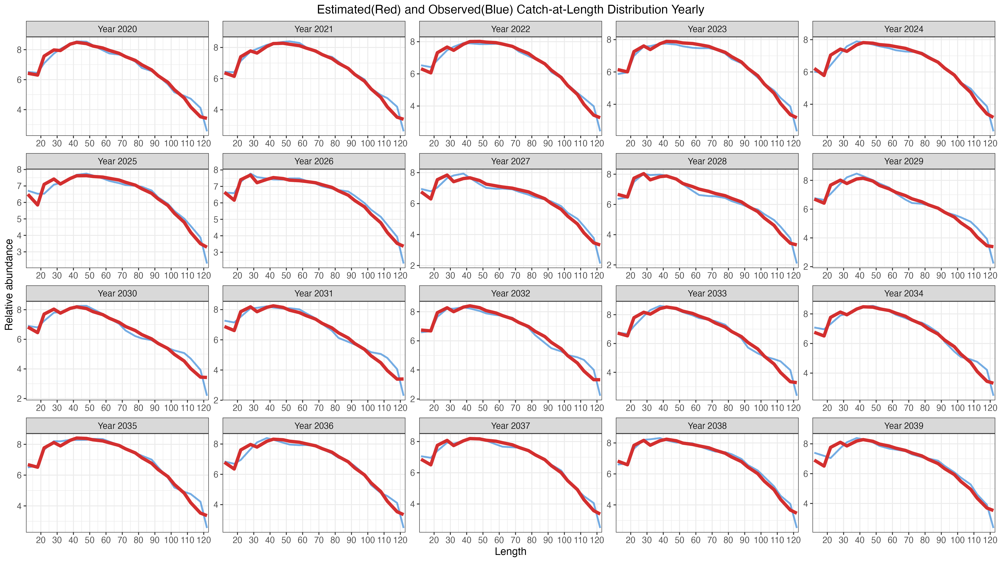
</p>


```r
# ALSCL: observed vs predicted catch-at-length by year
plot_CatL(result_alscl, type = "year")
```

<p align="center">
  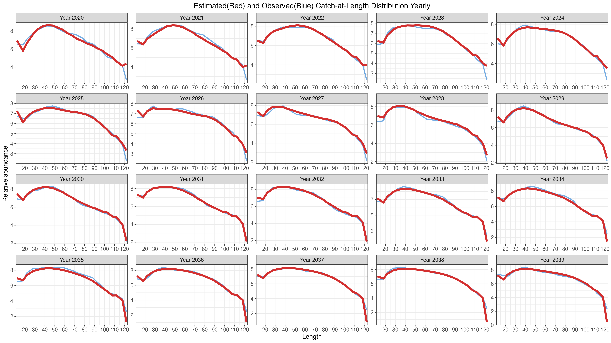
</p>


### Residual Diagnostics

Residuals reveal patterns that summary statistics miss. `plot_residuals()` shows Pearson residuals (log observed − log predicted) with a LOESS smoother. Ideally, residuals should scatter randomly around zero with no trends. Persistent positive residuals at a length bin mean the model underestimates abundance there; negative residuals mean overestimation. For ALSCL, the open-ended tail bin (e.g., `>120`) often produces extreme residuals because near-zero observations create large log-ratios — use `resid_cap` to symmetrically clip these.

```r
# ACL residuals by length bin
plot_residuals(result_acl, type = "length")
```

<p align="center">
  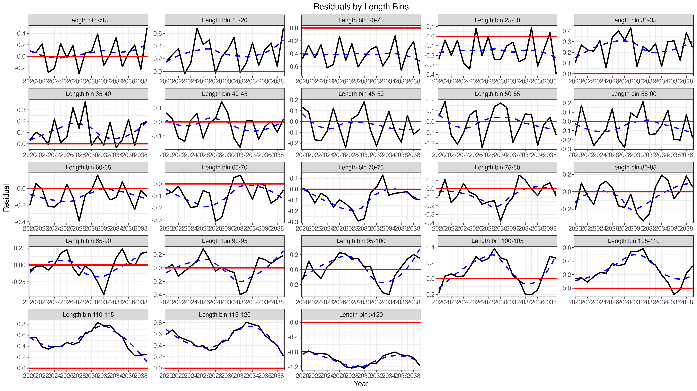
</p>


```r
# ALSCL residuals — use resid_cap to handle extreme tail bins (e.g., >120)
plot_residuals(result_alscl, type = "length", resid_cap = 1)
```

<p align="center">
  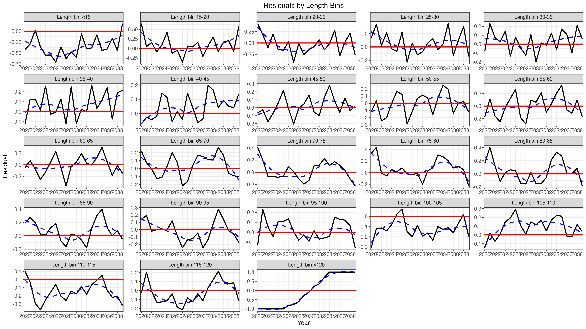
</p>


### Growth Curve & Age-Length Matrix

The von Bertalanffy growth curve defines the mapping between age and expected length — it is the backbone of the ACL model. `plot_VB()` shows the estimated curve with optional 95% CI ribbon derived from the standard error of `log_vbk` via the delta method. If the CI is missing (subtitle says "SE = NaN"), it means a growth parameter hit its optimization boundary — see [Convergence Checklist](#convergence-checklist). `plot_pla()` visualizes the resulting age-length probability matrix: each cell shows $p_{l|a}$, the probability that a fish of age $a$ falls into length bin $l$.

```r
# ACL: Von Bertalanffy growth with 95% CI ribbon
plot_VB(result_acl, se = TRUE)

# ACL: age-length probability heatmap
plot_pla(result_acl)
```

<p align="center">
  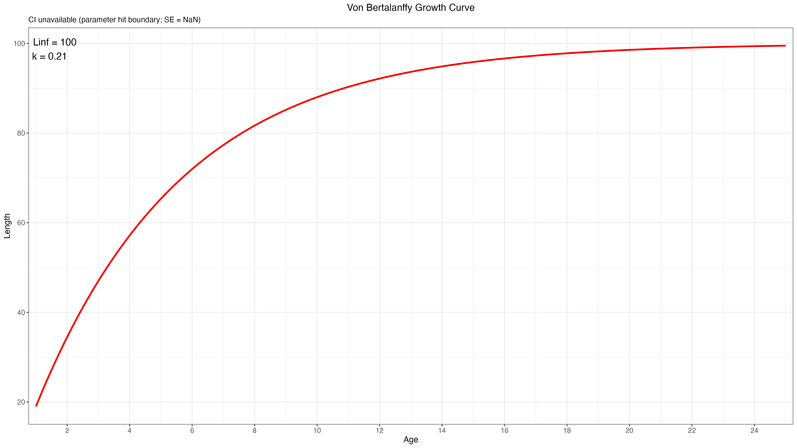
  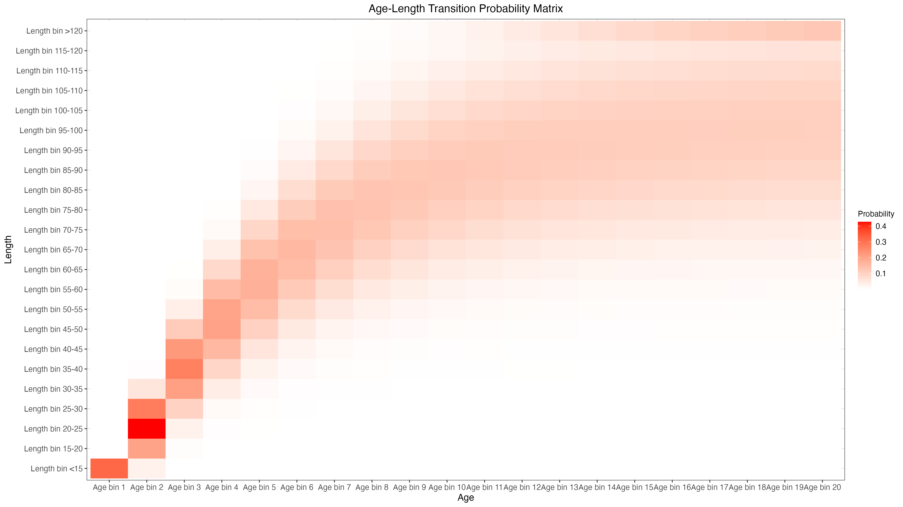
</p>


### Population Dynamics

These plots show the estimated population trajectories over time — recruitment (new fish entering the population each year) and spawning stock biomass (SSB, the reproductive portion of the stock). Comparing ACL and ALSCL trajectories reveals whether the two models agree on stock trends. Divergence often indicates that length-dependent processes (captured by ALSCL but not ACL) are influencing the estimates.

```r
# ACL
plot_recruitment(result_acl, se = TRUE)
plot_SSB(result_acl, type = "SSB", se = TRUE)
```

<p align="center">
  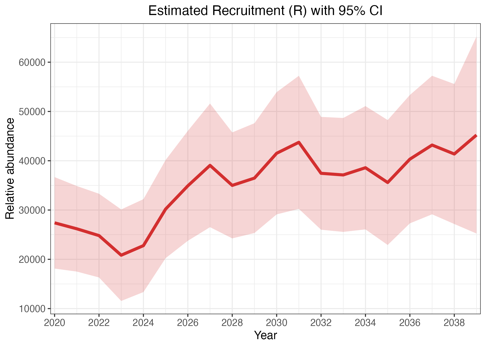
  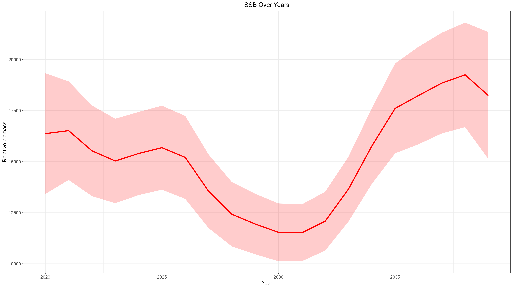
</p>


```r
# ALSCL
plot_recruitment(result_alscl, se = TRUE)
plot_SSB(result_alscl, type = "SSB", se = TRUE)
```

<p align="center">
  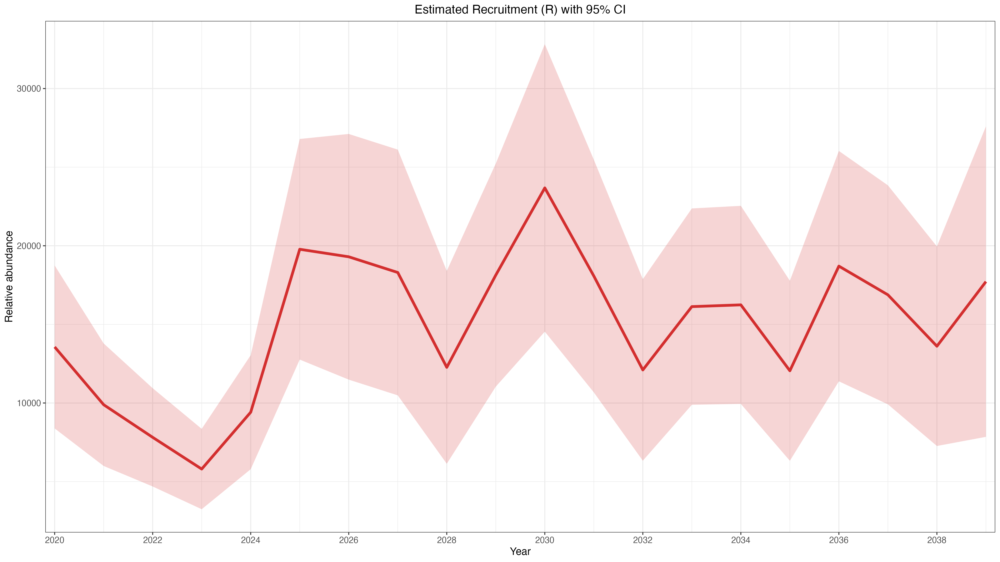
  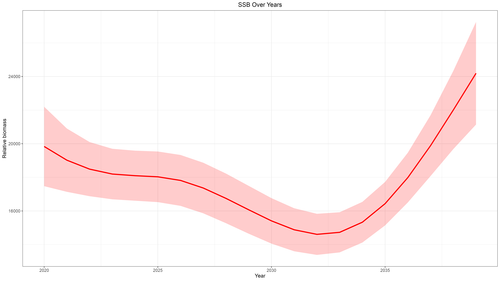
</p>


### Fishing Mortality

Fishing mortality ($F$) quantifies the rate at which fish are removed by fishing. `plot_fishing_mortality()` with `type = "age"` or `type = "length"` produces a heatmap showing how F varies across the age/length dimension and over time. This reveals selectivity patterns (which sizes are most heavily fished) and temporal trends (whether fishing pressure is increasing or decreasing). ACL estimates F-at-age directly; ALSCL estimates F-at-length, which better captures size-selective gear effects.

```r
# ACL: F heatmap by age × year
plot_fishing_mortality(result_acl, type = "age")
```

<p align="center">
  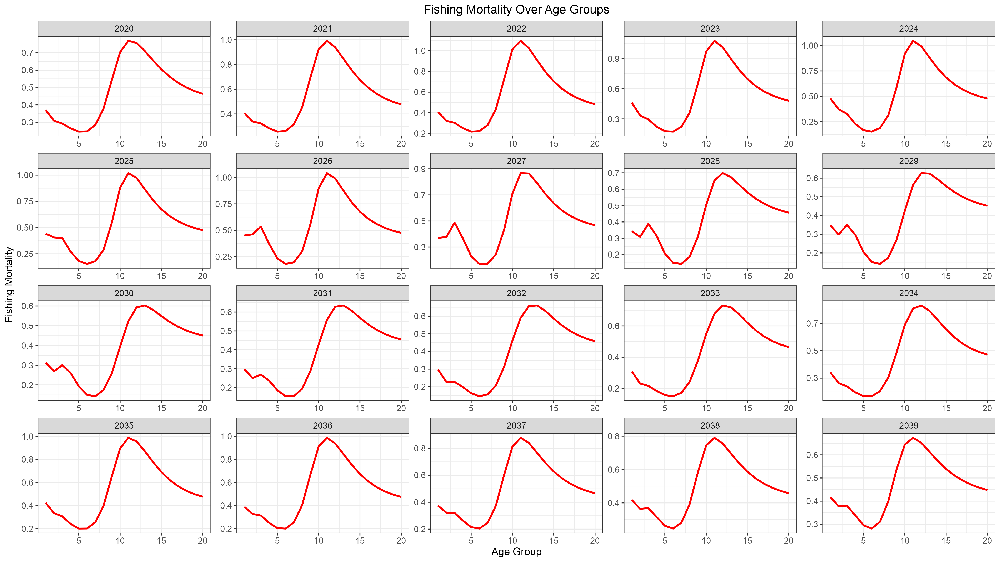
</p>


```r
# ALSCL: F heatmap by length × year
plot_fishing_mortality(result_alscl, type = "length")
```

<p align="center">
  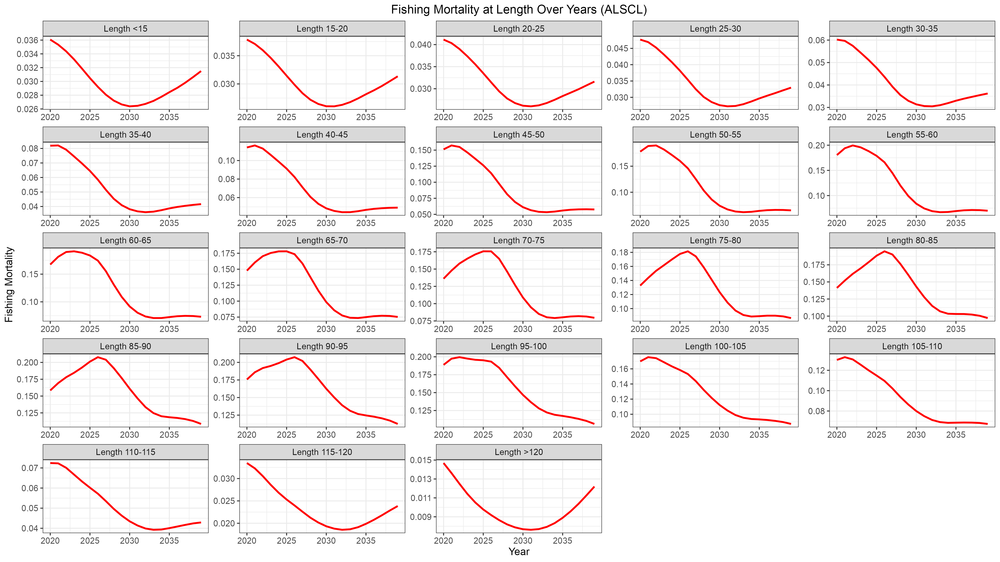
</p>


### Length Frequency Ridgelines

Ridgeline (joy) plots stack the predicted length-frequency distributions across years, providing an intuitive view of how the population's size structure evolves over time. Shifts in the peak location indicate changes in growth or recruitment strength; broadening of the distribution suggests increased age/length diversity. The `ridges_scale` parameter auto-adjusts so that peaks fill ~80% of the inter-year spacing, even for species with many narrow length bins.

```r
# ACL ridgeline plot
plot_ridges(result_acl, palette = "ocean")
```

<p align="center">
  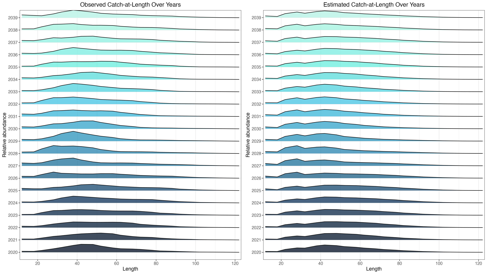
</p>


```r
# ALSCL ridgeline plot (auto-scaled for many bins)
plot_ridges(result_alscl, palette = "viridis")
```

<p align="center">
  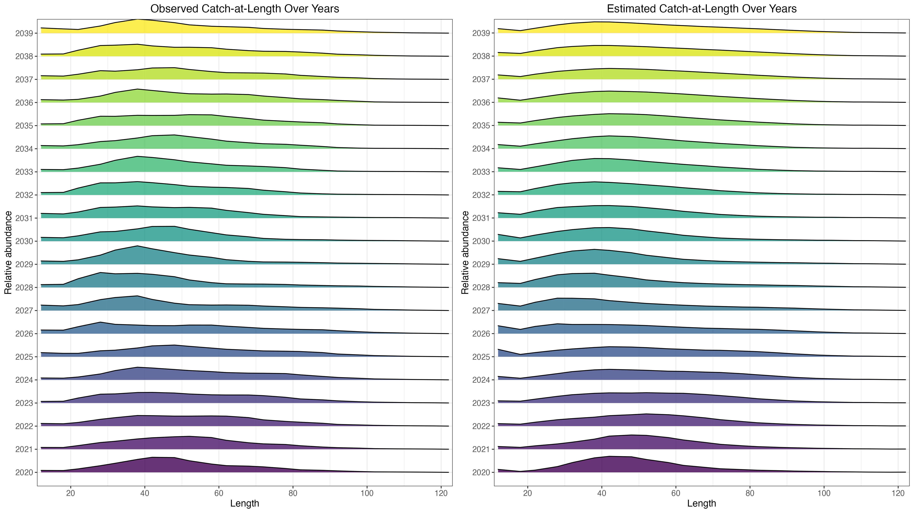
</p>


---

## Model Comparison

A central question in stock assessment is whether the added complexity of ALSCL (3D dynamics, growth transition matrix) provides meaningfully better estimates than the simpler ACL. The `compare_models()` function and associated plot functions facilitate this comparison.

```r
# Summary statistics (AIC, BIC, RMSE, R²)
comp <- compare_models(result_acl, result_alscl)
print(comp$summary)
```

### Time Series Comparison

The most direct comparison: overlay estimated SSB, biomass, recruitment, and abundance from both models on the same axes. Agreement between models increases confidence in the estimates; divergence highlights where model assumptions matter most.

```r
plot_compare_ts(result_acl, result_alscl)   # SSB, B, R, N overlay
```

<p align="center">
  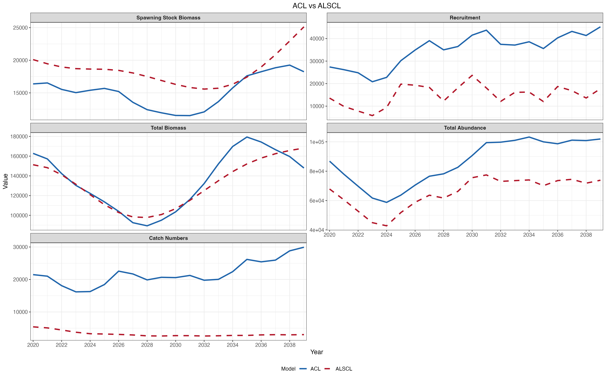
</p>


### Fishing Mortality Comparison

Because ACL estimates F-at-age and ALSCL estimates F-at-length, a fair annual summary requires choosing a comparable metric. **Apical F** (maximum F across ages/lengths per year) reflects the peak fishing pressure on the most vulnerable group, and is comparable across model types. The arithmetic mean is often misleading for ALSCL because many length bins have near-zero F, diluting the average.

```r
plot_compare_annual_F(result_acl, result_alscl)              # apical F (default)
plot_compare_annual_F(result_acl, result_alscl, method = "mean")  # mean F
```

<p align="center">
  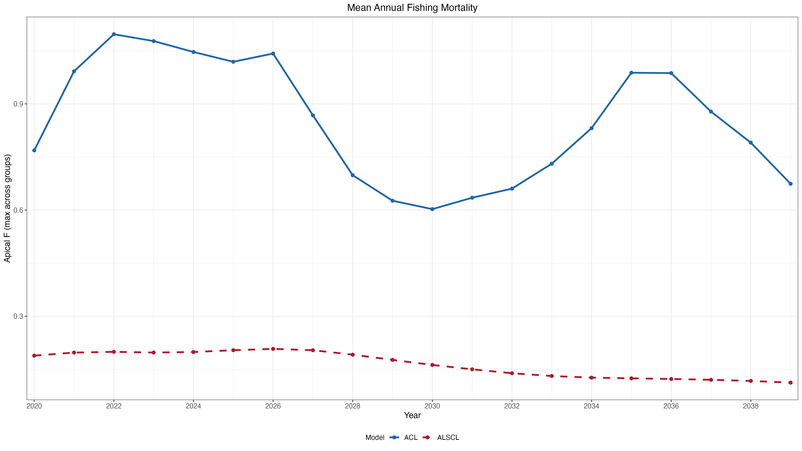
</p>


### Growth & Selectivity Comparison

Both models estimate the same von Bertalanffy parameters ($L_\infty$, $k$) — but from different likelihoods. If they agree, the growth estimates are robust. The selectivity comparison shows how each model estimates the survey gear's length-dependent catchability — differences here may explain divergences in other outputs.

```r
plot_compare_growth(result_acl, result_alscl)          # VB growth curves overlay
plot_compare_selectivity(result_acl, result_alscl)     # selectivity curves
```

<p align="center">
  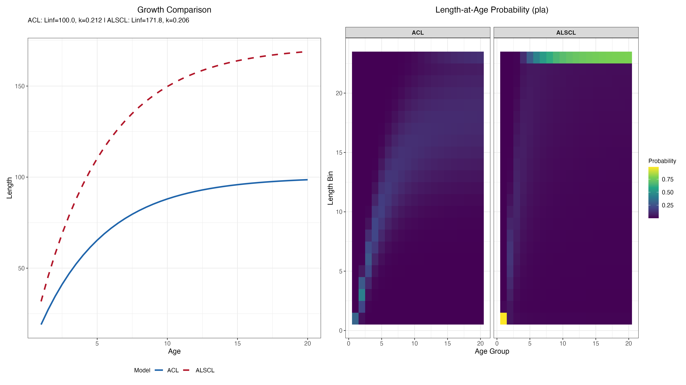
  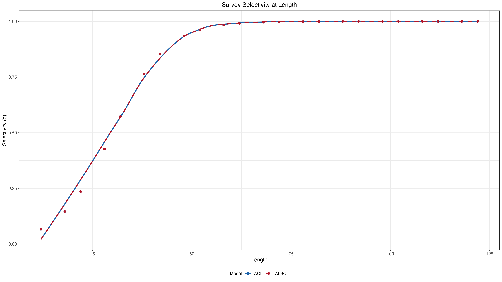
</p>


### Residual & Metrics Comparison

Side-by-side residual distributions and quantitative fit metrics (AIC, BIC, RMSE, negative log-likelihood) provide an objective basis for model selection. Lower AIC/BIC and tighter residual distributions indicate better fit, though parsimony should also be considered — ALSCL has more parameters and may overfit with short time series.

```r
plot_compare_residuals(result_acl, result_alscl, data.CatL = data.CatL)
plot_compare_metrics(result_acl, result_alscl)
```

<p align="center">
  
  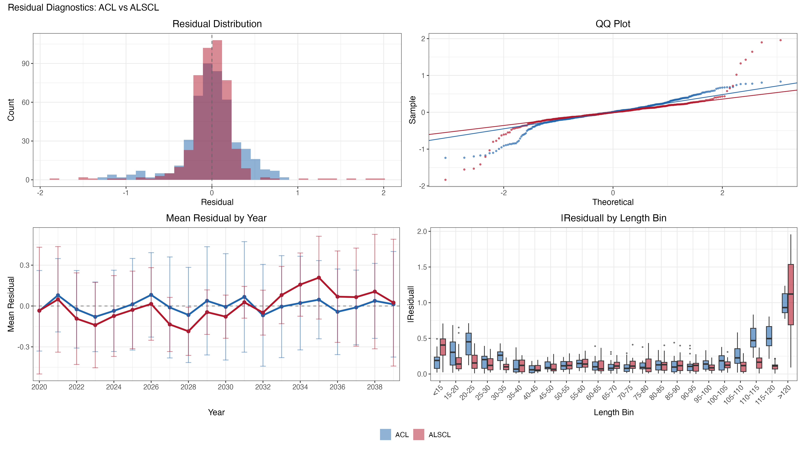
</p>


---

## Theming & Customization

A global theming system controls plot appearance across all functions:

```r
# Set global theme
acl_theme_set(
  font_family    = "Helvetica",
  title_size     = 16,
  palette        = "viridis",
  linewidth      = 1.2,
  base_theme     = "theme_minimal"
)

# Per-plot overrides always available
plot_recruitment(result_acl, title = "Custom Title", font_family = "Times")

# Reset to defaults
acl_theme_set()
```

---

## Output Structure

Both `run_acl()` and `run_alscl()` return a named list:

| Element       | Description                                                  |
| :------------ | :----------------------------------------------------------- |
| `report`      | Named list of all derived quantities: N (abundance), B (biomass), SSB (spawning stock biomass), F (fishing mortality), Rec (recruitment), CN (catch numbers), Linf, vbk, t0, pla, selectivity, etc. |
| `opt`         | TMB optimizer output: estimated parameter vector, objective function value, convergence code, number of iterations |
| `est_std`     | Data frame of parameter estimates with standard errors from `sdreport()`. NaN standard errors indicate parameters on bounds |
| `year`        | Character vector of year labels                              |
| `len_mid`     | Numeric vector of length bin midpoints                       |
| `len_label`   | Character vector of length bin labels (e.g., "<15", "15-20", ..., ">120") |
| `converge`    | Convergence message from `nlminb` (look for "relative convergence (4)") |
| `bound_hit`   | Logical — `TRUE` if any estimated parameter sits exactly on its bound |
| `bound_check` | Named vector showing the distance of each parameter from its nearest bound |
| `par_low_up`  | Matrix of parameter estimates alongside their lower and upper bounds |
| `model_type`  | Character: `"ACL"` or `"ALSCL"`                              |

### Convergence Checklist

```r
result$converge                   # Should be "relative convergence (4)"
result$bound_hit                  # Should be FALSE
max(abs(result$final_outer_mgc))  # Should be < 0.001
```

If `bound_hit = TRUE`, the standard errors for boundary parameters will be `NaN` and confidence intervals (e.g., `plot_VB(..., se = TRUE)`) cannot be computed. To resolve this, widen bounds via `parameters.L`/`parameters.U`, fix the parameter via `map`, provide better starting values, or increase `train_times` for more random restarts.

---

## Function Reference

### Core Modeling Functions

| Function              | Description                                                  |
| :-------------------- | :----------------------------------------------------------- |
| `run_acl()`           | Fit the ACL (Age-structured Catch-at-Length) model. Constructs a TMB model object from survey catch-at-length, weight-at-length, and maturity-at-length data, estimates parameters via `nlminb` optimization with optional multiple random starts (`train_times`), and returns population dynamics, estimated F-at-age, growth parameters, and model diagnostics. Supports user-supplied starting values, bounds, and parameter map. |
| `run_alscl()`         | Fit the ALSCL (Age- and Length-Structured Catch-at-Length) model. Same interface as `run_acl()` with the addition of `growth_step` (time resolution for the growth transition matrix $\mathbf{G}$) and `log_cv_grow` (growth variability). Estimates F-at-length directly; F-at-age is derived. |
| `compare_models()`    | Compare two fitted model results (ACL vs ALSCL or any pair). Computes AIC, BIC, negative log-likelihood, RMSE, R², and correlation between observed and predicted catch-at-length for each model. Returns a summary data frame for side-by-side comparison. |
| `create_parameters()` | Generate a complete parameter configuration (starting values, lower/upper bounds, map) for a given model type (`"acl"` or `"alscl"`) and optional species preset (`"flatfish"`, `"tuna"`, `"krill"`, or `NULL` for generic). User-supplied overrides are merged with defaults. |
| `generate_map()`      | Create or merge a TMB `map` list that controls which parameters are fixed vs freely estimated. User-supplied entries override defaults; unspecified parameters keep their default mapping. |

### Simulation Functions

| Function                     | Description                                                  |
| :--------------------------- | :----------------------------------------------------------- |
| `initialize_params(species)` | Initialize a full set of biological and population parameters for simulation. Species presets (`"flatfish"`, `"tuna"`, `"krill"`) configure mortality, growth, selectivity, and time-step settings appropriate for each species. All parameters can be individually overridden. |
| `sim_cal()`                  | Calculate derived biological variables from base parameters: age-length probability matrix (pla), growth transition matrix (Gij, for length-based engine), weight-at-length, maturity-at-length, and selectivity-at-length. Required preprocessing step before `sim_data()`. |
| `sim_data()`                 | Simulate a complete population dynamics trajectory and generate survey catch-at-length observations with lognormal measurement error. Supports both age-based (M7/flatfish) and length-based (M6/tuna) simulation engines, selected automatically based on parameter configuration. Includes burn-in period and optional multiple replicates. |

### Single-Model Diagnostic Plots

| Function                   | `type` Options                | Key Parameters                           | Description                                                  |
| :------------------------- | :---------------------------- | :--------------------------------------- | :----------------------------------------------------------- |
| `plot_CatL()`              | `"length"`, `"year"`          | `exp_transform`, line/point controls     | Plot observed vs model-predicted survey catch-at-length. `type = "year"` shows length distributions for each year; `type = "length"` shows time series for each length bin. `exp_transform = TRUE` exponentiates log-scale predictions. |
| `plot_residuals()`         | `"year"`, `"length"`          | `f` (LOESS span), `resid_cap`            | Pearson residuals (log observed − log predicted) with LOESS smoother and reference line at zero. `type = "year"` facets by year; `type = "length"` facets by length bin. `resid_cap` symmetrically caps extreme residuals (useful for tail bins with near-zero observations). |
| `plot_VB()`                | —                             | `se`, `se_type`, `age_range`             | Von Bertalanffy growth curve with estimated $L_\infty$ and $k$ annotated. `se = TRUE` adds 95% CI ribbon (or error bars) based on delta-method standard errors of `log_vbk`. Gracefully degrades with a warning subtitle when SEs are NaN (parameter on boundary). |
| `plot_pla()`               | —                             | `low_col`, `high_col`                    | Heatmap of the age-length probability matrix $\mathbf{P}$: each cell shows $p_{l \mid a}$, the probability that a fish of age $a$ falls into length bin $l$. Color gradient from `low_col` to `high_col`. |
| `plot_recruitment()`       | —                             | `se`, `se_type`                          | Estimated recruitment time series with optional 95% CI ribbon or error bars. Shows temporal patterns and recruitment deviations from the mean. |
| `plot_fishing_mortality()` | `"year"`, `"age"`, `"length"` | `se_type`, `facet_ncol`                  | `type = "year"`: total F time series. `type = "age"`: heatmap of F-at-age × year (ACL). `type = "length"`: heatmap of F-at-length × year (ALSCL). Faceted plots for age/length show individual trajectories with optional CI. |
| `plot_biomass()`           | `"B"`, `"BL"`, `"BA"`         | `se`, `facet_ncol`                       | `"B"`: total biomass time series. `"BL"`: biomass by length bin (faceted). `"BA"`: biomass by age (faceted). Optional 95% CI for total biomass. |
| `plot_abundance()`         | `"N"`, `"NL"`, `"NA"`         | `se`, `facet_ncol`                       | Same as `plot_biomass()` but for abundance (numbers) instead of biomass. |
| `plot_catch()`             | `"CN"`, `"CNA"`, `"CNL"`      | `se`, `facet_ncol`                       | Predicted catch in numbers: total (`"CN"`), by age (`"CNA"`), or by length bin (`"CNL"`). |
| `plot_SSB()`               | `"SSB"`, `"SBL"`, `"SBA"`     | `se`, `facet_ncol`                       | Spawning stock biomass: total time series (`"SSB"`), by length bin (`"SBL"`), or by age (`"SBA"`). |
| `plot_SSB_Rec()`           | —                             | `age_at_recruitment`, `point_*`          | Spawning stock biomass vs recruitment scatter plot, illustrating the stock-recruitment relationship. Each point represents one year; chronological order can be traced via color gradient. |
| `plot_ridges()`            | —                             | `palette`, `ridges_scale`                | Ridgeline (joy) plot of predicted length frequency distributions across years. Auto-scales ridge heights based on the maximum proportion (`ridges_scale = NULL`), or accepts a user-supplied scaling factor. 8 built-in palettes: `"default"`, `"ocean"`, `"viridis"`, `"warm"`, `"cool"`, `"earth"`, `"neon"`, `"pastel"`. |
| `plot_deviance()`          | `"R"`, `"F"`                  | `se`, `log`, `point_*`                   | Deviance (random effect) contributions. `"R"`: recruitment deviations over time. `"F"`: fishing mortality deviations across ages/lengths and years. Optional CI from `sdreport`. |
| `plot_retro()`             | —                             | `rho_digits`, `rho_position`, `rho_size` | Retrospective analysis plot showing how SSB (or other quantities) estimates change when successive years of data are removed. Mohn's rho statistic is annotated on the plot to quantify retrospective bias. |

### Model Comparison Plots

| Function                     | Key Parameters                                     | Description                                                  |
| :--------------------------- | :------------------------------------------------- | :----------------------------------------------------------- |
| `plot_compare_ts()`          | `quantities`, `se`, `ncol`                         | Overlay time series of selected quantities (SSB, B, R, N, CN, CB, F) from two models on the same axes. Optional CI bands. Faceted by quantity. |
| `plot_compare_residuals()`   | `bins`, `qq_alpha`, `errorbar_width`               | Four-panel residual comparison: boxplots by model, Q-Q plots, and residual-vs-fitted for each model. Allows direct visual comparison of model fit quality. |
| `plot_compare_growth()`      | `ref_data`, `ref_name`, `show_points`, `nls_start` | Overlay VB growth curves from two models. Optionally add external reference data (e.g., observed length-at-age from otolith reads) with NLS-fitted curve for comparison. |
| `plot_compare_CatL()`        | `years`, `ncol`, `obs_*`                           | Overlay predicted catch-at-length from two models against observed data for selected years. Observed data shown as points; each model as a separate colored line. |
| `plot_compare_selectivity()` | (common params)                                    | Compare estimated survey selectivity-at-length curves from two models. Shows how each model estimates the length-dependent catchability of the survey gear. |
| `plot_compare_F()`           | `palette`                                          | Side-by-side F heatmaps from two models: ACL shows F-at-age × year, ALSCL shows F-at-length × year. Useful for visualizing structural differences between model formulations. A message is issued when comparing across different dimensions. |
| `plot_compare_annual_F()`    | `method`                                           | Annual summary F from two models on the same time series plot. `method = "apical"` (default): maximum F across ages/lengths per year — provides comparable metric across model types. `method = "mean"`: arithmetic mean F — can be misleading for ALSCL due to many near-zero length bins. |
| `plot_compare_metrics()`     | `metrics`, `label_size`, `bar_width/alpha`         | Grouped bar chart comparing model fit statistics (AIC, BIC, RMSE, NLL, R², correlation) side by side. Quick visual summary for model selection. |

### Theming Functions

| Function          | Description                                                  |
| :---------------- | :----------------------------------------------------------- |
| `acl_theme_set()` | Set global theme parameters that apply to all subsequent plot calls: `font_family`, `title_size`, `axis_title_size`, `axis_text_size`, `strip_text_size`, `legend_text_size`, `palette`, `linewidth`, `base_theme`, `title_hjust`. Pass no arguments to reset to defaults. |
| `acl_theme()`     | Retrieve the current global theme settings as a named list. Useful for inspecting active settings or passing to custom plots. |

---

## BibTeX

```bibtex
@article{zhang2022age,
  title     = {An age- and length-structured statistical catch-at-length model
               for hard-to-age fisheries stocks},
  author    = {Zhang, Fan and Cadigan, Noel G.},
  journal   = {Fish and Fisheries},
  volume    = {23},
  pages     = {1121--1135},
  year      = {2022},
  doi       = {10.1111/faf.12673},
  publisher = {Wiley}
}
```

---

## License

GPL-3 © Hongyu Lin, Fan Zhang, Sisong Dong
