# ALSCL 

<!-- badges: start -->
[](https://github.com/Linbojun99/ALSCL/actions)
[](https://www.gnu.org/licenses/gpl-3.0)
<!-- badges: end -->

**Documentation:** [English](https://linbojun99.github.io/ALSCL/) · [简体中文](https://linbojun99.github.io/ALSCL/zh/) · [Function reference](https://linbojun99.github.io/ALSCL/reference/)

The documentation website includes tutorials, worked figures and all public functions, with a language switch on every page. [Website build and publishing instructions](website/README.md).

**基于年龄及体长结构的统计调查体长种群评估模型**

**Age-based and Length-based Statistical Catch-at-Length Models for Fish Stock Assessment**

**Version 2.0.0 · 简体中文 / English**

ALSCL 是基于 TMB（Template Model Builder）的 R 包，用于通过渔业独立调查数据拟合统计体长模型。完整双语手册见 [Wiki](https://github.com/Linbojun99/ALSCL/wiki)，理论基础见以下论文。

ALSCL is an R package for fitting statistical catch-at-length models to fishery-independent survey data using [TMB](https://github.com/kaskr/adcomp) (Template Model Builder). See the [User Guide](https://github.com/Linbojun99/ALSCL/wiki) and the paper:

> Zhang, F. & Cadigan, N. G. (2022). An age- and length-structured statistical catch-at-length model for hard-to-age fisheries stocks. *Fish and Fisheries*, 23, 1121–1135. [doi:10.1111/faf.12673](https://doi.org/10.1111/faf.12673)

## 模型概述 / Overview

对于难以判龄的鱼类，仅靠长度资料推断队列动态具有挑战性。ACL 在年龄维度推进数量，再用年龄—体长概率矩阵转换为长度组成；这种方法不能完整表达同一队列内部的长度相关死亡和个体生长差异。

Estimating cohort dynamics from length-based data is a long-standing challenge in fisheries stock assessment, especially for hard-to-age species where otolith reading is unreliable or unavailable. Traditional age-structured catch-at-length models (ACL) convert numbers-at-age to numbers-at-length via a fixed age-length key, but cannot account for **length-dependent processes** — such as size-selective fishing mortality and individual growth variability — within each cohort.

渔业独立调查提供的体长别数量、体重和成熟比例，使仅使用调查资料开展评估成为可能，减少对商业捕获量报告的依赖；调查可捕性、采样设计和生物假设仍需仔细评估。

Meanwhile, the increasing availability of high-quality **fishery-independent survey data** (survey catch-at-length, weight-at-length, maturity-at-length) has created opportunities for stock assessment models that rely solely on survey data, avoiding the well-known uncertainties in fisheries-dependent catch reporting.

ALSCL 包提供以下两种模型：

The **ALSCL** package addresses both challenges by providing two integrated models:

- **ACL（年龄结构模型）**：在年龄空间追踪种群动态，并通过 `pla` 将年龄别尾数转换为体长别尾数。适合检验年龄结构假设下的种群变化。

- **ACL** (Age-structured Catch-at-Length) — the classical approach that tracks population dynamics in age space $`N(a, t)`$ and projects to length via an age-length probability matrix (**pla**). Fast and well-suited when growth is predictable.
- **ALSCL（年龄—体长联合结构模型）**：同时追踪时间、年龄、体长三个维度，使用增长转移矩阵 G，直接在体长维度估计捕捞死亡率，并由队列存活推导年龄别 F。

- **ALSCL** (Age- and Length-Structured Catch-at-Length) — a hybrid model that simultaneously tracks the **three-dimensional dynamics** across time, age, and length $`N(l, a, t)`$. Growth is modeled via a **transition matrix** $`\mathbf{G}`$ that explicitly represents how individuals move between length bins over each time step. ALSCL estimates fishing mortality at length ($`F_l`$) directly, with $`F_a`$ derived as a secondary output.

Zhang & Cadigan (2022) 的黄尾鲽和大眼金枪鱼模拟表明，在长度相关过程重要时，ALSCL 可改善年龄别种群动态的估计。实际表现取决于数据和假设，应结合诊断及模拟评估。

Simulation studies using yellowtail flounder (*Limanda ferruginea*) and bigeye tuna (*Thunnus obesus*) operating models demonstrate that ALSCL outperforms ACL by providing more accurate estimates of age-based population dynamics when length-dependent processes are important (Zhang & Cadigan, 2022).

估计通过 TMB 和 R 的 `stats::nlminb()` 完成，支持诊断绘图、模型比较、回溯分析与模拟实验。

Estimation is performed via maximum likelihood with the objective function calculated in TMB and minimized in R via `stats::nlminb()`. The package includes a comprehensive suite of diagnostic visualization, model comparison, retrospective analysis, and simulation tools.

## 获取帮助 / Getting help

- 使用与结果解读：[讨论区 / Discussions](https://github.com/Linbojun99/ALSCL/discussions)。
- 错误与功能建议：[问题反馈 / Issues](https://github.com/Linbojun99/ALSCL/issues)。
- 完整教程：[双语 Wiki / Bilingual manual](https://github.com/Linbojun99/ALSCL/wiki)。

## 目录 / Table of contents

- [开始使用 / Getting started](#installation)
- [数学原理 / Mathematical Framework](#mathematical-framework)
- [快速开始 / Quick start](#quick-start)
- [分步教程 / Step-by-step tutorial](#tutorial)
- [核心函数与参数 / Core functions](#functions)
- [全部绘图功能 / Visualization functions](#plots)
- [全局主题 / Global theme](#theme)
- [并行处理 / Parallel processing](#parallel)
- [引用与许可 / Citation and license](#citation)

| 完整学习资源 / Learning resource | 内容 / Contents |
|---|---|
| **[Wiki 双语书籍 / Wiki book](https://github.com/Linbojun99/ALSCL/wiki)** | 15 章、目录、前后页导航 / 15 chapters with navigation |
| [完整单页书稿 / Complete book](docs/BOOK.md) | Wiki 内容在仓库中的完整版本 / Versioned book in this repository |
| [模块化使用指南 / User guide](docs/USER_GUIDE.md) | 理论、数据、模拟、拟合、诊断与回溯 / Complete workflow |
| [43 个函数参考 / Function reference](docs/FUNCTION_REFERENCE.md) | 签名、默认值、所有参数 / Signatures and every argument |
| [45 张 YTF 图谱 / YTF gallery](docs/PLOT_GALLERY.md) | 22 个绘图函数及主要类型 / All plotting families |
| [两个完整案例 / Case studies](docs/CASE_STUDIES.md) | 年度 flatfish、季度 tuna 和 7 张图 / Annual and quarterly examples |
| [Excel 填表示例 / Workbook](docs/data/ALSCL_Data_Entry_Example.xlsx) | 三表及行列示意 / Three input sheets and instructions |

<a id="installation"></a>
## 开始使用 / Getting started

```r
# 安装 ALSCL / Install ALSCL
install.packages("remotes")
remotes::install_github("Linbojun99/ALSCL")
library(ALSCL)
packageVersion("ALSCL")
```

建议使用近期 R 版本。依赖由安装程序解析，包括 TMB、RcppEigen、ggplot2、ggsci、dplyr、tidyr、reshape2、ggridges、cowplot、RColorBrewer、patchwork、scales，以及 R 内置 stats/utils/parallel/tools。Excel 导入示例另需 `readxl`；重建图谱需 `jsonlite`。

Use a recent R release. Dependencies are resolved during installation; Excel import additionally uses readxl and atlas regeneration uses jsonlite.

首次运行 `run_*()` 自动编译 TMB 模板，需要与 R 匹配的 C++ 工具链。常规工作流直接调用拟合函数即可。可选缓存路径：`options(ALSCL.tmb.cache="writable/path")`。

The first fit compiles TMB with an R-compatible C++ toolchain. Call the fitting functions directly in regular workflows. A writable cache can be configured when needed.

<a id="mathematical-framework"></a>
## 数学原理 / Mathematical Framework

ALSCL 包提供 ACL（年龄结构）和 ALSCL（年龄—体长联合结构）两个调查体长评估模型。下式采用 Zhang & Cadigan (2022) 的模型框架，并明确本包的时间单位和随机效应参数化。

The ALSCL package provides an age-structured model (ACL) and a joint age–length model (ALSCL) for survey catch-at-length assessment. The framework follows [Zhang & Cadigan (2022)](https://doi.org/10.1111/faf.12673), with time units and random-effect parameterization stated explicitly below.

### 种群动态 / Population dynamics

令 $`i=1,\ldots,A`$ 为年龄组索引，$`a_i=a_{rec}+(i-1)\Delta t`$ 为实际年龄，$`t`$ 为模型时间步。ACL 在年龄维度推进存活；补充量进入第一组，最大年龄组为加组：

Let $`i=1,\ldots,A`$ index age classes, with actual age $`a_i=a_{rec}+(i-1)\Delta t`$, and let $`t`$ index model steps. ACL advances survivors by age, introduces recruitment in the first class, and retains survivors in the oldest plus group:

```math
N_{1,t}=R_t,\qquad Z_{i,t}=M+F_{i,t},
```

```math
N_{i+1,t+1}=N_{i,t}\exp(-Z_{i,t}),\qquad i=1,\ldots,A-2,
```

```math
N_{A,t+1}=N_{A-1,t}\exp(-Z_{A-1,t})+N_{A,t}\exp(-Z_{A,t}).
```

`M` 和 F 是**每个模型时间步**的瞬时死亡率；季度模型的 `growth_step=0.25`，M 和 F 也须使用季度率。生长参数 $`k`$ 按年定义。

M and F are instantaneous rates **per model step**. A quarterly model uses `growth_step=0.25` and quarterly mortality rates; growth parameter $`k`$ is annual.

### 捕捞死亡率 / Fishing mortality structure

ACL 按年龄估计 F，ALSCL 按体长估计 F。以 $`s`$ 表示相应的年龄或体长组，两个模型均使用可分离的 AR(1) × AR(1) 对数 F 偏差：

ACL estimates F by age, whereas ALSCL estimates F by length. With $`s`$ denoting the corresponding age or length class, both use separable AR(1) × AR(1) deviations in log F:

```math
F_{s,t}=\exp(\mu_F+d_{s,t}),\qquad
\mathrm{Cov}(d_{s,t},d_{s-h,t-j})=\sigma_F^2\phi_S^{|h|}\phi_T^{|j|}.
```

这里 $`\sigma_F`$ 是 TMB `SCALE(SEPARABLE(AR1(),AR1()), sigma_F)` 中的**边际标准差**；$`\phi_S`$、$`\phi_T`$ 分别控制组间和时间相关性。若用创新方差定义 AR(1)，协方差公式的尺度会不同；不能在本式中再除以两个 $`1-\phi^2`$ 因子。自然死亡率 M 作为已知输入。

Here $`\sigma_F`$ is the **marginal SD** in TMB's scaled, separable AR(1) density. The correlation parameters describe dependence across groups and time. Innovation-variance parameterizations use a different scaling; dividing this expression again by two $`1-\phi^2`$ factors would be incorrect. Natural mortality M is supplied as known.

### 补充量 / Recruitment

拟合模型用 AR(1) 对数偏差描述补充量。下面写成与边际标准差 $`\sigma_R`$ 一致的平稳形式：

The fitted models use AR(1) log recruitment deviations. The following stationary representation uses marginal SD $`\sigma_R`$:

```math
R_t=\exp(\mu_R+r_t),\qquad
r_1\sim N(0,\sigma_R^2),\qquad
r_{t+1}=\phi_R r_t+\eta_t,\quad
\eta_t\sim N\!\left(0,\sigma_R^2(1-\phi_R^2)\right).
```

$`\exp(\mu_R)`$ 是补充量的中位尺度，不是包含随机变异后的算术均值。完整模拟器 `sim_data()` 使用 Beverton–Holt 亲体补充关系及随机偏差；模拟器与拟合器的补充过程应分别理解。

$`\exp(\mu_R)`$ is the median recruitment scale, not the arithmetic mean including stochastic variation. The full `sim_data()` operating model uses Beverton–Holt stock–recruitment with random deviations; its recruitment process differs from the fitted model.

### 初始条件 / Initial conditions

第一期最小年龄组由 $`R_1`$ 给定，其余年龄组按初始死亡率与逐组扰动递推：

Initial recruitment defines the youngest class; older classes follow a recursive decline with an initial mortality rate and class-to-class deviations:

```math
\log N_{1,1}=\log R_1,\qquad
\log N_{i,1}=\log N_{i-1,1}-Z_{init}+u_{i-1},\quad
u_{i-1}\sim N(0,\sigma_{N0}^2).
```

因此 $`\log N_{i,1}=\log R_1-(i-1)Z_{init}+\sum_{j=1}^{i-1}u_j`$。扰动沿年龄组累积；不能把每个年龄的总扰动误当作相互独立。ALSCL 再用初始年龄—体长概率分配这些个体。

Thus the initial log abundance contains the cumulative sum of earlier class deviations. The total deviations at different ages are not independent. ALSCL allocates these initial numbers across length using age–length probabilities.

### 年龄—体长转换 / Age-to-length conversion (ACL)

给定年龄的长度服从均值由 von Bertalanffy 曲线决定的正态分布：

Length conditional on age follows a normal distribution whose mean is defined by the von Bertalanffy curve:

```math
\mu_i=L_\infty\left[1-e^{-k(a_i-t_0)}\right],\qquad
\sigma_i=CV_L\mu_i,
```

```math
p_{l|i}=\Phi\!\left(\frac{UB_l-\mu_i}{\sigma_i}\right)
       -\Phi\!\left(\frac{LB_l-\mu_i}{\sigma_i}\right),\qquad
N_{l,t}=\sum_i p_{l|i}N_{i,t}.
```

`pla` 表示这个年龄—体长概率矩阵，`plot_pla()` 用热图展示。实现使用支持自动微分的正态 CDF 差，并通过右尾对称计算和归一化处理数值稳定性。长度边界必须与调查分组一致。论文 Appendix S1 给出的固定阶 Taylor 近似是另一种积分近似，本包使用上述 CDF 实现。

`pla` is the age–length probability matrix shown by `plot_pla()`. Differentiable normal CDF differences, symmetric right-tail calculations and normalization provide the implemented numerical treatment. Boundaries must match survey bins. Appendix S1 describes a fixed-order Taylor approximation; the package uses the CDF formulation above.

### 生长转移矩阵 / Growth transition matrix (ALSCL)

ALSCL 保留 $`N_{l,i,t}`$ 的体长、年龄、时间三个维度。$`G_{j,l}`$ 表示从源体长组 $`l`$ 转入目的体长组 $`j`$ 的概率。普通年龄组的存活与增长为：

ALSCL retains length, age and time in $`N_{l,i,t}`$. Entry $`G_{j,l}`$ is the probability of moving from source length bin $`l`$ to destination bin $`j`$. Survival and growth for ordinary age classes follow:

```math
N_{j,i+1,t+1}=\sum_l G_{j,l}N_{l,i,t}\exp[-(M+F_{l,t})].
```

加组累加前一年龄组和原最大年龄组的存活及增长；补充量按最小年龄的长度分布进入第一年龄组。G 的各列和为 1，不允许缩短，最大体长组吸收右尾概率。长度变化仍可能留在同一分组内。

The plus group combines survivors and growth from the preceding and oldest age classes. Recruitment enters the youngest class with its length distribution. Columns of G sum to one, shrinkage is excluded, and the largest bin absorbs right-tail probability. Growth can still leave an individual within its original bin.

增长增量使用下面的平滑下降函数，标准差为 $`CV_G\mu_{\Delta L}`$：

Growth increments use the following smooth decreasing mean, with SD $`CV_G\mu_{\Delta L}`$:

```math
\mu_{\Delta L}(L)=\frac{\Delta t(1-e^{-k})L_\infty}
{1+\exp\!\left(-\log(19)\frac{L-0.5L_\infty}{0.05L_\infty-0.5L_\infty}\right)}.
```

此函数不是精确的任意时间步 VB 增量 $`(L_\infty-L)(1-e^{-k\Delta t})`$。`pla` 是给定年龄的长度分布，G 是给定源长度的一步转移概率，两者不能互换。`FL` 是长度别 F，`FA` 则由原队列的存活率推导。

This is not the exact arbitrary-step VB increment $`(L_\infty-L)(1-e^{-k\Delta t})`$. `pla` describes length given age, while G describes a one-step transition given source length. They are not interchangeable. `FL` is length-specific F; `FA` is derived from original-cohort survival.

### 派生量 / Derived quantities

输入的平均个体重量 $`w_{l,t}`$ 和成熟比例 $`m_{l,t}`$ 用于计算体长别生物量、成熟生物量及总量：

Mean individual weight $`w_{l,t}`$ and maturity proportion $`m_{l,t}`$ convert abundance into length-specific biomass, spawning biomass and totals:

```math
b_{l,t}=N_{l,t}w_{l,t},\qquad sb_{l,t}=b_{l,t}m_{l,t},\qquad
B_t=\sum_l b_{l,t},\qquad SSB_t=\sum_l sb_{l,t}.
```

`CN`、`CB` 是模型推算的渔业捕获尾数与重量，区别于输入的调查数量指数。生物量单位由个体重量和调查数量尺度共同决定。

`CN` and `CB` are derived fishery catch numbers and biomass, distinct from the input survey number index. Biomass units depend on weight units and the abundance scale.

### 调查观测 / Survey observations

令 $`I_{l,t}`$ 为调查数量指数，$`N_{l,t}`$ 为种群尾数。调查观测使用对数正态模型：

Let $`I_{l,t}`$ denote the survey number index and $`N_{l,t}`$ population abundance. Survey observations follow a lognormal model:

```math
\log I_{l,t}=\log q_l+\log N_{l,t}+\epsilon_{l,t},\qquad
\epsilon_{l,t}\sim N(0,\sigma_I^2),
```

```math
q_l=\left[1+\exp\!\left(-\log(19)\frac{L_l-L_{50}}{L_{95}-L_{50}}\right)\right]^{-1}.
```

`sel_L50`、`sel_L95` 固定调查可捕性 q，在两个指定体长处分别取 0.5 和 0.95；它们不是估计出来的渔业选择性。绝对丰度依赖 q、M 等假设。`exp(report$Elog_index)` 给出原尺度的中位数，算术均值还需乘以 $`\exp(\sigma_I^2/2)`$。

`sel_L50` and `sel_L95` fix survey catchability at 0.5 and 0.95 at the specified lengths; they are not estimated fishery selectivity. Absolute abundance depends on q, M and related assumptions. `exp(report$Elog_index)` is the original-scale median; the arithmetic mean also includes $`\exp(\sigma_I^2/2)`$.

### 估计与区间 / Estimation and uncertainty

TMB 用自动微分计算目标函数及导数，对随机效应采用 Laplace 近似；R 的 `nlminb()` 优化固定效应。`sdreport()` 使用局部曲率及 delta 方法给出近似标准误。绘图中的约 95% 区间是逐点区间；固定参数不贡献估计不确定性。

TMB uses automatic differentiation and a Laplace approximation for random effects; R's `nlminb()` optimizes fixed effects. `sdreport()` obtains approximate standard errors from local curvature and the delta method. Plotted 95% intervals are pointwise, and parameters held fixed do not contribute estimation uncertainty.

<a id="quick-start"></a>
## 快速开始 / Quick start

```r
library(ALSCL)
data("YTF_example")
x <- YTF_example
inputs <- x[c("data.CatL", "data.wgt", "data.mat")]
# 条件教学拟合，固定已知生物参数 / Conditional fit with known biology fixed
a <- do.call(run_acl, c(inputs, x$fit_args, x$fit_config$acl,
                       list(train_times=2, silent=TRUE)))
b <- do.call(run_alscl, c(inputs, x$fit_args, x$fit_config$alscl,
                         list(train_times=2, silent=TRUE)))
# 先诊断，再画图 / Diagnose before interpreting plots
diagnose_model(x$data.CatL, b)
plot_recruitment(b, se=TRUE)
plot_SSB(b, se=TRUE)
plot_fishing_mortality(b, type="year", se=TRUE)
plot_CatL(b, type="year", exp_transform=TRUE, facet_ncol=4)
plot_compare_ts(a, b, se=TRUE)
```

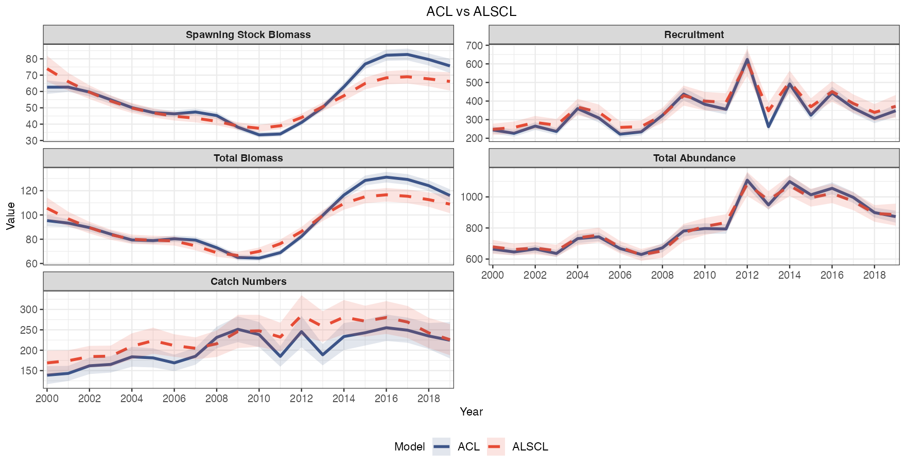

`YTF` 是 **26 项生物参数列表**，没有 `data.CatL`；`YTF_example` 才有 **23 体长组 × 20 期**的模拟三表。seed=4，预热 80 年，标签 2000–2019 仅为教学年份。原 `example_data` 保留作检查练习，物种、单位、零值含义及来源尚未核实。

`YTF` is a biological parameter list, not an observation dataset. `YTF_example` contains 23 bins × 20 periods of synthetic inputs. The legacy dataset remains available for inspection, with metadata unverified.

<a id="tutorial"></a>
## 分步教程 / Step-by-step tutorial

### 0. CPU 与任务规模 / CPU and workload

```r
cores <- parallel::detectCores()
workers <- if (is.na(cores)) 1L else max(1L, min(4L, cores - 1L))
```

首次学习建议 `ncores=1`。多初始点、模拟重复和回溯分别消耗进程，详见下方并行表。

Start with one worker; multistart, simulation and retrospectives allocate work differently.

### 1. 三张输入表 / Three input tables

| 表 / Table | 单元格填写 / Cell content |
|---|---|
| `data.CatL` | 体长组 × 时间的调查数量指数，非商业总捕获重量 / Survey number index |
| `data.wgt` | 同组同期的平均单尾体重，如 kg / Mean individual weight |
| `data.mat` | 同组同期成熟比例，0–1 / Mature proportion |

第一列为体长区间或中心，后续列为严格递增、等间隔时间。三表必须同维度同顺序。真实零值、缺失 NA 和未抽样不能混用。详见 [Excel 填写与导入](docs/USER_GUIDE.md#excel)。

The first column labels bins; remaining columns are ordered equally spaced periods. All tables must align. Establish the meaning of zeros, missing values and unsampled cells.

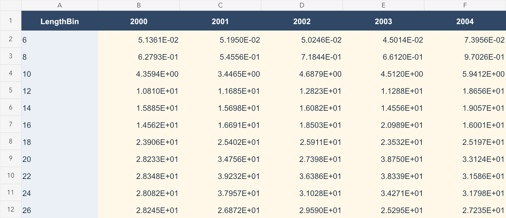

```r
# 导入自己的表；辅助函数由仓库脚本提供 / Import helpers are repository scripts
source("scripts/real_data_workflow.R", encoding="UTF-8")
your_inputs <- read_survey_excel("docs/data/ALSCL_Data_Entry_Example.xlsx")
validate_survey_tables(your_inputs, growth_step=1)
```

### 2. 编译与拟合 / Compile and fit

快速开始已演示两个拟合入口。`train_times` 为同一起点的连续优化次数，`ncores` 为独立初始点数。不要把优化器的文字消息当作唯一成功标准。

The quick start demonstrates both fitters. Optimization passes and independent starts are separate; optimizer messages alone do not establish a usable fit.

### 3. 诊断与比较 / Diagnose and compare

```r
c(code=b$convergence_code, gradient=b$max_abs_gradient,
  pdHess=b$pdHess, boundary=b$bound_hit)
diagnostic_metrics(x$data.CatL, b)
comparison <- compare_models(a, b, x$data.CatL)
comparison$fit_metrics
plot_residuals(b, type="length")
```

联合检查梯度、Hessian、边界、观测拟合、生物合理性和固定参数敏感性。AIC/BIC 比较需相同数据及可比似然；数值收敛不证明无偏或可识别。

Check numerical status, fit, biology and sensitivity together. Information criteria require comparable data and likelihoods; convergence does not prove unbiasedness or identifiability.

### 4. 模拟与批量拟合 / Simulation and batch fitting

```r
# 快速年度三表 / Quick annual tables
quick <- simulate_example_data(years=2000:2019, seed=42)
# 完整参数、随机模拟与多个重复 / Full generator and replicate files
pa <- initialize_params(species="flatfish", observation_error="independent")
sm <- sim_data(sim_cal(pa), pa, iter_range=4:5, return_iter=4,
               output_dir="simulation_examples/flatfish")
# 完整批量脚本也保留失败原因 / Batch script retains failures
source("scripts/simulation_workflow.R", encoding="UTF-8")
# run_simulation_examples(out="simulation_examples", fit_batch=TRUE)
```

tuna 用季度长度型过程；`nyear` 在模拟设定中为历年，在回溯中则为删除步数。可下载 [两个案例的三表及真值](docs/data/cases/README.md)。

Tuna uses quarterly length-based dynamics. Simulation years and retrospective peel counts use different units.

### 5. 回溯分析 / Retrospective analysis

```r
ra <- do.call(retro_acl, c(inputs, x$fit_args, x$fit_config$acl,
                          list(nyear=3, train_times=2, silent=TRUE)))
rb <- do.call(retro_alscl, c(inputs, x$fit_args, x$fit_config$alscl,
                            list(nyear=3, train_times=2, silent=TRUE)))
plot_retro(rb, palette="npg", facet_col=2, rho_digits=3)
rb$rho_text
```

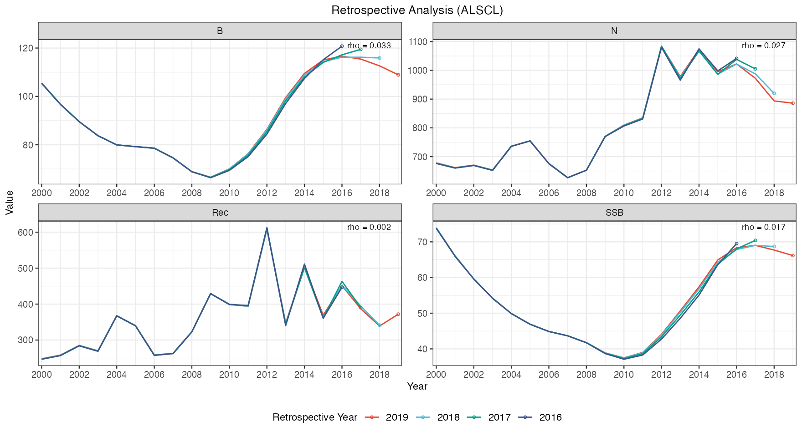

`nyear=3` 删除 1、2、3 个末端观测步后重拟合；Mohn rho 衡量末端修订，不是预测准确率。季度数据删除 4 步才是一年。

Three peels refit after successively removing terminal observations. Mohn's rho describes revision, not predictive accuracy.

<a id="functions"></a>
## 核心函数与可调参数 / Core functions and controls

| 公开函数 / Functions | 用途 / Purpose |
|---|---|
| [`run_acl`](docs/FUNCTION_REFERENCE.md#run_acl), [`run_alscl`](docs/FUNCTION_REFERENCE.md#run_alscl) | 两个模型拟合 / Fit both models |
| [`create_parameters`](docs/FUNCTION_REFERENCE.md#create_parameters), [`create_parameters_alscl`](docs/FUNCTION_REFERENCE.md#create_parameters_alscl), [`generate_map`](docs/FUNCTION_REFERENCE.md#generate_map) | 初值、边界、固定映射 / Starts, bounds and maps |
| [`initialize_params`](docs/FUNCTION_REFERENCE.md#initialize_params), [`sim_cal`](docs/FUNCTION_REFERENCE.md#sim_cal), [`sim_data`](docs/FUNCTION_REFERENCE.md#sim_data) | 完整随机模拟 / Full stochastic simulation |
| [`simulate_example_data`](docs/FUNCTION_REFERENCE.md#simulate_example_data), [`sim_acl`](docs/FUNCTION_REFERENCE.md#sim_acl) | 快速三表、批量 ACL 拟合 / Quick tables and batch fitting |
| [`VB_func`](docs/FUNCTION_REFERENCE.md#VB_func), [`mat_func`](docs/FUNCTION_REFERENCE.md#mat_func) | 生长与 logistic 生物函数 / Biological helpers |
| [`diagnose_model`](docs/FUNCTION_REFERENCE.md#diagnose_model), [`diagnostic_metrics`](docs/FUNCTION_REFERENCE.md#diagnostic_metrics), [`compare_models`](docs/FUNCTION_REFERENCE.md#compare_models) | 数值、拟合及比较 / Diagnostics and comparison |
| [`retro_model`](docs/FUNCTION_REFERENCE.md#retro_model), [`retro_acl`](docs/FUNCTION_REFERENCE.md#retro_acl), [`retro_alscl`](docs/FUNCTION_REFERENCE.md#retro_alscl) | 统一及模型专用回溯 / Retrospective interfaces |
| [`acl_theme`](docs/FUNCTION_REFERENCE.md#acl_theme), [`acl_theme_set`](docs/FUNCTION_REFERENCE.md#acl_theme_set), [`acl_theme_reset`](docs/FUNCTION_REFERENCE.md#acl_theme_reset) | 主题读取、设置及恢复 / Theme configuration |

| 设置 / Setting | flatfish / YTF 风格 | tuna / 金枪鱼风格 |
|---|---|---|
| 生成模型 / Operating model | 年龄型 / Age-based | 年龄与长度联合 / Joint age-length |
| `growth_step` | 1 年 / year | 0.25 年 / year |
| `nyear`, `burn_in` | 100, 80 年 / years | 100, 95 年 / years |
| 保留观测 / Retained observations | 20 年度 / annual steps | 20 季度 / quarterly steps |
| `nage`, `rec.age` | 15, 1 年 / year | 20, 0.25 年 / year |
| `Linf`, `vbk` | 60, 0.2/年 / year | 152, 0.38/年 / year |
| `M`, `F_mean` | 0.2, 0.3 每年 / per step | 0.2, 0.2 每季度 / per step |

全部参数签名、默认值与返回结构见 [43 个公开函数参考](docs/FUNCTION_REFERENCE.md)，包括 ACL 的 14 个、ALSCL 的 15 个标量估计参数。

The full reference documents every public argument and the inner estimation parameter lists.

<a id="plots"></a>
## 全部绘图功能 / Visualization functions

每图均有可运行 R 代码、双语解读和调整参数。这里列出用途、主要类型及代表图；[完整图谱](docs/PLOT_GALLERY.md) 展示所有 45 张图。以下使用快速开始得到的 `a`、`b`。

Each function has runnable examples and interpretation in the gallery. This section introduces each plotting family and its main controls.

### `plot_recruitment()` · 补充量 / Recruitment

最小年龄进入种群的补充量。强弱年级影响未来种群。 / New entrants at recruitment age; strong and weak cohorts shape later dynamics.

```r
# 示例与可调选项 / Example and controls
plot_recruitment(b, se=TRUE, se_type="ribbon")
```

[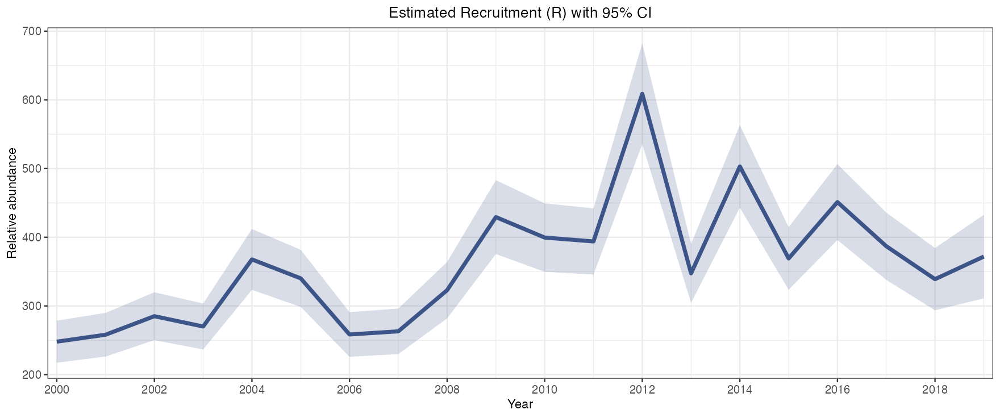](docs/PLOT_GALLERY.md#plot_recruitment)

### `plot_SSB()` · 产卵生物量 / Spawning biomass

`SSB` 总量；`SBA` 按年龄，`SBL` 按长度；成熟比例加权的生物量。 / Totals and age/length components weighted by maturity.

```r
# 示例与可调选项 / Example and controls
plot_SSB(b, type="SSB", se=TRUE)
```

[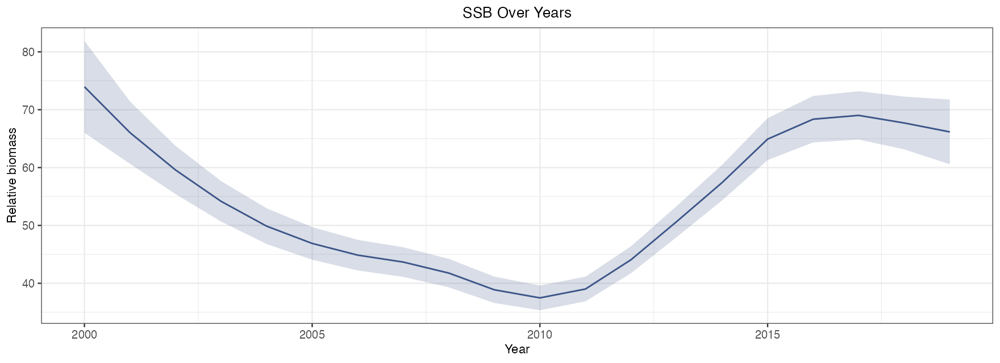](docs/PLOT_GALLERY.md#plot_SSB)

### `plot_biomass()` · 总生物量 / Biomass

`B`、`BA`、`BL`；包括未成熟个体的总重量及组成。 / Total weight and age/length components including immature fish.

```r
# 示例与可调选项 / Example and controls
plot_biomass(b, type="B", se=TRUE)
```

[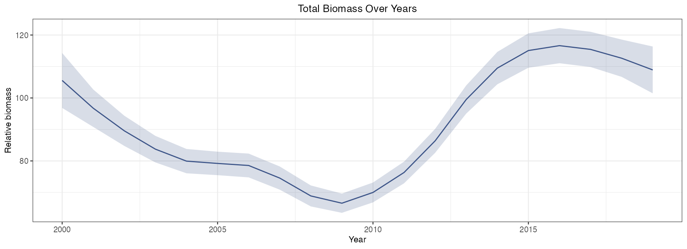](docs/PLOT_GALLERY.md#plot_biomass)

### `plot_abundance()` · 丰度 / Abundance

`N`、`NA`、`NL`；总数、队列年龄结构、长度组成。 / Total numbers, age cohorts and size composition.

```r
# 示例与可调选项 / Example and controls
plot_abundance(b, type="NL", se=TRUE, facet_ncol=4)
```

[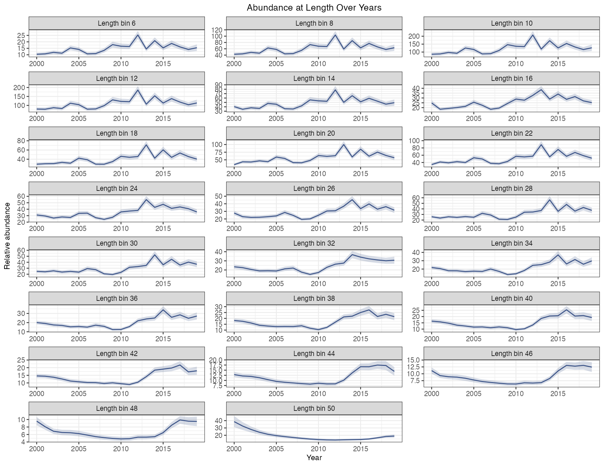](docs/PLOT_GALLERY.md#plot_abundance)

### `plot_catch()` · 推算捕获 / Derived catch

`CN`、`CNA`、`CNL` 是模型渔业捕获尾数，不是输入调查指数。 / Estimated fishery catches, distinct from survey indices.

```r
# 示例与可调选项 / Example and controls
plot_catch(b, type="CN", se=TRUE)
```

[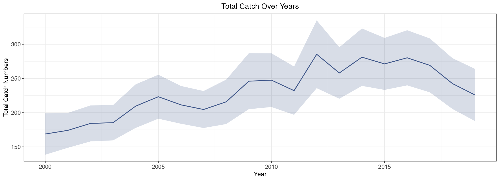](docs/PLOT_GALLERY.md#plot_catch)

### `plot_fishing_mortality()` · 捕捞死亡率 / Fishing mortality

`type="year"/"age"/"length"`；ALSCL 原生长度 F，ACL 原生年龄 F。ACL length 当前仍是 age 别名。 / Per-step mortality, with model-specific native dimensions.

```r
# 示例与可调选项 / Example and controls
plot_fishing_mortality(b, type="year", se=TRUE, facet_ncol=4)
```

[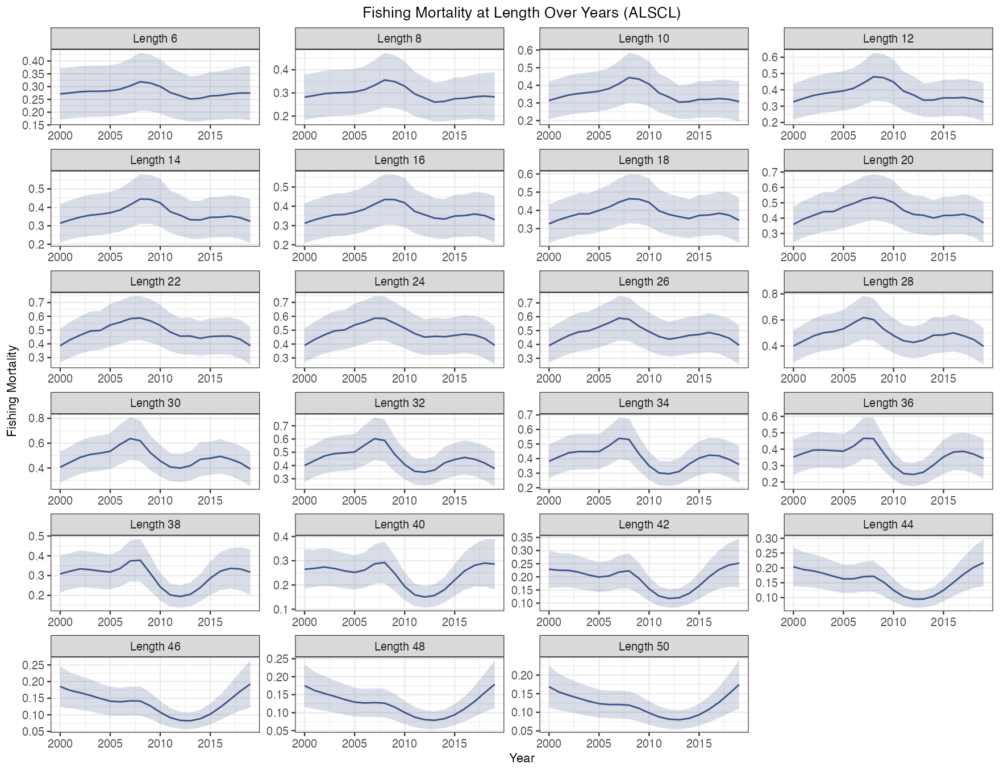](docs/PLOT_GALLERY.md#plot_fishing_mortality)

### `plot_CatL()` · 观测与拟合 / Observed and fitted survey

`type="length"` 按组随时间，`"year"` 按期看组成；`exp_transform=FALSE` 为对数，TRUE 为原尺度拟合中位数。 / Inspect temporal or size patterns on log or median scale.

```r
# 示例与可调选项 / Example and controls
plot_CatL(b, type="year", exp_transform=TRUE, facet_ncol=4)
```

[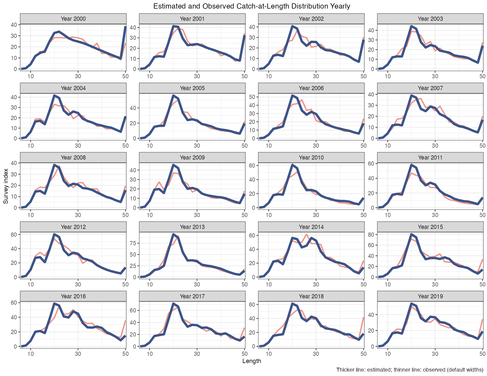](docs/PLOT_GALLERY.md#plot_CatL)

### `plot_ridges()` · 长度组成 / Length composition

左右为观测和拟合，每期归一化；不能读取总丰度。`ridges_alpha`、`ridges_scale` 调透明度和高度；需要活跃 obj。 / Normalized composition, requiring a live TMB object.

```r
# 示例与可调选项 / Example and controls
plot_ridges(b, ridges_alpha=.7) # viridis 年份渐变 / Sequential time gradient
plot_ridges(b, palette="cividis")
```

[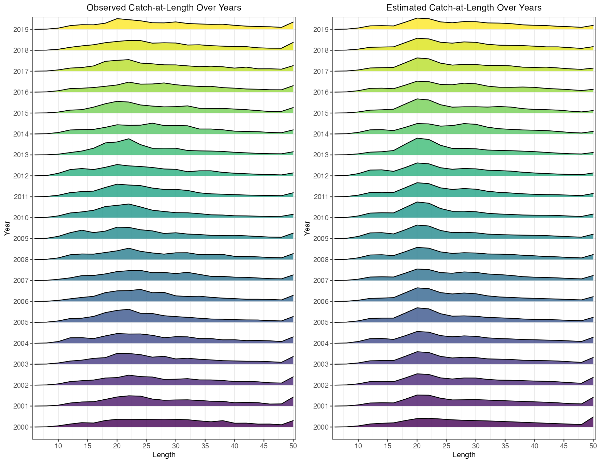](docs/PLOT_GALLERY.md#plot_ridges)

### `plot_VB()` · 生长曲线 / Growth curve

`age_range` 控制年龄范围；`text_size/text_color` 控制注释。区间是平均曲线参数的不确定性。 / Age range, parameter annotations and mean-curve uncertainty.

```r
# 示例与可调选项 / Example and controls
plot_VB(b, age_range=c(1,15), se=TRUE)
```

[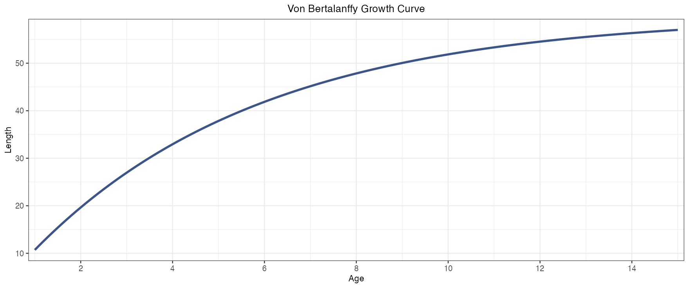](docs/PLOT_GALLERY.md#plot_VB)

### `plot_pla()` · 年龄长度概率 / Age-length probabilities

横轴年龄、纵轴长度，颜色是给定年龄的长度概率。不同于增长转移 G；首尾组含尾部。 / Length probabilities conditional on age, not the growth transition G.

```r
# 示例与可调选项 / Example and controls
plot_pla(b)
```

[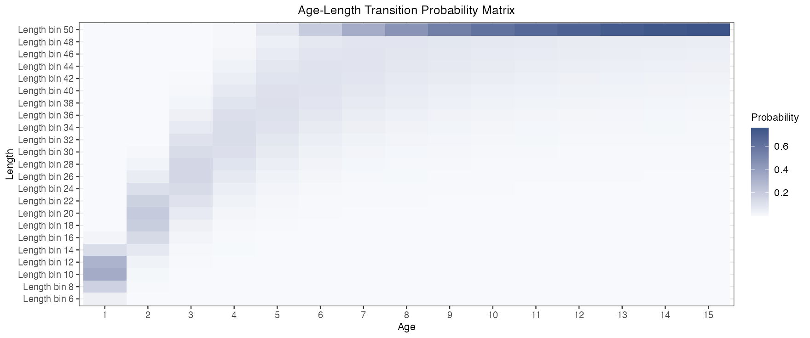](docs/PLOT_GALLERY.md#plot_pla)

### `plot_residuals()` · 对数残差 / Log residuals

观测对数减预测对数，未经 SD 标准化；`type` 控制分面方向，`f` 控制平滑程度。 / Inspect systematic structure using raw log residuals and a smoother.

```r
# 示例与可调选项 / Example and controls
plot_residuals(b, type="length", f=.4, facet_ncol=4)
```

[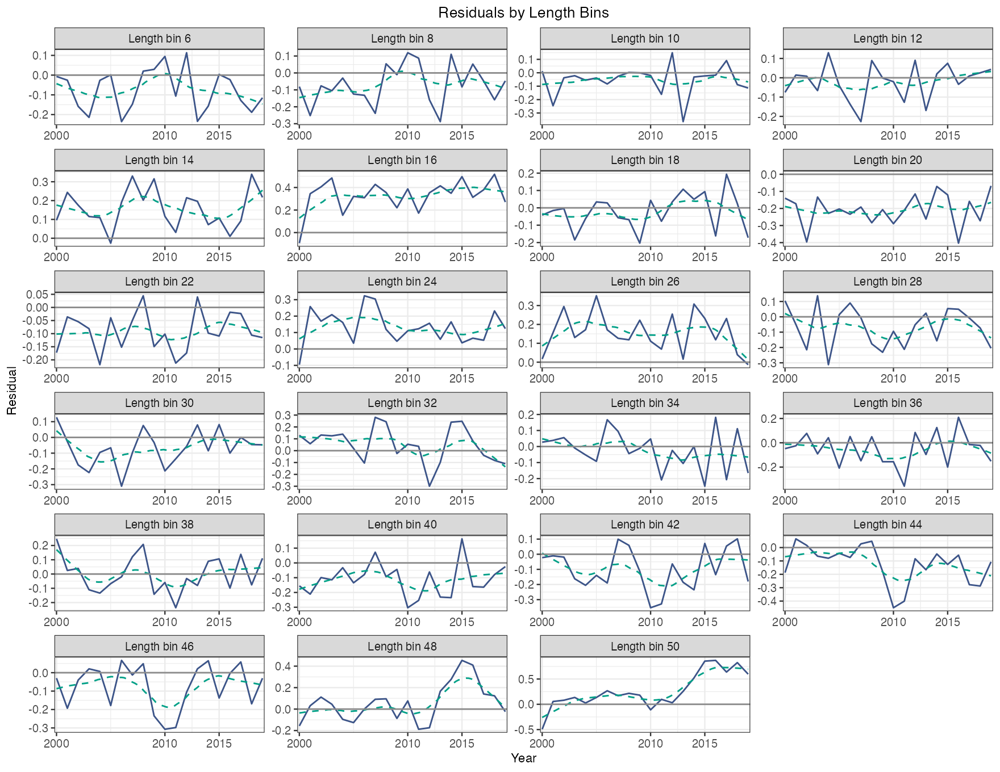](docs/PLOT_GALLERY.md#plot_residuals)

### `plot_SSB_Rec()` · 亲体与补充 / Stock and recruitment

`age_at_recruitment` 为错开的观测步数。散点关联不能证明因果或密度依赖；不自动拟合 B-H/Ricker。 / Lagged scatter alone does not establish causality or density dependence.

```r
# 示例与可调选项 / Example and controls
plot_SSB_Rec(b, age_at_recruitment=1, point_size=2)
```

[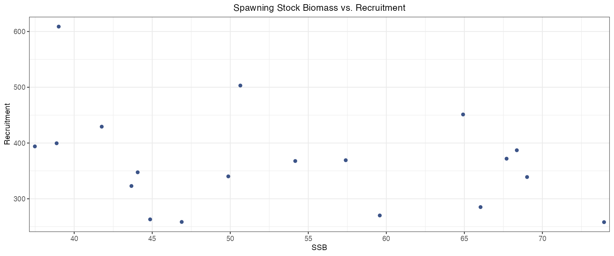](docs/PLOT_GALLERY.md#plot_SSB_Rec)

### `plot_deviance()` · 过程偏差 / Process deviations

`type="R"/"F"`；`log=TRUE` 显示对数偏差，FALSE 指数化。它不是似然 deviance。 / Recruitment or F process effects; not likelihood deviance.

```r
# 示例与可调选项 / Example and controls
plot_deviance(b, type="R", log=TRUE, se=TRUE)
```

[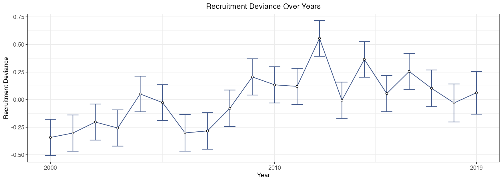](docs/PLOT_GALLERY.md#plot_deviance)

### 比较图与回溯图 / Comparison and retrospective plots

| 函数 / Function | 主要用途与参数 / Purpose and controls |
|---|---|
| `plot_compare_ts` | B/SSB/Rec/N/CN/CB/F，`quantities`、`se`、`colors`、`linetypes` |
| `plot_compare_F` | 两模型原生维度 F 热图；`palette` / Native-dimension heatmaps |
| `plot_compare_residuals` | 直方图、QQ、年度均值及长度组箱线图；`bins` / Residual panels |
| `plot_compare_growth` | VB、pla 及可选 Age/Length 外部参照；`ref_data`、`nls_start` / Growth and reference fit |
| `plot_compare_CatL` | 同期调查与两模型预测；`years`、`obs_color` / Survey comparisons |
| `plot_compare_metrics` | 误差、R²、MAPE、IC 与参数数；`metrics` / Fit summaries |
| `plot_compare_selectivity` | 固定调查 q，不是估计渔业选择性 / Fixed survey catchability |
| `plot_compare_annual_F` | `method="apical"/"mean"`，不自动年化 / Within-step summary F |
| `plot_retro` | `palette`、命名 `colors`、rho 位置与精度、分面 / Terminal revisions |

### 常用样式参数 / Common style controls

| 参数 / Argument | 用法 / Meaning |
|---|---|
| `line_color`, `se_color` | NULL 继承全局 ggsci 角色；可显式覆盖 / Global defaults or explicit colors |
| `line_size` / `linewidth` | 单模型 / 比较图线宽；以函数签名为准 / Function-specific line width |
| `se`, `se_type`, `se_alpha` | 近似 95% 区间；ribbon/errorbar（支持时）/ Interval options where supported |
| `title`, `xlab`, `ylab`, `x_breaks` | 标题、标签与刻度 / Labels and breaks |
| `facet_ncol`, `facet_scales` | 分面布局与纵轴是否一致 / Layout and shared scales |
| `font_family`, `title_size`, `base_theme` | 单图主题覆盖 / Typography and base theme |
| `return_data` | 支持的图返回 plot/data；CatL 为 plot/data1/data2 / Plot and processed data |

自由纵轴方便查看组内趋势，不能直接比较不同分面的幅度。固定参数的区间为条件区间；缺少标准误与真正零不确定性不是同一件事。

Free scales emphasize within-panel patterns. Fixed-parameter intervals are conditional; missing standard errors do not mean zero uncertainty.

<a id="theme"></a>
## 全局主题 / Global theme

```r
acl_theme_set(palette="npg", font_family="sans", base_theme="theme_bw",
              title_size=16, axis_title_size=12, axis_text_size=10,
              strip_text_size=10, title_hjust=.5,
              compare_linetypes=c("solid","dashed"))
plot_retro(rb, palette="jama", rho_position="top_left")
plot_SSB(b, se=TRUE, line_color="#00A087", se_color="#00A087")
acl_theme_reset() # 真正重置；acl_theme_set() 无参数不重置 / Explicit reset
```

支持 NPG、AAAS、NEJM、Lancet、JAMA。切换色板重设颜色角色，同次调用的显式颜色优先；山脊图独立使用 viridis 年份渐变。见 [完整配色与导出教程](docs/PLOT_STYLE.md)。

Palette changes reset semantic colors, with explicit same-call colors taking precedence. Ridges independently use a sequential viridis gradient across years.

<a id="parallel"></a>
## 并行处理 / Parallel processing

| 入口 / Function | `ncores=1` | `ncores>1` |
|---|---|---|
| `run_acl`, `run_alscl` | 一个初始点 / One start | socket 多初始点，选最佳有效结果 / Independent starts |
| `sim_acl` | 依序重复 / Sequential replicates | 并行重复 / Parallel replicates |
| `retro_*` | 依序回溯 / Sequential peels | 并行回溯 / Parallel peels |

Windows、macOS、Linux 使用 socket 工作进程。建议先 1，再按内存与任务数选择 2–4；避免内外层同时开满。OpenMP 编译选项不等于模板自动并行，不能据此承诺加速。

Socket workers support all three platforms. Begin with one and choose worker counts based on memory and task size; avoid nested oversubscription. OpenMP compilation alone does not establish parallel execution of the template.

<a id="citation"></a>
## 引用 / Citation

Zhang, F. & Cadigan, N. G. (2022). *An age- and length-structured statistical catch-at-length model for hard-to-age fisheries stocks*. Fish and Fisheries, 23(5), 1121–1135. [doi:10.1111/faf.12673](https://doi.org/10.1111/faf.12673).

```bibtex
@article{zhang2022age,
  title={An age-and length-structured statistical catch-at-length model for hard-to-age fisheries stocks},
  author={Zhang, Fan and Cadigan, Noel G},
  journal={Fish and Fisheries}, volume={23}, number={5},
  pages={1121--1135}, year={2022}, doi={10.1111/faf.12673}
}
```

```r
# 包引用及实际版本 / Package citation and installed version
citation("ALSCL")
packageVersion("ALSCL")
```

包作者 Hongyu Lin、Fan Zhang，贡献者 Sisong Dong；使用时同时记录包版本及提交号。

Authors: Hongyu Lin and Fan Zhang; contributor: Sisong Dong. Cite the installed package version and Git commit.

## 许可 / License

[GPL-3 License](LICENSE.md)。问题反馈：[Issues](https://github.com/Linbojun99/ALSCL/issues)。
