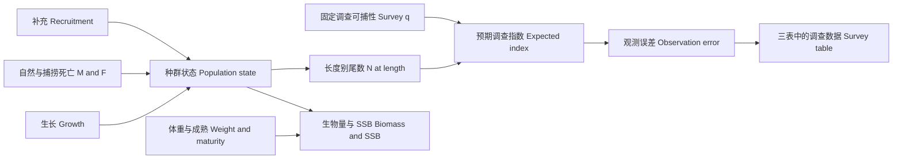

# ALSCL 完整使用手册 · Complete user manual

**调查体长数据的种群评估 · Survey catch-at-length stock assessment**

**ALSCL 2.0.0 · 简体中文与英文 · 15 章 / chapters**

本手册介绍模型原理、输入数据、模拟、拟合、诊断、绘图及回溯分析，提供双语 R 示例、Excel 填表示例、45 张 YTF 图和 7 张案例图。普通图使用 ggsci 配色；山脊图使用按年份排列的 viridis 渐变。

This manual covers model principles, data, simulation, fitting, diagnostics, plotting and retrospectives, with bilingual R examples, input worksheets, 45 YTF figures and seven case-study figures. Plots use ggsci colors; ridges use an ordered viridis gradient.

[开始使用 · Getting started](https://github.com/Linbojun99/ALSCL/wiki/01-Start) · [仓库主页 · Repository](https://github.com/Linbojun99/ALSCL/tree/main) · [单页书稿 · Single-page book](https://github.com/Linbojun99/ALSCL/blob/main/docs/BOOK.md) · [Excel 示例 · Workbook](https://github.com/Linbojun99/ALSCL/blob/main/docs/data/ALSCL_Data_Entry_Example.xlsx)


## 全书目录 · Book contents

- [01 开始使用 · Getting started](#chapter-01)
- [02 模型原理与时间尺度 · Model principles](#chapter-02)
- [03 数据、Excel 与实测导入 · Data and observations](#chapter-03)
- [04 内置数据与首个拟合 · Built-in YTF](#chapter-04)
- [05 模拟与批量实验 · Simulation](#chapter-05)
- [06 初值、边界与拟合 · Fitting controls](#chapter-06)
- [07 诊断与结果解读 · Diagnostics](#chapter-07)
- [08 调查与种群图 · Survey and population plots](#chapter-08)
- [09 生长、死亡与残差图 · Growth, mortality and residuals](#chapter-09)
- [10 模型比较与真值 · Model comparisons](#chapter-10)
- [11 回溯分析 · Retrospectives](#chapter-11)
- [12 年度与季度案例 · Annual and quarterly cases](#chapter-12)
- [13 ggsci 配色与导出 · Colors and export](#chapter-13)
- [14 全部函数与参数 · Complete function reference](#chapter-14)
- [15 进阶、复现与故障处理 · Reproducibility](#chapter-15)

<a id="chapter-01"></a>
## 01 开始使用 · Getting started

安装 ALSCL 2.0.0 后即可使用内置数据、拟合模型和绘图。以下代码在 R 中运行。

Install ALSCL 2.0.0 to use the bundled data, fit models and create plots. Run the following in R.

```r
# 安装 ALSCL / Install ALSCL
install.packages("remotes")
remotes::install_github("Linbojun99/ALSCL")
library(ALSCL)
packageVersion("ALSCL")
data("YTF_example")
str(YTF_example[c("data.CatL", "data.wgt", "data.mat")])
```

首次拟合需要与 R 匹配的 C++ 工具链。安装程序自动处理依赖；读取 Excel 示例另需 `readxl`。包含 `source("scripts/...")` 的示例请从下载的仓库根目录执行。

The first fit needs an R-compatible C++ toolchain. Dependencies are installed automatically; Excel examples additionally use readxl. Run examples containing `source("scripts/...")` from the downloaded repository root.

[仓库主页 / Repository](https://github.com/Linbojun99/ALSCL/blob/main/README.md) · [Excel 示例 / Workbook](https://github.com/Linbojun99/ALSCL/blob/main/docs/data/ALSCL_Data_Entry_Example.xlsx)

<a id="chapter-02"></a>
## 02 模型原理与时间尺度 · Model principles

ALSCL 包提供 ACL（年龄结构）和 ALSCL（年龄—体长联合结构）两个调查体长评估模型。下式采用 Zhang & Cadigan (2022) 的模型框架，并明确本包的时间单位和随机效应参数化。

The ALSCL package provides an age-structured model (ACL) and a joint age–length model (ALSCL) for survey catch-at-length assessment. The framework follows [Zhang & Cadigan (2022)](https://doi.org/10.1111/faf.12673), with time units and random-effect parameterization stated explicitly below.

### 种群动态 / Population dynamics

令 $`i=1,\ldots,A`$ 为年龄组索引，$`a_i=a_{rec}+(i-1)\Delta t`$ 为实际年龄，$`t`$ 为模型时间步。ACL 在年龄维度推进存活；补充量进入第一组，最大年龄组为加组：

Let $`i=1,\ldots,A`$ index age classes, with actual age $`a_i=a_{rec}+(i-1)\Delta t`$, and let $`t`$ index model steps. ACL advances survivors by age, introduces recruitment in the first class, and retains survivors in the oldest plus group:

```math
N_{1,t}=R_t,\qquad Z_{i,t}=M+F_{i,t},
```

```math
N_{i+1,t+1}=N_{i,t}\exp(-Z_{i,t}),\qquad i=1,\ldots,A-2,
```

```math
N_{A,t+1}=N_{A-1,t}\exp(-Z_{A-1,t})+N_{A,t}\exp(-Z_{A,t}).
```

`M` 和 F 是**每个模型时间步**的瞬时死亡率；季度模型的 `growth_step=0.25`，M 和 F 也须使用季度率。生长参数 $`k`$ 按年定义。

M and F are instantaneous rates **per model step**. A quarterly model uses `growth_step=0.25` and quarterly mortality rates; growth parameter $`k`$ is annual.

### 捕捞死亡率 / Fishing mortality structure

ACL 按年龄估计 F，ALSCL 按体长估计 F。以 $`s`$ 表示相应的年龄或体长组，两个模型均使用可分离的 AR(1) × AR(1) 对数 F 偏差：

ACL estimates F by age, whereas ALSCL estimates F by length. With $`s`$ denoting the corresponding age or length class, both use separable AR(1) × AR(1) deviations in log F:

```math
F_{s,t}=\exp(\mu_F+d_{s,t}),\qquad
\mathrm{Cov}(d_{s,t},d_{s-h,t-j})=\sigma_F^2\phi_S^{|h|}\phi_T^{|j|}.
```

这里 $`\sigma_F`$ 是 TMB `SCALE(SEPARABLE(AR1(),AR1()), sigma_F)` 中的**边际标准差**；$`\phi_S`$、$`\phi_T`$ 分别控制组间和时间相关性。若用创新方差定义 AR(1)，协方差公式的尺度会不同；不能在本式中再除以两个 $`1-\phi^2`$ 因子。自然死亡率 M 作为已知输入。

Here $`\sigma_F`$ is the **marginal SD** in TMB's scaled, separable AR(1) density. The correlation parameters describe dependence across groups and time. Innovation-variance parameterizations use a different scaling; dividing this expression again by two $`1-\phi^2`$ factors would be incorrect. Natural mortality M is supplied as known.

### 补充量 / Recruitment

拟合模型用 AR(1) 对数偏差描述补充量。下面写成与边际标准差 $`\sigma_R`$ 一致的平稳形式：

The fitted models use AR(1) log recruitment deviations. The following stationary representation uses marginal SD $`\sigma_R`$:

```math
R_t=\exp(\mu_R+r_t),\qquad
r_1\sim N(0,\sigma_R^2),\qquad
r_{t+1}=\phi_R r_t+\eta_t,\quad
\eta_t\sim N\!\left(0,\sigma_R^2(1-\phi_R^2)\right).
```

$`\exp(\mu_R)`$ 是补充量的中位尺度，不是包含随机变异后的算术均值。完整模拟器 `sim_data()` 使用 Beverton–Holt 亲体补充关系及随机偏差；模拟器与拟合器的补充过程应分别理解。

$`\exp(\mu_R)`$ is the median recruitment scale, not the arithmetic mean including stochastic variation. The full `sim_data()` operating model uses Beverton–Holt stock–recruitment with random deviations; its recruitment process differs from the fitted model.

### 初始条件 / Initial conditions

第一期最小年龄组由 $`R_1`$ 给定，其余年龄组按初始死亡率与逐组扰动递推：

Initial recruitment defines the youngest class; older classes follow a recursive decline with an initial mortality rate and class-to-class deviations:

```math
\log N_{1,1}=\log R_1,\qquad
\log N_{i,1}=\log N_{i-1,1}-Z_{init}+u_{i-1},\quad
u_{i-1}\sim N(0,\sigma_{N0}^2).
```

因此 $`\log N_{i,1}=\log R_1-(i-1)Z_{init}+\sum_{j=1}^{i-1}u_j`$。扰动沿年龄组累积；不能把每个年龄的总扰动误当作相互独立。ALSCL 再用初始年龄—体长概率分配这些个体。

Thus the initial log abundance contains the cumulative sum of earlier class deviations. The total deviations at different ages are not independent. ALSCL allocates these initial numbers across length using age–length probabilities.

### 年龄—体长转换 / Age-to-length conversion (ACL)

给定年龄的长度服从均值由 von Bertalanffy 曲线决定的正态分布：

Length conditional on age follows a normal distribution whose mean is defined by the von Bertalanffy curve:

```math
\mu_i=L_\infty\left[1-e^{-k(a_i-t_0)}\right],\qquad
\sigma_i=CV_L\mu_i,
```

```math
p_{l|i}=\Phi\!\left(\frac{UB_l-\mu_i}{\sigma_i}\right)
       -\Phi\!\left(\frac{LB_l-\mu_i}{\sigma_i}\right),\qquad
N_{l,t}=\sum_i p_{l|i}N_{i,t}.
```

`pla` 表示这个年龄—体长概率矩阵，`plot_pla()` 用热图展示。实现使用支持自动微分的正态 CDF 差，并通过右尾对称计算和归一化处理数值稳定性。长度边界必须与调查分组一致。论文 Appendix S1 给出的固定阶 Taylor 近似是另一种积分近似，本包使用上述 CDF 实现。

`pla` is the age–length probability matrix shown by `plot_pla()`. Differentiable normal CDF differences, symmetric right-tail calculations and normalization provide the implemented numerical treatment. Boundaries must match survey bins. Appendix S1 describes a fixed-order Taylor approximation; the package uses the CDF formulation above.

### 生长转移矩阵 / Growth transition matrix (ALSCL)

ALSCL 保留 $`N_{l,i,t}`$ 的体长、年龄、时间三个维度。$`G_{j,l}`$ 表示从源体长组 $`l`$ 转入目的体长组 $`j`$ 的概率。普通年龄组的存活与增长为：

ALSCL retains length, age and time in $`N_{l,i,t}`$. Entry $`G_{j,l}`$ is the probability of moving from source length bin $`l`$ to destination bin $`j`$. Survival and growth for ordinary age classes follow:

```math
N_{j,i+1,t+1}=\sum_l G_{j,l}N_{l,i,t}\exp[-(M+F_{l,t})].
```

加组累加前一年龄组和原最大年龄组的存活及增长；补充量按最小年龄的长度分布进入第一年龄组。G 的各列和为 1，不允许缩短，最大体长组吸收右尾概率。长度变化仍可能留在同一分组内。

The plus group combines survivors and growth from the preceding and oldest age classes. Recruitment enters the youngest class with its length distribution. Columns of G sum to one, shrinkage is excluded, and the largest bin absorbs right-tail probability. Growth can still leave an individual within its original bin.

增长增量使用下面的平滑下降函数，标准差为 $`CV_G\mu_{\Delta L}`$：

Growth increments use the following smooth decreasing mean, with SD $`CV_G\mu_{\Delta L}`$:

```math
\mu_{\Delta L}(L)=\frac{\Delta t(1-e^{-k})L_\infty}
{1+\exp\!\left(-\log(19)\frac{L-0.5L_\infty}{0.05L_\infty-0.5L_\infty}\right)}.
```

此函数不是精确的任意时间步 VB 增量 $`(L_\infty-L)(1-e^{-k\Delta t})`$。`pla` 是给定年龄的长度分布，G 是给定源长度的一步转移概率，两者不能互换。`FL` 是长度别 F，`FA` 则由原队列的存活率推导。

This is not the exact arbitrary-step VB increment $`(L_\infty-L)(1-e^{-k\Delta t})`$. `pla` describes length given age, while G describes a one-step transition given source length. They are not interchangeable. `FL` is length-specific F; `FA` is derived from original-cohort survival.

### 派生量 / Derived quantities

输入的平均个体重量 $`w_{l,t}`$ 和成熟比例 $`m_{l,t}`$ 用于计算体长别生物量、成熟生物量及总量：

Mean individual weight $`w_{l,t}`$ and maturity proportion $`m_{l,t}`$ convert abundance into length-specific biomass, spawning biomass and totals:

```math
b_{l,t}=N_{l,t}w_{l,t},\qquad sb_{l,t}=b_{l,t}m_{l,t},\qquad
B_t=\sum_l b_{l,t},\qquad SSB_t=\sum_l sb_{l,t}.
```

`CN`、`CB` 是模型推算的渔业捕获尾数与重量，区别于输入的调查数量指数。生物量单位由个体重量和调查数量尺度共同决定。

`CN` and `CB` are derived fishery catch numbers and biomass, distinct from the input survey number index. Biomass units depend on weight units and the abundance scale.

### 调查观测 / Survey observations

令 $`I_{l,t}`$ 为调查数量指数，$`N_{l,t}`$ 为种群尾数。调查观测使用对数正态模型：

Let $`I_{l,t}`$ denote the survey number index and $`N_{l,t}`$ population abundance. Survey observations follow a lognormal model:

```math
\log I_{l,t}=\log q_l+\log N_{l,t}+\epsilon_{l,t},\qquad
\epsilon_{l,t}\sim N(0,\sigma_I^2),
```

```math
q_l=\left[1+\exp\!\left(-\log(19)\frac{L_l-L_{50}}{L_{95}-L_{50}}\right)\right]^{-1}.
```

`sel_L50`、`sel_L95` 固定调查可捕性 q，在两个指定体长处分别取 0.5 和 0.95；它们不是估计出来的渔业选择性。绝对丰度依赖 q、M 等假设。`exp(report$Elog_index)` 给出原尺度的中位数，算术均值还需乘以 $`\exp(\sigma_I^2/2)`$。

`sel_L50` and `sel_L95` fix survey catchability at 0.5 and 0.95 at the specified lengths; they are not estimated fishery selectivity. Absolute abundance depends on q, M and related assumptions. `exp(report$Elog_index)` is the original-scale median; the arithmetic mean also includes $`\exp(\sigma_I^2/2)`$.

### 估计与区间 / Estimation and uncertainty

TMB 用自动微分计算目标函数及导数，对随机效应采用 Laplace 近似；R 的 `nlminb()` 优化固定效应。`sdreport()` 使用局部曲率及 delta 方法给出近似标准误。绘图中的约 95% 区间是逐点区间；固定参数不贡献估计不确定性。

TMB uses automatic differentiation and a Laplace approximation for random effects; R's `nlminb()` optimizes fixed effects. `sdreport()` obtains approximate standard errors from local curvature and the delta method. Plotted 95% intervals are pointwise, and parameters held fixed do not contribute estimation uncertainty.

## 从隐状态到调查观测 · From latent state to survey observation



模型用调查数量数据约束隐含种群状态，再结合体重、成熟与生存计算派生量。渔业捕获 `CN` 不等于调查输入；`plot_CatL()` 展示调查观测与拟合值。

Survey numbers constrain latent population states; weights, maturity and survival define derived quantities. Fishery catch `CN` is not the survey input. `plot_CatL()` shows observations and fitted survey indices.

## 两种概率矩阵不可混用 · Two different probability matrices

| 矩阵 / Matrix | 条件与方向 / Meaning | 检查 / Check |
|---|---|---|
| `pla` | 给定年龄的长度分布 $`P(l\mid a)`$；R 模拟器方向随模型而异 / Length given age; simulator orientation varies | 先检查维度方向 / Check orientation |
| `G` | 一个时间步内从源长度列转入目的长度行 / Destination row conditional on source column | `colSums(G)` 约等于 1；非负、不缩短 / Nonnegative, normalized, no shrinkage |

`plot_pla()` 画的是年龄长度关系。下面是 tuna 条件 ALSCL 拟合的增长矩阵，可看出“停留原组”及“进入较大组”的概率。

`plot_pla()` shows age-length probabilities. The tuna ALSCL growth matrix below instead shows the probabilities of staying in a bin or advancing to larger bins.


```r
# b 为 ALSCL 拟合对象 / b is an ALSCL fit
G <- b$report$G
range(colSums(G))
stopifnot(all(G >= 0), max(abs(colSums(G) - 1)) < 1e-8)
```

同一组内的增长仍可能落回本组；这是离散分组造成的“留组”，不表示鱼停止生长。最后一组承接右尾概率，长度组边界改变会影响矩阵与状态解释。

Growth can remain within the same bin; this is bin retention, not zero individual growth. The largest bin absorbs the right tail. Changing bin boundaries changes both matrices and state interpretation.

## 不确定性与参数可识别性 · Uncertainty and identifiability

TMB 的 `sdreport` 通过局部曲率和 delta 方法得到近似标准误。图示为约 95% 逐点区间，不是同时置信带；生长区间描述平均曲线的参数不确定性，不是单尾鱼长度的预测范围。

TMB `sdreport` uses local curvature and the delta method. Approximate 95% pointwise intervals are not simultaneous bands. Growth intervals represent parameter uncertainty in the mean curve, not individual-fish prediction ranges.

YTF 教学例固定了生长和部分随机过程参数，因此生长区间可以退化为线，SSB 等区间也只反映其余自由参数的条件不确定性。Hessian 非正定、参数碰界或梯度偏大时，应先解决数值和识别问题，再解读区间。

YTF fixes growth and selected process parameters. Its growth interval can collapse to a line, and other intervals are conditional on these fixed values. Investigate Hessian, bounds and gradients before interpreting intervals.

## 年度、季度与死亡率 · Annual and quarterly units

年龄格点为 $`a_i=a_{rec}+(i-1)\Delta t`$。季度设 `growth_step=.25`；`k` 始终按年，`M` 和 F 为每个模型时间步的瞬时率。若已知年 M = 0.8，则季度 M = 0.8 × 0.25 = 0.2。生存概率是 $`\exp[-(M+F)]`$，不是直接从数量减去 M 和 F。

Ages use the stated step. Growth k is annual; M and F are instantaneous rates per model step. Annual M = 0.8 becomes quarterly M = 0.2. Survival is exponential, not a direct subtraction of rates from abundance.

```r
rec.age <- .25; nage <- 20; growth_step <- .25
ages <- rec.age + (seq_len(nage) - 1) * growth_step
range(ages) # 0.25–5 年 / years
M_quarter <- .8 * growth_step
# 四个季度的累计瞬时率 / Sum four quarterly instantaneous rates
F_quarter <- c(.1, .15, .2, .15)
F_annual <- sum(F_quarter)
```

`plot_compare_annual_F()` 不会将季度输出自动年化；`method="apical"` 是每期组间最大值，`"mean"` 是非加权平均。不同模型的原生 F 维度不同，不能把同一颜色的热图单元当成相同年龄长度群。

`plot_compare_annual_F()` does not annualize quarterly values. Apical is a within-step group maximum; mean is unweighted. Native F dimensions differ between models.

<a id="chapter-03"></a>
## 03 数据、Excel 与实测导入 · Data and observations

下载 [ALSCL_Data_Entry_Example.xlsx](https://github.com/Linbojun99/ALSCL/blob/main/docs/data/ALSCL_Data_Entry_Example.xlsx)。工作簿的 `Instructions` 是双语说明页；其余三张表已填入与 `YTF_example` 相同的数值。请另存副本再替换数据。

Download the workbook. `Instructions` contains bilingual directions, and the other three sheets contain the exact YTF example. Save a copy before replacing values.

| 位置 / Location | 填写规则 / Entry rule |
|---|---|
| 工作表名 / Sheet names | 必须为 `data.CatL`、`data.wgt`、`data.mat` / Use these exact names |
| A1 | `LengthBin`，不要在表头上方加标题 / No title rows above the header |
| A2:A… | 每行一个体长组；示例为中心值 6、8、…、50 / One length-bin label per row; example uses midpoints |
| B1、C1、… | 递增数字年份，如 2000、2001；季度如 2000、2000.25 / Increasing numeric time headers |
| B2 等数值单元 / Numeric cells | 对应这一体长组、这一期的值 / Value for that bin and period |
| 三表顺序 / Alignment | 体长组、时间、行列顺序必须完全相同 / Exact same bins, periods and order |

**调查数量指数 `data.CatL` / Survey number index**


填数量或已标准化为可比尺度的数量指数；若使用 CPUE，各期努力量、单位和标准化方式必须一致。正数可为小数。未知调查单元留空或填 `NA`；不要用 0、破折号、`<1` 或“未测”代替缺失值。

Enter counts or a consistently standardized number index. For CPUE, maintain comparable effort, units and standardization. Decimals are valid. Use blank/`NA` for unknown observations; do not use zero, dashes, `<1` or text labels as missing-value substitutes.

**平均个体重量 `data.wgt` / Mean individual weight**


填每组每期的平均单尾重量，不是该组总重。选择同一重量单位并记录在说明页。没有逐年数据时，可以在有依据的条件下重复同一长度重量关系，但要在分析报告说明。不得留缺失值。

Enter mean weight per fish, not the total weight in the bin. Use one unit and document it separately. Repeating a defensible length-weight relationship across periods is possible but must be reported. Missing weights are not accepted.

**成熟比例 `data.mat` / Maturity proportion**


填写 0–1，例如 60% 填 `0.6`，不要填 `60`。0 和 1 在成熟表中是合法值；不要将“调查零值”的规则误用于成熟表。三张表的数据区不要插入单位行、合计、合并单元格或解释文字。

Enter proportions in [0,1], e.g. `0.6` for 60%. Both 0 and 1 are valid maturity values. Do not insert units, totals, merged cells or prose inside the three data grids.

Excel 使用科学记数显示小数，例如 `5.1361E-02` 等于 `0.051361`；显示精度不会改变保存的底层数值。 / Scientific notation avoids displaying tiny positive values as zero; it does not round the stored values.

**体长边界与缺测期 / Bin boundaries and missing periods.** 本示例中心值是 6:50，每隔 2 cm；拟合时显式传入 22 个内部边界 7:49，首尾尾部按模型约定处理。自己的不等宽组应提供真实边界。区间标签如 `0-20`、`20-25` 要连续且不重叠；原标签若为 `0-20`、`21-25`，不能未经核实就消除间隙。缺整个年度时保留对应列并在调查表填 NA，重量和成熟表仍需完整；不要删掉这一列而假装时间间隔没变。

The example uses midpoints 6:50 by 2 and 22 explicit internal boundaries 7:49. Supply the actual boundaries for unequal bins. Interval labels must be contiguous and non-overlapping; do not silently close gaps in legacy labels. Retain an entirely missing period as an NA survey column while supplying weight and maturity, so the temporal grid remains regular.

## 5. 导入自己的实测数据 / Importing your observations

[real_data_workflow.R](https://github.com/Linbojun99/ALSCL/blob/main/scripts/real_data_workflow.R) 提供指南辅助函数，需 `source()`，不属于包的导出 API。Excel 读取采用 [readxl::read_excel](https://readxl.tidyverse.org/reference/read_excel.html)，保留原始年份表头并显式转换数值。

These are guide helpers, sourced from the repository, not package exports. The Excel reader preserves original time headers and converts numeric cells explicitly.

```r
install.packages("readxl") # 只需安装一次 / Install once
source("scripts/real_data_workflow.R", encoding = "UTF-8")
# 先用附带工作簿练习 / Start with the supplied workbook
my_inputs <- read_survey_excel("docs/data/ALSCL_Data_Entry_Example.xlsx")
validate_survey_tables(my_inputs, growth_step = 1, zero_action = "error")
# CSV 也可以，目录内需有三张同名 CSV / Three named CSV files also work
csv_inputs <- read_survey_csv("docs/data")
# 教学工作簿使用其对应的生物设定 / Use the workbook's matching biology
config <- c(YTF_example$fit_args, YTF_example$fit_config$alscl,
            list(zero_action = "error", train_times = 2, silent = TRUE))
# 真正重新拟合；需要编译环境 / This refits and requires a compiler
my_fit <- fit_survey_tables(my_inputs, config, model_type = "alscl")
```

换成自己的文件时，替换路径，并依据自己的物种设置 `rec.age`、`nage`、`M`、`sel_L50`、`sel_L95`、`growth_step`、边界及拟合初值/固定参数。不能因为输入表尺寸相同，就沿用 YTF 的生物参数或固定参数表。生长、长度重量关系、成熟信息和调查可捕性应有独立依据。

For your own workbook, replace the path and supply species-specific biology, boundaries, starts and fixed parameters. Equal table dimensions do not justify reusing YTF biology. Growth, weight, maturity and survey catchability need independent support.

`validate_survey_tables()` 默认遇到调查零值报错，要求先确认其含义。包的拟合入口默认 `zero_action="missing"`，把零值从对数似然中排除。如果零是真实的无捕获结果，排除它会改变推断；本包没有提供零膨胀观测模型，不应随意加小常数伪装为正数。

The guide validator rejects survey zeros by default. Package fits retain the historical default `zero_action="missing"`, excluding zeros from the log likelihood. Excluding genuine zero catches changes inference. This package does not implement a zero-inflated observation model; arbitrary small constants are not a principled substitute.

### 5.1 原有 `example_data` / Legacy data inspection

```r
data("example_data")
names(example_data)
head(example_data$data.CatL)
# 查看标签与零值，暂不盲目拟合 / Inspect bins and zeros before fitting
example_data$data.CatL[[1]]
sum(as.matrix(example_data$data.CatL[-1]) == 0, na.rm = TRUE)
```

这三张表从原 ALSCL 仓库原样保留，原说明称匿名调查数据，列为 2001–2021，9 个长度组。物种、单位、原始出处和零值含义没有得到核实，而且 `0-20`、`21-25` 等标签存在间隔。当前长度检查会拒绝这些不连续区间。读者应先补齐元数据和真实分组边界，不能把它标注成本文论文的已核实实测数据，也不能擅自改标签后给出正式评估。

The legacy tables are preserved unchanged from ALSCL. Their old help calls them anonymized survey data, but species, units, original source and zero meanings are unverified. Their gapped interval labels are rejected by the current bin parser. Recover metadata and actual boundaries before assessment; these are not verified empirical data from the cited paper.


<a id="chapter-04"></a>
## 04 内置数据与首个拟合 · Built-in YTF

```r
install.packages("remotes")
remotes::install_github("Linbojun99/ALSCL")
library(ALSCL)
data("YTF_example")
x <- YTF_example
inputs <- x[c("data.CatL", "data.wgt", "data.mat")]
# 检查维度与来源 / Inspect dimensions and provenance
str(inputs)
x$provenance
# 两模型使用相同观测及条件设置 / Same observations and conditional settings
a <- do.call(run_acl, c(inputs, x$fit_args, x$fit_config$acl,
                       list(train_times = 2, silent = TRUE)))
b <- do.call(run_alscl, c(inputs, x$fit_args, x$fit_config$alscl,
                         list(train_times = 2, silent = TRUE)))
plot_compare_ts(a, b, quantities = c("B", "SSB", "Rec"), se = TRUE)
```


| 对象 / Object | 内容和适用方式 / Contents and use |
|---|---|
| `YTF` | 原有 26 项参数列表，无 `data.CatL` / Original 26-element biological parameter list, no survey table |
| `YTF_example` | 23 个体长组 × 20 期；三张表、参数、模拟真值、拟合设置、来源 / 23 bins × 20 periods, three tables, parameters, truth, fit settings and provenance |
| `example_data` | 从原 ALSCL 保留的 9 组 × 21 年三张表；来源待核实 / Legacy ALSCL tables, 9 bins × 21 years, provenance unverified |

`YTF_example` 复用 `YTF` 的共有参数，特别是调查对数 SD = 0.1；其余采用 flatfish 模拟预设。随机种子 4，预热 80 年、保留 20 年；2000–2019 仅为示意年份。教学单位约定为 cm、kg，数据不是论文实测样本。调用 [data-raw/YTF_example.R](https://github.com/Linbojun99/ALSCL/blob/main/data-raw/YTF_example.R) 可重建 `.rda`，脚本恢复调用者的随机状态。

`YTF_example` reuses shared YTF parameters, including survey log SD 0.1, with remaining flatfish defaults. Seed 4, 80 burn-in years and 20 retained years are used. Dates are illustrative; cm and kg are teaching conventions. These are not empirical paper data. The data-raw script rebuilds the object and restores the caller's RNG state.

`x$fit_config` 固定已知生长、部分过程误差及相关参数，让示例聚焦工作流程。区间是在这些固定参数条件下的近似区间，不包含全部生物不确定性。这种教学拟合不能证明同时估计所有参数时可识别。

`x$fit_config` fixes known growth and selected process/correlation parameters. Intervals are conditional on these assumptions and omit their uncertainty. The example does not establish identifiability when all parameters are estimated together.

<a id="chapter-05"></a>
## 05 模拟与批量实验 · Simulation

### 3.1 快速生成三张表 / Quick input-table simulator

```r
# 简单年度模拟，可直接导出 CSV / Simple annual simulation with CSV export
quick <- simulate_example_data(
  years = 2000:2019, seed = 42, bin_breaks = seq(5, 51, 2),
  Linf = 60, vbk = 0.2, t0 = 1/60, M = 0.2, nage = 15,
  L50_sel = 15, L95_sel = 20, L50_mat = 35, L95_mat = 40,
  wgt_a = exp(-12), wgt_b = 3, mean_F = 0.3,
  cv_catch = 0.2, rec_sigma = 0.3,
  save_csv = TRUE, output_dir = "my_simulation")
str(quick)
```

`years` 必须是连续年度，不能通过写季度列名把该简易模拟器变成季度模型。`cv_catch` 控制调查观测 CV；`rec_sigma` 控制对数补充变异；该函数使用简化的共同 F、独立补充扰动及固定长度 CV = 0.1。它不等于完整 Beverton–Holt 模拟器，也不等于内置 `YTF_example` 的生成流程。

Use consecutive annual `years`. Changing labels does not create quarterly dynamics. `cv_catch` controls survey observation CV and `rec_sigma` log recruitment variation. This simplified simulator uses common F, independent recruitment perturbations and fixed length CV 0.1; it differs from both the full operating model and the bundled YTF generation recipe.

### 3.2 完整模拟器与两个案例 / Full simulator and two cases

两个预设的 seed 4 数据、三张 CSV 和完整真值对象已随文档保存：[下载及读取方法 / Download and read the two saved cases](https://github.com/Linbojun99/ALSCL/blob/main/docs/data/cases/README.md)。

```r
# 参数 → 生物量表 → 随机模拟 / Parameters → biological arrays → simulation
pa <- initialize_params(species = "flatfish", observation_error = "independent")
bio <- sim_cal(pa)
sm <- sim_data(bio, pa, iter_range = 4:5, return_iter = 4,
               output_dir = "simulation_examples/flatfish")
# 长度型季度案例 / Length-based quarterly case
tuna_pa <- initialize_params(species = "tuna")
tuna <- sim_data(sim_cal(tuna_pa), tuna_pa, iter_range = 4:5,
                 return_iter = 4, output_dir = "simulation_examples/tuna")
# 将模拟矩阵变成模型输入 / Convert simulated matrices to input tables
source("scripts/simulation_workflow.R", encoding = "UTF-8")
flatfish_inputs <- simulation_to_tables(sm, pa)
tuna_inputs <- simulation_to_tables(tuna, tuna_pa)
```

| 设置 / Setting | flatfish / YTF 风格 | tuna / 金枪鱼风格 |
|---|---|---|
| 生成模型 / Operating model | 年龄型 / Age-based | 年龄与长度联合 / Joint age-length |
| `growth_step` | 1 年 / year | 0.25 年 / year |
| `nyear`, `burn_in` | 100, 80 年 / years | 100, 95 年 / years |
| 保留观测 / Retained observations | 20 年度 / annual steps | 20 季度 / quarterly steps |
| `nage`, `rec.age` | 15, 1 年 / year | 20, 0.25 年 / year |
| `Linf`, `vbk` | 60, 0.2/年 / year | 152, 0.38/年 / year |
| `M`, `F_mean` | 0.2, 0.3 每年 / per step | 0.2, 0.2 每季度 / per step |

这是包内的两个模拟预设案例，不能当成已取得论文两个案例的原始观测。完整参数见 [initialize_params](https://github.com/Linbojun99/ALSCL/blob/main/docs/FUNCTION_REFERENCE.md#initialize_params)。`nyear`、`burn_in`、`sim_year` 的单位是**年**；返回 `sm$nyear` 是保留的**时间步数**。`SN_at_len` 是时间 × 长度，导入时要转置；`weight` 和 `mat` 已是长度 × 时间。

These are the two package simulation presets, not recovered empirical datasets from the paper. Duration arguments are in **years**, whereas returned `sm$nyear` counts retained **steps**. Transpose `SN_at_len` (time × length); weight and maturity are already length × time.

`iter_range` 同时指定重复编号和随机种子；`return_iter` 选择在内存中返回哪次重复。每个 `sim_rep4` 等文件由 `save()` 写出，应用 `load()`，不是 `readRDS()`。`observation_error="independent"` 让每个长度与时间单元有独立扰动；`"shared_time"` 让同一期的长度组共享扰动，适合专门的误差结构实验。

`iter_range` provides replicate IDs and seeds; `return_iter` selects the in-memory replicate. `sim_rep*` files use `save()/load()`, not RDS. Independent error varies across cells, while shared-time error applies the same perturbation to all length bins in a period.

```r
# 同时生成两个案例及 CSV、真值文件 / Generate both cases, CSV and truth files
cases <- run_simulation_examples(out = "simulation_examples", fit_batch = FALSE)
# 加上两个 ACL 重复拟合，保存失败诊断 / Add two ACL fits and retain failures
# run_simulation_examples(out = "simulation_examples", fit_batch = TRUE)
e <- new.env()
load("simulation_examples/flatfish/sim_rep4", envir = e)
str(e$sim.data)
```

批量入口 `sim_acl()` 仅拟合 ACL；ALSCL 可对各重复转表后循环调用 `run_alscl()`。生成器与拟合器的参数名不完全一致，不要直接把 `pa` 整表传入 `parameters`。两个重复只用于确认流程；正式性能实验应增加重复、保存真值并报告偏差、RMSE、区间覆盖率以及拟合失败率，不能只分析成功的重复。

`sim_acl()` fits ACL only. For ALSCL, convert each replicate then call `run_alscl()` in a loop. Generator and estimator parameter names differ. Two replicates only verify the workflow; performance studies need more replicates, retained truth, bias, RMSE, coverage and failure rates.

<a id="chapter-06"></a>
## 06 初值、边界与拟合 · Fitting controls

| 设置 / Setting | 怎么调整及影响 / Meaning and effect |
|---|---|
| `rec.age`, `nage` | 起始年龄（年）和年龄组数；年龄网格为 rec.age + (0:nage-1) × growth_step / Recruitment age and number of age classes |
| `growth_step` | 每步多少年；ACL 的 NULL 按 rec.age<1 时取 rec.age、否则取 1，ALSCL 默认 1，季度应显式设 0.25 / Years per step; specify 0.25 for quarterly ALSCL |
| `M` | 每模型步长自然死亡瞬时率；年率转季度需相应换算 / Instantaneous natural mortality per model step |
| `sel_L50`, `sel_L95` | 固定调查 q 的位置和斜率，L95 必须大于 L50 / Fixed survey catchability locations |
| `len_mid`, `len_border` | 组中心及内部边界；ALSCL 还提供 `len_lower/len_upper` / Midpoints and internal boundaries; ALSCL also offers outer bounds |
| `parameters`, `.L`, `.U` | 命名初值、下界、上界；在程序参数化尺度上提供 / Named starting values and bounds on the optimizer scale |
| `map` | 固定或释放参数；固定值来自 `parameters` / Fix or release parameters at their supplied values |
| `train_times` | 从优化结果继续优化的次数，并非随机多起点 / Successive optimization passes, not independent random starts |
| `control` | 传给 `nlminb` 的控制项，如 `eval.max`、`iter.max` / Optimizer controls |
| `ncores` | 单次拟合为独立初始点数，使用 socket 并行并扰动自由参数；批量/回溯为外层并行数 / Independent fit starts versus outer replicate/peel workers |
| `output` | FALSE 不写文件，TRUE 在 output 目录导出诊断与图 / Export diagnostics and plots under output when TRUE |

`initialize_params(species=...)` 建立模拟参数；`create_parameters(model_type=..., species=...)` 建立估计初值及边界。后者的物种预设不会自动替你更改 `run_*` 的 M、年龄、调查 q 或数据。

Simulation presets and estimation starts are separate. Choosing a species in `create_parameters()` does not automatically change the biological arguments passed to `run_*()`.

```r
p <- create_parameters(model_type = "acl", species = "flatfish")
names(p) # 查看初值及上下界列表 / Inspect start and bound components
# 明确固定参数；不同模型参数名不同 / Explicit fixed parameters, model-specific names
fixed <- list(log_Linf = factor(NA), log_vbk = factor(NA))
# factor(NA) 固定；映射中的 NULL 可释放默认固定项 / NULL releases a default fixed item
released <- generate_map(list(logit_log_F_y = NULL))
VB_func(Linf = 60, k = 0.2, t0 = 1/60, age = 1:15)
mat_func(L50 = 35, L95 = 40, length = seq(6, 50, 2))
```

| 生物含义 / Meaning | ACL 参数名 / Name | ALSCL 参数名 / Name |
|---|---|---|
| 生长 / Growth | `log_Linf`, `log_vbk`, `t0` | `log_Linf`, `log_vbk`, `log_t0` |
| 长度离散 / Length dispersion | `log_cv_len` | `log_cv_len`, `log_cv_grow` |
| 过程 SD / Process SD | `log_std_log_R`, `log_std_log_F`, `log_std_log_N0` | `log_sigma_log_R`, `log_sigma_log_F`, `log_sigma_log_N0` |
| F 相关 / F correlation | `logit_log_F_a`, `logit_log_F_y` | `logit_log_F_l`, `logit_log_F_y` |
| 补充相关 / Recruitment correlation | `logit_log_R` | `logit_log_R` |

`log_` 参数通常用 `log(自然尺度值)`，相关系数的变换必须以对应模板为准。尤其 ACL 的 `t0` 是原尺度，而 ALSCL 的 `log_t0` 经 exp 变换，因此本版 ALSCL 的该参数化不支持负 t0。不要将 ACL 参数表直接用于 ALSCL。全部 14/15 个估计参数的名称、变换及上下界查询方法见 [初值列表参考](https://github.com/Linbojun99/ALSCL/blob/main/docs/FUNCTION_REFERENCE.md#estimation_parameters)。

Most `log_` parameters use log-transformed values; correlation transforms must match the template. ACL `t0` is untransformed, while ALSCL exponentiates `log_t0`, preventing negative t0 in this parameterization. Do not interchange their parameter lists.

<a id="chapter-07"></a>
## 07 诊断与结果解读 · Diagnostics

```r
# 数值检查 / Numerical checks
c(code = b$convergence_code, gradient = b$max_abs_gradient,
  pdHess = b$pdHess, boundary = b$bound_hit)
diagnose_model(x$data.CatL, b)
diagnostic_metrics(x$data.CatL, b)
comparison <- compare_models(a, b, x$data.CatL)
comparison$fit_metrics
comparison$correlation # 包括 Ratio_Mean / Includes Ratio_Mean
plot_residuals(b, type = "length", facet_ncol = 4)
plot_compare_residuals(a, b, x$data.CatL)
```

本次 YTF 主拟合的优化码均为 0，最大绝对梯度约为 ACL `1.22e-4`、ALSCL `5.75e-9`，Hessian 均正定，没有检测到边界命中。结果记录见 [convergence.csv](https://github.com/Linbojun99/ALSCL/blob/main/docs/results/convergence.csv)。梯度 < 0.001 是本教学流程的数值筛查阈值，不是适用于所有模型的科学有效性标准。

Both example fits returned code 0, positive-definite Hessians and no detected bound hits. Maximum absolute gradients were about `1.22e-4` and `5.75e-9`. The tutorial's 0.001 screening threshold is not a universal validity criterion.

还需查看残差结构、不同初值和固定参数假设的敏感性、时间末端稳定性以及生物合理性。图中残差是“观测对数 − 预测对数”，没有除以观测 SD；`plot_deviance` 展示的是过程偏差，不是似然 deviance。AIC/BIC 比较需使用相同观测与可比似然口径；当前由年龄模型生成的一个样本不能证明 ACL 或 ALSCL 普遍更好。

Also assess residual structure, sensitivity to starts and fixed assumptions, terminal stability and biological plausibility. Plotted residuals are raw log residuals, and process-deviation plots are not likelihood deviance. Information criteria require comparable observations and likelihoods; one age-generated sample cannot establish general model superiority.

<a id="chapter-08"></a>
## 08 调查与种群图 · Survey and population plots

先完成第 04 章的 YTF 拟合，得到 `a`、`b`、`x`、`inputs`，并设置 `dat <- x$data.CatL`。加载 ggplot2 和 patchwork。第 11 章建立回溯对象 `ra/rb`。
First complete chapter 04, define `dat <- x$data.CatL`, and load ggplot2 and patchwork. Chapter 11 defines retrospective objects.

```r
library(ggplot2)
library(patchwork)
acl_theme_set(palette="npg", base_theme="theme_bw")
```

## 1. 调查拟合 length 对数尺度 / Survey fit length log scale

```r
# 绘制本图 / Draw this figure
plot_CatL(b, type = "length", exp_transform = FALSE, facet_ncol = 4,
  point_size = 1, line_size = 0.6,
  x_breaks = c(2000, 2010, 2015),
  ylab = "Log survey index")
```

[](https://github.com/Linbojun99/ALSCL/blob/main/docs/figures/ytf/CatL_length_FALSE.png?raw=true)

点为观测对数，曲线为拟合的 Elog_index。

Points are log observations; curves show fitted Elog_index.

[参数及默认值 / Arguments and defaults](https://github.com/Linbojun99/ALSCL/blob/main/docs/FUNCTION_REFERENCE.md#plot_CatL)


## 2. 调查拟合 length 原尺度 / Survey fit length original scale

```r
# 绘制本图 / Draw this figure
plot_CatL(b, type = "length", exp_transform = TRUE, facet_ncol = 4,
  point_size = 1, line_size = 0.6,
  x_breaks = c(2000, 2010, 2015),
  ylab = "Survey index")
```

[](https://github.com/Linbojun99/ALSCL/blob/main/docs/figures/ytf/CatL_length_TRUE.png?raw=true)

原尺度曲线为 exp(Elog_index)，即对数正态中位数。

Original-scale curves are lognormal medians, exp(Elog_index).

[参数及默认值 / Arguments and defaults](https://github.com/Linbojun99/ALSCL/blob/main/docs/FUNCTION_REFERENCE.md#plot_CatL)


## 3. 调查拟合 year 对数尺度 / Survey fit year log scale

```r
# 绘制本图 / Draw this figure
plot_CatL(b, type = "year", exp_transform = FALSE, facet_ncol = 4,
  point_size = 1, line_size = 0.6,
  x_breaks = c(10, 30, 50),
  ylab = "Log survey index")
```

[](https://github.com/Linbojun99/ALSCL/blob/main/docs/figures/ytf/CatL_year_FALSE.png?raw=true)

朱红色为观测对数，深蓝色为拟合的 Elog_index。

Vermilion curves are log observations; navy curves show fitted Elog_index.

[参数及默认值 / Arguments and defaults](https://github.com/Linbojun99/ALSCL/blob/main/docs/FUNCTION_REFERENCE.md#plot_CatL)


## 4. 调查拟合 year 原尺度 / Survey fit year original scale

```r
# 绘制本图 / Draw this figure
plot_CatL(b, type = "year", exp_transform = TRUE, facet_ncol = 4,
  point_size = 1, line_size = 0.6,
  x_breaks = c(10, 30, 50),
  ylab = "Survey index")
```

[](https://github.com/Linbojun99/ALSCL/blob/main/docs/figures/ytf/CatL_year_TRUE.png?raw=true)

原尺度曲线为 exp(Elog_index)，即对数正态中位数。

Original-scale curves are lognormal medians, exp(Elog_index).

[参数及默认值 / Arguments and defaults](https://github.com/Linbojun99/ALSCL/blob/main/docs/FUNCTION_REFERENCE.md#plot_CatL)


## 5. 丰度 N / Abundance N

```r
# 绘制本图 / Draw this figure
plot_abundance(b, type = "N", se = TRUE, facet_ncol = 3,
  line_size = 0.6)
```

[](https://github.com/Linbojun99/ALSCL/blob/main/docs/figures/ytf/plot_abundance_N.png?raw=true)

ALSCL 示例；A 表示年龄组，L 表示长度组。有可用标准误时显示近似 95% 区间。 总量图显示各组之和；分面图的纵轴按组调整。

ALSCL example: A denotes age, L length. Approximate 95% intervals appear where standard errors are available. Totals sum across groups; faceted y axes adjust to each group.

[参数及默认值 / Arguments and defaults](https://github.com/Linbojun99/ALSCL/blob/main/docs/FUNCTION_REFERENCE.md#plot_abundance)


## 6. 丰度 NA / Abundance NA

```r
# 绘制本图 / Draw this figure
plot_abundance(b, type = "NA", se = TRUE, facet_ncol = 3,
  line_size = 0.6)
```

[](https://github.com/Linbojun99/ALSCL/blob/main/docs/figures/ytf/plot_abundance_NA.png?raw=true)

ALSCL 示例；A 表示年龄组，L 表示长度组。有可用标准误时显示近似 95% 区间。 总量图显示各组之和；分面图的纵轴按组调整。

ALSCL example: A denotes age, L length. Approximate 95% intervals appear where standard errors are available. Totals sum across groups; faceted y axes adjust to each group.

[参数及默认值 / Arguments and defaults](https://github.com/Linbojun99/ALSCL/blob/main/docs/FUNCTION_REFERENCE.md#plot_abundance)


## 7. 丰度 NL / Abundance NL

```r
# 绘制本图 / Draw this figure
plot_abundance(b, type = "NL", se = TRUE, facet_ncol = 3,
  line_size = 0.6)
```

[](https://github.com/Linbojun99/ALSCL/blob/main/docs/figures/ytf/plot_abundance_NL.png?raw=true)

ALSCL 示例；A 表示年龄组，L 表示长度组。有可用标准误时显示近似 95% 区间。 总量图显示各组之和；分面图的纵轴按组调整。

ALSCL example: A denotes age, L length. Approximate 95% intervals appear where standard errors are available. Totals sum across groups; faceted y axes adjust to each group.

[参数及默认值 / Arguments and defaults](https://github.com/Linbojun99/ALSCL/blob/main/docs/FUNCTION_REFERENCE.md#plot_abundance)


## 8. 生物量 B / Biomass B

```r
# 绘制本图 / Draw this figure
plot_biomass(b, type = "B", se = TRUE, facet_ncol = 3,
  line_size = 0.6)
```

[](https://github.com/Linbojun99/ALSCL/blob/main/docs/figures/ytf/plot_biomass_B.png?raw=true)

ALSCL 示例；A 表示年龄组，L 表示长度组。有可用标准误时显示近似 95% 区间。 总量图显示各组之和；分面图的纵轴按组调整。

ALSCL example: A denotes age, L length. Approximate 95% intervals appear where standard errors are available. Totals sum across groups; faceted y axes adjust to each group.

[参数及默认值 / Arguments and defaults](https://github.com/Linbojun99/ALSCL/blob/main/docs/FUNCTION_REFERENCE.md#plot_biomass)


## 9. 生物量 BA / Biomass BA

```r
# 绘制本图 / Draw this figure
plot_biomass(b, type = "BA", se = TRUE, facet_ncol = 3,
  line_size = 0.6)
```

[](https://github.com/Linbojun99/ALSCL/blob/main/docs/figures/ytf/plot_biomass_BA.png?raw=true)

ALSCL 示例；A 表示年龄组，L 表示长度组。有可用标准误时显示近似 95% 区间。 总量图显示各组之和；分面图的纵轴按组调整。

ALSCL example: A denotes age, L length. Approximate 95% intervals appear where standard errors are available. Totals sum across groups; faceted y axes adjust to each group.

[参数及默认值 / Arguments and defaults](https://github.com/Linbojun99/ALSCL/blob/main/docs/FUNCTION_REFERENCE.md#plot_biomass)


## 10. 生物量 BL / Biomass BL

```r
# 绘制本图 / Draw this figure
plot_biomass(b, type = "BL", se = TRUE, facet_ncol = 3,
  line_size = 0.6)
```

[](https://github.com/Linbojun99/ALSCL/blob/main/docs/figures/ytf/plot_biomass_BL.png?raw=true)

ALSCL 示例；A 表示年龄组，L 表示长度组。有可用标准误时显示近似 95% 区间。 总量图显示各组之和；分面图的纵轴按组调整。

ALSCL example: A denotes age, L length. Approximate 95% intervals appear where standard errors are available. Totals sum across groups; faceted y axes adjust to each group.

[参数及默认值 / Arguments and defaults](https://github.com/Linbojun99/ALSCL/blob/main/docs/FUNCTION_REFERENCE.md#plot_biomass)


## 11. 产卵生物量 SSB / Spawning biomass SSB

```r
# 绘制本图 / Draw this figure
plot_SSB(b, type = "SSB", se = TRUE, facet_ncol = 3,
  line_size = 0.6)
```

[](https://github.com/Linbojun99/ALSCL/blob/main/docs/figures/ytf/plot_SSB_SSB.png?raw=true)

ALSCL 示例；A 表示年龄组，L 表示长度组。有可用标准误时显示近似 95% 区间。 总量图显示各组之和；分面图的纵轴按组调整。

ALSCL example: A denotes age, L length. Approximate 95% intervals appear where standard errors are available. Totals sum across groups; faceted y axes adjust to each group.

[参数及默认值 / Arguments and defaults](https://github.com/Linbojun99/ALSCL/blob/main/docs/FUNCTION_REFERENCE.md#plot_SSB)


## 12. 产卵生物量 SBA / Spawning biomass SBA

```r
# 绘制本图 / Draw this figure
plot_SSB(b, type = "SBA", se = TRUE, facet_ncol = 3,
  line_size = 0.6)
```

[](https://github.com/Linbojun99/ALSCL/blob/main/docs/figures/ytf/plot_SSB_SBA.png?raw=true)

ALSCL 示例；A 表示年龄组，L 表示长度组。有可用标准误时显示近似 95% 区间。 总量图显示各组之和；分面图的纵轴按组调整。

ALSCL example: A denotes age, L length. Approximate 95% intervals appear where standard errors are available. Totals sum across groups; faceted y axes adjust to each group.

[参数及默认值 / Arguments and defaults](https://github.com/Linbojun99/ALSCL/blob/main/docs/FUNCTION_REFERENCE.md#plot_SSB)


## 13. 产卵生物量 SBL / Spawning biomass SBL

```r
# 绘制本图 / Draw this figure
plot_SSB(b, type = "SBL", se = TRUE, facet_ncol = 3,
  line_size = 0.6)
```

[](https://github.com/Linbojun99/ALSCL/blob/main/docs/figures/ytf/plot_SSB_SBL.png?raw=true)

ALSCL 示例；A 表示年龄组，L 表示长度组。有可用标准误时显示近似 95% 区间。 总量图显示各组之和；分面图的纵轴按组调整。

ALSCL example: A denotes age, L length. Approximate 95% intervals appear where standard errors are available. Totals sum across groups; faceted y axes adjust to each group.

[参数及默认值 / Arguments and defaults](https://github.com/Linbojun99/ALSCL/blob/main/docs/FUNCTION_REFERENCE.md#plot_SSB)


## 14. 捕获尾数 CN / Catch numbers CN

```r
# 绘制本图 / Draw this figure
plot_catch(b, type = "CN", se = TRUE, facet_ncol = 3,
  line_size = 0.6)
```

[](https://github.com/Linbojun99/ALSCL/blob/main/docs/figures/ytf/plot_catch_CN.png?raw=true)

ALSCL 示例；A 表示年龄组，L 表示长度组。有可用标准误时显示近似 95% 区间。 捕获尾数是模型推算的渔业捕获，不是调查指数。

ALSCL example: A denotes age, L length. Approximate 95% intervals appear where standard errors are available. These are model-derived fishery catches, not survey indices.

[参数及默认值 / Arguments and defaults](https://github.com/Linbojun99/ALSCL/blob/main/docs/FUNCTION_REFERENCE.md#plot_catch)


## 15. 捕获尾数 CNA / Catch numbers CNA

```r
# 绘制本图 / Draw this figure
plot_catch(b, type = "CNA", se = TRUE, facet_ncol = 3,
  line_size = 0.6)
```

[](https://github.com/Linbojun99/ALSCL/blob/main/docs/figures/ytf/plot_catch_CNA.png?raw=true)

ALSCL 示例；A 表示年龄组，L 表示长度组。有可用标准误时显示近似 95% 区间。 捕获尾数是模型推算的渔业捕获，不是调查指数。

ALSCL example: A denotes age, L length. Approximate 95% intervals appear where standard errors are available. These are model-derived fishery catches, not survey indices.

[参数及默认值 / Arguments and defaults](https://github.com/Linbojun99/ALSCL/blob/main/docs/FUNCTION_REFERENCE.md#plot_catch)


## 16. 捕获尾数 CNL / Catch numbers CNL

```r
# 绘制本图 / Draw this figure
plot_catch(b, type = "CNL", se = TRUE, facet_ncol = 3,
  line_size = 0.6)
```

[](https://github.com/Linbojun99/ALSCL/blob/main/docs/figures/ytf/plot_catch_CNL.png?raw=true)

ALSCL 示例；A 表示年龄组，L 表示长度组。有可用标准误时显示近似 95% 区间。 捕获尾数是模型推算的渔业捕获，不是调查指数。

ALSCL example: A denotes age, L length. Approximate 95% intervals appear where standard errors are available. These are model-derived fishery catches, not survey indices.

[参数及默认值 / Arguments and defaults](https://github.com/Linbojun99/ALSCL/blob/main/docs/FUNCTION_REFERENCE.md#plot_catch)


## 17. 补充量 / Recruitment

```r
# 绘制本图 / Draw this figure
plot_recruitment(b, se = TRUE)
```

[](https://github.com/Linbojun99/ALSCL/blob/main/docs/figures/ytf/recruitment.png?raw=true)

补充量对应最小年龄组；受设定的补充年龄和时间步长影响。

Recruitment enters the youngest age class; its interpretation depends on recruitment age and time step.

[参数及默认值 / Arguments and defaults](https://github.com/Linbojun99/ALSCL/blob/main/docs/FUNCTION_REFERENCE.md#plot_recruitment)


## 18. 亲体与补充关系 / Spawning biomass and recruitment

```r
# 绘制本图 / Draw this figure
plot_SSB_Rec(b, age_at_recruitment = 1)
```

[](https://github.com/Linbojun99/ALSCL/blob/main/docs/figures/ytf/SSB_Rec.png?raw=true)

横轴与补充量错开 1 个观测步长。这里只画散点，不拟合资源补充函数。

Recruitment is shifted by one observation step. This is a scatter plot, not a fitted stock recruitment curve.

[参数及默认值 / Arguments and defaults](https://github.com/Linbojun99/ALSCL/blob/main/docs/FUNCTION_REFERENCE.md#plot_SSB_Rec)


<a id="chapter-09"></a>
## 09 生长、死亡与残差图 · Growth, mortality and residuals

先完成第 04 章的 YTF 拟合，得到 `a`、`b`、`x`、`inputs`，并设置 `dat <- x$data.CatL`。加载 ggplot2 和 patchwork。第 11 章建立回溯对象 `ra/rb`。
First complete chapter 04, define `dat <- x$data.CatL`, and load ggplot2 and patchwork. Chapter 11 defines retrospective objects.

```r
library(ggplot2)
library(patchwork)
acl_theme_set(palette="npg", base_theme="theme_bw")
```

## 19. 生长曲线与区间 / Growth curve and interval

```r
# 绘制本图 / Draw this figure
plot_VB(b, age_range = c(1, 15), se = TRUE)
```

[](https://github.com/Linbojun99/ALSCL/blob/main/docs/figures/ytf/VB.png?raw=true)

生长参数在本例中固定，区间退化为曲线；释放参数后区间才反映估计不确定性，不是个体长度分布。

Growth is fixed in this example, so its interval collapses. With estimated growth, intervals reflect parameter uncertainty, not individual length variation.

[参数及默认值 / Arguments and defaults](https://github.com/Linbojun99/ALSCL/blob/main/docs/FUNCTION_REFERENCE.md#plot_VB)


## 20. 年龄长度转换 / Age length conversion

```r
# 绘制本图 / Draw this figure
plot_pla(b) + scale_x_discrete(labels = as.character(1:15))
```

[](https://github.com/Linbojun99/ALSCL/blob/main/docs/figures/ytf/pla.png?raw=true)

色值是长度组给定年龄的概率；不是增长转移矩阵 G。年龄标签为组序号。

Cells are length-bin probabilities conditional on age, not the growth transition matrix G. Age labels are class indices.

[参数及默认值 / Arguments and defaults](https://github.com/Linbojun99/ALSCL/blob/main/docs/FUNCTION_REFERENCE.md#plot_pla)


## 21. ACL 捕捞死亡率 year / ACL fishing mortality year

```r
# 绘制本图 / Draw this figure
plot_fishing_mortality(a, type = "year",
  se = TRUE, facet_ncol = 4, line_size = 0.6)
```

[](https://github.com/Linbojun99/ALSCL/blob/main/docs/figures/ytf/F_ACL_year.png?raw=true)

年度示例的 F 为每年瞬时率；季度数据得到每季度率。不同模型的原生 F 维度不同。

F is an instantaneous rate per model step. Native F dimensions differ between the models.

[参数及默认值 / Arguments and defaults](https://github.com/Linbojun99/ALSCL/blob/main/docs/FUNCTION_REFERENCE.md#plot_fishing_mortality)


## 22. ACL 捕捞死亡率 age / ACL fishing mortality age

```r
# 绘制本图 / Draw this figure
plot_fishing_mortality(a, type = "age",
  se = TRUE, facet_ncol = 4, line_size = 0.6)
```

[](https://github.com/Linbojun99/ALSCL/blob/main/docs/figures/ytf/F_ACL_age.png?raw=true)

年度示例的 F 为每年瞬时率；季度数据得到每季度率。不同模型的原生 F 维度不同。

F is an instantaneous rate per model step. Native F dimensions differ between the models.

[参数及默认值 / Arguments and defaults](https://github.com/Linbojun99/ALSCL/blob/main/docs/FUNCTION_REFERENCE.md#plot_fishing_mortality)


## 23. ACL 捕捞死亡率 length / ACL fishing mortality length

```r
# 绘制本图 / Draw this figure
plot_fishing_mortality(a, type = "length",
  se = TRUE, facet_ncol = 4, line_size = 0.6)
```

[](https://github.com/Linbojun99/ALSCL/blob/main/docs/figures/ytf/F_ACL_length.png?raw=true)

当前 ACL 的 length 分支与 age 分支相同，仍是年龄曲线，不能作为长度别 F。

In this version, ACL length is an alias of age; the output is still age-specific F.

[参数及默认值 / Arguments and defaults](https://github.com/Linbojun99/ALSCL/blob/main/docs/FUNCTION_REFERENCE.md#plot_fishing_mortality)


## 24. ALSCL 捕捞死亡率 year / ALSCL fishing mortality year

```r
# 绘制本图 / Draw this figure
plot_fishing_mortality(b, type = "year",
  se = TRUE, facet_ncol = 4, line_size = 0.6)
```

[](https://github.com/Linbojun99/ALSCL/blob/main/docs/figures/ytf/F_ALSCL_year.png?raw=true)

年度示例的 F 为每年瞬时率；季度数据得到每季度率。不同模型的原生 F 维度不同。

F is an instantaneous rate per model step. Native F dimensions differ between the models.

[参数及默认值 / Arguments and defaults](https://github.com/Linbojun99/ALSCL/blob/main/docs/FUNCTION_REFERENCE.md#plot_fishing_mortality)


## 25. ALSCL 捕捞死亡率 age / ALSCL fishing mortality age

```r
# 绘制本图 / Draw this figure
plot_fishing_mortality(b, type = "age",
  se = TRUE, facet_ncol = 4, line_size = 0.6)
```

[](https://github.com/Linbojun99/ALSCL/blob/main/docs/figures/ytf/F_ALSCL_age.png?raw=true)

年度示例的 F 为每年瞬时率；季度数据得到每季度率。不同模型的原生 F 维度不同。

F is an instantaneous rate per model step. Native F dimensions differ between the models.

[参数及默认值 / Arguments and defaults](https://github.com/Linbojun99/ALSCL/blob/main/docs/FUNCTION_REFERENCE.md#plot_fishing_mortality)


## 26. ALSCL 捕捞死亡率 length / ALSCL fishing mortality length

```r
# 绘制本图 / Draw this figure
plot_fishing_mortality(b, type = "length",
  se = TRUE, facet_ncol = 4, line_size = 0.6)
```

[](https://github.com/Linbojun99/ALSCL/blob/main/docs/figures/ytf/F_ALSCL_length.png?raw=true)

年度示例的 F 为每年瞬时率；季度数据得到每季度率。不同模型的原生 F 维度不同。

F is an instantaneous rate per model step. Native F dimensions differ between the models.

[参数及默认值 / Arguments and defaults](https://github.com/Linbojun99/ALSCL/blob/main/docs/FUNCTION_REFERENCE.md#plot_fishing_mortality)


## 27. 对数残差 length / Log residuals length

```r
# 绘制本图 / Draw this figure
plot_residuals(b, type = "length", facet_ncol = 4, line_size = 0.6,
  x_breaks = c(2000, 2010, 2015))
```

[](https://github.com/Linbojun99/ALSCL/blob/main/docs/figures/ytf/residuals_length.png?raw=true)

观测对数减预测对数；未经标准差标准化。平滑线用于发现结构，不是显著性检验。

Observed minus fitted log index, without standardization. Smooth curves reveal structure, not significance.

[参数及默认值 / Arguments and defaults](https://github.com/Linbojun99/ALSCL/blob/main/docs/FUNCTION_REFERENCE.md#plot_residuals)


## 28. 对数残差 year / Log residuals year

```r
# 绘制本图 / Draw this figure
plot_residuals(b, type = "year", facet_ncol = 4, line_size = 0.6,
  x_breaks = c(10, 30, 50))
```

[](https://github.com/Linbojun99/ALSCL/blob/main/docs/figures/ytf/residuals_year.png?raw=true)

观测对数减预测对数；未经标准差标准化。平滑线用于发现结构，不是显著性检验。

Observed minus fitted log index, without standardization. Smooth curves reveal structure, not significance.

[参数及默认值 / Arguments and defaults](https://github.com/Linbojun99/ALSCL/blob/main/docs/FUNCTION_REFERENCE.md#plot_residuals)


## 29. 过程偏差 R TRUE / Process deviations R TRUE

```r
# 绘制本图 / Draw this figure
plot_deviance(b, type = "R", log = TRUE, se = TRUE,
  facet_ncol = 3, point_size = 1.2, line_size = 0.5) +
  scale_x_continuous(breaks = c(2000, 2010, 2019), expand = expansion(mult = 0.04))
```

[](https://github.com/Linbojun99/ALSCL/blob/main/docs/figures/ytf/deviation_R_TRUE.png?raw=true)

对数过程偏差以 0 为参照。这不是似然偏差统计量。

Log process deviations use zero as reference; these are not likelihood deviance statistics.

[参数及默认值 / Arguments and defaults](https://github.com/Linbojun99/ALSCL/blob/main/docs/FUNCTION_REFERENCE.md#plot_deviance)


## 30. 过程偏差 R FALSE / Process deviations R FALSE

```r
# 绘制本图 / Draw this figure
plot_deviance(b, type = "R", log = FALSE, se = TRUE,
  facet_ncol = 3, point_size = 1.2, line_size = 0.5) +
  scale_x_continuous(breaks = c(2000, 2010, 2019), expand = expansion(mult = 0.04))
```

[](https://github.com/Linbojun99/ALSCL/blob/main/docs/figures/ytf/deviation_R_FALSE.png?raw=true)

指数转换后以 1 为参照，区间不对称。这不是原尺度残差。

Exponentiated deviations use one as reference and asymmetric intervals; these are not original-scale residuals.

[参数及默认值 / Arguments and defaults](https://github.com/Linbojun99/ALSCL/blob/main/docs/FUNCTION_REFERENCE.md#plot_deviance)


## 31. 过程偏差 F TRUE / Process deviations F TRUE

```r
# 绘制本图 / Draw this figure
plot_deviance(b, type = "F", log = TRUE, se = TRUE,
  facet_ncol = 3, point_size = 1.2, line_size = 0.5) +
  scale_x_continuous(breaks = c(2000, 2010, 2019), expand = expansion(mult = 0.04))
```

[](https://github.com/Linbojun99/ALSCL/blob/main/docs/figures/ytf/deviation_F_TRUE.png?raw=true)

对数过程偏差以 0 为参照。这不是似然偏差统计量。

Log process deviations use zero as reference; these are not likelihood deviance statistics.

[参数及默认值 / Arguments and defaults](https://github.com/Linbojun99/ALSCL/blob/main/docs/FUNCTION_REFERENCE.md#plot_deviance)


## 32. 过程偏差 F FALSE / Process deviations F FALSE

```r
# 绘制本图 / Draw this figure
plot_deviance(b, type = "F", log = FALSE, se = TRUE,
  facet_ncol = 3, point_size = 1.2, line_size = 0.5) +
  scale_x_continuous(breaks = c(2000, 2010, 2019), expand = expansion(mult = 0.04))
```

[](https://github.com/Linbojun99/ALSCL/blob/main/docs/figures/ytf/deviation_F_FALSE.png?raw=true)

指数转换后以 1 为参照，区间不对称。这不是原尺度残差。

Exponentiated deviations use one as reference and asymmetric intervals; these are not original-scale residuals.

[参数及默认值 / Arguments and defaults](https://github.com/Linbojun99/ALSCL/blob/main/docs/FUNCTION_REFERENCE.md#plot_deviance)


## 33. 长度组成山脊图 / Length composition ridges

```r
# 绘制本图 / Draw this figure
plot_ridges(b) # 默认 viridis 渐变 / Default viridis gradient
```

[](https://github.com/Linbojun99/ALSCL/blob/main/docs/figures/ytf/ridges.png?raw=true)

每期分别归一化；左为观测，右为拟合。不能由此读出总丰度趋势。需当前会话中的 obj。

Each period is normalized separately: observations left, fit right. This does not show total abundance trends. A live obj is required.

[参数及默认值 / Arguments and defaults](https://github.com/Linbojun99/ALSCL/blob/main/docs/FUNCTION_REFERENCE.md#plot_ridges)


<a id="chapter-10"></a>
## 10 模型比较与真值 · Model comparisons

先完成第 04 章的 YTF 拟合，得到 `a`、`b`、`x`、`inputs`，并设置 `dat <- x$data.CatL`。加载 ggplot2 和 patchwork。第 11 章建立回溯对象 `ra/rb`。
First complete chapter 04, define `dat <- x$data.CatL`, and load ggplot2 and patchwork. Chapter 11 defines retrospective objects.

```r
library(ggplot2)
library(patchwork)
acl_theme_set(palette="npg", base_theme="theme_bw")
```

## 34. 种群时间序列比较 / Population time series comparison

```r
# 绘制本图 / Draw this figure
plot_compare_ts(a, b, se = TRUE, ncol = 2)
```

[](https://github.com/Linbojun99/ALSCL/blob/main/docs/figures/ytf/compare_ts.png?raw=true)

只比较共同输出与相同时间窗；自由纵轴不能直接比较不同量的振幅。

Compare common quantities over the same time window. Free y axes preclude amplitude comparisons across quantities.

[参数及默认值 / Arguments and defaults](https://github.com/Linbojun99/ALSCL/blob/main/docs/FUNCTION_REFERENCE.md#plot_compare_ts)


## 35. 死亡率矩阵比较 / Fishing mortality matrices

```r
# 绘制本图 / Draw this figure
plot_compare_F(a, b) + scale_x_continuous(breaks = c(2000, 2010, 2019))
```

[](https://github.com/Linbojun99/ALSCL/blob/main/docs/figures/ytf/compare_F.png?raw=true)

ACL 纵轴是年龄，ALSCL 纵轴是长度；颜色可辅助观察，但两行不逐格对应。

ACL uses age and ALSCL length on the vertical axis; cells do not correspond one to one.

[参数及默认值 / Arguments and defaults](https://github.com/Linbojun99/ALSCL/blob/main/docs/FUNCTION_REFERENCE.md#plot_compare_F)


## 36. 残差联合诊断 / Combined residual diagnostics

```r
# 绘制本图 / Draw this figure
plot_compare_residuals(a, b, dat)
```

[](https://github.com/Linbojun99/ALSCL/blob/main/docs/figures/ytf/compare_residuals.png?raw=true)

包括直方图、QQ 图、年度残差和长度组箱线图。年度误差棒是标准差，不是置信区间。

Includes histograms, QQ plots, annual residuals and length-bin boxplots. Annual error bars represent SD, not confidence intervals.

[参数及默认值 / Arguments and defaults](https://github.com/Linbojun99/ALSCL/blob/main/docs/FUNCTION_REFERENCE.md#plot_compare_residuals)


## 37. 生长与外部参照接口 / Growth and reference-data interface

参考数据与排版辅助函数 / Reference data and layout helper:

```r
# 模拟参考生长点，并非论文实测 / Synthetic reference points, not paper observations
set.seed(42)
ref <- data.frame(Age = rep(1:15, each = 5))
ref$Length <- VB_func(60, .2, 1/60, ref$Age) + rnorm(nrow(ref), 0, 2)
growth_display <- function(p) {
  p[[1]] <- p[[1]] + labs(subtitle = paste(strsplit(
    p[[1]]$labels$subtitle, " | ", fixed=TRUE)[[1]], collapse="\n")) +
    theme(legend.text=element_text(size=7))
  p[[2]] <- p[[2]] + scale_x_continuous(breaks=c(1,5,10,15))
  p
}
```

```r
# 绘制本图 / Draw this figure
growth_display(plot_compare_growth(a, b, age_range = c(1, 15), ref_data = ref, ref_name = "Synthetic reference",
    nls_start = list(Linf = 60, k = 0.2, t0 = 1/60)))
```

[](https://github.com/Linbojun99/ALSCL/blob/main/docs/figures/ytf/compare_growth.png?raw=true)

灰色参照曲线来自模拟 Age 与 Length；不代表论文实测生长。

The reference curve uses synthetic Age and Length data, not empirical measurements from the paper.

[参数及默认值 / Arguments and defaults](https://github.com/Linbojun99/ALSCL/blob/main/docs/FUNCTION_REFERENCE.md#plot_compare_growth)


## 38. 两模型调查拟合 / Survey fits from both models

```r
# 绘制本图 / Draw this figure
plot_compare_CatL(a, b, dat, years = c(2000, 2005, 2010, 2015), ncol = 2)
```

[](https://github.com/Linbojun99/ALSCL/blob/main/docs/figures/ytf/compare_CatL.png?raw=true)

显示 4 个指定年份；省略 years 将显示全部年份。点为调查数据，线为拟合中位数。

Four selected years are shown. Omit years to show all periods. Points are observations and curves fitted medians.

[参数及默认值 / Arguments and defaults](https://github.com/Linbojun99/ALSCL/blob/main/docs/FUNCTION_REFERENCE.md#plot_compare_CatL)


## 39. 拟合指标比较 / Fit metric comparison

```r
# 绘制本图 / Draw this figure
plot_compare_metrics(a, b, dat, ncol = 2) & scale_y_continuous(expand = expansion(mult = c(0,
    0.3)))
```

[](https://github.com/Linbojun99/ALSCL/blob/main/docs/figures/ytf/compare_metrics.png?raw=true)

当前数据由年龄模型生成。图示差异不能证明任一模型普遍较优；IC 还需要相同数据与似然口径。

The generating model is age based. This comparison cannot establish universal superiority; information criteria also require comparable data and likelihoods.

[参数及默认值 / Arguments and defaults](https://github.com/Linbojun99/ALSCL/blob/main/docs/FUNCTION_REFERENCE.md#plot_compare_metrics)


## 40. 固定调查可捕性 / Fixed survey catchability

```r
# 绘制本图 / Draw this figure
plot_compare_selectivity(a, b)
```

[](https://github.com/Linbojun99/ALSCL/blob/main/docs/figures/ytf/compare_selectivity.png?raw=true)

当前函数展示输入 q 的连接线，不是估计的渔业选择性。两模型使用同一输入，曲线重合。

This function connects the input survey q; it does not estimate fishery selectivity. Identical inputs produce overlapping curves.

[参数及默认值 / Arguments and defaults](https://github.com/Linbojun99/ALSCL/blob/main/docs/FUNCTION_REFERENCE.md#plot_compare_selectivity)


## 41. 总体 F 比较 apical / Summary F comparison apical

```r
# 绘制本图 / Draw this figure
plot_compare_annual_F(a, b, method = "apical") +
  labs(title = "Apical fishing mortality")
```

[](https://github.com/Linbojun99/ALSCL/blob/main/docs/figures/ytf/compare_F_apical.png?raw=true)

apical 取最大值，mean 取组间算术平均，均非丰度加权。函数名称含 annual，但不会自动把季度率年化。

Apical is the maximum; mean is an unweighted group average. Despite its name, the function does not annualize quarterly rates.

[参数及默认值 / Arguments and defaults](https://github.com/Linbojun99/ALSCL/blob/main/docs/FUNCTION_REFERENCE.md#plot_compare_annual_F)


## 42. 总体 F 比较 mean / Summary F comparison mean

```r
# 绘制本图 / Draw this figure
plot_compare_annual_F(a, b, method = "mean") +
  labs(title = "Mean fishing mortality")
```

[](https://github.com/Linbojun99/ALSCL/blob/main/docs/figures/ytf/compare_F_mean.png?raw=true)

apical 取最大值，mean 取组间算术平均，均非丰度加权。函数名称含 annual，但不会自动把季度率年化。

Apical is the maximum; mean is an unweighted group average. Despite its name, the function does not annualize quarterly rates.

[参数及默认值 / Arguments and defaults](https://github.com/Linbojun99/ALSCL/blob/main/docs/FUNCTION_REFERENCE.md#plot_compare_annual_F)


## 45. 模拟真值与条件估计 / Simulation truth and conditional estimates

```r
# 将生成真值与报告中的估计对齐 / Align truth and fitted reports
years <- a$year
truth <- data.frame(Year=rep(years,3),
  Quantity=rep(c("B","SSB","Rec"),each=length(years)),
  Truth=c(x$truth$TB,x$truth$SSB,x$truth$Rec))
estimates <- rbind(
  data.frame(Year=rep(years,3),Quantity=truth$Quantity,
    Value=c(a$report$B,a$report$SSB,a$report$Rec),Model="ACL"),
  data.frame(Year=rep(years,3),Quantity=truth$Quantity,
    Value=c(b$report$B,b$report$SSB,b$report$Rec),Model="ALSCL"))
```

```r
# 绘制本图 / Draw this figure
ggplot(estimates, aes(Year, Value, color = Model)) + geom_line() + scale_color_manual(values = setNames(acl_theme("compare_colors"),
    c("ACL", "ALSCL"))) + geom_line(data = truth, aes(Year, Truth), inherit.aes = FALSE, linetype = 2) +
    facet_wrap(~Quantity, scales = "free_y", ncol = 1) + theme_bw() + labs(y = NULL)
```

[](https://github.com/Linbojun99/ALSCL/blob/main/docs/figures/ytf/truth.png?raw=true)

黑虚线为生成真值；固定生物参数，且模拟与拟合的补充过程不同。

Black dashed curves are generating truth. Biology is fixed; recruitment processes differ.


<a id="chapter-11"></a>
## 11 回溯分析 · Retrospectives

```r
# 删除最后 1、2、3 个时间步后分别重拟合 / Refit after peeling 1, 2 and 3 steps
ra <- do.call(retro_acl, c(inputs, x$fit_args, x$fit_config$acl,
                          list(nyear = 3, train_times = 2, silent = TRUE)))
rb <- do.call(retro_alscl, c(inputs, x$fit_args, x$fit_config$alscl,
                            list(nyear = 3, train_times = 2, silent = TRUE)))
plot_retro(rb, facet_col = 2, rho_digits = 3)
rb$rho_text
```

这里 `nyear` 是删除的**末端时间步数**，季度数据中 4 步才是一年。保留至少两个观测期，各次回溯使用一致的生物假设与固定参数。Mohn's rho 衡量末端修订方向和幅度，不是未来预测准确率，也不能替代检查每次拟合的数值状态。

Here `nyear` counts terminal **steps**: four quarterly steps equal one year. Retain at least two observations and keep assumptions consistent across peels. Mohn's rho measures retrospective revision, not forecast accuracy; inspect each fit's numerical status.


```r
# 从仓库根目录重建图、结果 CSV 和会话记录 / Rebuild figures, CSV and session record
source("scripts/ytf_workflow.R", encoding = "UTF-8")
result <- run_ytf_guide(out = "my_ytf_guide", npeels = 3)
# 保留活跃结果用于需要 TMB 对象的图 / Keep live fits for TMB-dependent plots
plot_ridges(result$alscl)
```

默认输出目录为 `docs`，会覆盖同名图和结果文件；使用自己的目录可保留仓库版本。工作流依赖 `ggplot2`、`patchwork`、`jsonlite`。首次 TMB 编译需要编译器，回溯要执行多次优化。可设置 `options(ALSCL.tmb.cache="可写路径")`；保存 `.rds` 不能保证其中 TMB 外部指针跨会话有效，重新打开 R 后应重拟合依赖活跃 `obj` 的操作。

The default output is `docs` and overwrites matching outputs; choose another folder to preserve bundled files. The workflow requires ggplot2, patchwork and jsonlite. Initial compilation needs a compiler, and retrospectives involve multiple fits. A writable TMB cache can be configured. Saved R objects do not preserve usable TMB external pointers across sessions; refit for operations requiring a live `obj`.
## Mohn rho 的含义 · Meaning of Mohn's rho

对每个删除末端数据的拟合，在其最后保留期与完整拟合同期的估计比较，再取相对差的平均：
Compare each peeled estimate with the full fit at that peel's terminal period, then average relative differences:

```math
\rho=\frac{1}{K}\sum_{k=1}^{K}\frac{\hat\theta^{(-k)}_{T-k}-\hat\theta^{(0)}_{T-k}}{\hat\theta^{(0)}_{T-k}}.
```

正值表示较短序列在这些终点总体偏高，负值表示偏低；正负可能互相抵消。检查每条曲线与每次拟合，而不只报告单个 rho 数字。全长基准为零时相对差没有定义，应检查数据与结果。
Positive rho means shorter fits tend to be higher at their terminal periods; signs can cancel. Inspect individual trajectories and fits. A zero full-fit denominator makes the relative difference undefined.


## 43. ACL 回溯分析 / ACL retrospective analysis

```r
# 绘制本图 / Draw this figure
plot_retro(ra, facet_col = 2, rho_digits = 3, rho_size = 3, point_size = 1, line_size = 0.6)
```

[](https://github.com/Linbojun99/ALSCL/blob/main/docs/figures/ytf/retro_ACL.png?raw=true)


逐步删除末端观测并重拟合；各颜色代表不同截止期。 / Successively peel terminal observations and refit; colors indicate different terminal periods.

[参数及默认值 / Arguments and defaults](https://github.com/Linbojun99/ALSCL/blob/main/docs/FUNCTION_REFERENCE.md#plot_retro)


## 44. ALSCL 回溯分析 / ALSCL retrospective analysis

```r
# 绘制本图 / Draw this figure
plot_retro(rb, facet_col = 2, rho_digits = 3, rho_size = 3, point_size = 1, line_size = 0.6)
```

[](https://github.com/Linbojun99/ALSCL/blob/main/docs/figures/ytf/retro_ALSCL.png?raw=true)


逐步删除末端观测并重拟合；各颜色代表不同截止期。 / Successively peel terminal observations and refit; colors indicate different terminal periods.

[参数及默认值 / Arguments and defaults](https://github.com/Linbojun99/ALSCL/blob/main/docs/FUNCTION_REFERENCE.md#plot_retro)


<a id="chapter-12"></a>
## 12 年度与季度案例 · Annual and quarterly cases

两案例重新使用当前包拟合。它们用于学习年度/季度工作流，不能替代原论文数据复现；单个随机重复也不能给两个模型排名。所有拟合图的通用操作仍以 `YTF_example` 为主线。

Both cases are refitted with the current package to teach annual and quarterly workflows. They do not reproduce the paper's data, and one replicate cannot rank the models. General plotting lessons continue to use `YTF_example`.

| 设置 / Setting | 黄尾鲽 Flatfish | 大眼金枪鱼 Tuna |
|---|---|---|
| 生成动力学 / Generator | age_based | length_based |
| 时间步 / Step, years | 1 | 0.25 |
| 总年数 / 预热年数 · Total / burn-in | 100 / 80 | 100 / 95 |
| 保留步数 / Retained steps | 20 | 20 |
| rec.age / nage | 1 / 15 | 0.25 / 20 |
| Linf / annual k | 60 / 0.20 | 152 / 0.38 |
| t0, years | 1/60 | 1/152 |
| M / mean F, per step | 0.20 / 0.30 | 0.20 / 0.20 |
| 成熟 L50/L95 · Maturity | 35 / 40 | 100 / 120 |
| 调查 q L50/L95 · Survey | 15 / 20 | 30 / 50 |
| 长度中点 / Midpoints | 6, 8, …, 50 | 12.5, 17.5, …, 122.5 |
| 调查 log SD / Survey log SD | 0.20 | 0.10 |

这里 flatfish 的调查 SD = 0.20，主线 `YTF_example` 则沿用 YTF 的 0.10，不能混称同一数据。tuna 的 M = 0.2 为每季度率。长度与体重单位必须与幂函数系数匹配；示例年份从 2000 开始仅用于坐标标签。

The flatfish preset uses survey SD 0.20, while `YTF_example` retains YTF's 0.10. Tuna M is per quarter. Units must match the length-weight coefficients; dates starting in 2000 are illustrative.

## 读取和重建 · Read and rebuild

```r
# 读取已有案例 / Read the supplied cases
source("scripts/real_data_workflow.R", encoding="UTF-8")
flatfish_inputs <- read_survey_csv("docs/data/cases/flatfish")
tuna_inputs <- read_survey_csv("docs/data/cases/tuna")
validate_survey_tables(flatfish_inputs, growth_step=1)
validate_survey_tables(tuna_inputs, growth_step=.25)
pa <- readRDS("docs/data/cases/tuna/truth.rds")$parameters
str(pa)
# 重新产生数据 / Regenerate inputs
source("scripts/simulation_workflow.R", encoding="UTF-8")
simulations <- run_simulation_examples(out="my_simulations", fit_batch=FALSE)
# 重跑两个案例的拟合和七张图 / Refit both cases and regenerate seven figures
source("scripts/case_studies.R", encoding="UTF-8")
case_status <- run_case_studies(out="docs")
```

最后一行读取 `out/data/cases` 的已保存真值并将输出写入同一目录下。要换目录，先复制案例输入及真值。完整拟合初值、map 和生物参数构造均在 [case_studies.R](https://github.com/Linbojun99/ALSCL/blob/main/scripts/case_studies.R)，数据下载见 [两个案例目录](https://github.com/Linbojun99/ALSCL/blob/main/docs/data/cases/README.md)。

The final call reads saved truth from `out/data/cases` and writes results under `out`. Copy these inputs first when choosing another directory. The linked R script defines every starting value, map and biological argument.

## 年度黄尾鲽 · Annual flatfish


颜色为 log10 调查数量指数。沿时间和体长延伸的条带可反映队列结构；它们仍同时受调查可捕性和观测误差影响。

Colors encode log10 survey numbers. Cohort patterns are modified by catchability and observation noise.


生长曲线决定年龄与平均长度的联系；成熟概率和调查 q 有不同的 L50/L95，不可相互替代。

The growth curve links age to mean length. Maturity and survey q use different L50/L95 values and are not interchangeable.


黑虚线为生成真值，彩色线是固定部分生物参数的条件估计。比较每种量的趋势和偏移；同一时期曲线接近并不证明所有参数可识别。

Black dashed curves are generating truth; colored curves are conditional estimates. Compare trajectories and offsets without treating agreement as proof of identifiability.

## 季度大眼金枪鱼 · Quarterly tuna


20 个保留步长覆盖 5 年，非 20 年。物种预设同时改变生成动力学、长度组、年龄网格及生物参数。

Twenty retained quarters span five years, not twenty. The preset changes dynamics, bins, ages and biological parameters together.


tuna 由长度型过程生成；拟合仍要明确 `growth_step=.25`。案例固定了真实生长、CV、部分过程离散及相关参数，估计的区间不能覆盖这些假设本身的误差。

Tuna is generated with length-based dynamics and fitted with an explicit quarterly step. Known growth, CV and selected process/correlation parameters are fixed; conditional uncertainty omits errors in those assumptions.

## 如何扩展为模拟实验 · Extend into a simulation study

改变 `iter_range` 生成多个随机重复；系统改变观测误差、M、q、长度分箱或数据长度。保留所有失败拟合和诊断，再汇总偏差、RMSE、区间覆盖率及回溯表现。仅平均“成功重复”会形成选择偏差。

Use multiple seeds and vary observation noise, M, q, binning or series length systematically. Retain failed fits before summarizing bias, RMSE, coverage and retrospectives; averaging only successful fits introduces selection bias.

[本次四个拟合的数值状态 / Four-fit convergence record](https://github.com/Linbojun99/ALSCL/blob/main/docs/results/case_convergence.csv)。

<a id="chapter-13"></a>
## 13 ggsci 配色与导出 · Colors and export

默认使用 **ggsci NPG**。单模型估计用深蓝，观测用朱红；两模型比较按模型顺序使用深蓝、朱红；回溯按截止期从新到旧分配 NPG 原生颜色。设置在创建图时生效，已有图对象不会自动重绘。

The default is **ggsci NPG**: navy estimates, vermilion observations, and navy/vermilion model comparisons. Retrospective colors follow descending terminal periods. Settings affect newly created plots, not existing objects.

```r
# 一次设置，随后重新创建图 / Set once, then recreate plots
acl_theme_set(palette = "npg", base_theme = "theme_bw", font_family = "sans")
plot_retro(rb, facet_col = 2, rho_digits = 3)
plot_compare_ts(a, b, se = TRUE)

# 可选期刊色板 / Alternative journal palettes
acl_theme_set(palette = "jama") # npg, aaas, nejm, lancet, jama
plot_abundance(b, type = "NL", facet_ncol = 3)

# 单图覆盖优先于全局设置 / Per-call overrides take precedence
plot_retro(rb, palette = "nejm", rho_position = "top_left")
plot_retro(rb, colors = c("2019" = "#3C5488", "2018" = "#E64B35",
                         "2017" = "#00A087", "2016" = "#4DBBD5"))
plot_SSB(b, line_color = "#00A087", se = TRUE, se_color = "#00A087")
plot_compare_ts(a, b, colors = c("ACL" = "#3C5488", "ALSCL" = "#E64B35"))

# 连续量使用浅到深渐变 / Sequential gradients encode continuous quantities
plot_pla(b)                         # 全局端点 / Global endpoints
plot_compare_F(a, b, palette = "npg")
plot_compare_F(a, b, palette = "inferno") # 其他渐变 / Another gradient
plot_ridges(b)                      # 默认 viridis 年份渐变 / Default time gradient
plot_ridges(b, palette = "cividis")
acl_theme_set(ylab = list(year = "Survey year")) # 山脊图时间轴 / Ridge time axis
plot_ridges(b, palette = c("#E8F1FA", "#3C5488"))

# 恢复默认 / Restore defaults
acl_theme_reset()
```

山脊图 `plot_ridges()` 独立使用 **viridis 连续渐变**，按输入年份顺序取色，两侧观测与拟合使用相同的年份颜色。它不继承全局 ggsci 分类色板；`palette=NULL` 也使用 viridis。可改为 `"cividis"`、`"plasma"`、`"ocean"`，或提供两个以上颜色作为渐变端点。

Ridges independently use the **sequential viridis gradient**, sampled in input-year order and shared by observed and fitted panels. They do not inherit the global ggsci categorical palette; NULL also selects viridis. Choose cividis, plasma, ocean, or a vector of gradient colors for an alternative.

`plot_retro(colors=...)` 的命名向量必须覆盖本次结果的所有截止期；无名称时按截止期降序对应。普通 `retro_*` 拟合入口通过全局主题控制自动生成的图；对已返回结果调用 `plot_retro()` 可单独改色。

Named retrospective colors must cover every terminal period; unnamed colors follow descending periods. Use the global theme for automatic plots from `retro_*`, or call `plot_retro()` on the returned result for per-plot styling.

| 设置 / Setting | 范围与优先级 / Scope and precedence |
|---|---|
| `palette` | `npg`（10 色）、`aaas`（10）、`nejm`（8）、`lancet`（9）、`jama`（7）；切换时重设色彩角色 / Switching resets derived roles |
| `line_color`, `se_color`, `point_color` | 单模型线、区间、散点；NULL 继承主题 / Single-model lines, intervals and scatter |
| `observed_color`, `smooth_color`, `hline_color` | 观测、残差平滑和零参考线 / Observation, residual smoother and reference |
| `compare_colors` | 模型 1、模型 2；可按模型名称匹配 / Model pair, optionally matched by name |
| `low_col`, `high_col` | 连续热图端点；不把分类色板当数值刻度 / Sequential heatmap endpoints |
| `font_family`, `title_size`, `axis_text_size`, `strip_text_size` | 字体、标题、刻度与分面文字 / Typography |
| `line_size` / `linewidth` | 单模型 / 比较图线宽，按函数签名使用 / Function-specific line width |
| `facet_ncol` / `facet_col` / `ncol` | 单模型 / 回溯 / 比较图分面列数 / Function-specific layout |

当类别数超过色板原生颜色数，回溯图使用插值扩展，**不代表 ggsci 原生提供了更多独立类别色**。大量回溯应减少同时展示的期数，或显式提供经过检查的命名颜色；打印时也要检查线型和端点。

Beyond native palette size, retrospective colors are interpolated. These are not additional native categorical colors. For many peels, show fewer at once or supply reviewed named colors; check lines and endpoints in print.

```r
# 调整文字与布局 / Typography and layout
acl_theme_set(palette="npg", title_size=16, axis_title_size=12,
              axis_text_size=10, strip_text_size=10, title_hjust=0,
              compare_legend_pos="bottom", compare_linetypes=c("solid","dashed"))
p <- plot_retro(rb, facet_col=2, point_size=1.8, line_size=.8)
ggplot2::ggsave("retrospective.png", p, width=11, height=7, dpi=300, bg="white")
ggplot2::ggsave("retrospective.pdf", p, width=11, height=7)
# 保存并恢复主题；无参数 acl_theme_set() 不会重置 / Preserve settings explicitly
old <- acl_theme()
acl_theme_set(palette="aaas")
do.call(acl_theme_set, old)
acl_theme_reset()
```

可显式指定颜色；默认颜色参数为 `NULL`，从全局主题取值。改变 `line_color` 不会自动改变 `se_color`；要让自定义线与区间同色，请一起指定。`palette` 与颜色同时传入时，显式颜色优先。

Explicit colors override the theme; `NULL` color arguments inherit it. Changing `line_color` alone does not change `se_color`; specify both to match custom ribbons. Explicit colors win when supplied together with a palette.

色板来源：[ggsci NPG documentation](https://nanx.me/ggsci/reference/pal_npg.html)。

<a id="chapter-14"></a>
## 14 全部函数与参数 · Complete function reference

对应 ALSCL 2.0.0 的 **43 个公开函数**。签名及默认值从实际 R 函数提取；每项参数均有中文说明和英文帮助。签名中的 `c(...)` 通常列出可选值，默认取第一项。`NULL` 的含义依函数而异，未必表示停用。

All **43 exported functions** in ALSCL 2.0.0 are covered. Signatures/defaults were extracted from R. Each argument has Chinese guidance and English help. For a choice argument, `c(...)` lists options and the first is the default.

[使用指南 / Guide](https://github.com/Linbojun99/ALSCL/blob/main/docs/USER_GUIDE.md) · [图谱 / Gallery](https://github.com/Linbojun99/ALSCL/blob/main/docs/PLOT_GALLERY.md)

## 示例环境 / Example context

先执行使用指南中的内置数据拟合，得到 `x`、`inputs`、`a`（ACL）、`b`（ALSCL），并设 `dat <- x$data.CatL`。回溯示例生成 `ra`、`rb`；模拟依次运行 `initialize_params`、`sim_cal`、`sim_data`。独立参数函数无需拟合对象。

First run the guide's built-in fitting example to define `x`, `inputs`, `a` and `b`; set `dat <- x$data.CatL`. Retrospective examples define `ra/rb`. Run simulation constructors in order. Standalone biological functions need no fitted model.

```r
library(ALSCL)
library(ggplot2)
library(patchwork)
data(YTF_example)
x <- YTF_example
inputs <- x[c("data.CatL", "data.wgt", "data.mat")]
dat <- x$data.CatL
```

## 索引 / Index

- [acl_theme](#acl_theme) — 读取全局主题 / Read global theme settings
- [acl_theme_reset](#acl_theme_reset) — 恢复默认主题 / Reset theme settings
- [acl_theme_set](#acl_theme_set) — 设置全局主题 / Set global theme settings
- [compare_models](#compare_models) — 生成两个模型的数值比较表 / Compare fitted model summaries
- [create_parameters](#create_parameters) — 建立模型初值及边界 / Construct estimation starts and bounds
- [create_parameters_alscl](#create_parameters_alscl) — ALSCL 初值及边界便捷入口 / ALSCL parameter constructor
- [diagnose_model](#diagnose_model) — 汇总诊断指标 / Summarize diagnostics
- [diagnostic_metrics](#diagnostic_metrics) — 计算预测误差和信息指标 / Calculate prediction and fit metrics
- [generate_map](#generate_map) — 合并 ACL 默认固定参数与自定义映射 / Merge ACL default and custom maps
- [initialize_params](#initialize_params) — 建立模拟生物参数 / Initialize simulation biology
- [mat_func](#mat_func) — 计算 logistic 成熟比例 / Calculate logistic maturity
- [plot_abundance](#plot_abundance) — 丰度 N / Abundance N
- [plot_biomass](#plot_biomass) — 生物量 B / Biomass B
- [plot_catch](#plot_catch) — 捕获尾数 CN / Catch numbers CN
- [plot_CatL](#plot_CatL) — 调查拟合 length 对数尺度 / Survey fit length log scale
- [plot_compare_annual_F](#plot_compare_annual_F) — 总体 F 比较 apical / Summary F comparison apical
- [plot_compare_CatL](#plot_compare_CatL) — 两模型调查拟合 / Survey fits from both models
- [plot_compare_F](#plot_compare_F) — 死亡率矩阵比较 / Fishing mortality matrices
- [plot_compare_growth](#plot_compare_growth) — 生长与外部参照接口 / Growth and reference-data interface
- [plot_compare_metrics](#plot_compare_metrics) — 拟合指标比较 / Fit metric comparison
- [plot_compare_residuals](#plot_compare_residuals) — 残差联合诊断 / Combined residual diagnostics
- [plot_compare_selectivity](#plot_compare_selectivity) — 固定调查可捕性 / Fixed survey catchability
- [plot_compare_ts](#plot_compare_ts) — 种群时间序列比较 / Population time series comparison
- [plot_deviance](#plot_deviance) — 过程偏差 R TRUE / Process deviations R TRUE
- [plot_fishing_mortality](#plot_fishing_mortality) — ACL 捕捞死亡率 year / ACL fishing mortality year
- [plot_pla](#plot_pla) — 年龄长度转换 / Age length conversion
- [plot_recruitment](#plot_recruitment) — 补充量 / Recruitment
- [plot_residuals](#plot_residuals) — 对数残差 length / Log residuals length
- [plot_retro](#plot_retro) — ACL 回溯分析 / ACL retrospective analysis
- [plot_ridges](#plot_ridges) — 长度组成山脊图 / Length composition ridges
- [plot_SSB](#plot_SSB) — 产卵生物量 SSB / Spawning biomass SSB
- [plot_SSB_Rec](#plot_SSB_Rec) — 亲体与补充关系 / Spawning biomass and recruitment
- [plot_VB](#plot_VB) — 生长曲线与区间 / Growth curve and interval
- [retro_acl](#retro_acl) — ACL 回溯入口 / ACL retrospective wrapper
- [retro_alscl](#retro_alscl) — ALSCL 回溯入口 / ALSCL retrospective wrapper
- [retro_model](#retro_model) — 统一回溯分析 / Unified retrospective analysis
- [run_acl](#run_acl) — 拟合年龄型 ACL / Fit age-based ACL
- [run_alscl](#run_alscl) — 拟合年龄与长度联合 ALSCL / Fit joint age-length ALSCL
- [sim_acl](#sim_acl) — 批量拟合 ACL 模拟重复 / Fit simulated replicates with ACL
- [sim_cal](#sim_cal) — 从参数计算生物矩阵 / Calculate biological arrays
- [sim_data](#sim_data) — 运行完整随机种群模拟 / Simulate full population dynamics
- [simulate_example_data](#simulate_example_data) — 快速年度教学数据生成 / Generate simple annual teaching data
- [VB_func](#VB_func) — 计算 VB 平均体长 / Calculate VB mean length

<a id="acl_theme"></a>
## `acl_theme()`

读取全局主题 / Read global theme settings

```r
acl_theme(what = NULL)
```

| 参数 / Argument | 默认值 / Default | 中文说明 | English |
|---|---|---|---|
| `what` | `NULL` | NULL 返回全部全局主题设置，字符名称返回单项。 | Optional character. Retrieve a specific element, e.g. "titles", "font_family", "compare_colors". |

**返回 / Returns:** 返回结构及字段如下；可用 str() 检查。 A list of current settings, or a single element if what is specified.

**示例 / Example:**

```r
# 调用示例；变量按上文创建 / Use objects defined above
acl_theme()
acl_theme("line_color")
```

<a id="acl_theme_reset"></a>
## `acl_theme_reset()`

恢复默认主题 / Reset theme settings

```r
acl_theme_reset()
```

| 参数 / Argument | 默认值 / Default | 中文说明 | English |
|---|---|---|---|

**返回 / Returns:** 返回结构及字段如下；可用 str() 检查。

**示例 / Example:**

```r
# 调用示例；变量按上文创建 / Use objects defined above
acl_theme_reset()
```

<a id="acl_theme_set"></a>
## `acl_theme_set()`

设置全局主题 / Set global theme settings

```r
acl_theme_set(base_theme = NULL, font_family = NULL, title_size = NULL,
    title_hjust = NULL, axis_title_size = NULL, axis_text_size = NULL,
    strip_text_size = NULL, legend_text_size = NULL, x_breaks = NULL,
    x_expand = NULL, line_color = NULL, line_size = NULL, se_color = NULL,
    se_alpha = NULL, compare_colors = NULL, compare_linetypes = NULL,
    compare_linewidth = NULL, compare_point_size = NULL, compare_se_alpha = NULL,
    compare_legend_pos = NULL, compare_facet_ncol = NULL, compare_facet_scales = NULL,
    titles = NULL, xlab = NULL, ylab = NULL, palette = NULL,
    point_color = NULL, observed_color = NULL, smooth_color = NULL,
    hline_color = NULL, low_col = NULL, high_col = NULL)
```

| 参数 / Argument | 默认值 / Default | 中文说明 | English |
|---|---|---|---|
| `base_theme` | `NULL` | 基础主题名称，如 bw、minimal 或 theme_bw。 | Character. Base ggplot2 theme name. |
| `font_family` | `NULL` | 文本字体；请使用本机可用字体。 | Character. Font family for all text. |
| `title_size` | `NULL` | 图标题字号。 | Numeric. Plot title size in pt. |
| `title_hjust` | `NULL` | 标题水平对齐：0 左、0.5 中、1 右。 | Numeric. Title alignment (0=left, 0.5=center, 1=right). |
| `axis_title_size` | `NULL` | 坐标轴标题字号。 | Numeric. Axis title size. |
| `axis_text_size` | `NULL` | 坐标刻度文字字号。 | Numeric. Axis tick label size. |
| `strip_text_size` | `NULL` | 分面标签字号。 | Numeric. Facet label size. |
| `legend_text_size` | `NULL` | 图例文字字号。 | Numeric. Legend text size. |
| `x_breaks` | `NULL` | 横轴刻度向量；NULL 自动。 | Numeric vector or NULL. Custom x-axis breaks. |
| `x_expand` | `NULL` | 横轴留白设置，长度 2 的数值向量。 | Numeric vector of length 2. X-axis expansion. |
| `line_color` | `NULL` | 单模型线条颜色。 | Character. Default line color for single-model plots. |
| `line_size` | `NULL` | 线宽；参数名按函数区别使用。 | Numeric. Default line width for single-model plots. |
| `se_color` | `NULL` | 区间阴影或误差棒的颜色。 | Character. Default CI color. |
| `se_alpha` | `NULL` | 区间透明度，0–1。 | Numeric. Default CI transparency. |
| `compare_colors` | `NULL` | 按两个模型顺序提供两种颜色；名称可选。 | Character vector of 2 colors. Can be unnamed (positional) or named. The first color is always model1, second is model2. Examples: c("blue", "red"), c(ACL = "blue", ALSCL = "red"), c("M=0" = "steelblue", "M=0.5" = "tomato"). |
| `compare_linetypes` | `NULL` | 按模型顺序提供两种线型。 | Character vector of 2 linetypes. Same rules as colors. |
| `compare_linewidth` | `NULL` | 比较图全局线宽。 | Numeric. Line width for comparison plots. |
| `compare_point_size` | `NULL` | 比较图全局点大小。 | Numeric. Point size for comparison plots. |
| `compare_se_alpha` | `NULL` | 比较图区间透明度。 | Numeric. CI ribbon alpha for comparison plots. |
| `compare_legend_pos` | `NULL` | 图例位置，如 bottom、right、none。 | Character. Legend position for comparison plots. |
| `compare_facet_ncol` | `NULL` | 比较图全局分面列数。 | Integer. Default facet columns in comparison plots. |
| `compare_facet_scales` | `NULL` | 比较图全局分面尺度。 | Character. Facet scales for comparison plots. |
| `titles` | `NULL` | 以图名为键的标题列表，用于全局覆盖。 | Named list. Override specific titles. |
| `xlab` | `NULL` | 坐标轴标签；主题设置函数中使用命名列表。 | Named list. Override specific x-axis labels. |
| `ylab` | `NULL` | 坐标轴标签；主题设置函数中使用命名列表。 | Named list. Override specific y-axis labels. |
| `palette` | `NULL` | ggsci 色板名；NULL 继承全局设置，部分图也保留旧色板。 | Character or NULL. ggsci palette: "npg" (default), "aaas", "nejm", "lancet", or "jama". Changing it resets palette-derived colors; explicit color arguments in the same call take precedence. No arguments leaves settings unchanged; use acl_theme_reset() to reset. |
| `point_color` | `NULL` | 点颜色。 | Character or NULL. Default point, observation, smoother and reference-line colors. |
| `observed_color` | `NULL` | 观测数据颜色；NULL 继承全局角色。 | Character or NULL. Default point, observation, smoother and reference-line colors. |
| `smooth_color` | `NULL` | 残差平滑线颜色。 | Character or NULL. Default point, observation, smoother and reference-line colors. |
| `hline_color` | `NULL` | 残差零参考线颜色。 | Character or NULL. Default point, observation, smoother and reference-line colors. |
| `low_col` | `NULL` | 概率热图的低值 / 高值颜色。 | Character or NULL. Continuous heatmap endpoints. |
| `high_col` | `NULL` | 概率热图的低值 / 高值颜色。 | Character or NULL. Continuous heatmap endpoints. |

**返回 / Returns:** 返回结构及字段如下；可用 str() 检查。 Invisible previous settings.

**示例 / Example:**

```r
# 调用示例；变量按上文创建 / Use objects defined above
acl_theme_set(base_theme = "bw", line_color = "navy")
```

<a id="compare_models"></a>
## `compare_models()`

生成两个模型的数值比较表 / Compare fitted model summaries

```r
compare_models(model1, model2, data.CatL, model1_name = NULL, model2_name = NULL)
```

| 参数 / Argument | 默认值 / Default | 中文说明 | English |
|---|---|---|---|
| `model1` | `必填 / required` | 第一个拟合对象。 | A list from run_acl or run_alscl. Treated as the reference model. |
| `model2` | `必填 / required` | 第二个拟合对象。 | A list from run_acl or run_alscl. Treated as the alternative model. |
| `data.CatL` | `必填 / required` | 调查数量指数表：首列体长标签，其余列为时间。 | A data frame with survey catch-at-length data (used for goodness-of-fit). |
| `model1_name` | `NULL` | 图例中的模型名称；NULL 自动判断。 | Character. Label for model1. Default is auto-detected from model_type. |
| `model2_name` | `NULL` | 图例中的模型名称；NULL 自动判断。 | Character. Label for model2. Default is auto-detected from model_type. |

**返回 / Returns:** 返回结构及字段如下；可用 str() 检查。 A list with: summaryData frame with convergence, objective, AIC, BIC, number of parameters. growthData frame comparing VB growth parameters. fit_metricsData frame with MSE, RMSE, R-squared, MAPE, etc. for each model. correlationData frame with Pearson correlations and Ratio_Mean, the ratio of means (model2/model1), for common population quantities. model1_name,model2_nameLabels used in the comparison.

**示例 / Example:**

```r
# 调用示例；变量按上文创建 / Use objects defined above
compare_models(a, b, dat)
```

<a id="create_parameters"></a>
## `create_parameters()`

建立模型初值及边界 / Construct estimation starts and bounds

```r
create_parameters(model_type = c("acl", "alscl"), species = NULL, parameters = NULL,
    parameters.L = NULL, parameters.U = NULL)
```

| 参数 / Argument | 默认值 / Default | 中文说明 | English |
|---|---|---|---|
| `model_type` | `c("acl", "alscl")` | 模型选择：acl 或 alscl。 | Character. Either "acl" or "alscl". Determines which TMB model parameter names and defaults to use. |
| `species` | `NULL` | 物种预设 flatfish、tuna、krill；? 列出预设。 | Character or NULL. Optional species preset: "flatfish" (M7 yellowtail flounder-like, annual, Linf=60), "tuna" (M6 tuna-like, quarterly, Linf=152), or "krill" (Antarctic krill-like, Linf=60-90). When NULL (default), generic wide-range defaults are used. Each preset provides species-specific initial values and bounds that have been tested in simulation studies. See Details. |
| `parameters` | `NULL` | 命名参数初值列表，采用优化器尺度。 | A list of custom initial values (default NULL = use all defaults). Only the parameters you specify will be overridden; all others keep their default (or species-preset) values. |
| `parameters.L` | `NULL` | 命名下界列表，采用优化器尺度。 | A list of custom lower bounds (default NULL). |
| `parameters.U` | `NULL` | 命名上界列表，采用优化器尺度。 | A list of custom upper bounds (default NULL). |

**返回 / Returns:** 返回结构及字段如下；可用 str() 检查。 A list with three elements: parameters, parameters.L, and parameters.U. Each is a named list of parameter values with names matching the corresponding TMB model template.

**示例 / Example:**

```r
# 调用示例；变量按上文创建 / Use objects defined above
create_parameters(model_type = "acl", species = "flatfish")
```

<a id="create_parameters_alscl"></a>
## `create_parameters_alscl()`

ALSCL 初值及边界便捷入口 / ALSCL parameter constructor

```r
create_parameters_alscl(species = NULL, parameters = NULL, parameters.L = NULL,
    parameters.U = NULL)
```

| 参数 / Argument | 默认值 / Default | 中文说明 | English |
|---|---|---|---|
| `species` | `NULL` | 物种预设 flatfish、tuna、krill；? 列出预设。 | Character or NULL. Optional species preset: "flatfish" (M7 yellowtail flounder-like, annual, Linf=60), "tuna" (M6 tuna-like, quarterly, Linf=152), or "krill" (Antarctic krill-like, Linf=60-90). When NULL (default), generic wide-range defaults are used. Each preset provides species-specific initial values and bounds that have been tested in simulation studies. See Details. |
| `parameters` | `NULL` | 命名参数初值列表，采用优化器尺度。 | A list of custom initial values (default NULL = use all defaults). Only the parameters you specify will be overridden; all others keep their default (or species-preset) values. |
| `parameters.L` | `NULL` | 命名下界列表，采用优化器尺度。 | A list of custom lower bounds (default NULL). |
| `parameters.U` | `NULL` | 命名上界列表，采用优化器尺度。 | A list of custom upper bounds (default NULL). |

**返回 / Returns:** 返回结构及字段如下；可用 str() 检查。 A list with three elements: parameters, parameters.L, and parameters.U. Each is a named list of parameter values with names matching the corresponding TMB model template.

**示例 / Example:**

```r
# 调用示例；变量按上文创建 / Use objects defined above
create_parameters_alscl(species = "flatfish")
```

<a id="diagnose_model"></a>
## `diagnose_model()`

汇总诊断指标 / Summarize diagnostics

```r
diagnose_model(data.CatL, model_result)
```

| 参数 / Argument | 默认值 / Default | 中文说明 | English |
|---|---|---|---|
| `data.CatL` | `必填 / required` | 调查数量指数表：首列体长标签，其余列为时间。 | Length labels followed by time columns. |
| `model_result` | `必填 / required` | 单次模型拟合结果。 | A fitted model result. |

**返回 / Returns:** 返回结构及字段如下；可用 str() 检查。 A data frame of fit metrics and convergence diagnostics.

**示例 / Example:**

```r
# 调用示例；变量按上文创建 / Use objects defined above
diagnose_model(dat, b)
```

<a id="diagnostic_metrics"></a>
## `diagnostic_metrics()`

计算预测误差和信息指标 / Calculate prediction and fit metrics

```r
diagnostic_metrics(data.CatL, model_result)
```

| 参数 / Argument | 默认值 / Default | 中文说明 | English |
|---|---|---|---|
| `data.CatL` | `必填 / required` | 调查数量指数表：首列体长标签，其余列为时间。 | Length labels followed by time columns. |
| `model_result` | `必填 / required` | 单次模型拟合结果。 | A fitted ACL or ALSCL result. |

**返回 / Returns:** 返回结构及字段如下；可用 str() 检查。 A data frame with Metric and Value. Undefined metrics are NA.

**示例 / Example:**

```r
# 调用示例；变量按上文创建 / Use objects defined above
diagnostic_metrics(dat, b)
```

<a id="generate_map"></a>
## `generate_map()`

合并 ACL 默认固定参数与自定义映射 / Merge ACL default and custom maps

```r
generate_map(map = NULL)
```

| 参数 / Argument | 默认值 / Default | 中文说明 | English |
|---|---|---|---|
| `map` | `NULL` | TMB 映射；factor(NA) 固定，NULL 可释放默认固定项。 | A list containing the custom values for the map elements (default is NULL). log_std_log_F: Custom value for log_std_log_F (default is NA). logit_log_F_y: Custom value for logit_log_F_y (default is NA). logit_log_F_a: Custom value for logit_log_F_a (default is NA). t0: Custom value for t0 (default is NA). Growth parameters log_vbk and log_Linf are free unless explicitly mapped. |

**返回 / Returns:** 返回结构及字段如下；可用 str() 检查。 A list representing the generated map with custom or default values.

**示例 / Example:**

```r
# 调用示例；变量按上文创建 / Use objects defined above
generate_map(list(log_Linf = factor(NA), logit_log_F_y = NULL))
```

该函数提供 ACL 默认映射。ALSCL 请使用本例 `x$fit_config$alscl$map` 或模型相应命名参数。默认 `t0/log_std_log_F/logit_log_F_y/logit_log_F_a` 固定，`log_vbk/log_Linf` 默认可估计；自定义未列出的项仍保留默认映射。 / This constructor uses ACL defaults. Use model-specific names for ALSCL. Unmentioned default mappings remain in force.

<a id="initialize_params"></a>
## `initialize_params()`

建立模拟生物参数 / Initialize simulation biology

```r
initialize_params(nyear = NULL, rec.age = NULL, first.year = NULL, nage = NULL,
    M = NULL, init_Z = NULL, vbk = NULL, Linf = NULL, t0 = NULL,
    len_mid = NULL, len_border = NULL, a = NULL, b = NULL, mat_L50 = NULL,
    mat_L95 = NULL, cv_L = NULL, cv_inc = NULL, std_logR = NULL,
    std_logN0 = NULL, alpha = NULL, beta = NULL, std_SN = NULL,
    q_surv_L50 = NULL, q_surv_L95 = NULL, R_init = NULL, F_mean = NULL,
    F_ar = NULL, F_sd = NULL, R_ar = NULL, species = NULL, growth_step = NULL,
    burn_in = NULL, observation_error = c("independent", "shared_time"))
```

| 参数 / Argument | 默认值 / Default | 中文说明 | English |
|---|---|---|---|
| `nyear` | `NULL` | 模拟器为总年数；回溯函数为删除的末端时间步数。 | Integer. Total simulation years including burn-in (default 100). |
| `rec.age` | `NULL` | 补充年龄，单位为年。 | Numeric. Age of recruitment (default 1; use 0.25 for quarterly). |
| `first.year` | `NULL` | 模拟返回观测的起始年份标签。 | Integer. First year of the observation window (default 2020). |
| `nage` | `NULL` | 年龄组数量，包括最大年龄加组。 | Integer. Number of age classes including plus-group (default 15). |
| `M` | `NULL` | 每个模型时间步的自然死亡瞬时率。 | Numeric. Natural mortality rate (default 0.2). |
| `init_Z` | `NULL` | 构造初始平衡年龄结构的总死亡率。 | Numeric. Initial total mortality for equilibrium (default 0.5). |
| `vbk` | `NULL` | VB 生长系数，以年为时间单位。 | Numeric. Von Bertalanffy k (default 0.2). |
| `Linf` | `NULL` | VB 渐近体长，与输入体长单位一致。 | Numeric. Asymptotic length (default 60). |
| `t0` | `NULL` | VB 理论零体长年龄，单位为年。 | Numeric. Von Bertalanffy t0 (default 1/60). |
| `len_mid` | `NULL` | 每个体长组的中心值向量，长度与数据行数相同。 | Numeric vector. Midpoints of length bins. |
| `len_border` | `NULL` | 体长边界；拟合入口需要 nlen-1 个内部边界，模拟器使用 nlen+1 个完整边界。 | Complete boundary vector of nlen+1 entries, including outer boundaries. |
| `a` | `NULL` | 长度重量关系 W=a*L^b 的系数，需匹配单位。 | Numeric. Length-weight coefficient (default exp(-12)). |
| `b` | `NULL` | 长度重量关系 W=a*L^b 的指数。 | Numeric. Length-weight exponent (default 3). |
| `mat_L50` | `NULL` | 成熟比例为 0.5 的体长。 | Numeric. Length at 50 pct maturity (default 35). |
| `mat_L95` | `NULL` | 成熟比例为 0.95 的体长，须大于 L50。 | Numeric. Length at 95 pct maturity (default 40). |
| `cv_L` | `NULL` | 给定年龄时体长的变异系数。 | Numeric. CV of length-at-age (default 0.2). |
| `cv_inc` | `NULL` | 生长增量的变异系数。 | Numeric. CV of growth increment (default 0.2). |
| `std_logR` | `NULL` | 模拟对数补充偏差的 SD 缩放。 | Numeric. SD of log-recruitment deviations (default 0.3). |
| `std_logN0` | `NULL` | 初始对数年龄组尾数偏差的 SD。 | Numeric. SD of initial log-N deviations (default 0.2). |
| `alpha` | `NULL` | Beverton–Holt 补充关系系数，量纲随丰度与生物量单位改变。 | Numeric. Beverton-Holt alpha (default 400). |
| `beta` | `NULL` | Beverton–Holt 补充关系系数，量纲随丰度与生物量单位改变。 | Numeric. Beverton-Holt beta (default 10). |
| `std_SN` | `NULL` | 调查观测对数误差的标准差。 | Numeric. Survey observation error SD (default 0.2). |
| `q_surv_L50` | `NULL` | 调查可捕性达到 50% 的体长。 | Numeric. Survey selectivity L50 (default 15). |
| `q_surv_L95` | `NULL` | 调查可捕性达到 95% 的体长，必须大于 L50。 | Numeric. Survey selectivity L95 (default 20). |
| `R_init` | `NULL` | 初始补充尾数。 | Numeric. Initial recruitment (default 500). |
| `F_mean` | `NULL` | 每步平均捕捞死亡率。 | Numeric. Mean fishing mortality (default 0.3). |
| `F_ar` | `NULL` | 模拟 F 偏差的 AR(1) 相关参数。 | Numeric. AR1 coefficient for F deviations (default 0.75). |
| `F_sd` | `NULL` | 模拟 F 偏差标准差。 | Numeric. SD of F deviations (default 0.2). |
| `R_ar` | `NULL` | 模拟补充偏差的 AR(1) 相关参数。 | Numeric. AR1 coefficient for recruitment deviations (default 0.1). |
| `species` | `NULL` | 物种预设 flatfish、tuna、krill；? 列出预设。 | Character or NULL. Species preset name, one of "flatfish", "tuna", "krill", or "?" to list presets. NULL (default) uses generic defaults equivalent to flatfish. |
| `growth_step` | `NULL` | 每个时间步包含的年数；季度为 0.25。 | Time step in years; defaults to the species preset. |
| `burn_in` | `NULL` | 模拟预热年数，不包含在最终观测中。 | Simulation years discarded before returning observations. |
| `observation_error` | `c("independent", "shared_time")` | independent：各单元独立；shared_time：同一期共享误差。 | Independent lognormal errors per length and time cell, or shared_time for an explicitly misspecified, perfectly correlated scenario. |

**返回 / Returns:** 返回结构及字段如下；可用 str() 检查。 A list containing all initialized parameters and derived variables (ages, years, etc.), ready to pass to sim_cal().

**示例 / Example:**

```r
# 调用示例；变量按上文创建 / Use objects defined above
pa <- initialize_params(species = "flatfish", nyear = 100, burn_in = 80)
```

表中 NULL 表示从物种预设取值，英文括号中的数值是通用/flatfish 基线，并非所有物种的默认值。查看 `str(initialize_params(species="tuna"))` 得到完整季度预设。 / NULL inherits the selected preset; numeric defaults mentioned in help describe the generic/flatfish baseline.

<a id="mat_func"></a>
## `mat_func()`

计算 logistic 成熟比例 / Calculate logistic maturity

```r
mat_func(L50, L95, length)
```

| 参数 / Argument | 默认值 / Default | 中文说明 | English |
|---|---|---|---|
| `L50` | `必填 / required` | 成熟比例为 0.5 的体长。 | Length at which 50% of individuals are mature. |
| `L95` | `必填 / required` | 成熟比例为 0.95 的体长，须大于 L50。 | Length at which 95% of individuals are mature. |
| `length` | `必填 / required` | 计算成熟比例的体长向量。 | Length of the fish. |

**返回 / Returns:** 返回结构及字段如下；可用 str() 检查。 Maturation probability.

**示例 / Example:**

```r
# 调用示例；变量按上文创建 / Use objects defined above
mat_func(L50 = 35, L95 = 40, length = seq(6, 50, 2))
```

<a id="plot_abundance"></a>
## `plot_abundance()`

丰度 N / Abundance N

```r
plot_abundance(model_result, line_size = 1.2, line_color = NULL, line_type = "solid",
    se = FALSE, se_color = NULL, se_alpha = 0.2, type = c("N",
        "NA", "NL"), facet_ncol = NULL, facet_scales = "free",
    return_data = FALSE)
```

| 参数 / Argument | 默认值 / Default | 中文说明 | English |
|---|---|---|---|
| `model_result` | `必填 / required` | 单次模型拟合结果。 | A list from run_acl or run_alscl. |
| `line_size` | `1.2` | 线宽；参数名按函数区别使用。 | Numeric. Line thickness. Default is 1.2. |
| `line_color` | `NULL` | 单模型线条颜色。 | Character or NULL. NULL inherits the global line_color setting. |
| `line_type` | `"solid"` | 线型，如 solid、dashed。 | Character. Line type. Default is "solid". |
| `se` | `FALSE` | 是否绘制可用标准误对应的近似区间。 | Logical. Whether to plot confidence intervals. Default is FALSE. |
| `se_color` | `NULL` | 区间阴影或误差棒的颜色。 | Character or NULL. NULL inherits the global se_color setting. |
| `se_alpha` | `0.2` | 区间透明度，0–1。 | Numeric. CI ribbon transparency. Default is 0.2. |
| `type` | `c("N", "NA", "NL")` | 选择输出类型；可选值列于签名和英文说明。 | Character. "N" (total), "NA" (at age), or "NL" (at length). Default is "N". |
| `facet_ncol` | `NULL` | 分面排列的列数。 | Number of columns in facet wrap. Default is NULL. |
| `facet_scales` | `"free"` | fixed、free、free_x 或 free_y；自由尺度有助观察组内变化。 | Scales for facet wrap. Default is "free". |
| `return_data` | `FALSE` | TRUE 同时返回绘图对象及整理后的数据；结构见返回说明。 | Logical. Whether to return processed data. Default is FALSE. |

**返回 / Returns:** 图对象；如支持 return_data，可同时取回整理数据。 A ggplot; return_data=TRUE returns a list with plot and data.

**示例 / Example:**

```r
# 调用示例；变量按上文创建 / Use objects defined above
plot_abundance(b, type = "N", se = TRUE, facet_ncol = 3,
  line_size = 0.6)
```

[查看实际 YTF 图和解读 / Rendered YTF examples](https://github.com/Linbojun99/ALSCL/blob/main/docs/PLOT_GALLERY.md#plot_abundance)。

<a id="plot_biomass"></a>
## `plot_biomass()`

生物量 B / Biomass B

```r
plot_biomass(model_result, line_size = 1.2, line_color = NULL, line_type = "solid",
    se = FALSE, se_color = NULL, se_alpha = 0.2, type = c("B",
        "BL", "BA"), facet_ncol = NULL, facet_scales = "free",
    return_data = FALSE)
```

| 参数 / Argument | 默认值 / Default | 中文说明 | English |
|---|---|---|---|
| `model_result` | `必填 / required` | 单次模型拟合结果。 | A list from run_acl or run_alscl. |
| `line_size` | `1.2` | 线宽；参数名按函数区别使用。 | Numeric. Line thickness. Default is 1.2. |
| `line_color` | `NULL` | 单模型线条颜色。 | Character or NULL. NULL inherits the global line_color setting. |
| `line_type` | `"solid"` | 线型，如 solid、dashed。 | Character. Line type. Default is "solid". |
| `se` | `FALSE` | 是否绘制可用标准误对应的近似区间。 | Logical. Whether to plot confidence intervals. Default is FALSE. |
| `se_color` | `NULL` | 区间阴影或误差棒的颜色。 | Character or NULL. NULL inherits the global se_color setting. |
| `se_alpha` | `0.2` | 区间透明度，0–1。 | Numeric. CI ribbon transparency. Default is 0.2. |
| `type` | `c("B", "BL", "BA")` | 选择输出类型；可选值列于签名和英文说明。 | Character. "B" (total), "BL" (at length), or "BA" (at age). Default is "B". |
| `facet_ncol` | `NULL` | 分面排列的列数。 | Integer. Columns in facet_wrap. Default is NULL. |
| `facet_scales` | `"free"` | fixed、free、free_x 或 free_y；自由尺度有助观察组内变化。 | Character. Scales for facet_wrap. Default is "free". |
| `return_data` | `FALSE` | TRUE 同时返回绘图对象及整理后的数据；结构见返回说明。 | Logical. Whether to return processed data. Default is FALSE. |

**返回 / Returns:** 图对象；如支持 return_data，可同时取回整理数据。 A ggplot; return_data=TRUE returns a list with plot and data.

**示例 / Example:**

```r
# 调用示例；变量按上文创建 / Use objects defined above
plot_biomass(b, type = "B", se = TRUE, facet_ncol = 3,
  line_size = 0.6)
```

[查看实际 YTF 图和解读 / Rendered YTF examples](https://github.com/Linbojun99/ALSCL/blob/main/docs/PLOT_GALLERY.md#plot_biomass)。

<a id="plot_catch"></a>
## `plot_catch()`

捕获尾数 CN / Catch numbers CN

```r
plot_catch(model_result, line_size = 1.2, line_color = NULL, line_type = "solid",
    se = FALSE, se_color = NULL, se_alpha = 0.2, facet_ncol = NULL,
    facet_scales = "free", type = c("CN", "CNA", "CNL"), return_data = FALSE)
```

| 参数 / Argument | 默认值 / Default | 中文说明 | English |
|---|---|---|---|
| `model_result` | `必填 / required` | 单次模型拟合结果。 | A list from run_acl or run_alscl. |
| `line_size` | `1.2` | 线宽；参数名按函数区别使用。 | Numeric. Line thickness. Default is 1.2. |
| `line_color` | `NULL` | 单模型线条颜色。 | Character or NULL. NULL inherits the global line_color setting. |
| `line_type` | `"solid"` | 线型，如 solid、dashed。 | Character. Line type. Default is "solid". |
| `se` | `FALSE` | 是否绘制可用标准误对应的近似区间。 | Logical. Whether to plot confidence intervals. Default is FALSE. |
| `se_color` | `NULL` | 区间阴影或误差棒的颜色。 | Character or NULL. NULL inherits the global se_color setting. |
| `se_alpha` | `0.2` | 区间透明度，0–1。 | Numeric. CI ribbon transparency. Default is 0.2. |
| `facet_ncol` | `NULL` | 分面排列的列数。 | Numeric. Columns in facet wrap. Default is NULL. |
| `facet_scales` | `"free"` | fixed、free、free_x 或 free_y；自由尺度有助观察组内变化。 | Character. Scales for facet wrap. Default is "free". |
| `type` | `c("CN", "CNA", "CNL")` | 选择输出类型；可选值列于签名和英文说明。 | Character. "CN" (total), "CNA" (at age), or "CNL" (at length). Default is "CN". |
| `return_data` | `FALSE` | TRUE 同时返回绘图对象及整理后的数据；结构见返回说明。 | Logical. Whether to return processed data. Default is FALSE. |

**返回 / Returns:** 图对象；如支持 return_data，可同时取回整理数据。 A ggplot; return_data=TRUE returns a list with plot and data.

**示例 / Example:**

```r
# 调用示例；变量按上文创建 / Use objects defined above
plot_catch(b, type = "CN", se = TRUE, facet_ncol = 3,
  line_size = 0.6)
```

[查看实际 YTF 图和解读 / Rendered YTF examples](https://github.com/Linbojun99/ALSCL/blob/main/docs/PLOT_GALLERY.md#plot_catch)。

<a id="plot_CatL"></a>
## `plot_CatL()`

调查拟合 length 对数尺度 / Survey fit length log scale

```r
plot_CatL(model_result, point_size = 2.5, point_color = NULL,
    point_shape = 16, line_size = 1.2, line_color = NULL, line_type = "solid",
    line_size1 = 1.8, line_color1 = NULL, line_type1 = "solid",
    line_alpha1 = 1, line_size2 = 1, line_color2 = NULL, line_type2 = "solid",
    line_alpha2 = 0.6, facet_ncol = NULL, facet_scales = "free",
    type = c("length", "year"), exp_transform = FALSE, return_data = FALSE,
    title = NULL, xlab = NULL, ylab = NULL, font_family = NULL,
    title_size = NULL, axis_title_size = NULL, axis_text_size = NULL,
    strip_text_size = NULL, legend_text_size = NULL, x_breaks = NULL,
    base_theme = NULL, title_hjust = NULL)
```

| 参数 / Argument | 默认值 / Default | 中文说明 | English |
|---|---|---|---|
| `model_result` | `必填 / required` | 单次模型拟合结果。 | A list that contains the model output. The list should have a "report" component which contains an "Elog_index" component representing counts in length groups. |
| `point_size` | `2.5` | 点大小。 | Numeric. Specifies the size of the point in the plot. Default is 2.5. |
| `point_color` | `NULL` | 点颜色。 | Character or NULL. NULL inherits the global observed_color setting. |
| `point_shape` | `16` | 点形状编号，如 16、21。 | Numeric. Specifies the shape of the point in the plot. Default is 16 (filled circle). Common: 1=open circle, 16=filled circle, 17=triangle, 15=square. |
| `line_size` | `1.2` | 线宽；参数名按函数区别使用。 | Numeric. Line thickness for type="length" plot. Default is 1.2. |
| `line_color` | `NULL` | 单模型线条颜色。 | Character or NULL. NULL inherits the global line_color setting. |
| `line_type` | `"solid"` | 线型，如 solid、dashed。 | Character. Line type for type="length" plot. Default is "solid". |
| `line_size1` | `1.8` | plot_CatL 年份分面中拟合曲线的线宽/颜色/线型/透明度。 | Numeric. Line thickness for estimated (Elog_index) in type="year". Default is 1.8. |
| `line_color1` | `NULL` | plot_CatL 年份分面中拟合曲线的线宽/颜色/线型/透明度。 | Character or NULL. NULL inherits the global line_color setting. |
| `line_type1` | `"solid"` | plot_CatL 年份分面中拟合曲线的线宽/颜色/线型/透明度。 | Character. Line type for estimated line. Default is "solid". |
| `line_alpha1` | `1` | plot_CatL 年份分面中拟合曲线的线宽/颜色/线型/透明度。 | Numeric. Transparency for estimated line (0-1). Default is 1. |
| `line_size2` | `1` | plot_CatL 年份分面中观测曲线的线宽/颜色/线型/透明度。 | Numeric. Line thickness for observed (logN_at_len) in type="year". Default is 1.0. |
| `line_color2` | `NULL` | plot_CatL 年份分面中观测曲线的线宽/颜色/线型/透明度。 | Character or NULL. NULL inherits the global observed_color setting. |
| `line_type2` | `"solid"` | plot_CatL 年份分面中观测曲线的线宽/颜色/线型/透明度。 | Character. Line type for observed line. Default is "solid". |
| `line_alpha2` | `0.6` | plot_CatL 年份分面中观测曲线的线宽/颜色/线型/透明度。 | Numeric. Transparency for observed line (0-1). Default is 0.6. |
| `facet_ncol` | `NULL` | 分面排列的列数。 | Integer. Specifies the number of columns in the facet_wrap. Default is NULL. |
| `facet_scales` | `"free"` | fixed、free、free_x 或 free_y；自由尺度有助观察组内变化。 | Character. Specifies scales for facet_wrap. Default is "free". |
| `type` | `c("length", "year")` | 选择输出类型；可选值列于签名和英文说明。 | Character. It specifies whether the Elog_index is plotted across "length" or "year". Default is "length". |
| `exp_transform` | `FALSE` | 对数调查值取指数，显示原尺度；拟合曲线是中位数。 | Logical. Specifies whether to apply the exponential function to the data before plotting. If TRUE, the exponential of the data values is plotted. Default is FALSE. |
| `return_data` | `FALSE` | TRUE 同时返回绘图对象及整理后的数据；结构见返回说明。 | A logical indicating whether to return the processed data alongside the plot. Default is FALSE. |
| `title` | `NULL` | 自定义图标题；NULL 继承默认。 | Character or NULL. Custom plot title. If NULL, uses global theme setting. See acl_theme_set(). |
| `xlab` | `NULL` | 坐标轴标签；主题设置函数中使用命名列表。 | Character or NULL. Custom x-axis label. If NULL, uses global theme setting. |
| `ylab` | `NULL` | 坐标轴标签；主题设置函数中使用命名列表。 | Character or NULL. Custom y-axis label. If NULL, uses global theme setting. |
| `font_family` | `NULL` | 文本字体；请使用本机可用字体。 | Character or NULL. Custom font family. If NULL, uses global theme setting (default "sans"). |
| `title_size` | `NULL` | 图标题字号。 | Numeric or NULL. Plot title size in pt. If NULL, uses global theme (default 14). |
| `axis_title_size` | `NULL` | 坐标轴标题字号。 | Numeric or NULL. Axis title size in pt. If NULL, uses global theme (default 12). |
| `axis_text_size` | `NULL` | 坐标刻度文字字号。 | Numeric or NULL. Axis tick label size in pt. If NULL, uses global theme (default 10). |
| `strip_text_size` | `NULL` | 分面标签字号。 | Numeric or NULL. Facet label size in pt. If NULL, uses global theme (default 10). |
| `legend_text_size` | `NULL` | 图例文字字号。 | Numeric or NULL. Legend text size in pt. If NULL, uses global theme (default 10). |
| `x_breaks` | `NULL` | 横轴刻度向量；NULL 自动。 | Numeric vector or NULL. Custom x-axis breaks (e.g. seq(1, 20, by = 2)). NULL = auto. |
| `base_theme` | `NULL` | 基础主题名称，如 bw、minimal 或 theme_bw。 | Character or NULL. Base ggplot2 theme name (e.g. "theme_bw"). NULL = global setting. |
| `title_hjust` | `NULL` | 标题水平对齐：0 左、0.5 中、1 右。 | Numeric or NULL. Title horizontal alignment: 0 = left, 0.5 = center, 1 = right. NULL = global setting. |

**返回 / Returns:** 图对象；如支持 return_data，可同时取回整理数据。 A ggplot; return_data=TRUE returns a list with plot, data1 and data2.

**示例 / Example:**

```r
# 调用示例；变量按上文创建 / Use objects defined above
plot_CatL(b, type = "length", exp_transform = FALSE, facet_ncol = 4,
  point_size = 1, line_size = 0.6,
  x_breaks = c(2000, 2010, 2015),
  ylab = "Log survey index")
```

[查看实际 YTF 图和解读 / Rendered YTF examples](https://github.com/Linbojun99/ALSCL/blob/main/docs/PLOT_GALLERY.md#plot_CatL)。

<a id="plot_compare_annual_F"></a>
## `plot_compare_annual_F()`

总体 F 比较 apical / Summary F comparison apical

```r
plot_compare_annual_F(model1, model2, model1_name = NULL, model2_name = NULL,
    method = c("apical", "mean"), colors = NULL, linetypes = NULL,
    linewidth = NULL)
```

| 参数 / Argument | 默认值 / Default | 中文说明 | English |
|---|---|---|---|
| `model1` | `必填 / required` | 第一个拟合对象。 | First model result (reference). |
| `model2` | `必填 / required` | 第二个拟合对象。 | Second model result (alternative). |
| `model1_name` | `NULL` | 图例中的模型名称；NULL 自动判断。 | Character. Labels. Auto-detected if NULL. |
| `model2_name` | `NULL` | 图例中的模型名称；NULL 自动判断。 | Character. Labels. Auto-detected if NULL. |
| `method` | `c("apical", "mean")` | apical 取组间最大 F；mean 取非加权均值，不自动年化。 | Character. How to summarize F across age/length groups each year. "apical" (default): maximum F across groups -- comparable across age-based and length-based models. "mean": arithmetic mean across all groups -- can be misleading when models differ in dimension (e.g. 20 ages vs 22 length bins with many near-zero). |
| `colors` | `NULL` | 按两个模型顺序提供两种颜色；名称可选。 | Named character vector of 2 colors. NULL = use global theme. |
| `linetypes` | `NULL` | 按模型顺序提供两种线型。 | Named character vector of 2 linetypes. NULL = use global theme. |
| `linewidth` | `NULL` | 线宽；参数名按函数区别使用。 | Numeric. NULL = use global theme. |

**返回 / Returns:** 图对象；如支持 return_data，可同时取回整理数据。 A ggplot object.

**示例 / Example:**

```r
# 调用示例；变量按上文创建 / Use objects defined above
plot_compare_annual_F(a, b, method = "apical") +
  labs(title = "Apical fishing mortality")
```

[查看实际 YTF 图和解读 / Rendered YTF examples](https://github.com/Linbojun99/ALSCL/blob/main/docs/PLOT_GALLERY.md#plot_compare_annual_F)。

<a id="plot_compare_CatL"></a>
## `plot_compare_CatL()`

两模型调查拟合 / Survey fits from both models

```r
plot_compare_CatL(model1, model2, data.CatL, years = NULL, model1_name = NULL,
    model2_name = NULL, colors = NULL, linetypes = NULL, linewidth = NULL,
    ncol = 4, scales = "free_y", obs_color = "grey40", obs_size = 1.5,
    obs_alpha = 0.6, obs_shape = 16, legend_pos = NULL)
```

| 参数 / Argument | 默认值 / Default | 中文说明 | English |
|---|---|---|---|
| `model1` | `必填 / required` | 第一个拟合对象。 | First model result (reference). |
| `model2` | `必填 / required` | 第二个拟合对象。 | Second model result (alternative). |
| `data.CatL` | `必填 / required` | 调查数量指数表：首列体长标签，其余列为时间。 | Catch-at-length data frame. |
| `years` | `NULL` | 年份向量；快速模拟器要求连续年度，比较图用它筛选时期。 | Numeric vector of years to show. Default NULL = all years. Use e.g. years = seq(1991, 2011, by = 2) to select specific years. |
| `model1_name` | `NULL` | 图例中的模型名称；NULL 自动判断。 | Character. Labels. Auto-detected if NULL. |
| `model2_name` | `NULL` | 图例中的模型名称；NULL 自动判断。 | Character. Labels. Auto-detected if NULL. |
| `colors` | `NULL` | 按两个模型顺序提供两种颜色；名称可选。 | Named character vector of 2 colors. NULL = use global theme. |
| `linetypes` | `NULL` | 按模型顺序提供两种线型。 | Named character vector of 2 linetypes. NULL = use global theme. |
| `linewidth` | `NULL` | 线宽；参数名按函数区别使用。 | Numeric. NULL = use global theme. |
| `ncol` | `4` | 分面排列的列数。 | Integer. Facet columns. Default 4. |
| `scales` | `"free_y"` | fixed、free、free_x 或 free_y；自由尺度有助观察组内变化。 | Character. Facet scales. Default "free_y". |
| `obs_color` | `"grey40"` | 观测点颜色。 | Character. Color for observed points. Default "grey40". |
| `obs_size` | `1.5` | 观测点大小。 | Numeric. Size of observed points. Default 1.5. |
| `obs_alpha` | `0.6` | 观测点透明度。 | Numeric. Transparency of observed points. Default 0.6. |
| `obs_shape` | `16` | 观测点形状。 | Integer. Shape of observed points. Default 16. |
| `legend_pos` | `NULL` | 图例位置，如 bottom、right、none。 | Character. Legend position. NULL = use global theme. |

**返回 / Returns:** 图对象；如支持 return_data，可同时取回整理数据。 A ggplot object.

**示例 / Example:**

```r
# 调用示例；变量按上文创建 / Use objects defined above
plot_compare_CatL(a, b, dat, years = c(2000, 2005, 2010, 2015), ncol = 2)
```

[查看实际 YTF 图和解读 / Rendered YTF examples](https://github.com/Linbojun99/ALSCL/blob/main/docs/PLOT_GALLERY.md#plot_compare_CatL)。

<a id="plot_compare_F"></a>
## `plot_compare_F()`

死亡率矩阵比较 / Fishing mortality matrices

```r
plot_compare_F(model1, model2, model1_name = NULL, model2_name = NULL,
    palette = NULL)
```

| 参数 / Argument | 默认值 / Default | 中文说明 | English |
|---|---|---|---|
| `model1` | `必填 / required` | 第一个拟合对象。 | First model result (reference). |
| `model2` | `必填 / required` | 第二个拟合对象。 | Second model result (alternative). |
| `model1_name` | `NULL` | 图例中的模型名称；NULL 自动判断。 | Character. Labels. Auto-detected if NULL. |
| `model2_name` | `NULL` | 图例中的模型名称；NULL 自动判断。 | Character. Labels. Auto-detected if NULL. |
| `palette` | `NULL` | ggsci 色板名；NULL 继承全局设置，部分图也保留旧色板。 | Character or NULL. NULL uses the global sequential colors; a ggsci palette name or a viridis option overrides them. |

**返回 / Returns:** 图对象；如支持 return_data，可同时取回整理数据。 A ggplot object.

**示例 / Example:**

```r
# 调用示例；变量按上文创建 / Use objects defined above
plot_compare_F(a, b) + scale_x_continuous(breaks = c(2000, 2010, 2019))
```

[查看实际 YTF 图和解读 / Rendered YTF examples](https://github.com/Linbojun99/ALSCL/blob/main/docs/PLOT_GALLERY.md#plot_compare_F)。

<a id="plot_compare_growth"></a>
## `plot_compare_growth()`

生长与外部参照接口 / Growth and reference-data interface

```r
plot_compare_growth(model1, model2, age_range = c(1, 20), model1_name = NULL,
    model2_name = NULL, colors = NULL, linetypes = NULL, linewidth = NULL,
    ref_data = NULL, ref_name = "Observed VB", ref_color = "grey30",
    ref_linetype = "dotdash", show_points = TRUE, point_size = NULL,
    point_alpha = 0.4, nls_start = NULL)
```

| 参数 / Argument | 默认值 / Default | 中文说明 | English |
|---|---|---|---|
| `model1` | `必填 / required` | 第一个拟合对象。 | First model result (reference). |
| `model2` | `必填 / required` | 第二个拟合对象。 | Second model result (alternative). |
| `age_range` | `c(1, 20)` | 生长图的年龄上下限，单位为年。 | Numeric vector of length 2. Default c(1, 20). |
| `model1_name` | `NULL` | 图例中的模型名称；NULL 自动判断。 | Character. Labels. Auto-detected if NULL. |
| `model2_name` | `NULL` | 图例中的模型名称；NULL 自动判断。 | Character. Labels. Auto-detected if NULL. |
| `colors` | `NULL` | 按两个模型顺序提供两种颜色；名称可选。 | Named character vector of 2 colors. NULL = use global theme. |
| `linetypes` | `NULL` | 按模型顺序提供两种线型。 | Named character vector of 2 linetypes. NULL = use global theme. |
| `linewidth` | `NULL` | 线宽；参数名按函数区别使用。 | Numeric. NULL = use global theme. |
| `ref_data` | `NULL` | 可选 Age、Length 列的参考个体生长数据。 | Optional data.frame with columns Age and Length containing observed age-length measurements (e.g. from otolith readings). If provided, a VB curve is fitted via nls() and overlaid as a reference, with the raw data as scatter points. |
| `ref_name` | `"Observed VB"` | 参考数据曲线的图例名称。 | Character. Label for the reference curve. Default "Observed VB". |
| `ref_color` | `"grey30"` | 参考曲线颜色。 | Character. Color for reference curve/points. Default "grey30". |
| `ref_linetype` | `"dotdash"` | 参考曲线线型。 | Character. Linetype for reference curve. Default "dotdash". |
| `show_points` | `TRUE` | 是否显示参考数据点。 | Logical. Show raw data points from ref_data. Default TRUE. |
| `point_size` | `NULL` | 点大小。 | Numeric. Size of data points. NULL = use global theme. |
| `point_alpha` | `0.4` | 点透明度，0–1。 | Numeric. Transparency of data points. Default 0.4. |
| `nls_start` | `NULL` | 参考数据 VB 非线性回归初值：Linf、k、t0。 | Named list. Starting values for nls. Default attempts auto-detection from data range. |

**返回 / Returns:** 图对象；如支持 return_data，可同时取回整理数据。 A ggplot object.

**示例 / Example:**

```r
# 调用示例；变量按上文创建 / Use objects defined above
growth_display(plot_compare_growth(a, b, age_range = c(1, 15), ref_data = ref, ref_name = "Synthetic reference",
    nls_start = list(Linf = 60, k = 0.2, t0 = 1/60)))
```

[查看实际 YTF 图和解读 / Rendered YTF examples](https://github.com/Linbojun99/ALSCL/blob/main/docs/PLOT_GALLERY.md#plot_compare_growth)。

如使用 `ref_data`，请先执行图谱中的模拟参考数据代码；示例的 `growth_display` 是脚本排版辅助函数，不属于 API。 / Define the synthetic reference data and layout helper from the gallery before using them.

<a id="plot_compare_metrics"></a>
## `plot_compare_metrics()`

拟合指标比较 / Fit metric comparison

```r
plot_compare_metrics(model1, model2, data.CatL, model1_name = NULL, model2_name = NULL,
    colors = NULL, metrics = NULL, ncol = NULL, legend_pos = NULL,
    label_size = 3.2, bar_width = 0.6, bar_alpha = 0.85)
```

| 参数 / Argument | 默认值 / Default | 中文说明 | English |
|---|---|---|---|
| `model1` | `必填 / required` | 第一个拟合对象。 | First model result (reference). |
| `model2` | `必填 / required` | 第二个拟合对象。 | Second model result (alternative). |
| `data.CatL` | `必填 / required` | 调查数量指数表：首列体长标签，其余列为时间。 | Catch-at-length data frame. |
| `model1_name` | `NULL` | 图例中的模型名称；NULL 自动判断。 | Character. Labels. Auto-detected if NULL. |
| `model2_name` | `NULL` | 图例中的模型名称；NULL 自动判断。 | Character. Labels. Auto-detected if NULL. |
| `colors` | `NULL` | 按两个模型顺序提供两种颜色；名称可选。 | Named character vector of 2 colors. NULL = use global theme. |
| `metrics` | `NULL` | 选择 error、R2、MAPE、IC、npar 面板。 | Character vector selecting which panels to show. Options: "error" (RMSE, MAE), "R2", "MAPE", "IC" (AIC, BIC, NLL), "npar". Default NULL = all five panels. E.g. metrics = c("error", "R2", "IC"). |
| `ncol` | `NULL` | 分面排列的列数。 | Integer. Columns for panel layout. Default: auto. |
| `legend_pos` | `NULL` | 图例位置，如 bottom、right、none。 | Character. Legend position. NULL = use global theme. |
| `label_size` | `3.2` | 柱图数值标签字号。 | Numeric. Text label size on bars. Default 3.2. |
| `bar_width` | `0.6` | 柱子宽度。 | Numeric. Bar width. Default 0.6. |
| `bar_alpha` | `0.85` | 柱子透明度。 | Numeric. Bar transparency. Default 0.85. |

**返回 / Returns:** 图对象；如支持 return_data，可同时取回整理数据。 A ggplot object.

**示例 / Example:**

```r
# 调用示例；变量按上文创建 / Use objects defined above
plot_compare_metrics(a, b, dat, ncol = 2) & scale_y_continuous(expand = expansion(mult = c(0,
    0.3)))
```

[查看实际 YTF 图和解读 / Rendered YTF examples](https://github.com/Linbojun99/ALSCL/blob/main/docs/PLOT_GALLERY.md#plot_compare_metrics)。

<a id="plot_compare_residuals"></a>
## `plot_compare_residuals()`

残差联合诊断 / Combined residual diagnostics

```r
plot_compare_residuals(model1, model2, data.CatL, model1_name = NULL, model2_name = NULL,
    colors = NULL, linetypes = NULL, linewidth = NULL, point_size = NULL,
    legend_pos = NULL, bins = 35, qq_alpha = 0.6, errorbar_width = 0.3)
```

| 参数 / Argument | 默认值 / Default | 中文说明 | English |
|---|---|---|---|
| `model1` | `必填 / required` | 第一个拟合对象。 | First model result (reference). |
| `model2` | `必填 / required` | 第二个拟合对象。 | Second model result (alternative). |
| `data.CatL` | `必填 / required` | 调查数量指数表：首列体长标签，其余列为时间。 | Catch-at-length data frame. |
| `model1_name` | `NULL` | 图例中的模型名称；NULL 自动判断。 | Character. Labels. Auto-detected if NULL. |
| `model2_name` | `NULL` | 图例中的模型名称；NULL 自动判断。 | Character. Labels. Auto-detected if NULL. |
| `colors` | `NULL` | 按两个模型顺序提供两种颜色；名称可选。 | Named character vector of 2 colors. NULL = use global theme. |
| `linetypes` | `NULL` | 按模型顺序提供两种线型。 | Named character vector of 2 linetypes. NULL = use global theme. |
| `linewidth` | `NULL` | 线宽；参数名按函数区别使用。 | Numeric. NULL = use global theme. |
| `point_size` | `NULL` | 点大小。 | Numeric. Point size. NULL = use global theme. |
| `legend_pos` | `NULL` | 图例位置，如 bottom、right、none。 | Character. Legend position. NULL = use global theme (default "bottom"). |
| `bins` | `35` | 残差直方图分箱数量。 | Integer. Histogram bins. Default 35. |
| `qq_alpha` | `0.6` | QQ 图点的透明度。 | Numeric. QQ point transparency. Default 0.6. |
| `errorbar_width` | `0.3` | 年度残差 SD 误差棒端帽宽度。 | Numeric. Error bar cap width. Default 0.3. |

**返回 / Returns:** 图对象；如支持 return_data，可同时取回整理数据。 A ggplot object (combined 4-panel via patchwork).

**示例 / Example:**

```r
# 调用示例；变量按上文创建 / Use objects defined above
plot_compare_residuals(a, b, dat)
```

[查看实际 YTF 图和解读 / Rendered YTF examples](https://github.com/Linbojun99/ALSCL/blob/main/docs/PLOT_GALLERY.md#plot_compare_residuals)。

<a id="plot_compare_selectivity"></a>
## `plot_compare_selectivity()`

固定调查可捕性 / Fixed survey catchability

```r
plot_compare_selectivity(model1, model2, model1_name = NULL, model2_name = NULL,
    colors = NULL, linetypes = NULL, linewidth = NULL)
```

| 参数 / Argument | 默认值 / Default | 中文说明 | English |
|---|---|---|---|
| `model1` | `必填 / required` | 第一个拟合对象。 | First fit; its fixed survey catchability is plotted. |
| `model2` | `必填 / required` | 第二个拟合对象。 | Second model result (alternative). |
| `model1_name` | `NULL` | 图例中的模型名称；NULL 自动判断。 | Character. Labels. Auto-detected if NULL. |
| `model2_name` | `NULL` | 图例中的模型名称；NULL 自动判断。 | Character. Labels. Auto-detected if NULL. |
| `colors` | `NULL` | 按两个模型顺序提供两种颜色；名称可选。 | Named character vector of 2 colors. NULL = use global theme. |
| `linetypes` | `NULL` | 按模型顺序提供两种线型。 | Named character vector of 2 linetypes. NULL = use global theme. |
| `linewidth` | `NULL` | 线宽；参数名按函数区别使用。 | Numeric. NULL = use global theme. |

**返回 / Returns:** 图对象；如支持 return_data，可同时取回整理数据。 A ggplot object.

**示例 / Example:**

```r
# 调用示例；变量按上文创建 / Use objects defined above
plot_compare_selectivity(a, b)
```

[查看实际 YTF 图和解读 / Rendered YTF examples](https://github.com/Linbojun99/ALSCL/blob/main/docs/PLOT_GALLERY.md#plot_compare_selectivity)。

<a id="plot_compare_ts"></a>
## `plot_compare_ts()`

种群时间序列比较 / Population time series comparison

```r
plot_compare_ts(model1, model2, quantities = c("SSB", "R", "B", "N",
    "CN", "CB"), se = FALSE, model1_name = NULL, model2_name = NULL,
    colors = NULL, linetypes = NULL, linewidth = NULL, ncol = NULL,
    scales = NULL, return_data = FALSE)
```

| 参数 / Argument | 默认值 / Default | 中文说明 | English |
|---|---|---|---|
| `model1` | `必填 / required` | 第一个拟合对象。 | First model result (reference). |
| `model2` | `必填 / required` | 第二个拟合对象。 | Second model result (alternative). |
| `quantities` | `c("SSB", "R", "B", "N", "CN", "CB")` | 选定输出：SSB、R/Rec、B、N、CN、CB、F。 | Character vector. Quantities to compare. Accepts: "SSB", "R" (or "Rec"), "B", "N", "CN", "CB", "F". Default c("SSB","R","B","N","CN","CB"). |
| `se` | `FALSE` | 是否绘制可用标准误对应的近似区间。 | Logical. Show confidence intervals. Default FALSE. |
| `model1_name` | `NULL` | 图例中的模型名称；NULL 自动判断。 | Character. Labels. Auto-detected if NULL. |
| `model2_name` | `NULL` | 图例中的模型名称；NULL 自动判断。 | Character. Labels. Auto-detected if NULL. |
| `colors` | `NULL` | 按两个模型顺序提供两种颜色；名称可选。 | Named character vector of 2 colors. NULL = use global theme. |
| `linetypes` | `NULL` | 按模型顺序提供两种线型。 | Named character vector of 2 linetypes. NULL = use global theme. |
| `linewidth` | `NULL` | 线宽；参数名按函数区别使用。 | Numeric. NULL = use global theme. |
| `ncol` | `NULL` | 分面排列的列数。 | Integer. Facet columns. NULL = use global theme. |
| `scales` | `NULL` | fixed、free、free_x 或 free_y；自由尺度有助观察组内变化。 | Character. Facet scales. NULL = use global theme. |
| `return_data` | `FALSE` | TRUE 同时返回绘图对象及整理后的数据；结构见返回说明。 | Logical. Return data alongside plot. Default FALSE. |

**返回 / Returns:** 图对象；如支持 return_data，可同时取回整理数据。 A ggplot; return_data=TRUE returns a list with plot and data.

**示例 / Example:**

```r
# 调用示例；变量按上文创建 / Use objects defined above
plot_compare_ts(a, b, se = TRUE, ncol = 2)
```

[查看实际 YTF 图和解读 / Rendered YTF examples](https://github.com/Linbojun99/ALSCL/blob/main/docs/PLOT_GALLERY.md#plot_compare_ts)。

<a id="plot_deviance"></a>
## `plot_deviance()`

过程偏差 R TRUE / Process deviations R TRUE

```r
plot_deviance(model_result, se = TRUE, point_size = 3, point_color = "white",
    point_shape = 21, line_size = 1, line_color = NULL, line_type = "solid",
    se_color = NULL, se_width = 0.5, facet_ncol = NULL, facet_scales = "free",
    log = TRUE, type = c("R", "F"))
```

| 参数 / Argument | 默认值 / Default | 中文说明 | English |
|---|---|---|---|
| `model_result` | `必填 / required` | 单次模型拟合结果。 | A list from run_acl or run_alscl. |
| `se` | `TRUE` | 是否绘制可用标准误对应的近似区间。 | Logical, whether to draw the standard error bar. |
| `point_size` | `3` | 点大小。 | Numeric. The size of the point. Default is 3. |
| `point_color` | `"white"` | 点颜色。 | Character. The color of the point. Default is "white". |
| `point_shape` | `21` | 点形状编号，如 16、21。 | Numeric. The shape of the point. Default is 21. |
| `line_size` | `1` | 线宽；参数名按函数区别使用。 | Numeric, the line size. |
| `line_color` | `NULL` | 单模型线条颜色。 | Character or NULL. NULL inherits the global line_color setting. |
| `line_type` | `"solid"` | 线型，如 solid、dashed。 | Character, the line type. |
| `se_color` | `NULL` | 区间阴影或误差棒的颜色。 | Character or NULL. NULL inherits the global se_color setting. |
| `se_width` | `0.5` | 误差棒端帽宽度。 | Numeric, the width of the standard error. |
| `facet_ncol` | `NULL` | 分面排列的列数。 | Number of columns in facet wrap. Default is NULL. |
| `facet_scales` | `"free"` | fixed、free、free_x 或 free_y；自由尺度有助观察组内变化。 | Scales for facet wrap. Default is "free". |
| `log` | `TRUE` | TRUE 为对数过程偏差；FALSE 取指数，参考值为 1。 | Logical, whether to keep log scale (TRUE) or apply exp transform (FALSE). |
| `type` | `c("R", "F")` | 选择输出类型；可选值列于签名和英文说明。 | Character. "R" for recruitment deviation, "F" for fishing mortality deviation. |

**返回 / Returns:** 图对象；如支持 return_data，可同时取回整理数据。 A ggplot2 object.

**示例 / Example:**

```r
# 调用示例；变量按上文创建 / Use objects defined above
plot_deviance(b, type = "R", log = TRUE, se = TRUE,
  facet_ncol = 3, point_size = 1.2, line_size = 0.5) +
  scale_x_continuous(breaks = c(2000, 2010, 2019), expand = expansion(mult = 0.04))
```

[查看实际 YTF 图和解读 / Rendered YTF examples](https://github.com/Linbojun99/ALSCL/blob/main/docs/PLOT_GALLERY.md#plot_deviance)。

<a id="plot_fishing_mortality"></a>
## `plot_fishing_mortality()`

ACL 捕捞死亡率 year / ACL fishing mortality year

```r
plot_fishing_mortality(model_result, line_size = 1, line_color = NULL, line_type = "solid",
    facet_ncol = NULL, facet_scales = "free", se = FALSE, se_color = NULL,
    se_alpha = 0.2, se_type = "ribbon", type = c("year", "age",
        "length"), return_data = FALSE, x_breaks = NULL, title = NULL,
    xlab = NULL, ylab = NULL, font_family = NULL, title_size = NULL,
    base_theme = NULL)
```

| 参数 / Argument | 默认值 / Default | 中文说明 | English |
|---|---|---|---|
| `model_result` | `必填 / required` | 单次模型拟合结果。 | A list obtained from run_acl or run_alscl. |
| `line_size` | `1` | 线宽；参数名按函数区别使用。 | Numeric. The thickness of the line. Default is 1. |
| `line_color` | `NULL` | 单模型线条颜色。 | Character or NULL. NULL inherits the global line_color setting. |
| `line_type` | `"solid"` | 线型，如 solid、dashed。 | Character. The type of the line. Default is "solid". |
| `facet_ncol` | `NULL` | 分面排列的列数。 | Integer. The number of columns in facet_wrap. |
| `facet_scales` | `"free"` | fixed、free、free_x 或 free_y；自由尺度有助观察组内变化。 | Character. Scales for facet_wrap. Default is "free". |
| `se` | `FALSE` | 是否绘制可用标准误对应的近似区间。 | Logical. Whether to plot confidence intervals. Default is FALSE. |
| `se_color` | `NULL` | 区间阴影或误差棒的颜色。 | Character or NULL. NULL inherits the global se_color setting. |
| `se_alpha` | `0.2` | 区间透明度，0–1。 | Numeric. The transparency of the ribbon. Default is 0.2. |
| `se_type` | `"ribbon"` | 区间样式：ribbon 或 errorbar。 | Character. "ribbon" or "errorbar". Default is "ribbon". |
| `type` | `c("year", "age", "length")` | 选择输出类型；可选值列于签名和英文说明。 | Character. "year" (faceted by group), "age" (faceted by year), or "length" (ALSCL: faceted by year showing F vs length). Default is "year". |
| `return_data` | `FALSE` | TRUE 同时返回绘图对象及整理后的数据；结构见返回说明。 | Logical. Whether to return data alongside the plot. Default is FALSE. |
| `x_breaks` | `NULL` | 横轴刻度向量；NULL 自动。 | Numeric vector. Custom x-axis breaks. |
| `title` | `NULL` | 自定义图标题；NULL 继承默认。 | Character. Custom plot title. |
| `xlab` | `NULL` | 坐标轴标签；主题设置函数中使用命名列表。 | Character. Custom x-axis label. |
| `ylab` | `NULL` | 坐标轴标签；主题设置函数中使用命名列表。 | Character. Custom y-axis label. |
| `font_family` | `NULL` | 文本字体；请使用本机可用字体。 | Character. Font family for text elements. |
| `title_size` | `NULL` | 图标题字号。 | Numeric. Title text size. |
| `base_theme` | `NULL` | 基础主题名称，如 bw、minimal 或 theme_bw。 | A ggplot2 theme object. |

**返回 / Returns:** 图对象；如支持 return_data，可同时取回整理数据。 A ggplot; return_data=TRUE returns a list with plot and data.

**示例 / Example:**

```r
# 调用示例；变量按上文创建 / Use objects defined above
plot_fishing_mortality(a, type = "year",
  se = TRUE, facet_ncol = 4, line_size = 0.6)
```

[查看实际 YTF 图和解读 / Rendered YTF examples](https://github.com/Linbojun99/ALSCL/blob/main/docs/PLOT_GALLERY.md#plot_fishing_mortality)。

ACL 的 `type="length"` 当前与 `"age"` 是兼容别名，不能解释为长度别 F。 / For ACL, length remains an age-plot compatibility alias.

<a id="plot_pla"></a>
## `plot_pla()`

年龄长度转换 / Age length conversion

```r
plot_pla(model_result, low_col = NULL, high_col = NULL, title = NULL,
    xlab = NULL, ylab = NULL, font_family = NULL, title_size = NULL,
    axis_title_size = NULL, axis_text_size = NULL, strip_text_size = NULL,
    legend_text_size = NULL, x_breaks = NULL, base_theme = NULL,
    title_hjust = NULL)
```

| 参数 / Argument | 默认值 / Default | 中文说明 | English |
|---|---|---|---|
| `model_result` | `必填 / required` | 单次模型拟合结果。 | A list that contains model output. The model output should include a PLA report. |
| `low_col` | `NULL` | 概率热图的低值 / 高值颜色。 | Character or NULL. NULL inherits the global low_col setting. |
| `high_col` | `NULL` | 概率热图的低值 / 高值颜色。 | Character or NULL. NULL inherits the global high_col setting. |
| `title` | `NULL` | 自定义图标题；NULL 继承默认。 | Character or NULL. Custom plot title. If NULL, uses global theme setting. See acl_theme_set(). |
| `xlab` | `NULL` | 坐标轴标签；主题设置函数中使用命名列表。 | Character or NULL. Custom x-axis label. If NULL, uses global theme setting. |
| `ylab` | `NULL` | 坐标轴标签；主题设置函数中使用命名列表。 | Character or NULL. Custom y-axis label. If NULL, uses global theme setting. |
| `font_family` | `NULL` | 文本字体；请使用本机可用字体。 | Character or NULL. Custom font family. If NULL, uses global theme setting (default "sans"). |
| `title_size` | `NULL` | 图标题字号。 | Numeric or NULL. Plot title size in pt. If NULL, uses global theme (default 14). |
| `axis_title_size` | `NULL` | 坐标轴标题字号。 | Numeric or NULL. Axis title size in pt. If NULL, uses global theme (default 12). |
| `axis_text_size` | `NULL` | 坐标刻度文字字号。 | Numeric or NULL. Axis tick label size in pt. If NULL, uses global theme (default 10). |
| `strip_text_size` | `NULL` | 分面标签字号。 | Numeric or NULL. Facet label size in pt. If NULL, uses global theme (default 10). |
| `legend_text_size` | `NULL` | 图例文字字号。 | Numeric or NULL. Legend text size in pt. If NULL, uses global theme (default 10). |
| `x_breaks` | `NULL` | 横轴刻度向量；NULL 自动。 | Numeric vector or NULL. Custom x-axis breaks (e.g. seq(1, 20, by = 2)). NULL = auto. |
| `base_theme` | `NULL` | 基础主题名称，如 bw、minimal 或 theme_bw。 | Character or NULL. Base ggplot2 theme name (e.g. "theme_bw"). NULL = global setting. |
| `title_hjust` | `NULL` | 标题水平对齐：0 左、0.5 中、1 右。 | Numeric or NULL. Title horizontal alignment: 0 = left, 0.5 = center, 1 = right. NULL = global setting. |

**返回 / Returns:** 图对象；如支持 return_data，可同时取回整理数据。 A ggplot object showing the heatmap of the probability length at age.

**示例 / Example:**

```r
# 调用示例；变量按上文创建 / Use objects defined above
plot_pla(b) + scale_x_discrete(labels = as.character(1:15))
```

[查看实际 YTF 图和解读 / Rendered YTF examples](https://github.com/Linbojun99/ALSCL/blob/main/docs/PLOT_GALLERY.md#plot_pla)。

<a id="plot_recruitment"></a>
## `plot_recruitment()`

补充量 / Recruitment

```r
plot_recruitment(model_result, line_size = 1.5, line_color = NULL, line_type = "solid",
    se = FALSE, se_color = NULL, se_alpha = 0.2, se_type = c("ribbon",
        "errorbar"), return_data = FALSE, title = NULL, xlab = NULL,
    ylab = NULL, font_family = NULL, title_size = NULL, axis_title_size = NULL,
    axis_text_size = NULL, strip_text_size = NULL, legend_text_size = NULL,
    x_breaks = NULL, base_theme = NULL, title_hjust = NULL)
```

| 参数 / Argument | 默认值 / Default | 中文说明 | English |
|---|---|---|---|
| `model_result` | `必填 / required` | 单次模型拟合结果。 | A list that contains the model output. The list should have a "report" component which contains a "Rec" component representing Recruitment. |
| `line_size` | `1.5` | 线宽；参数名按函数区别使用。 | Numeric. Specifies the thickness of the line in the plot. Default is 1.2. |
| `line_color` | `NULL` | 单模型线条颜色。 | Character or NULL. NULL inherits the global line_color setting. |
| `line_type` | `"solid"` | 线型，如 solid、dashed。 | Character. Specifies the type of the line in the plot. Default is "solid". |
| `se` | `FALSE` | 是否绘制可用标准误对应的近似区间。 | Logical. Determines whether to calculate and plot the standard error as confidence intervals. Default is FALSE. |
| `se_color` | `NULL` | 区间阴影或误差棒的颜色。 | Character or NULL. NULL inherits the global se_color setting. |
| `se_alpha` | `0.2` | 区间透明度，0–1。 | Numeric. The transparency of the confidence interval ribbon. Default is 0.2. |
| `se_type` | `c("ribbon", "errorbar")` | 区间样式：ribbon 或 errorbar。 | Character. Type of CI display: "ribbon" (shaded area) or "errorbar" (error bars). Default is "ribbon". |
| `return_data` | `FALSE` | TRUE 同时返回绘图对象及整理后的数据；结构见返回说明。 | A logical indicating whether to return the processed data alongside the plot. Default is FALSE. |
| `title` | `NULL` | 自定义图标题；NULL 继承默认。 | Character or NULL. Custom plot title. If NULL, uses global theme setting. See acl_theme_set(). |
| `xlab` | `NULL` | 坐标轴标签；主题设置函数中使用命名列表。 | Character or NULL. Custom x-axis label. If NULL, uses global theme setting. |
| `ylab` | `NULL` | 坐标轴标签；主题设置函数中使用命名列表。 | Character or NULL. Custom y-axis label. If NULL, uses global theme setting. |
| `font_family` | `NULL` | 文本字体；请使用本机可用字体。 | Character or NULL. Custom font family. If NULL, uses global theme setting (default "sans"). |
| `title_size` | `NULL` | 图标题字号。 | Numeric or NULL. Plot title size in pt. If NULL, uses global theme (default 14). |
| `axis_title_size` | `NULL` | 坐标轴标题字号。 | Numeric or NULL. Axis title size in pt. If NULL, uses global theme (default 12). |
| `axis_text_size` | `NULL` | 坐标刻度文字字号。 | Numeric or NULL. Axis tick label size in pt. If NULL, uses global theme (default 10). |
| `strip_text_size` | `NULL` | 分面标签字号。 | Numeric or NULL. Facet label size in pt. If NULL, uses global theme (default 10). |
| `legend_text_size` | `NULL` | 图例文字字号。 | Numeric or NULL. Legend text size in pt. If NULL, uses global theme (default 10). |
| `x_breaks` | `NULL` | 横轴刻度向量；NULL 自动。 | Numeric vector or NULL. Custom x-axis breaks (e.g. seq(1, 20, by = 2)). NULL = auto. |
| `base_theme` | `NULL` | 基础主题名称，如 bw、minimal 或 theme_bw。 | Character or NULL. Base ggplot2 theme name (e.g. "theme_bw"). NULL = global setting. |
| `title_hjust` | `NULL` | 标题水平对齐：0 左、0.5 中、1 右。 | Numeric or NULL. Title horizontal alignment: 0 = left, 0.5 = center, 1 = right. NULL = global setting. |

**返回 / Returns:** 图对象；如支持 return_data，可同时取回整理数据。 A ggplot; return_data=TRUE returns a list with plot and data.

**示例 / Example:**

```r
# 调用示例；变量按上文创建 / Use objects defined above
plot_recruitment(b, se = TRUE)
```

[查看实际 YTF 图和解读 / Rendered YTF examples](https://github.com/Linbojun99/ALSCL/blob/main/docs/PLOT_GALLERY.md#plot_recruitment)。

<a id="plot_residuals"></a>
## `plot_residuals()`

对数残差 length / Log residuals length

```r
plot_residuals(model_result, f = 0.4, line_color = NULL, smooth_color = NULL,
    hline_color = NULL, line_size = 1, facet_scales = "free",
    facet_ncol = NULL, type = c("length", "year"), resid_cap = NULL,
    return_data = FALSE, title = NULL, xlab = NULL, ylab = NULL,
    font_family = NULL, title_size = NULL, axis_title_size = NULL,
    axis_text_size = NULL, strip_text_size = NULL, legend_text_size = NULL,
    x_breaks = NULL, base_theme = NULL, title_hjust = NULL)
```

| 参数 / Argument | 默认值 / Default | 中文说明 | English |
|---|---|---|---|
| `model_result` | `必填 / required` | 单次模型拟合结果。 | A list obtained from the run_acl function. This list should contain a "report" component that includes a "resid_index" component, representing the residuals for each index. |
| `f` | `0.4` | 残差平滑参数，越大越平滑。 | Numeric. The smoother span for the loess smooth line in the plot. This gives the proportion of points in the plot which influence the smooth at each value. Larger values result in more smoothing. Default is 0.4. Sparse facets use a linear trend; otherwise the span is enlarged when needed for at least five neighbors. |
| `line_color` | `NULL` | 单模型线条颜色。 | Character or NULL. NULL inherits the global line_color setting. |
| `smooth_color` | `NULL` | 残差平滑线颜色。 | Character or NULL. NULL inherits the global smooth_color setting. |
| `hline_color` | `NULL` | 残差零参考线颜色。 | Character or NULL. NULL inherits the global hline_color setting. |
| `line_size` | `1` | 线宽；参数名按函数区别使用。 | Numeric. The size of the lines in the plot. Default is 1. |
| `facet_scales` | `"free"` | fixed、free、free_x 或 free_y；自由尺度有助观察组内变化。 | Character. The "scales" argument for the facet_wrap function in ggplot2. Default is "free". |
| `facet_ncol` | `NULL` | 分面排列的列数。 | Numeric, optional. Number of columns in facet wrap. Default is NULL. |
| `type` | `c("length", "year")` | 选择输出类型；可选值列于签名和英文说明。 | Character. Specifies whether the residuals are calculated over "length" or "year". Default is "length". |
| `resid_cap` | `NULL` | 可选残差显示裁剪阈值；使用时需说明。 | Numeric or NULL. Symmetrically cap residuals at +/- this value. Useful for species with many length bins where tail bins (e.g. >120 for tuna) have very few observations, producing extreme log-residuals that distort the plot. Default is NULL (no capping). A value of 1 is a reasonable starting point. |
| `return_data` | `FALSE` | TRUE 同时返回绘图对象及整理后的数据；结构见返回说明。 | A logical indicating whether to return the processed data alongside the plot. Default is FALSE. |
| `title` | `NULL` | 自定义图标题；NULL 继承默认。 | Character or NULL. Custom plot title. If NULL, uses global theme setting. See acl_theme_set(). |
| `xlab` | `NULL` | 坐标轴标签；主题设置函数中使用命名列表。 | Character or NULL. Custom x-axis label. If NULL, uses global theme setting. |
| `ylab` | `NULL` | 坐标轴标签；主题设置函数中使用命名列表。 | Character or NULL. Custom y-axis label. If NULL, uses global theme setting. |
| `font_family` | `NULL` | 文本字体；请使用本机可用字体。 | Character or NULL. Custom font family. If NULL, uses global theme setting (default "sans"). |
| `title_size` | `NULL` | 图标题字号。 | Numeric or NULL. Plot title size in pt. If NULL, uses global theme (default 14). |
| `axis_title_size` | `NULL` | 坐标轴标题字号。 | Numeric or NULL. Axis title size in pt. If NULL, uses global theme (default 12). |
| `axis_text_size` | `NULL` | 坐标刻度文字字号。 | Numeric or NULL. Axis tick label size in pt. If NULL, uses global theme (default 10). |
| `strip_text_size` | `NULL` | 分面标签字号。 | Numeric or NULL. Facet label size in pt. If NULL, uses global theme (default 10). |
| `legend_text_size` | `NULL` | 图例文字字号。 | Numeric or NULL. Legend text size in pt. If NULL, uses global theme (default 10). |
| `x_breaks` | `NULL` | 横轴刻度向量；NULL 自动。 | Numeric vector or NULL. Custom x-axis breaks (e.g. seq(1, 20, by = 2)). NULL = auto. |
| `base_theme` | `NULL` | 基础主题名称，如 bw、minimal 或 theme_bw。 | Character or NULL. Base ggplot2 theme name (e.g. "theme_bw"). NULL = global setting. |
| `title_hjust` | `NULL` | 标题水平对齐：0 左、0.5 中、1 右。 | Numeric or NULL. Title horizontal alignment: 0 = left, 0.5 = center, 1 = right. NULL = global setting. |

**返回 / Returns:** 图对象；如支持 return_data，可同时取回整理数据。 A ggplot; return_data=TRUE returns a list with plot and data.

**示例 / Example:**

```r
# 调用示例；变量按上文创建 / Use objects defined above
plot_residuals(b, type = "length", facet_ncol = 4, line_size = 0.6,
  x_breaks = c(2000, 2010, 2015))
```

[查看实际 YTF 图和解读 / Rendered YTF examples](https://github.com/Linbojun99/ALSCL/blob/main/docs/PLOT_GALLERY.md#plot_residuals)。

<a id="plot_retro"></a>
## `plot_retro()`

ACL 回溯分析 / ACL retrospective analysis

```r
plot_retro(retro_result, rho_digits = 4, rho_position = "top_right",
    rho_size = 3.5, line_size = 1.2, point_size = 3, point_shape = 21,
    facet_scales = "free", facet_col = NULL, facet_row = NULL,
    title = NULL, xlab = NULL, ylab = NULL, font_family = NULL,
    title_size = NULL, axis_title_size = NULL, axis_text_size = NULL,
    strip_text_size = NULL, legend_text_size = NULL, x_breaks = NULL,
    base_theme = NULL, title_hjust = NULL, palette = NULL, colors = NULL)
```

| 参数 / Argument | 默认值 / Default | 中文说明 | English |
|---|---|---|---|
| `retro_result` | `必填 / required` | retro_model/retro_acl/retro_alscl 的回溯结果。 | A list returned by retro_model(), retro_acl(), or retro_alscl(). |
| `rho_digits` | `4` | Mohn rho 显示的小数位数。 | Integer. Decimal places for Mohn's rho. Default is 4. |
| `rho_position` | `"top_right"` | Mohn rho 标注位置。 | Character. Position of rho text. Default is "top_right". |
| `rho_size` | `3.5` | Mohn rho 标注字号。 | Numeric. Font size of rho text. Default is 3.5. |
| `line_size` | `1.2` | 线宽；参数名按函数区别使用。 | Numeric. Line thickness. Default is 1.2. |
| `point_size` | `3` | 点大小。 | Numeric. Point size. Default is 3. |
| `point_shape` | `21` | 点形状编号，如 16、21。 | Numeric. Point shape. Default is 21. |
| `facet_scales` | `"free"` | fixed、free、free_x 或 free_y；自由尺度有助观察组内变化。 | Character. Facet scales. Default is "free". |
| `facet_col` | `NULL` | 分面排列的列数。 | Integer or NULL. Number of facet columns. |
| `facet_row` | `NULL` | 分面排列的行数。 | Integer or NULL. Number of facet rows. |
| `title` | `NULL` | 自定义图标题；NULL 继承默认。 | Character or NULL. Custom plot title. |
| `xlab` | `NULL` | 坐标轴标签；主题设置函数中使用命名列表。 | Character or NULL. Custom x-axis label. |
| `ylab` | `NULL` | 坐标轴标签；主题设置函数中使用命名列表。 | Character or NULL. Custom y-axis label. |
| `font_family` | `NULL` | 文本字体；请使用本机可用字体。 | Character or NULL. Font family. |
| `title_size` | `NULL` | 图标题字号。 | Numeric or NULL. Title size in pt. |
| `axis_title_size` | `NULL` | 坐标轴标题字号。 | Numeric or NULL. Axis title size in pt. |
| `axis_text_size` | `NULL` | 坐标刻度文字字号。 | Numeric or NULL. Axis tick label size in pt. |
| `strip_text_size` | `NULL` | 分面标签字号。 | Numeric or NULL. Facet label size in pt. |
| `legend_text_size` | `NULL` | 图例文字字号。 | Numeric or NULL. Legend text size in pt. |
| `x_breaks` | `NULL` | 横轴刻度向量；NULL 自动。 | Numeric vector or NULL. Custom x-axis breaks. |
| `base_theme` | `NULL` | 基础主题名称，如 bw、minimal 或 theme_bw。 | Character or NULL. Base ggplot2 theme name. |
| `title_hjust` | `NULL` | 标题水平对齐：0 左、0.5 中、1 右。 | Numeric or NULL. Title horizontal alignment. |
| `palette` | `NULL` | ggsci 色板名；NULL 继承全局设置，部分图也保留旧色板。 | Character or NULL. ggsci palette name; NULL inherits acl_theme(). Native colors are interpolated when there are more peels than colors. |
| `colors` | `NULL` | 按截止期降序给色，或按截止期命名；需覆盖每条曲线。 | Character vector or NULL. Explicit period colors, ordered by descending terminal period or named by terminal period. Overrides palette. |

**返回 / Returns:** 图对象；如支持 return_data，可同时取回整理数据。 A ggplot object.

**示例 / Example:**

```r
# 调用示例；变量按上文创建 / Use objects defined above
plot_retro(rb, facet_col = 2, rho_digits = 3)
```

[查看实际 YTF 图和解读 / Rendered YTF examples](https://github.com/Linbojun99/ALSCL/blob/main/docs/PLOT_GALLERY.md#plot_retro)。

<a id="plot_ridges"></a>
## `plot_ridges()`

长度组成山脊图 / Length composition ridges

```r
plot_ridges(model_result, ridges_alpha = 0.8, ridges_scale = NULL,
    palette = "viridis", title = NULL, xlab = NULL, ylab = NULL, font_family = NULL,
    title_size = NULL, axis_title_size = NULL, axis_text_size = NULL,
    strip_text_size = NULL, legend_text_size = NULL, x_breaks = NULL,
    base_theme = NULL, title_hjust = NULL)
```

| 参数 / Argument | 默认值 / Default | 中文说明 | English |
|---|---|---|---|
| `model_result` | `必填 / required` | 单次模型拟合结果。 | A list containing the model result, which includes a data frame of Elog_index and logN_at_len, len_mid, and year. |
| `ridges_alpha` | `0.8` | 山脊图透明度。 | Numeric. Specifies the transparency of the ridgeline plots. Default is 0.8. |
| `ridges_scale` | `NULL` | 山脊图高度/重叠缩放。 | Numeric or NULL. Multiplier for ridge height. When NULL (default), auto-scales so the tallest peak fills ~80\% of inter-year spacing. Increase for taller ridges, decrease for flatter. Useful when many length bins make proportions small (e.g. tuna with 22 bins). |
| `palette` | `"viridis"` | 按时间顺序渐变；NULL 同样使用 viridis，不继承全局分类色板。可选 cividis、plasma、ocean 或自定义渐变端点。 | Sequential gradient across ordered years; NULL also uses viridis independently of the global categorical palette. Accepts other named gradients or a color vector; explicit journal palettes remain available. |
| `title` | `NULL` | 自定义图标题；NULL 继承默认。 | Character or NULL. Custom plot title. If NULL, uses global theme setting. See acl_theme_set(). |
| `xlab` | `NULL` | 坐标轴标签；主题设置函数中使用命名列表。 | Character or NULL. Custom x-axis label. If NULL, uses global theme setting. |
| `ylab` | `NULL` | 坐标轴标签；主题设置函数中使用命名列表。 | Character or NULL. Custom y-axis label. If NULL, uses global theme setting. |
| `font_family` | `NULL` | 文本字体；请使用本机可用字体。 | Character or NULL. Custom font family. If NULL, uses global theme setting (default "sans"). |
| `title_size` | `NULL` | 图标题字号。 | Numeric or NULL. Plot title size in pt. If NULL, uses global theme (default 14). |
| `axis_title_size` | `NULL` | 坐标轴标题字号。 | Numeric or NULL. Axis title size in pt. If NULL, uses global theme (default 12). |
| `axis_text_size` | `NULL` | 坐标刻度文字字号。 | Numeric or NULL. Axis tick label size in pt. If NULL, uses global theme (default 10). |
| `strip_text_size` | `NULL` | 分面标签字号。 | Numeric or NULL. Facet label size in pt. If NULL, uses global theme (default 10). |
| `legend_text_size` | `NULL` | 图例文字字号。 | Numeric or NULL. Legend text size in pt. If NULL, uses global theme (default 10). |
| `x_breaks` | `NULL` | 横轴刻度向量；NULL 自动。 | Numeric vector or NULL. Custom x-axis breaks (e.g. seq(1, 20, by = 2)). NULL = auto. |
| `base_theme` | `NULL` | 基础主题名称，如 bw、minimal 或 theme_bw。 | Character or NULL. Base ggplot2 theme name (e.g. "theme_bw"). NULL = global setting. |
| `title_hjust` | `NULL` | 标题水平对齐：0 左、0.5 中、1 右。 | Numeric or NULL. Title horizontal alignment: 0 = left, 0.5 = center, 1 = right. NULL = global setting. |

**返回 / Returns:** 图对象；如支持 return_data，可同时取回整理数据。 A grid arranged ggplot object.

**示例 / Example:**

```r
# 调用示例；变量按上文创建 / Use objects defined above
plot_ridges(b)
```

[查看实际 YTF 图和解读 / Rendered YTF examples](https://github.com/Linbojun99/ALSCL/blob/main/docs/PLOT_GALLERY.md#plot_ridges)。

<a id="plot_SSB"></a>
## `plot_SSB()`

产卵生物量 SSB / Spawning biomass SSB

```r
plot_SSB(model_result, line_size = 1.2, line_color = NULL, line_type = "solid",
    se = FALSE, se_color = NULL, se_alpha = 0.2, type = c("SSB",
        "SBL", "SBA"), facet_ncol = NULL, facet_scales = "free",
    return_data = FALSE)
```

| 参数 / Argument | 默认值 / Default | 中文说明 | English |
|---|---|---|---|
| `model_result` | `必填 / required` | 单次模型拟合结果。 | A list from run_acl or run_alscl. |
| `line_size` | `1.2` | 线宽；参数名按函数区别使用。 | Numeric. Line thickness. Default is 1.2. |
| `line_color` | `NULL` | 单模型线条颜色。 | Character or NULL. NULL inherits the global line_color setting. |
| `line_type` | `"solid"` | 线型，如 solid、dashed。 | Character. Line type. Default is "solid". |
| `se` | `FALSE` | 是否绘制可用标准误对应的近似区间。 | Logical. Whether to plot confidence intervals. Default is FALSE. |
| `se_color` | `NULL` | 区间阴影或误差棒的颜色。 | Character or NULL. NULL inherits the global se_color setting. |
| `se_alpha` | `0.2` | 区间透明度，0–1。 | Numeric. CI ribbon transparency. Default is 0.2. |
| `type` | `c("SSB", "SBL", "SBA")` | 选择输出类型；可选值列于签名和英文说明。 | Character. "SSB" (total), "SBL" (at length), or "SBA" (at age). Default is "SSB". |
| `facet_ncol` | `NULL` | 分面排列的列数。 | Numeric. Columns in facet wrap. Default is NULL. |
| `facet_scales` | `"free"` | fixed、free、free_x 或 free_y；自由尺度有助观察组内变化。 | Character. Scales for facet wrap. Default is "free". |
| `return_data` | `FALSE` | TRUE 同时返回绘图对象及整理后的数据；结构见返回说明。 | Logical. Whether to return processed data. Default is FALSE. |

**返回 / Returns:** 图对象；如支持 return_data，可同时取回整理数据。 A ggplot; return_data=TRUE returns a list with plot and data.

**示例 / Example:**

```r
# 调用示例；变量按上文创建 / Use objects defined above
plot_SSB(b, type = "SSB", se = TRUE, facet_ncol = 3,
  line_size = 0.6)
```

[查看实际 YTF 图和解读 / Rendered YTF examples](https://github.com/Linbojun99/ALSCL/blob/main/docs/PLOT_GALLERY.md#plot_SSB)。

<a id="plot_SSB_Rec"></a>
## `plot_SSB_Rec()`

亲体与补充关系 / Spawning biomass and recruitment

```r
plot_SSB_Rec(model_result, age_at_recruitment = 1, point_size = 2,
    point_color = NULL, point_shape = 16, return_data = FALSE,
    title = NULL, xlab = NULL, ylab = NULL, font_family = NULL,
    title_size = NULL, axis_title_size = NULL, axis_text_size = NULL,
    strip_text_size = NULL, legend_text_size = NULL, x_breaks = NULL,
    base_theme = NULL, title_hjust = NULL)
```

| 参数 / Argument | 默认值 / Default | 中文说明 | English |
|---|---|---|---|
| `model_result` | `必填 / required` | 单次模型拟合结果。 | A list containing the model results. It includes a component "report" that comprises "SSB" and "Rec". |
| `age_at_recruitment` | `1` | 亲体补充图的错位步数；单位是观测步，不自动转换为年。 | Numeric. The age at which individuals are recruited. Used to align SSB with Rec. Default is 1. |
| `point_size` | `2` | 点大小。 | Numeric. The size of the points in the scatter plot. Default is 2. |
| `point_color` | `NULL` | 点颜色。 | Character or NULL. NULL inherits the global point_color setting. |
| `point_shape` | `16` | 点形状编号，如 16、21。 | Numeric. The shape of the points in the scatter plot, as an integer value (see ?points in base R for more info). Default is 16 (filled circle). |
| `return_data` | `FALSE` | TRUE 同时返回绘图对象及整理后的数据；结构见返回说明。 | A logical indicating whether to return the processed data alongside the plot. Default is FALSE. |
| `title` | `NULL` | 自定义图标题；NULL 继承默认。 | Character or NULL. Custom plot title. If NULL, uses global theme setting. See acl_theme_set(). |
| `xlab` | `NULL` | 坐标轴标签；主题设置函数中使用命名列表。 | Character or NULL. Custom x-axis label. If NULL, uses global theme setting. |
| `ylab` | `NULL` | 坐标轴标签；主题设置函数中使用命名列表。 | Character or NULL. Custom y-axis label. If NULL, uses global theme setting. |
| `font_family` | `NULL` | 文本字体；请使用本机可用字体。 | Character or NULL. Custom font family. If NULL, uses global theme setting (default "sans"). |
| `title_size` | `NULL` | 图标题字号。 | Numeric or NULL. Plot title size in pt. If NULL, uses global theme (default 14). |
| `axis_title_size` | `NULL` | 坐标轴标题字号。 | Numeric or NULL. Axis title size in pt. If NULL, uses global theme (default 12). |
| `axis_text_size` | `NULL` | 坐标刻度文字字号。 | Numeric or NULL. Axis tick label size in pt. If NULL, uses global theme (default 10). |
| `strip_text_size` | `NULL` | 分面标签字号。 | Numeric or NULL. Facet label size in pt. If NULL, uses global theme (default 10). |
| `legend_text_size` | `NULL` | 图例文字字号。 | Numeric or NULL. Legend text size in pt. If NULL, uses global theme (default 10). |
| `x_breaks` | `NULL` | 横轴刻度向量；NULL 自动。 | Numeric vector or NULL. Custom x-axis breaks (e.g. seq(1, 20, by = 2)). NULL = auto. |
| `base_theme` | `NULL` | 基础主题名称，如 bw、minimal 或 theme_bw。 | Character or NULL. Base ggplot2 theme name (e.g. "theme_bw"). NULL = global setting. |
| `title_hjust` | `NULL` | 标题水平对齐：0 左、0.5 中、1 右。 | Numeric or NULL. Title horizontal alignment: 0 = left, 0.5 = center, 1 = right. NULL = global setting. |

**返回 / Returns:** 图对象；如支持 return_data，可同时取回整理数据。 A ggplot; return_data=TRUE returns a list with plot and data.

**示例 / Example:**

```r
# 调用示例；变量按上文创建 / Use objects defined above
plot_SSB_Rec(b, age_at_recruitment = 1)
```

[查看实际 YTF 图和解读 / Rendered YTF examples](https://github.com/Linbojun99/ALSCL/blob/main/docs/PLOT_GALLERY.md#plot_SSB_Rec)。

<a id="plot_VB"></a>
## `plot_VB()`

生长曲线与区间 / Growth curve and interval

```r
plot_VB(model_result, age_range = c(1, 25), line_size = 1.2,
    line_color = NULL, line_type = "solid", se = FALSE, se_color = NULL,
    se_alpha = 0.2, se_type = c("ribbon", "errorbar"), text_color = "black",
    text_size = 5, title = NULL, xlab = NULL, ylab = NULL, font_family = NULL,
    title_size = NULL, axis_title_size = NULL, axis_text_size = NULL,
    strip_text_size = NULL, legend_text_size = NULL, x_breaks = NULL,
    base_theme = NULL, title_hjust = NULL)
```

| 参数 / Argument | 默认值 / Default | 中文说明 | English |
|---|---|---|---|
| `model_result` | `必填 / required` | 单次模型拟合结果。 | A list that contains model output. The list should have a "report" component which contains "Linf", "vbk" and "t0" components. |
| `age_range` | `c(1, 25)` | 生长图的年龄上下限，单位为年。 | Numeric vector of length 2, defining the range of ages to consider. |
| `line_size` | `1.2` | 线宽；参数名按函数区别使用。 | Numeric. The thickness of the line in the plot. Default is 1.2. |
| `line_color` | `NULL` | 单模型线条颜色。 | Character or NULL. NULL inherits the global line_color setting. |
| `line_type` | `"solid"` | 线型，如 solid、dashed。 | Character. The type of the line in the plot. Default is "solid". |
| `se` | `FALSE` | 是否绘制可用标准误对应的近似区间。 | Logical. Whether to calculate and plot standard error as confidence intervals. Default is FALSE. |
| `se_color` | `NULL` | 区间阴影或误差棒的颜色。 | Character or NULL. NULL inherits the global se_color setting. |
| `se_alpha` | `0.2` | 区间透明度，0–1。 | Numeric. The transparency of the confidence interval ribbon. Default is 0.2. |
| `se_type` | `c("ribbon", "errorbar")` | 区间样式：ribbon 或 errorbar。 | Character. Type of CI display: "ribbon" (shaded area) or "errorbar" (error bars). Default is "ribbon". |
| `text_color` | `"black"` | 生长参数标注文字颜色。 | Character. The color of the text in the plot. Default is "black". |
| `text_size` | `5` | 生长参数标注文字大小。 | Numeric. The thickness of the text in the plot. Default is 5. |
| `title` | `NULL` | 自定义图标题；NULL 继承默认。 | Character or NULL. Custom plot title. If NULL, uses global theme setting. See acl_theme_set(). |
| `xlab` | `NULL` | 坐标轴标签；主题设置函数中使用命名列表。 | Character or NULL. Custom x-axis label. If NULL, uses global theme setting. |
| `ylab` | `NULL` | 坐标轴标签；主题设置函数中使用命名列表。 | Character or NULL. Custom y-axis label. If NULL, uses global theme setting. |
| `font_family` | `NULL` | 文本字体；请使用本机可用字体。 | Character or NULL. Custom font family. If NULL, uses global theme setting (default "sans"). |
| `title_size` | `NULL` | 图标题字号。 | Numeric or NULL. Plot title size in pt. If NULL, uses global theme (default 14). |
| `axis_title_size` | `NULL` | 坐标轴标题字号。 | Numeric or NULL. Axis title size in pt. If NULL, uses global theme (default 12). |
| `axis_text_size` | `NULL` | 坐标刻度文字字号。 | Numeric or NULL. Axis tick label size in pt. If NULL, uses global theme (default 10). |
| `strip_text_size` | `NULL` | 分面标签字号。 | Numeric or NULL. Facet label size in pt. If NULL, uses global theme (default 10). |
| `legend_text_size` | `NULL` | 图例文字字号。 | Numeric or NULL. Legend text size in pt. If NULL, uses global theme (default 10). |
| `x_breaks` | `NULL` | 横轴刻度向量；NULL 自动。 | Numeric vector or NULL. Custom x-axis breaks (e.g. seq(1, 20, by = 2)). NULL = auto. |
| `base_theme` | `NULL` | 基础主题名称，如 bw、minimal 或 theme_bw。 | Character or NULL. Base ggplot2 theme name (e.g. "theme_bw"). NULL = global setting. |
| `title_hjust` | `NULL` | 标题水平对齐：0 左、0.5 中、1 右。 | Numeric or NULL. Title horizontal alignment: 0 = left, 0.5 = center, 1 = right. NULL = global setting. |

**返回 / Returns:** 图对象；如支持 return_data，可同时取回整理数据。 A ggplot object representing the plot.

**示例 / Example:**

```r
# 调用示例；变量按上文创建 / Use objects defined above
plot_VB(b, age_range = c(1, 15), se = TRUE)
```

[查看实际 YTF 图和解读 / Rendered YTF examples](https://github.com/Linbojun99/ALSCL/blob/main/docs/PLOT_GALLERY.md#plot_VB)。

<a id="retro_acl"></a>
## `retro_acl()`

ACL 回溯入口 / ACL retrospective wrapper

```r
retro_acl(nyear = 5, data.CatL, data.wgt, data.mat, rec.age,
    nage, M, sel_L50, sel_L95, parameters = NULL, parameters.L = NULL,
    parameters.U = NULL, map = NULL, len_mid = NULL, len_border = NULL,
    plot = FALSE, line_size = 1.2, point_size = 3, point_shape = 21,
    facet_scales = "free", facet_col = NULL, facet_row = NULL,
    train_times = 1, title = NULL, xlab = NULL, ylab = NULL,
    font_family = NULL, title_size = NULL, axis_title_size = NULL,
    axis_text_size = NULL, strip_text_size = NULL, legend_text_size = NULL,
    x_breaks = NULL, base_theme = NULL, title_hjust = NULL, rho_digits = 4,
    rho_position = "top_right", rho_size = 3.5, ncores = 1, ...)
```

| 参数 / Argument | 默认值 / Default | 中文说明 | English |
|---|---|---|---|
| `nyear` | `5` | 模拟器为总年数；回溯函数为删除的末端时间步数。 | Number of terminal observation steps peeled, not calendar years for quarterly data. |
| `data.CatL` | `必填 / required` | 调查数量指数表：首列体长标签，其余列为时间。 | The Catch-at-Length data. |
| `data.wgt` | `必填 / required` | 平均单尾体重表，与调查表完全对齐。 | The weight data. |
| `data.mat` | `必填 / required` | 成熟比例表，0–1，与调查表完全对齐。 | The maturity data. |
| `rec.age` | `必填 / required` | 补充年龄，单位为年。 | The recruitment age. |
| `nage` | `必填 / required` | 年龄组数量，包括最大年龄加组。 | The number of age classes. |
| `M` | `必填 / required` | 每个模型时间步的自然死亡瞬时率。 | The natural mortality rate. |
| `sel_L50` | `必填 / required` | 调查可捕性达到 50% 的体长。 | Length at 50 percent selectivity. |
| `sel_L95` | `必填 / required` | 调查可捕性达到 95% 的体长，必须大于 L50。 | Length at 95 percent selectivity. |
| `parameters` | `NULL` | 命名参数初值列表，采用优化器尺度。 | Optional custom starting parameter list. |
| `parameters.L` | `NULL` | 命名下界列表，采用优化器尺度。 | Optional lower bounds for parameters. |
| `parameters.U` | `NULL` | 命名上界列表，采用优化器尺度。 | Optional upper bounds for parameters. |
| `map` | `NULL` | TMB 映射；factor(NA) 固定，NULL 可释放默认固定项。 | Optional TMB map argument for fixing parameters. |
| `len_mid` | `NULL` | 每个体长组的中心值向量，长度与数据行数相同。 | Optional numeric vector of length bin midpoints. |
| `len_border` | `NULL` | 体长边界；拟合入口需要 nlen-1 个内部边界，模拟器使用 nlen+1 个完整边界。 | Optional numeric vector of length bin borders. |
| `plot` | `FALSE` | TRUE 在回溯返回对象中附带图。 | Logical. If TRUE, include plot in return value. Default is FALSE. |
| `line_size` | `1.2` | 线宽；参数名按函数区别使用。 | Numeric. Line thickness. Default is 1.2. |
| `point_size` | `3` | 点大小。 | Numeric. Point size for endpoints. Default is 3. |
| `point_shape` | `21` | 点形状编号，如 16、21。 | Numeric. Point shape for endpoints. Default is 21. |
| `facet_scales` | `"free"` | fixed、free、free_x 或 free_y；自由尺度有助观察组内变化。 | Character. Facet scales argument. Default is "free". |
| `facet_col` | `NULL` | 分面排列的列数。 | Integer or NULL. Number of facet columns. |
| `facet_row` | `NULL` | 分面排列的行数。 | Integer or NULL. Number of facet rows. |
| `train_times` | `1` | 每个初始点连续优化的次数。 | Number of successive optimization passes per start; not independent random starts. |
| `title` | `NULL` | 自定义图标题；NULL 继承默认。 | Character or NULL. Custom plot title. |
| `xlab` | `NULL` | 坐标轴标签；主题设置函数中使用命名列表。 | Character or NULL. Custom x-axis label. |
| `ylab` | `NULL` | 坐标轴标签；主题设置函数中使用命名列表。 | Character or NULL. Custom y-axis label. |
| `font_family` | `NULL` | 文本字体；请使用本机可用字体。 | Character or NULL. Font family. |
| `title_size` | `NULL` | 图标题字号。 | Numeric or NULL. Title size in pt. |
| `axis_title_size` | `NULL` | 坐标轴标题字号。 | Numeric or NULL. Axis title size in pt. |
| `axis_text_size` | `NULL` | 坐标刻度文字字号。 | Numeric or NULL. Axis tick label size in pt. |
| `strip_text_size` | `NULL` | 分面标签字号。 | Numeric or NULL. Facet label size in pt. |
| `legend_text_size` | `NULL` | 图例文字字号。 | Numeric or NULL. Legend text size in pt. |
| `x_breaks` | `NULL` | 横轴刻度向量；NULL 自动。 | Numeric vector or NULL. Custom x-axis breaks. |
| `base_theme` | `NULL` | 基础主题名称，如 bw、minimal 或 theme_bw。 | Character or NULL. Base ggplot2 theme name. |
| `title_hjust` | `NULL` | 标题水平对齐：0 左、0.5 中、1 右。 | Numeric or NULL. Title horizontal alignment. |
| `rho_digits` | `4` | Mohn rho 显示的小数位数。 | Integer. Decimal places for Mohn's rho display. Default is 4. |
| `rho_position` | `"top_right"` | Mohn rho 标注位置。 | Character. Position of rho text. Default is "top_right". |
| `rho_size` | `3.5` | Mohn rho 标注字号。 | Numeric. Font size of rho text. Default is 3.5. |
| `ncores` | `1` | 并行数量；具体含义依函数而异，见英文说明。 | Integer. Number of CPU cores for parallel peel computation. Default is 1. |
| `...` | `必填 / required` | 转发参数；仅使用目标函数接受的命名参数。 | Additional arguments passed to retro_model(). |

**返回 / Returns:** 返回结构及字段如下；可用 str() 检查。 A list. See retro_model().

**示例 / Example:**

```r
# 调用示例；变量按上文创建 / Use objects defined above
ra <- do.call(retro_acl, c(inputs, x$fit_args, x$fit_config$acl, list(nyear = 3)))
```

<a id="retro_alscl"></a>
## `retro_alscl()`

ALSCL 回溯入口 / ALSCL retrospective wrapper

```r
retro_alscl(nyear = 5, data.CatL, data.wgt, data.mat, rec.age,
    nage, M, sel_L50, sel_L95, growth_step = 1, ...)
```

| 参数 / Argument | 默认值 / Default | 中文说明 | English |
|---|---|---|---|
| `nyear` | `5` | 模拟器为总年数；回溯函数为删除的末端时间步数。 | Number of terminal observation steps peeled, not calendar years for quarterly data. |
| `data.CatL` | `必填 / required` | 调查数量指数表：首列体长标签，其余列为时间。 | The Catch-at-Length data. |
| `data.wgt` | `必填 / required` | 平均单尾体重表，与调查表完全对齐。 | The weight data. |
| `data.mat` | `必填 / required` | 成熟比例表，0–1，与调查表完全对齐。 | The maturity data. |
| `rec.age` | `必填 / required` | 补充年龄，单位为年。 | The recruitment age. |
| `nage` | `必填 / required` | 年龄组数量，包括最大年龄加组。 | The number of age classes. |
| `M` | `必填 / required` | 每个模型时间步的自然死亡瞬时率。 | The natural mortality rate. |
| `sel_L50` | `必填 / required` | 调查可捕性达到 50% 的体长。 | Length at 50 percent selectivity. |
| `sel_L95` | `必填 / required` | 调查可捕性达到 95% 的体长，必须大于 L50。 | Length at 95 percent selectivity. |
| `growth_step` | `1` | 每个时间步包含的年数；季度为 0.25。 | Numeric. Growth transition time step. Default is 1. |
| `...` | `必填 / required` | 转发参数；仅使用目标函数接受的命名参数。 | Additional arguments passed to retro_model(). |

**返回 / Returns:** 返回结构及字段如下；可用 str() 检查。 A list. See retro_model().

**示例 / Example:**

```r
# 调用示例；变量按上文创建 / Use objects defined above
rb <- do.call(retro_alscl, c(inputs, x$fit_args, x$fit_config$alscl, list(nyear = 3)))
```

<a id="retro_model"></a>
## `retro_model()`

统一回溯分析 / Unified retrospective analysis

```r
retro_model(nyear = 5, data.CatL, data.wgt, data.mat, rec.age,
    nage, M, sel_L50, sel_L95, model_type = c("acl", "alscl"),
    growth_step = NULL, parameters = NULL, parameters.L = NULL,
    parameters.U = NULL, map = NULL, len_mid = NULL, len_border = NULL,
    len_lower = NULL, len_upper = NULL, train_times = 1, ncores = 1,
    silent = FALSE, plot = FALSE, line_size = 1.2, point_size = 3,
    point_shape = 21, facet_scales = "free", facet_col = NULL,
    facet_row = NULL, title = NULL, xlab = NULL, ylab = NULL,
    font_family = NULL, title_size = NULL, axis_title_size = NULL,
    axis_text_size = NULL, strip_text_size = NULL, legend_text_size = NULL,
    x_breaks = NULL, base_theme = NULL, title_hjust = NULL, rho_digits = 4,
    rho_position = "top_right", rho_size = 3.5)
```

| 参数 / Argument | 默认值 / Default | 中文说明 | English |
|---|---|---|---|
| `nyear` | `5` | 模拟器为总年数；回溯函数为删除的末端时间步数。 | Number of terminal observation steps peeled, not calendar years for quarterly data. |
| `data.CatL` | `必填 / required` | 调查数量指数表：首列体长标签，其余列为时间。 | The Catch-at-Length data. |
| `data.wgt` | `必填 / required` | 平均单尾体重表，与调查表完全对齐。 | The weight data. |
| `data.mat` | `必填 / required` | 成熟比例表，0–1，与调查表完全对齐。 | The maturity data. |
| `rec.age` | `必填 / required` | 补充年龄，单位为年。 | The recruitment age. |
| `nage` | `必填 / required` | 年龄组数量，包括最大年龄加组。 | The number of age classes. |
| `M` | `必填 / required` | 每个模型时间步的自然死亡瞬时率。 | The natural mortality rate. |
| `sel_L50` | `必填 / required` | 调查可捕性达到 50% 的体长。 | The length at 50 percent selectivity. |
| `sel_L95` | `必填 / required` | 调查可捕性达到 95% 的体长，必须大于 L50。 | The length at 95 percent selectivity. |
| `model_type` | `c("acl", "alscl")` | 模型选择：acl 或 alscl。 | Character. Model to use: "acl" (default) or "alscl". |
| `growth_step` | `NULL` | 每个时间步包含的年数；季度为 0.25。 | Time step in years. NULL uses recruitment age when below 1, otherwise 1. |
| `parameters` | `NULL` | 命名参数初值列表，采用优化器尺度。 | Optional custom starting parameter list. |
| `parameters.L` | `NULL` | 命名下界列表，采用优化器尺度。 | Optional lower bounds for parameters. |
| `parameters.U` | `NULL` | 命名上界列表，采用优化器尺度。 | Optional upper bounds for parameters. |
| `map` | `NULL` | TMB 映射；factor(NA) 固定，NULL 可释放默认固定项。 | Optional TMB map argument for fixing parameters. |
| `len_mid` | `NULL` | 每个体长组的中心值向量，长度与数据行数相同。 | Optional numeric vector of length bin midpoints. |
| `len_border` | `NULL` | 体长边界；拟合入口需要 nlen-1 个内部边界，模拟器使用 nlen+1 个完整边界。 | Optional numeric vector of length bin borders. |
| `len_lower` | `NULL` | ALSCL 每组下界/上界向量，须与分组一致。 | Optional numeric vector of lower bin boundaries (ALSCL only). |
| `len_upper` | `NULL` | ALSCL 每组下界/上界向量，须与分组一致。 | Optional numeric vector of upper bin boundaries (ALSCL only). |
| `train_times` | `1` | 每个初始点连续优化的次数。 | Number of successive optimization passes per start; not independent random starts. |
| `ncores` | `1` | 并行数量；具体含义依函数而异，见英文说明。 | Integer. Number of CPU cores for parallel peel computation. Default is 1. |
| `silent` | `FALSE` | TRUE 减少拟合进度输出。 | Logical. If TRUE, suppress all progress messages. Default is FALSE. |
| `plot` | `FALSE` | TRUE 在回溯返回对象中附带图。 | Logical. If TRUE, include plot in return value. Default is FALSE. |
| `line_size` | `1.2` | 线宽；参数名按函数区别使用。 | Numeric. Line thickness. Default is 1.2. |
| `point_size` | `3` | 点大小。 | Numeric. Point size for endpoints. Default is 3. |
| `point_shape` | `21` | 点形状编号，如 16、21。 | Numeric. Point shape for endpoints. Default is 21. |
| `facet_scales` | `"free"` | fixed、free、free_x 或 free_y；自由尺度有助观察组内变化。 | Character. Facet scales argument. Default is "free". |
| `facet_col` | `NULL` | 分面排列的列数。 | Integer or NULL. Number of facet columns. |
| `facet_row` | `NULL` | 分面排列的行数。 | Integer or NULL. Number of facet rows. |
| `title` | `NULL` | 自定义图标题；NULL 继承默认。 | Character or NULL. Custom plot title. |
| `xlab` | `NULL` | 坐标轴标签；主题设置函数中使用命名列表。 | Character or NULL. Custom x-axis label. |
| `ylab` | `NULL` | 坐标轴标签；主题设置函数中使用命名列表。 | Character or NULL. Custom y-axis label. |
| `font_family` | `NULL` | 文本字体；请使用本机可用字体。 | Character or NULL. Font family. |
| `title_size` | `NULL` | 图标题字号。 | Numeric or NULL. Title size in pt. |
| `axis_title_size` | `NULL` | 坐标轴标题字号。 | Numeric or NULL. Axis title size in pt. |
| `axis_text_size` | `NULL` | 坐标刻度文字字号。 | Numeric or NULL. Axis tick label size in pt. |
| `strip_text_size` | `NULL` | 分面标签字号。 | Numeric or NULL. Facet label size in pt. |
| `legend_text_size` | `NULL` | 图例文字字号。 | Numeric or NULL. Legend text size in pt. |
| `x_breaks` | `NULL` | 横轴刻度向量；NULL 自动。 | Numeric vector or NULL. Custom x-axis breaks. |
| `base_theme` | `NULL` | 基础主题名称，如 bw、minimal 或 theme_bw。 | Character or NULL. Base ggplot2 theme name. |
| `title_hjust` | `NULL` | 标题水平对齐：0 左、0.5 中、1 右。 | Numeric or NULL. Title horizontal alignment. |
| `rho_digits` | `4` | Mohn rho 显示的小数位数。 | Integer. Decimal places for Mohn's rho display. Default is 4. |
| `rho_position` | `"top_right"` | Mohn rho 标注位置。 | Character. Position of rho text. Default is "top_right". |
| `rho_size` | `3.5` | Mohn rho 标注字号。 | Numeric. Font size of rho text. Default is 3.5. |

**返回 / Returns:** 返回结构及字段如下；可用 str() 检查。 A list containing results, rho_text, last_points, model_type, and optionally plot.

**示例 / Example:**

```r
# 调用示例；变量按上文创建 / Use objects defined above
rb <- do.call(retro_model, c(inputs, x$fit_args, x$fit_config$alscl,
                            list(model_type = "alscl", nyear = 3)))
```

<a id="run_acl"></a>
## `run_acl()`

拟合年龄型 ACL / Fit age-based ACL

```r
run_acl(data.CatL, data.wgt, data.mat, rec.age, nage, M, sel_L50,
    sel_L95, parameters = NULL, parameters.L = NULL, parameters.U = NULL,
    map = NULL, len_mid = NULL, len_border = NULL, output = FALSE,
    train_times = 1, ncores = 1, silent = FALSE, growth_step = NULL,
    zero_action = c("missing", "error"), control = list())
```

| 参数 / Argument | 默认值 / Default | 中文说明 | English |
|---|---|---|---|
| `data.CatL` | `必填 / required` | 调查数量指数表：首列体长标签，其余列为时间。 | Data frame or matrix with length labels in its first column, followed by at least two numerically labelled time columns. |
| `data.wgt` | `必填 / required` | 平均单尾体重表，与调查表完全对齐。 | Weight-at-length, with identical labels, columns and dimensions. |
| `data.mat` | `必填 / required` | 成熟比例表，0–1，与调查表完全对齐。 | Maturity-at-length between 0 and 1, with the same layout. |
| `rec.age` | `必填 / required` | 补充年龄，单位为年。 | Recruitment age in years, greater than t0. |
| `nage` | `必填 / required` | 年龄组数量，包括最大年龄加组。 | Number of age classes including the plus group (at least two). |
| `M` | `必填 / required` | 每个模型时间步的自然死亡瞬时率。 | Nonnegative natural mortality per model time step. |
| `sel_L50` | `必填 / required` | 调查可捕性达到 50% 的体长。 | Lengths at 50 and 95 percent survey catchability. |
| `sel_L95` | `必填 / required` | 调查可捕性达到 95% 的体长，必须大于 L50。 | Lengths at 50 and 95 percent survey catchability. |
| `parameters` | `NULL` | 命名参数初值列表，采用优化器尺度。 | Named list of initial fixed-effect values. |
| `parameters.L` | `NULL` | 命名下界列表，采用优化器尺度。 | Named lower and upper bounds. Bounds are aligned with free parameters after applying map. Initial free values are clamped to bounds. |
| `parameters.U` | `NULL` | 命名上界列表，采用优化器尺度。 | Named lower and upper bounds. Bounds are aligned with free parameters after applying map. Initial free values are clamped to bounds. |
| `map` | `NULL` | TMB 映射；factor(NA) 固定，NULL 可释放默认固定项。 | Named TMB factor mappings. factor(NA) fixes a parameter at its supplied value; NULL releases a default fixed parameter. Other defaults remain in force. |
| `len_mid` | `NULL` | 每个体长组的中心值向量，长度与数据行数相同。 | Finite length-bin midpoints; overrides automatic parsing. |
| `len_border` | `NULL` | 体长边界；拟合入口需要 nlen-1 个内部边界，模拟器使用 nlen+1 个完整边界。 | Interior boundaries, one fewer than the number of length bins. |
| `output` | `FALSE` | 是否导出拟合诊断与图；TRUE 使用 output 目录。 | Save diagnostic tables and plots below output/ when TRUE. |
| `train_times` | `1` | 每个初始点连续优化的次数。 | Number of successive optimization passes per start; not independent random starts. |
| `ncores` | `1` | 并行数量；具体含义依函数而异，见英文说明。 | Number of independent starts. More than one uses socket workers and jitters free parameters; not TMB thread count. |
| `silent` | `FALSE` | TRUE 减少拟合进度输出。 | Suppress fitting progress messages when TRUE. |
| `growth_step` | `NULL` | 每个时间步包含的年数；季度为 0.25。 | Years per model step. ACL NULL uses rec.age when below 1, otherwise 1; ALSCL defaults to 1. Supply explicitly for quarterly data. |
| `zero_action` | `c("missing", "error")` | missing 排除调查零值；error 报错。NA 始终为缺失。 | Exclude zero observations as missing (historical behavior), or reject them with "error". NA is always missing; negative/infinite values fail. |
| `control` | `list()` | 传入 nlminb 的命名控制列表，如 iter.max、eval.max。 | A named list of nlminb control settings. |

**返回 / Returns:** 返回结构及字段如下；可用 str() 检查。 A list with report, opt, obj, est_std, vcov, pdHess, gradient, max_abs_gradient (also final_outer_mgc), convergence_code, bound_hit, year, age, length-bin metadata, growth_step, elapsed and multi-start diagnostics. The DLL remains loaded so the returned obj can be evaluated in the same session.

**示例 / Example:**

```r
# 调用示例；变量按上文创建 / Use objects defined above
a <- do.call(run_acl, c(inputs, x$fit_args, x$fit_config$acl))
```

<a id="run_alscl"></a>
## `run_alscl()`

拟合年龄与长度联合 ALSCL / Fit joint age-length ALSCL

```r
run_alscl(data.CatL, data.wgt, data.mat, rec.age, nage, M, sel_L50,
    sel_L95, growth_step = 1, parameters = NULL, parameters.L = NULL,
    parameters.U = NULL, map = NULL, len_mid = NULL, len_border = NULL,
    len_lower = NULL, len_upper = NULL, output = FALSE, train_times = 1,
    ncores = 1, silent = FALSE, zero_action = c("missing", "error"),
    control = list())
```

| 参数 / Argument | 默认值 / Default | 中文说明 | English |
|---|---|---|---|
| `data.CatL` | `必填 / required` | 调查数量指数表：首列体长标签，其余列为时间。 | Data frame or matrix with length labels in its first column, followed by at least two numerically labelled time columns. |
| `data.wgt` | `必填 / required` | 平均单尾体重表，与调查表完全对齐。 | Weight-at-length, with identical labels, columns and dimensions. |
| `data.mat` | `必填 / required` | 成熟比例表，0–1，与调查表完全对齐。 | Maturity-at-length between 0 and 1, with the same layout. |
| `rec.age` | `必填 / required` | 补充年龄，单位为年。 | Recruitment age in years, greater than t0. |
| `nage` | `必填 / required` | 年龄组数量，包括最大年龄加组。 | Number of age classes including the plus group (at least two). |
| `M` | `必填 / required` | 每个模型时间步的自然死亡瞬时率。 | Nonnegative natural mortality per model time step. |
| `sel_L50` | `必填 / required` | 调查可捕性达到 50% 的体长。 | Lengths at 50 and 95 percent survey catchability. |
| `sel_L95` | `必填 / required` | 调查可捕性达到 95% 的体长，必须大于 L50。 | Lengths at 50 and 95 percent survey catchability. |
| `growth_step` | `1` | 每个时间步包含的年数；季度为 0.25。 | Years per model step. ACL NULL uses rec.age when below 1, otherwise 1; ALSCL defaults to 1. Supply explicitly for quarterly data. |
| `parameters` | `NULL` | 命名参数初值列表，采用优化器尺度。 | Named list of initial fixed-effect values. |
| `parameters.L` | `NULL` | 命名下界列表，采用优化器尺度。 | Named lower and upper bounds. Bounds are aligned with free parameters after applying map. Initial free values are clamped to bounds. |
| `parameters.U` | `NULL` | 命名上界列表，采用优化器尺度。 | Named lower and upper bounds. Bounds are aligned with free parameters after applying map. Initial free values are clamped to bounds. |
| `map` | `NULL` | TMB 映射；factor(NA) 固定，NULL 可释放默认固定项。 | Named TMB factor mappings. factor(NA) fixes a parameter at its supplied value; NULL releases a default fixed parameter. Other defaults remain in force. |
| `len_mid` | `NULL` | 每个体长组的中心值向量，长度与数据行数相同。 | Finite length-bin midpoints; overrides automatic parsing. |
| `len_border` | `NULL` | 体长边界；拟合入口需要 nlen-1 个内部边界，模拟器使用 nlen+1 个完整边界。 | Interior boundaries, one fewer than the number of length bins. |
| `len_lower` | `NULL` | ALSCL 每组下界/上界向量，须与分组一致。 | Optional bounds consistent with len_border and len_mid. Infinite outer boundaries are allowed; the model treats the outer bins as tails. |
| `len_upper` | `NULL` | ALSCL 每组下界/上界向量，须与分组一致。 | Optional bounds consistent with len_border and len_mid. Infinite outer boundaries are allowed; the model treats the outer bins as tails. |
| `output` | `FALSE` | 是否导出拟合诊断与图；TRUE 使用 output 目录。 | Save diagnostic tables and plots below output/ when TRUE. |
| `train_times` | `1` | 每个初始点连续优化的次数。 | Number of successive optimization passes per start; not independent random starts. |
| `ncores` | `1` | 并行数量；具体含义依函数而异，见英文说明。 | Number of independent starts. More than one uses socket workers and jitters free parameters; not TMB thread count. |
| `silent` | `FALSE` | TRUE 减少拟合进度输出。 | Suppress fitting progress messages when TRUE. |
| `zero_action` | `c("missing", "error")` | missing 排除调查零值；error 报错。NA 始终为缺失。 | Exclude zero observations as missing (historical behavior), or reject them with "error". NA is always missing; negative/infinite values fail. |
| `control` | `list()` | 传入 nlminb 的命名控制列表，如 iter.max、eval.max。 | A named list of nlminb control settings. |

**返回 / Returns:** 返回结构及字段如下；可用 str() 检查。 A list with report, opt, obj, est_std, vcov, pdHess, gradient, max_abs_gradient (also final_outer_mgc), convergence_code, bound_hit, year, age, length-bin metadata, growth_step, elapsed and multi-start diagnostics. The DLL remains loaded so the returned obj can be evaluated in the same session.

**示例 / Example:**

```r
# 调用示例；变量按上文创建 / Use objects defined above
b <- do.call(run_alscl, c(inputs, x$fit_args, x$fit_config$alscl))
```

<a id="sim_acl"></a>
## `sim_acl()`

批量拟合 ACL 模拟重复 / Fit simulated replicates with ACL

```r
sim_acl(iter_range = 4:100, sim_data_path = ".", output_dir = ".",
    parameters = NULL, parameters.L = NULL, parameters.U = NULL,
    map = NULL, M = 0.2, ncores = 1, train_times = 1, control = list())
```

| 参数 / Argument | 默认值 / Default | 中文说明 | English |
|---|---|---|---|
| `iter_range` | `4:100` | 重复编号；模拟时也用作随机种子。 | A numeric vector specifying the range of iterations to run the stock assessment model for (default is 4:100). |
| `sim_data_path` | `"."` | 包含 sim_rep 文件的目录。 | A character string specifying the path to the folder containing the simulation data files (default is the current working directory). |
| `output_dir` | `"."` | 输出目录；必要时自动建立。 | Character, the directory where simulation results will be saved.(default is the current working directory). |
| `parameters` | `NULL` | 命名参数初值列表，采用优化器尺度。 | A list containing the custom initial values for the parameters (default is NULL). |
| `parameters.L` | `NULL` | 命名下界列表，采用优化器尺度。 | A list containing the custom lower bounds for the parameters (default is NULL). |
| `parameters.U` | `NULL` | 命名上界列表，采用优化器尺度。 | A list containing the custom upper bounds for the parameters (default is NULL). |
| `map` | `NULL` | TMB 映射；factor(NA) 固定，NULL 可释放默认固定项。 | A list containing the custom values for the map elements (default is NULL). |
| `M` | `0.2` | 每个模型时间步的自然死亡瞬时率。 | Numeric, natural mortality (default: 0.2) |
| `ncores` | `1` | 并行数量；具体含义依函数而异，见英文说明。 | Integer. Number of CPU cores to use. 1 = sequential (default). Uses socket workers on all platforms. Use parallel::detectCores() to see available cores. |
| `train_times` | `1` | 每个初始点连续优化的次数。 | Number of successive optimization passes per start; not independent random starts. |
| `control` | `list()` | 传入 nlminb 的命名控制列表，如 iter.max、eval.max。 | Named nlminb control settings. |

**返回 / Returns:** 返回结构及字段如下；可用 str() 检查。 A list containing the results of the stock assessment model.

**示例 / Example:**

```r
# 调用示例；变量按上文创建 / Use objects defined above
do.call(sim_acl, c(list(iter_range = 4:5,
  sim_data_path = "simulation_examples/flatfish",
  output_dir = "simulation_examples/fit", M = pa$M), x$fit_config$acl))
```

<a id="sim_cal"></a>
## `sim_cal()`

从参数计算生物矩阵 / Calculate biological arrays

```r
sim_cal(params)
```

| 参数 / Argument | 默认值 / Default | 中文说明 | English |
|---|---|---|---|
| `params` | `必填 / required` | initialize_params() 返回的完整模拟参数列表。 | A list of parameters from initialize_params(). Must contain model_type ("age_based" or "length_based") to determine which transition matrix to build. |

**返回 / Returns:** 返回结构及字段如下；可用 str() 检查。 A list containing: model_typeCharacter: "age_based" or "length_based" LatALength-at-age vector W_at_lenWeight-at-length vector matMaturity-at-length vector q_survSurvey catchability-at-length vector selSelectivity vector (at-age for age_based, at-length for length_based) plaAge-length transition matrix (always built for initial conditions) GijGrowth transition matrix (length_based only) nlen, len_lower, len_upperLength bin dimensions

**示例 / Example:**

```r
# 调用示例；变量按上文创建 / Use objects defined above
bio <- sim_cal(pa)
```

<a id="sim_data"></a>
## `sim_data()`

运行完整随机种群模拟 / Simulate full population dynamics

```r
sim_data(bio_vars, params, sim_year = NULL, output_dir = ".",
    iter_range = 4:100, return_iter = NULL)
```

| 参数 / Argument | 默认值 / Default | 中文说明 | English |
|---|---|---|---|
| `bio_vars` | `必填 / required` | sim_cal() 返回的生物矩阵及生成模型类型。 | A list from sim_cal() containing biological variables. |
| `params` | `必填 / required` | initialize_params() 返回的完整模拟参数列表。 | A list from initialize_params() containing parameters. |
| `sim_year` | `NULL` | 模拟总年数；NULL 使用 params$nyear。 | Total simulation years; NULL uses params$nyear. |
| `output_dir` | `"."` | 输出目录；必要时自动建立。 | Directory for saving results (default: current directory). |
| `iter_range` | `4:100` | 重复编号；模拟时也用作随机种子。 | Integer vector, which iterations (seeds) to run (default: 4:100). |
| `return_iter` | `NULL` | 选择在内存中返回的模拟重复编号。 | Integer or NULL, which iteration to return in memory. |

**返回 / Returns:** 返回结构及字段如下；可用 str() 检查。 A list containing simulated fishery data for the observation window (post-burn-in), including SN_at_len, N_at_len, N_at_age, SSB, etc.

**示例 / Example:**

```r
# 调用示例；变量按上文创建 / Use objects defined above
sm <- sim_data(bio, pa, iter_range = 4:5, return_iter = 4,
               output_dir = "simulation_examples/flatfish")
```

<a id="simulate_example_data"></a>
## `simulate_example_data()`

快速年度教学数据生成 / Generate simple annual teaching data

```r
simulate_example_data(years = 2000:2025, bin_breaks = c(0, 20, 25, 30, 35,
    40, 45, 50, 55, 60), Linf = 55, vbk = 0.45, t0 = -0.1, M = 0.8,
    nage = 7, L50_sel = 28, L95_sel = 36, L50_mat = 33, L95_mat = 40,
    wgt_a = 2.2e-06, wgt_b = 3.2, mean_F = 0.3, cv_catch = 0.3,
    rec_sigma = 0.5, seed = NULL, save_csv = FALSE, output_dir = ".")
```

| 参数 / Argument | 默认值 / Default | 中文说明 | English |
|---|---|---|---|
| `years` | `2000:2025` | 年份向量；快速模拟器要求连续年度，比较图用它筛选时期。 | Numeric vector of years. Default 2000:2025. |
| `bin_breaks` | `c(0, 20, 25, 30, 35, 40, 45, 50, 55, 60)` | 递增完整边界向量，相邻边界定义一个长度组。 | Numeric vector of bin boundary points. Defines n+1 boundaries for n bins. Default c(0, 20, 25, 30, 35, 40, 45, 50, 55, 60) giving 9 bins: 0-20, 20-25, 25-30, ..., 55-60. Works with any bin width (1mm, 2mm, 3mm, 5mm, etc.) and unequal widths. |
| `Linf` | `55` | VB 渐近体长，与输入体长单位一致。 | Numeric. VB asymptotic length. Default 55. |
| `vbk` | `0.45` | VB 生长系数，以年为时间单位。 | Numeric. VB growth coefficient. Default 0.45. |
| `t0` | `-0.1` | VB 理论零体长年龄，单位为年。 | Numeric. VB theoretical age at length 0. Default -0.1. |
| `M` | `0.8` | 每个模型时间步的自然死亡瞬时率。 | Numeric. Natural mortality. Default 0.8. |
| `nage` | `7` | 年龄组数量，包括最大年龄加组。 | Integer. Maximum age (plus group). Default 7. |
| `L50_sel` | `28` | 调查可捕性达到 50% 的体长。 | Numeric. Length at 50 percent selectivity. Default 28. |
| `L95_sel` | `36` | 调查可捕性达到 95% 的体长，必须大于 L50。 | Numeric. Length at 95 percent selectivity. Default 36. |
| `L50_mat` | `33` | 成熟比例为 0.5 的体长。 | Numeric. Length at 50 percent maturity. Default 33. |
| `L95_mat` | `40` | 成熟比例为 0.95 的体长，须大于 L50。 | Numeric. Length at 95 percent maturity. Default 40. |
| `wgt_a` | `2.2e-06` | 长度重量关系 W=a*L^b 的系数，需匹配单位。 | Numeric. Weight-length parameter a in W = a * L^b. Default 2.2e-6. |
| `wgt_b` | `3.2` | 长度重量关系 W=a*L^b 的指数。 | Numeric. Weight-length parameter b in W = a * L^b. Default 3.2. |
| `mean_F` | `0.3` | 每步平均捕捞死亡率。 | Numeric. Mean fishing mortality. Default 0.3. |
| `cv_catch` | `0.3` | 简易模拟调查误差的 CV，而非对数 SD。 | Numeric. CV of observation noise on catches. Default 0.3. |
| `rec_sigma` | `0.5` | 简易模拟对数补充扰动 SD。 | Numeric. SD of log-recruitment variation. Default 0.5. |
| `seed` | `NULL` | 随机种子；设定后可重复生成。 | Integer or NULL. Random seed for reproducibility. Default NULL (different result each run). Set e.g. seed = 42 for reproducible output. |
| `save_csv` | `FALSE` | TRUE 将生成的三张输入表写为 CSV。 | Logical. Save CSV files to working directory. Default FALSE. |
| `output_dir` | `"."` | 输出目录；必要时自动建立。 | Character. Directory for CSV output. Default ".". |

**返回 / Returns:** 返回结构及字段如下；可用 str() 检查。 A list with components: data.CatLCatch-at-length data.frame (LengthBin x Years) data.wgtWeight-at-length data.frame (same structure) data.matMaturity-at-length data.frame (same structure) true_paramsList of true parameter values used in simulation

**示例 / Example:**

```r
# 调用示例；变量按上文创建 / Use objects defined above
simulate_example_data(years = 2000:2019, seed = 42,
                      save_csv = TRUE, output_dir = "quick_simulation")
```

<a id="VB_func"></a>
## `VB_func()`

计算 VB 平均体长 / Calculate VB mean length

```r
VB_func(Linf, k, t0, age)
```

| 参数 / Argument | 默认值 / Default | 中文说明 | English |
|---|---|---|---|
| `Linf` | `必填 / required` | VB 渐近体长，与输入体长单位一致。 | The asymptotic length. |
| `k` | `必填 / required` | VB 生长系数，以年为时间单位。 | The growth coefficient. |
| `t0` | `必填 / required` | VB 理论零体长年龄，单位为年。 | The theoretical age at zero length. |
| `age` | `必填 / required` | 用于计算生长的年龄向量，单位为年。 | Age of the fish. |

**返回 / Returns:** 返回结构及字段如下；可用 str() 检查。 Length at age.

**示例 / Example:**

```r
# 调用示例；变量按上文创建 / Use objects defined above
VB_func(Linf = 60, k = 0.2, t0 = 1/60, age = 1:15)
```

<a id="estimation_parameters"></a>
## 初值列表内部可以改什么 / Inside estimation parameter lists

`parameters`、`parameters.L`、`parameters.U` 的键名如下。表中变换指从优化参数到自然尺度；初值和界限都要在优化尺度填写。`create_parameters()` 返回的三个命名列表就是传给拟合入口的同名参数。

The keys below apply to starting values and bounds. Transformations map optimizer values to the natural scale; enter starts and bounds on the optimizer scale. The constructor's three named components match the corresponding fit arguments.

| ACL 键名 / Key | ALSCL 键名 / Key | 变换 / Transform | 含义 / Meaning |
|---|---|---|---|
| `log_init_Z` | `log_init_Z` | exp | 初始平衡总死亡率 / Initial equilibrium total mortality |
| `log_std_log_N0` | `log_sigma_log_N0` | exp | 初始年龄尾数偏差 SD / Initial log-number deviation SD |
| `mean_log_R` | `mean_log_R` | exp | 对数补充过程的位置参数 / Location of the log recruitment process |
| `log_std_log_R` | `log_sigma_log_R` | exp | 对数补充过程 SD 缩放 / Log recruitment process SD scale |
| `logit_log_R` | `logit_log_R` | plogis | 补充 AR(1) 相关，限定 (0,1) / Recruitment correlation restricted to (0,1) |
| `mean_log_F` | `mean_log_F` | exp | 对数 F 过程的位置参数 / Location of the log F process |
| `log_std_log_F` | `log_sigma_log_F` | exp | F 偏差 SD 缩放 / F deviation SD scale |
| `logit_log_F_y` | `logit_log_F_y` | plogis | F 的时间相关 / Temporal F correlation |
| `logit_log_F_a` | `logit_log_F_l` | plogis | F 的年龄/体长相关 / Age/length F correlation |
| `log_vbk` | `log_vbk` | exp | VB k，单位为每年 / Annual VB k |
| `log_Linf` | `log_Linf` | exp | 渐近体长 / Asymptotic length |
| `t0` | `log_t0` | ACL 原值；ALSCL exp / Identity vs exp | VB t0；ALSCL 本版限定正值 / ALSCL restricts t0 to positive values |
| `log_cv_len` | `log_cv_len` | exp | 年龄体长 CV / Length-at-age CV |
| — | `log_cv_grow` | exp | 增长增量 CV / Growth-increment CV |
| `log_std_index` | `log_sigma_index` | exp | 对数调查观测 SD / Log survey observation SD |

`exp(mean_log_R)` 和 `exp(mean_log_F)` 是对数位置的指数转换；有随机偏差时不能直接称作无条件算术平均数。两个模板当前都不支持负的 AR(1) 相关。SD 在相关过程中的具体尺度见指南原理部分。

Exponentiating a log location does not give the unconditional arithmetic mean when random deviations are present. Both templates currently restrict AR(1) correlations to positive values. See the theory section for SD conventions in correlated processes.

```r
# 查看某物种的全部初值和上下界 / Inspect all starts and bounds for a preset
p <- create_parameters(model_type = "alscl", species = "flatfish")
keys <- names(p$parameters)
parameter_table <- data.frame(
  Parameter = keys,
  Start = unlist(p$parameters[keys]),
  Lower = unlist(p$parameters.L[keys]),
  Upper = unlist(p$parameters.U[keys]))
parameter_table
# 改一个初值及上界：此处并未自动固定该参数 / Change a start and upper bound
p$parameters$log_sigma_index <- log(0.15)
p$parameters.U$log_sigma_index <- log(0.5)
# 要固定该 SD，还需显式 map；固定值取自 parameters / Explicit map fixes the value
fixed_index <- list(log_sigma_index = factor(NA))
```

拟合会按数据维度建立 `dev_log_R`、`dev_log_F`、`dev_log_N0` 随机效应。它们不是本表的普通标量初值；不要把生成器的 `std_logR`、`F_mean` 等直接作为估计列表键名。

Fits construct random effects `dev_log_R`, `dev_log_F` and `dev_log_N0` from data dimensions. These are not ordinary scalar entries above. Generator names such as `std_logR` and `F_mean` are not estimator keys.

<a id="chapter-15"></a>
## 15 进阶、复现与故障处理 · Reproducibility

## 固定参数敏感性 · Sensitivity to fixed assumptions

改变 M、q 或固定 CV 可能明显改变绝对丰度与 SSB。一次改变一个有科学依据的假设，使用同一观测，保留数值诊断和全过程设置，而不是只寻找最小 AIC。

Changing M, q or fixed CV can alter abundance and SSB. Vary justified assumptions on identical observations and retain diagnostics, rather than optimizing assumptions solely for AIC.

```r
# 使用指南中的 inputs、x / Use inputs and x defined in the guide
sensitivity <- lapply(c(.15, .20, .25), function(M_value) {
  biology <- x$fit_args
  biology$M <- M_value
  fit <- do.call(run_alscl, c(inputs, biology, x$fit_config$alscl,
                             list(train_times=2, silent=TRUE)))
  list(M=M_value, diagnostics=diagnose_model(x$data.CatL, fit), fit=fit)
})
# 确认每个诊断后比较 / Inspect each diagnostic before comparison
lapply(sensitivity, function(z) z$diagnostics)
plot_compare_ts(sensitivity[[1]]$fit, sensitivity[[3]]$fit,
                model1_name="M = 0.15", model2_name="M = 0.25")
```

释放参数前先检查上下界和映射：`generate_map(list(t0=NULL))` 释放 ACL 默认固定的 t0；ALSCL 使用 `log_t0`，不能直接套同一列表。对自由参数可使用多个合理起点，比较目标函数、梯度与派生量。

Review bounds and maps before releasing parameters. ACL and ALSCL use different t0 parameterizations. Compare objectives, gradients and derived quantities across credible starting values.

## 并行与编译 · Parallelism and compilation

```r
# CPU 数量未知时回退单进程 / Fall back safely when core count is unavailable
cores <- parallel::detectCores()
workers <- if (is.na(cores)) 1L else max(1L, min(4L, cores - 1L))
# 在原拟合中替换 ncores，不重复传参 / Supply ncores once
multi <- do.call(run_acl, c(inputs, x$fit_args, x$fit_config$acl,
                           list(ncores=workers, train_times=2, silent=TRUE)))
```

| 入口 / Entry | ncores=1 | ncores>1 |
|---|---|---|
| `run_acl`, `run_alscl` | 一个初始点 / One start | socket 多初始点，扰动自由参数后选择最佳有效结果 / Socket multistart |
| `sim_acl` | 依序拟合重复 / Sequential replicates | 按重复分工 / Parallel replicates |
| `retro_model`, `retro_acl`, `retro_alscl` | 依序删除末期 / Sequential peels | 按回溯拟合分工 / Parallel peels |

多起点的目标是稳健性，墙钟时间仍受最慢起点及进程开销影响。避免外层重复与内层多起点同时占满 CPU。Windows、macOS、Linux 均使用可移植 socket 路径。

Multistart improves robustness; runtime includes the slowest start and worker overhead. Avoid oversubscribing nested parallel jobs. Socket workers support Windows, macOS and Linux.

编译由 `run_*()` 自动完成，源文件随包分发，缓存键含模板、头文件、R/TMB/RcppEigen 版本和编译选项。`compile_and_load_acl()` 是内部辅助函数；开启编译选项本身不保证模板的似然计算自动并行。

Fits compile automatically with a cache keyed by sources, headers, R/TMB/RcppEigen and compilation options. Call run_acl() or run_alscl() directly to compile and fit. An OpenMP compiler option alone does not guarantee parallel likelihood evaluation.

```r
# 仅在默认缓存不合适时设置 / Optional writable compilation cache
options(ALSCL.tmb.cache=file.path(tempdir(), "alscl_tmb_cache"))
```

macOS 需要配套命令行 C++ 工具链，Windows 使用匹配 R 版本的 Rtools，Linux 需要 C++/make。依赖安装失败应先解决编译工具和依赖，再重新拟合；不应通过关闭检查掩盖问题。

Use an R-compatible C++ toolchain: command-line tools on macOS, matching Rtools on Windows, and C++/make on Linux. Resolve dependency and toolchain failures before fitting.

## 保存可移植结果 · Save portable results

```r
# obj 含当前会话的外部指针 / obj contains session-specific external pointers
portable <- function(fit) fit[setdiff(names(fit), "obj")]
saveRDS(portable(b), "alscl_report.rds")
capture.output(sessionInfo(), file="sessionInfo.txt")
saved <- readRDS("alscl_report.rds")
saved$report$SSB
# 这些图只需已保存报告 / These plots can use saved reports
plot_SSB(saved)
```

`plot_ridges()` 需要活跃 TMB 对象，应在新会话重新拟合。记录包版本、提交号、随机种子、数据来源、三表单位、固定参数、边界、时间步和诊断。保存 `.rds` 不等于保存可跨机器运行的编译模型。

Refit in a new session for `plot_ridges()`, which requires a live TMB object. Record version, commit, seed, provenance, units, maps, bounds, time step and diagnostics. An RDS file does not preserve a portable compiled model.

## 常见问题 · Troubleshooting


| 现象 / Symptom | 处理 / Action |
|---|---|
| `YTF$data.CatL` 是 NULL | 载入 `YTF_example`；YTF 是参数列表 / Load the input-data object |
| Excel 年份变成 X2000 | 用指南读取函数或 `check.names=FALSE` / Preserve original headers |
| 长度边界不连续 | 核对真实测量定义，不要自动消除间隙 / Verify actual bin definitions |
| 出现零调查值 | 判断真实零还是缺失编码，再明确 `zero_action` / Establish meaning before excluding zeros |
| 体重/成熟缺失 | 依据可靠资料补全并记录方法 / Supply defensible complete biology |
| 优化码非 0、梯度大、Hessian 非正定 | 检查尺度、边界、初值和可识别性；不能只增加次数 / Investigate data and parameterization |
| 季度 F 看起来偏小 | 输出是每步瞬时率；`annual_F` 名称不意味着自动年化 / Rates are per step, not auto-annualized |
| ACL 的 F 图 `type="length"` | 当前兼容分支仍输出年龄曲线；真正长度别 F 用 ALSCL / Current ACL compatibility alias plots age-specific F |
| 生长区间退化为线 | 本例固定生长参数，属于预期行为 / Expected when growth parameters are fixed |

本文的可执行脚本和实际数值结果随仓库发布；所有图应结合模型假设与数据来源解释。

Executable scripts and numerical results accompany the guide. Interpret figures in light of model assumptions and data provenance.
