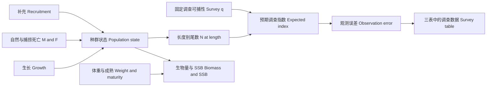
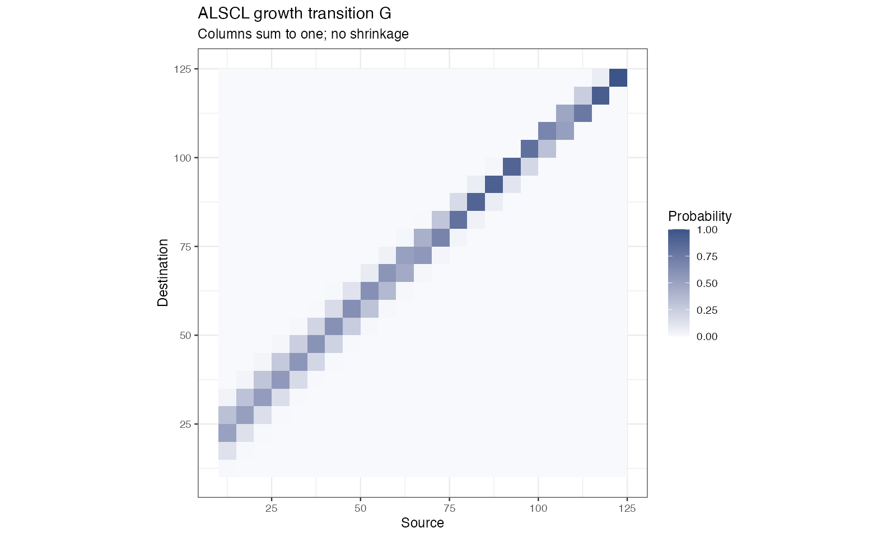

# 读懂状态、概率与区间 · States, probabilities and intervals

## 从隐状态到调查观测 · From latent state to survey observation



模型用调查数量数据约束隐含种群状态，再结合体重、成熟与生存计算派生量。渔业捕获 `CN` 不等于调查输入；`plot_CatL()` 展示调查观测与拟合值。

Survey numbers constrain latent population states; weights, maturity and survival define derived quantities. Fishery catch `CN` is not the survey input. `plot_CatL()` shows observations and fitted survey indices.

## 两种概率矩阵不可混用 · Two different probability matrices

| 矩阵 / Matrix | 条件与方向 / Meaning | 检查 / Check |
|---|---|---|
| `pla` | 给定年龄的长度分布 $`P(l\mid a)`$；R 模拟器方向随模型而异 / Length given age; simulator orientation varies | 先检查维度方向 / Check orientation |
| `G` | 一个时间步内从源长度列转入目的长度行 / Destination row conditional on source column | `colSums(G)` 约等于 1；非负、不缩短 / Nonnegative, normalized, no shrinkage |

`plot_pla()` 画的是年龄长度关系。下面是 tuna 条件 ALSCL 拟合的增长矩阵，可看出“停留原组”及“进入较大组”的概率。

`plot_pla()` shows age-length probabilities. The tuna ALSCL growth matrix below instead shows the probabilities of staying in a bin or advancing to larger bins.



```r
# b 为 ALSCL 拟合对象 / b is an ALSCL fit
G <- b$report$G
range(colSums(G))
stopifnot(all(G >= 0), max(abs(colSums(G) - 1)) < 1e-8)
```

同一组内的增长仍可能落回本组；这是离散分组造成的“留组”，不表示鱼停止生长。最后一组承接右尾概率，长度组边界改变会影响矩阵与状态解释。

Growth can remain within the same bin; this is bin retention, not zero individual growth. The largest bin absorbs the right tail. Changing bin boundaries changes both matrices and state interpretation.

## 不确定性与参数可识别性 · Uncertainty and identifiability

TMB 的 `sdreport` 通过局部曲率和 delta 方法得到近似标准误。图示为约 95% 逐点区间，不是同时置信带；生长区间描述平均曲线的参数不确定性，不是单尾鱼长度的预测范围。

TMB `sdreport` uses local curvature and the delta method. Approximate 95% pointwise intervals are not simultaneous bands. Growth intervals represent parameter uncertainty in the mean curve, not individual-fish prediction ranges.

YTF 教学例固定了生长和部分随机过程参数，因此生长区间可以退化为线，SSB 等区间也只反映其余自由参数的条件不确定性。Hessian 非正定、参数碰界或梯度偏大时，应先解决数值和识别问题，再解读区间。

YTF fixes growth and selected process parameters. Its growth interval can collapse to a line, and other intervals are conditional on these fixed values. Investigate Hessian, bounds and gradients before interpreting intervals.

## 年度、季度与死亡率 · Annual and quarterly units

年龄格点为 $`a_i=a_{rec}+(i-1)\Delta t`$。季度设 `growth_step=.25`；`k` 始终按年，`M` 和 F 为每个模型时间步的瞬时率。若已知年 M = 0.8，则季度 M = 0.8 × 0.25 = 0.2。生存概率是 $`\exp[-(M+F)]`$，不是直接从数量减去 M 和 F。

Ages use the stated step. Growth k is annual; M and F are instantaneous rates per model step. Annual M = 0.8 becomes quarterly M = 0.2. Survival is exponential, not a direct subtraction of rates from abundance.

```r
rec.age <- .25; nage <- 20; growth_step <- .25
ages <- rec.age + (seq_len(nage) - 1) * growth_step
range(ages) # 0.25–5 年 / years
M_quarter <- .8 * growth_step
# 四个季度的累计瞬时率 / Sum four quarterly instantaneous rates
F_quarter <- c(.1, .15, .2, .15)
F_annual <- sum(F_quarter)
```

`plot_compare_annual_F()` 不会将季度输出自动年化；`method="apical"` 是每期组间最大值，`"mean"` 是非加权平均。不同模型的原生 F 维度不同，不能把同一颜色的热图单元当成相同年龄长度群。

`plot_compare_annual_F()` does not annualize quarterly values. Apical is a within-step group maximum; mean is unweighted. Native F dimensions differ between models.
