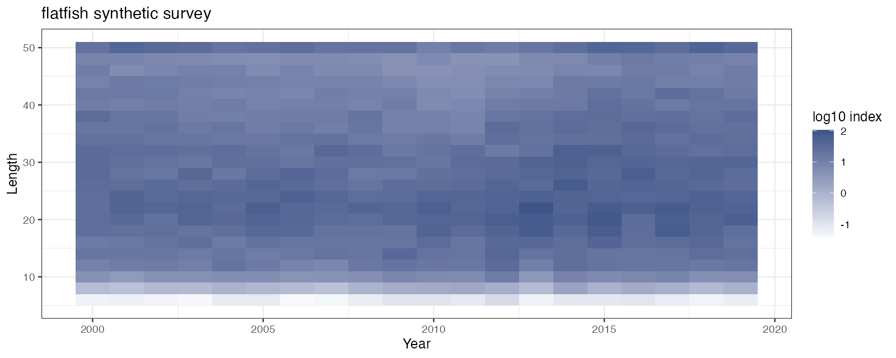
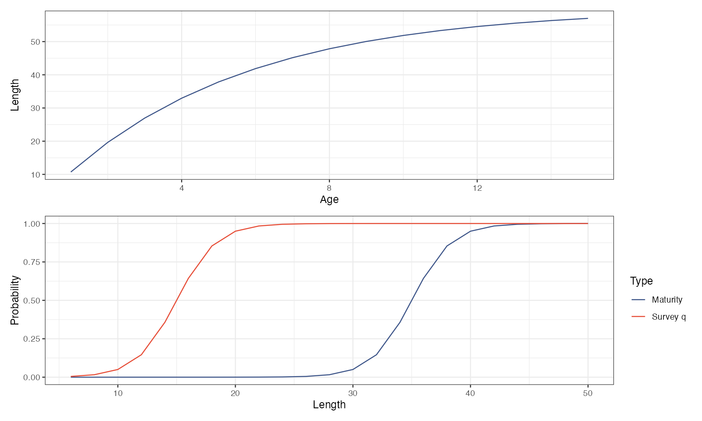
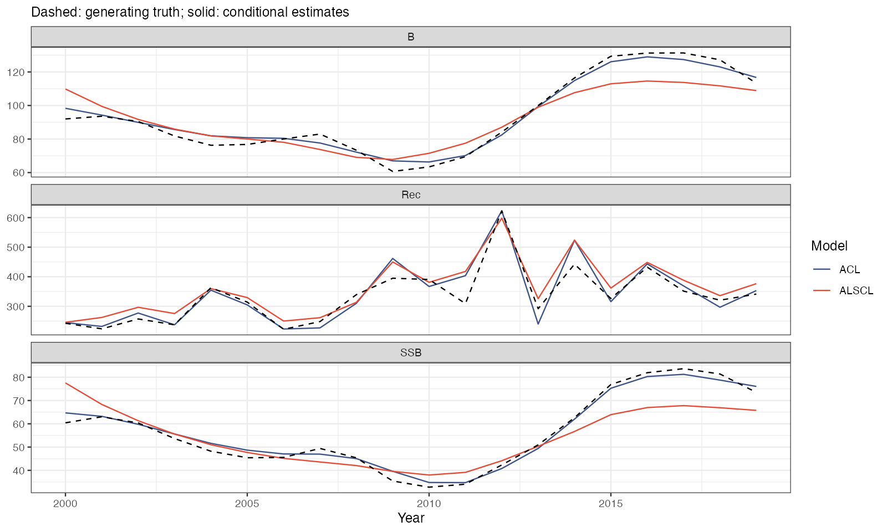
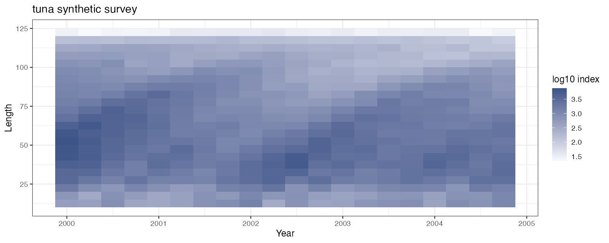
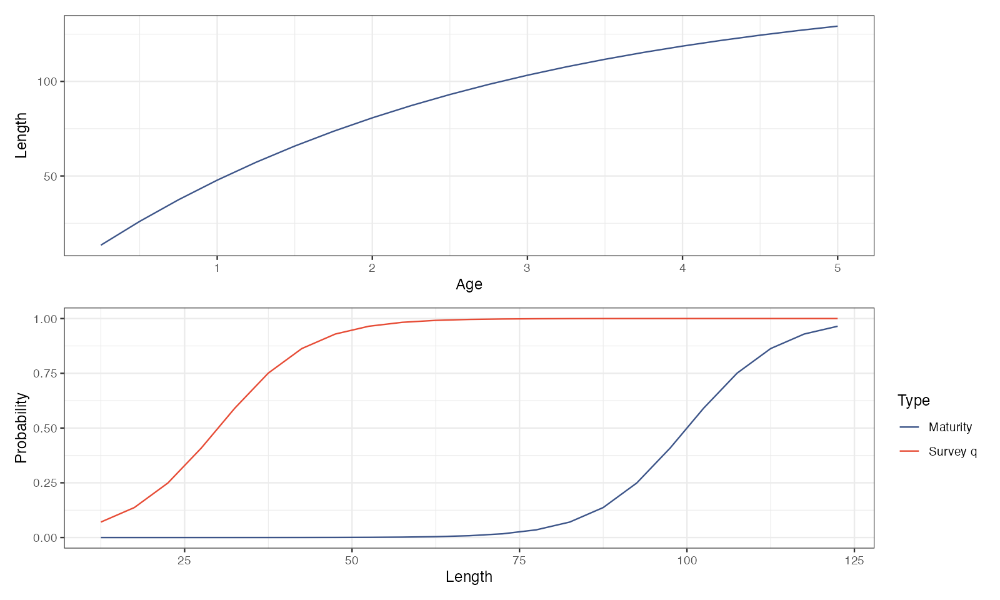
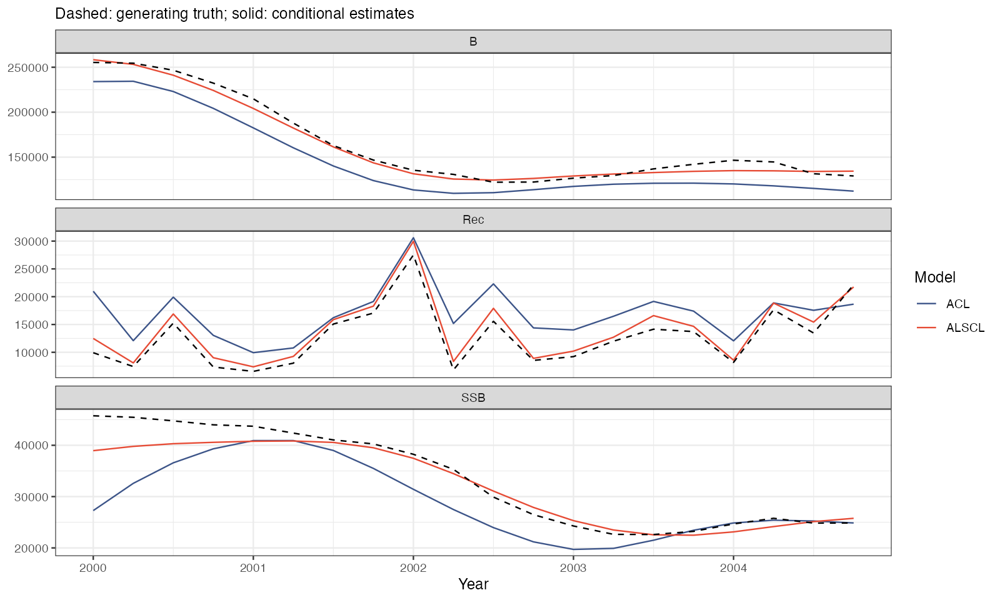

# 两个完整案例 · Two complete case studies

两案例重新使用当前包拟合。它们用于学习年度/季度工作流，不能替代原论文数据复现；单个随机重复也不能给两个模型排名。所有拟合图的通用操作仍以 `YTF_example` 为主线。

Both cases are refitted with the current package to teach annual and quarterly workflows. They do not reproduce the paper's data, and one replicate cannot rank the models. General plotting lessons continue to use `YTF_example`.

| 设置 / Setting | 黄尾鲽 Flatfish | 大眼金枪鱼 Tuna |
|---|---|---|
| 生成动力学 / Generator | age_based | length_based |
| 时间步 / Step, years | 1 | 0.25 |
| 总年数 / 预热年数 · Total / burn-in | 100 / 80 | 100 / 95 |
| 保留步数 / Retained steps | 20 | 20 |
| rec.age / nage | 1 / 15 | 0.25 / 20 |
| Linf / annual k | 60 / 0.20 | 152 / 0.38 |
| t0, years | 1/60 | 1/152 |
| M / mean F, per step | 0.20 / 0.30 | 0.20 / 0.20 |
| 成熟 L50/L95 · Maturity | 35 / 40 | 100 / 120 |
| 调查 q L50/L95 · Survey | 15 / 20 | 30 / 50 |
| 长度中点 / Midpoints | 6, 8, …, 50 | 12.5, 17.5, …, 122.5 |
| 调查 log SD / Survey log SD | 0.20 | 0.10 |

这里 flatfish 的调查 SD = 0.20，主线 `YTF_example` 则沿用 YTF 的 0.10，不能混称同一数据。tuna 的 M = 0.2 为每季度率。长度与体重单位必须与幂函数系数匹配；示例年份从 2000 开始仅用于坐标标签。

The flatfish preset uses survey SD 0.20, while `YTF_example` retains YTF's 0.10. Tuna M is per quarter. Units must match the length-weight coefficients; dates starting in 2000 are illustrative.

## 读取和重建 · Read and rebuild

```r
# 读取已有案例 / Read the supplied cases
source("scripts/real_data_workflow.R", encoding="UTF-8")
flatfish_inputs <- read_survey_csv("docs/data/cases/flatfish")
tuna_inputs <- read_survey_csv("docs/data/cases/tuna")
validate_survey_tables(flatfish_inputs, growth_step=1)
validate_survey_tables(tuna_inputs, growth_step=.25)
pa <- readRDS("docs/data/cases/tuna/truth.rds")$parameters
str(pa)
# 重新产生数据 / Regenerate inputs
source("scripts/simulation_workflow.R", encoding="UTF-8")
simulations <- run_simulation_examples(out="my_simulations", fit_batch=FALSE)
# 重跑两个案例的拟合和七张图 / Refit both cases and regenerate seven figures
source("scripts/case_studies.R", encoding="UTF-8")
case_status <- run_case_studies(out="docs")
```

最后一行读取 `out/data/cases` 的已保存真值并将输出写入同一目录下。要换目录，先复制案例输入及真值。完整拟合初值、map 和生物参数构造均在 [case_studies.R](../scripts/case_studies.R)，数据下载见 [两个案例目录](data/cases/README.md)。

The final call reads saved truth from `out/data/cases` and writes results under `out`. Copy these inputs first when choosing another directory. The linked R script defines every starting value, map and biological argument.

## 年度黄尾鲽 · Annual flatfish



颜色为 log10 调查数量指数。沿时间和体长延伸的条带可反映队列结构；它们仍同时受调查可捕性和观测误差影响。

Colors encode log10 survey numbers. Cohort patterns are modified by catchability and observation noise.



生长曲线决定年龄与平均长度的联系；成熟概率和调查 q 有不同的 L50/L95，不可相互替代。

The growth curve links age to mean length. Maturity and survey q use different L50/L95 values and are not interchangeable.



黑虚线为生成真值，彩色线是固定部分生物参数的条件估计。比较每种量的趋势和偏移；同一时期曲线接近并不证明所有参数可识别。

Black dashed curves are generating truth; colored curves are conditional estimates. Compare trajectories and offsets without treating agreement as proof of identifiability.

## 季度大眼金枪鱼 · Quarterly tuna



20 个保留步长覆盖 5 年，非 20 年。物种预设同时改变生成动力学、长度组、年龄网格及生物参数。

Twenty retained quarters span five years, not twenty. The preset changes dynamics, bins, ages and biological parameters together.





tuna 由长度型过程生成；拟合仍要明确 `growth_step=.25`。案例固定了真实生长、CV、部分过程离散及相关参数，估计的区间不能覆盖这些假设本身的误差。

Tuna is generated with length-based dynamics and fitted with an explicit quarterly step. Known growth, CV and selected process/correlation parameters are fixed; conditional uncertainty omits errors in those assumptions.

## 如何扩展为模拟实验 · Extend into a simulation study

改变 `iter_range` 生成多个随机重复；系统改变观测误差、M、q、长度分箱或数据长度。保留所有失败拟合和诊断，再汇总偏差、RMSE、区间覆盖率及回溯表现。仅平均“成功重复”会形成选择偏差。

Use multiple seeds and vary observation noise, M, q, binning or series length systematically. Retain failed fits before summarizing bias, RMSE, coverage and retrospectives; averaging only successful fits introduces selection bias.

[本次四个拟合的数值状态 / Four-fit convergence record](results/case_convergence.csv)。
