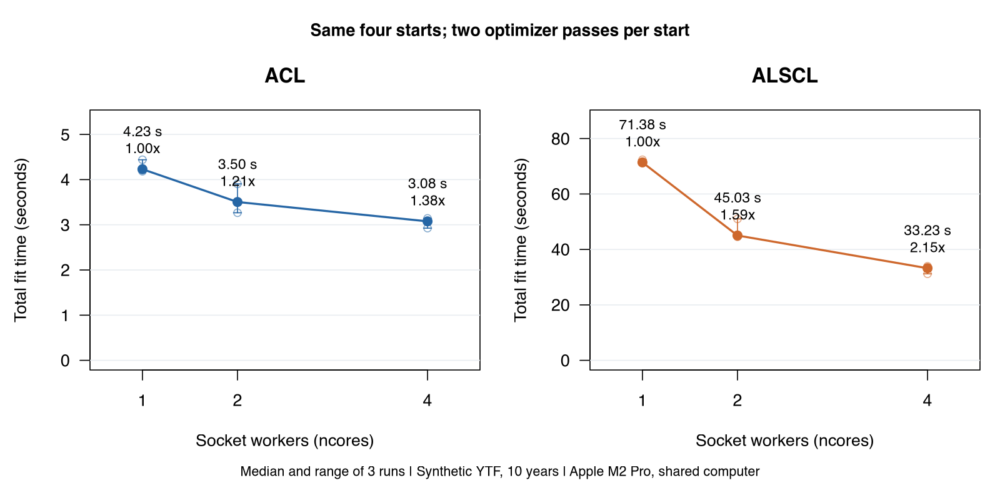
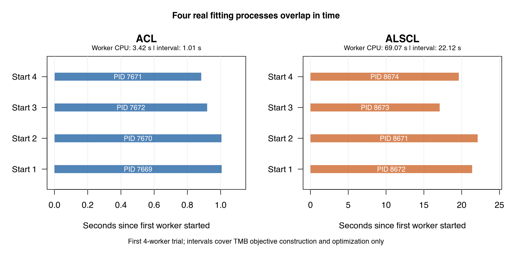

# Parallel fitting: measured performance / 并行拟合实测

Measured on 7 October 2026 (PDT). These are actual calls to `run_acl()` and `run_alscl()`, including real TMB optimization. The measurements demonstrate process-level parallelism across initial values; they do not demonstrate multithreading within one likelihood evaluation.

实测日期：2026 年 10 月 7 日（PDT）。测试直接调用 `run_acl()` 和 `run_alscl()`，执行真实 TMB 优化。验证的是不同初始点之间的进程并行，不是单个似然函数内部的多线程。

## Equal work / 相同工作量

| Model | Workers | Median (s) | Range (s) | Speedup |
|---|---:|---:|---:|---:|
| ACL | 1 | 4.23 | 4.18–4.44 | 1.00× |
| ACL | 2 | 3.50 | 3.27–3.90 | 1.21× |
| ACL | 4 | 3.08 | 2.93–3.14 | 1.38× |
| ALSCL | 1 | 71.38 | 71.28–72.35 | 1.00× |
| ALSCL | 2 | 45.03 | 44.55–51.00 | 1.59× |
| ALSCL | 4 | 33.23 | 31.21–33.95 | 2.15× |

Each entry summarizes **three runs**, with **four identical starts** and **two successive optimizer passes per start**. Speedup is the one-worker median divided by that row's median. Time includes data preparation, starting and stopping socket workers, optimization, the final report, and standard-error calculation. Compilation and one warm-up per model are excluded. All measured runs are retained.

每项为 **3 次实测**的汇总，每次均为 **4 个相同初始点，每个起点连续优化 2 轮**。加速比为单进程中位时间除以该行中位时间。包含数据准备、进程创建与关闭、优化、最终报告与标准误计算；不包含编译及每个模型的一次预热。没有删除较慢的测量。



## Data and machine / 数据与环境

- Synthetic `YTF_example`, seed 4: first 10 annual columns (2000–2009), all 23 length bins and 15 age classes. These are teaching data, not empirical stock observations.
- The same bundled `fit_args` and model-specific `fit_config` were used at every worker count. Known biological assumptions stay fixed; other configured fixed effects and random effects are estimated. These conditional fits do not establish performance for every full assessment.
- Apple M2 Pro, 10 logical CPUs, 32 GiB RAM; R 4.6.0, TMB 1.9.21, RcppEigen 0.3.4.0.2; optimized C++ templates compiled with `-O2`, without template OpenMP.
- Worker order rotates (1,2,4; 2,4,1; 4,1,2), and model order alternates. Other user analyses shared the machine. These are shared-machine measurements, not an isolated hardware benchmark or a universal speed guarantee.

使用内置模拟数据前 10 年，保留 23 个体长组和 15 个年龄组；不同并行数使用相同数据、参数映射、初始值与默认优化控制。机器为 Apple M2 Pro / 32 GiB，测试期间有其他分析在运行。计时顺序轮换以降低顺序偏差，但不能排除系统负载影响。具体环境见 [environment.txt](results/parallel/environment.txt)。

## Evidence of real computation / 真实运算证据

| Model | Distinct PIDs | Peak overlapping starts | Total worker CPU (s) | Worker interval (s) |
|---|---:|---:|---:|---:|
| ACL | 4 | 4 | 3.42 | 1.01 |
| ALSCL | 4 | 4 | 69.07 | 22.12 |

These are the first four-worker trials. Worker intervals overlap, PIDs differ, and summed worker CPU time exceeds the elapsed optimization interval. Every worker creates a TMB objective and calls `nlminb()` with its objective and analytic gradient. There is no artificial delay or substitute calculation in this benchmark.

以上为第一轮四进程测试。不同 PID 的执行时间重叠，累计 CPU 运算时间超过该阶段的实际经过时间；每个进程确实建立 TMB 对象并调用 `nlminb()`，而不是仅创建空闲进程。图中仅画起点构建及优化阶段；总耗时表还包括进程开销和后续串行步骤。



Across 18 timed fits and 72 starts: all starts returned finite objectives and optimizer code 0. All selected fits had a positive-definite Hessian, no boundary hit, and maximum absolute gradient below 0.001 (observed maximum: 6.44e-05). Initial vectors were identical across worker counts; maximum per-start objective difference was 0, and maximum relative biomass difference was 0. Hessian and gradient checks apply to the selected result; other starts retain objective and optimizer-code diagnostics.

全部 18 次计时拟合、72 个起点均得到有限目标函数及优化码 0。选中的模型均通过 Hessian、梯度与边界检查；不同并行数的初值一致，逐起点目标函数最大差为 0，最终生物量最大相对差为 0。Hessian 和梯度是最终选中模型的诊断，其他起点保留目标函数及优化码。

## What changed / 实现调整

The existing core already used `parallel::parLapply()` for real optimization, but `ncores` also set the number of starts. That confounded work quantity with concurrency. The fitting APIs now expose `nstarts` separately, defaulting to `ncores` to preserve earlier calls. At most `min(ncores, nstarts)` workers are created. Sequential and parallel fits share the same optimization helper and deterministic starting values; sequential jitter preserves the caller's RNG state.

原有核心已经调用真实并行优化，但 `ncores` 同时决定总起点数，无法直接公平比较速度。现在新增 `nstarts`，默认仍等于 `ncores`，兼容旧调用。串行与并行共用优化实现和初值规则；返回的 `start_diagnostics` 记录每个起点的 PID、Unix 起止时间、经过时间、CPU 时间、目标函数及优化码。无需修改 C++ 模型数学定义。

```r
library(ALSCL)
x <- YTF_example
inputs <- x[c("data.CatL", "data.wgt", "data.mat")]
# Same four starts: use ncores = 1, 2 or 4 to choose concurrency.
# This example uses the full 20-year data; the timing table used its first 10 years.
fit <- do.call(run_alscl, c(inputs, x$fit_args, x$fit_config$alscl,
  list(nstarts = 4, ncores = 4, train_times = 2, silent = TRUE)))
fit$start_diagnostics
c(code = fit$convergence_code, gradient = fit$max_abs_gradient,
  pdHess = fit$pdHess, boundary = fit$bound_hit)
```

One start is still a serial TMB fit: `nstarts = 1, ncores = 4` uses one worker. Preparation, final report and standard errors include serial work. Small jobs can be slower in parallel, and memory use increases with workers. The chosen result minimizes the finite objective; this selection rule does not replace convergence checks. `sim_acl()` parallelizes replicate fits and `retro_*()` parallelizes peels; their inner fits remain single-worker.

单个起点仍是串行 TMB 拟合；`nstarts = 1, ncores = 4` 实际使用一个进程。数据准备、最终报告和标准误计算包含串行工作，因此不能期望 4 个进程总能快 4 倍。小任务可能因启动开销变慢，更多进程也需要更多内存。`sim_acl()` 和 `retro_*()` 分别并行分配模拟重复和回溯任务，内部仍单进程拟合。

## Original version check / 修改前验证

The original commit `34ee83b59af17bae250ebb93355ccb0799e62e9c` was also tested on the full 20-year example with `train_times = 2`. All four calls converged, with positive-definite Hessians and no boundary hits.

| Model | Original ncores | Total starts | Elapsed (s) |
|---|---:|---:|---:|
| ACL | 1 | 1 | 5.899 |
| ACL | 2 | 2 | 8.526 |
| ALSCL | 1 | 1 | 96.754 |
| ALSCL | 2 | 2 | 121.082 |

This is a functionality check, **not an equal-work speed comparison**: both data length and start counts differ from the main experiment. It confirms that the original setting was functional, while explaining why increasing `ncores` alone need not reduce elapsed time.

原版在完整 20 年数据上也正常运行。此表用于功能确认，**不能作为相同工作量的加速比**；直接增大旧参数 `ncores` 会增加总拟合次数。主表则固定了起点总数。

## Reproduce and inspect / 复现与核对

From the repository root, install the updated source first:

```sh
R CMD INSTALL .
Rscript scripts/benchmark_parallel.R docs/results/parallel 3 10
Rscript scripts/plot_parallel_benchmark.R
Rscript -e 'library(ALSCL); testthat::test_dir("tests/testthat", reporter="summary")'
```

The complete local regression suite passed **256 assertions, with zero failures, errors or warnings**; see [regression test results](results/parallel/regression_tests.csv). / 本机完整回归测试通过 **256 项检查，零失败、错误或警告**。

The benchmark stops on failed convergence, different starting values/objectives/biomass, missing worker PIDs, or absent CPU activity. Unit tests also cover legacy defaults, worker caps, RNG preservation, failed-start diagnostics, retrospective ACL/ALSCL results at 1/2/4 workers, and actual `sim_acl()` replicate fits at 1/2/4 workers.

- [Benchmark script](../scripts/benchmark_parallel.R) · [Plotting script](../scripts/plot_parallel_benchmark.R) · [Regression tests](../tests/testthat/test-parallel.R)
- [Summary](results/parallel/summary.csv) · [All timed runs](results/parallel/runs.csv) · [Per-start PID/CPU/timing](results/parallel/starts.csv)
- [Starting and fitted parameters](results/parallel/parameters.csv) · [Source hashes](results/parallel/source_hashes.csv) · [Package versions](results/parallel/package_versions.csv)
- [Original-version timings](results/parallel/original_baseline.csv) · [Validation](results/parallel/validation.txt)
