# YTF 绘图图谱 · YTF plot gallery

**45 张图，覆盖 22 个公开绘图函数及主要类型。45 figures covering all 22 public plotting functions and major variants.**

[使用指南 / Guide](USER_GUIDE.md) · [完整参数 / API](FUNCTION_REFERENCE.md) · [可运行脚本 / R workflow](../scripts/ytf_workflow.R)

先运行指南第 2 节，定义 `a`、`b`、`x`、`inputs`、`dat <- x$data.CatL`，并加载 `ggplot2`、`patchwork`。回溯图使用指南第 9 节的 `ra` 和 `rb`。全部图来自同一个模拟 YTF 数据和固定部分生物参数的条件拟合。

Run section 2 of the guide, define `dat <- x$data.CatL`, and load ggplot2/patchwork. Retrospective plots use `ra/rb` from section 9. Every fit uses the same synthetic YTF data and conditional fixed-biology settings.

代码中的额外主题、刻度及组合布局仅调整显示。图像可点击放大；保存时建议宽 11 英寸、多分面高 8.5 英寸。 / Extra theme, scale and layout calls affect presentation only. Click figures to enlarge; use wide output for multi-panel figures.

```r
# 全图共用主题 / Shared gallery theme
acl_theme_set(base_theme="bw", font_family="sans", title_size=12,
  axis_title_size=10, axis_text_size=9, strip_text_size=9,
  palette="npg")
```

## 图目录 / Figure index

- [1. 调查拟合 length 对数尺度 / Survey fit length log scale](#CatL_length_FALSE)
- [2. 调查拟合 length 原尺度 / Survey fit length original scale](#CatL_length_TRUE)
- [3. 调查拟合 year 对数尺度 / Survey fit year log scale](#CatL_year_FALSE)
- [4. 调查拟合 year 原尺度 / Survey fit year original scale](#CatL_year_TRUE)
- [5. 丰度 N / Abundance N](#plot_abundance_N)
- [6. 丰度 NA / Abundance NA](#plot_abundance_NA)
- [7. 丰度 NL / Abundance NL](#plot_abundance_NL)
- [8. 生物量 B / Biomass B](#plot_biomass_B)
- [9. 生物量 BA / Biomass BA](#plot_biomass_BA)
- [10. 生物量 BL / Biomass BL](#plot_biomass_BL)
- [11. 产卵生物量 SSB / Spawning biomass SSB](#plot_SSB_SSB)
- [12. 产卵生物量 SBA / Spawning biomass SBA](#plot_SSB_SBA)
- [13. 产卵生物量 SBL / Spawning biomass SBL](#plot_SSB_SBL)
- [14. 捕获尾数 CN / Catch numbers CN](#plot_catch_CN)
- [15. 捕获尾数 CNA / Catch numbers CNA](#plot_catch_CNA)
- [16. 捕获尾数 CNL / Catch numbers CNL](#plot_catch_CNL)
- [17. 补充量 / Recruitment](#recruitment)
- [18. 亲体与补充关系 / Spawning biomass and recruitment](#SSB_Rec)
- [19. 生长曲线与区间 / Growth curve and interval](#VB)
- [20. 年龄长度转换 / Age length conversion](#pla)
- [21. ACL 捕捞死亡率 year / ACL fishing mortality year](#F_ACL_year)
- [22. ACL 捕捞死亡率 age / ACL fishing mortality age](#F_ACL_age)
- [23. ACL 捕捞死亡率 length / ACL fishing mortality length](#F_ACL_length)
- [24. ALSCL 捕捞死亡率 year / ALSCL fishing mortality year](#F_ALSCL_year)
- [25. ALSCL 捕捞死亡率 age / ALSCL fishing mortality age](#F_ALSCL_age)
- [26. ALSCL 捕捞死亡率 length / ALSCL fishing mortality length](#F_ALSCL_length)
- [27. 对数残差 length / Log residuals length](#residuals_length)
- [28. 对数残差 year / Log residuals year](#residuals_year)
- [29. 过程偏差 R TRUE / Process deviations R TRUE](#deviation_R_TRUE)
- [30. 过程偏差 R FALSE / Process deviations R FALSE](#deviation_R_FALSE)
- [31. 过程偏差 F TRUE / Process deviations F TRUE](#deviation_F_TRUE)
- [32. 过程偏差 F FALSE / Process deviations F FALSE](#deviation_F_FALSE)
- [33. 长度组成山脊图 / Length composition ridges](#ridges)
- [34. 种群时间序列比较 / Population time series comparison](#compare_ts)
- [35. 死亡率矩阵比较 / Fishing mortality matrices](#compare_F)
- [36. 残差联合诊断 / Combined residual diagnostics](#compare_residuals)
- [37. 生长与外部参照接口 / Growth and reference-data interface](#compare_growth)
- [38. 两模型调查拟合 / Survey fits from both models](#compare_CatL)
- [39. 拟合指标比较 / Fit metric comparison](#compare_metrics)
- [40. 固定调查可捕性 / Fixed survey catchability](#compare_selectivity)
- [41. 总体 F 比较 apical / Summary F comparison apical](#compare_F_apical)
- [42. 总体 F 比较 mean / Summary F comparison mean](#compare_F_mean)
- [43. ACL 回溯分析 / ACL retrospective analysis](#retro_ACL)
- [44. ALSCL 回溯分析 / ALSCL retrospective analysis](#retro_ALSCL)
- [45. 模拟真值与条件估计 / Simulation truth and conditional estimates](#truth)

<a id="plot_CatL"></a>

<a id="CatL_length_FALSE"></a>
## 1. 调查拟合 length 对数尺度 / Survey fit length log scale

```r
# 绘制本图 / Draw this figure
plot_CatL(b, type = "length", exp_transform = FALSE, facet_ncol = 4,
  point_size = 1, line_size = 0.6,
  x_breaks = c(2000, 2010, 2015),
  ylab = "Log survey index")
```

[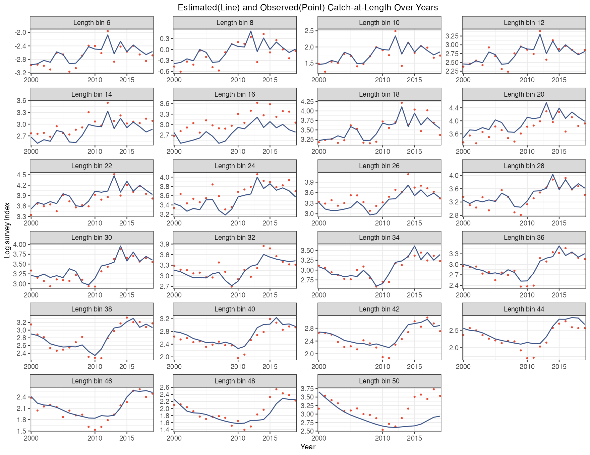](figures/ytf/CatL_length_FALSE.png)

点为观测对数，曲线为拟合的 Elog_index。

Points are log observations; curves show fitted Elog_index.

[参数及默认值 / Arguments and defaults](FUNCTION_REFERENCE.md#plot_CatL)

<a id="CatL_length_TRUE"></a>
## 2. 调查拟合 length 原尺度 / Survey fit length original scale

```r
# 绘制本图 / Draw this figure
plot_CatL(b, type = "length", exp_transform = TRUE, facet_ncol = 4,
  point_size = 1, line_size = 0.6,
  x_breaks = c(2000, 2010, 2015),
  ylab = "Survey index")
```

[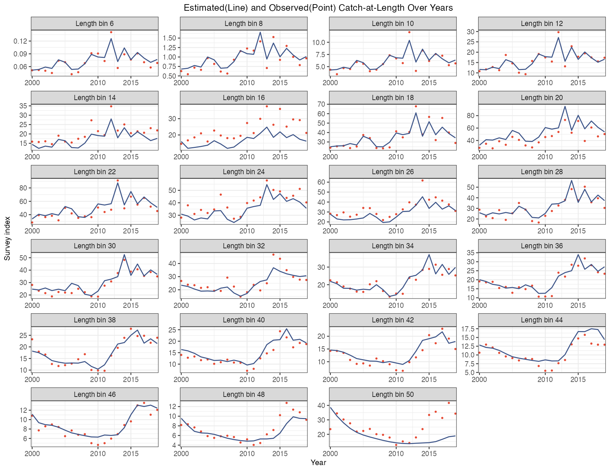](figures/ytf/CatL_length_TRUE.png)

原尺度曲线为 exp(Elog_index)，即对数正态中位数。

Original-scale curves are lognormal medians, exp(Elog_index).

[参数及默认值 / Arguments and defaults](FUNCTION_REFERENCE.md#plot_CatL)

<a id="CatL_year_FALSE"></a>
## 3. 调查拟合 year 对数尺度 / Survey fit year log scale

```r
# 绘制本图 / Draw this figure
plot_CatL(b, type = "year", exp_transform = FALSE, facet_ncol = 4,
  point_size = 1, line_size = 0.6,
  x_breaks = c(10, 30, 50),
  ylab = "Log survey index")
```

[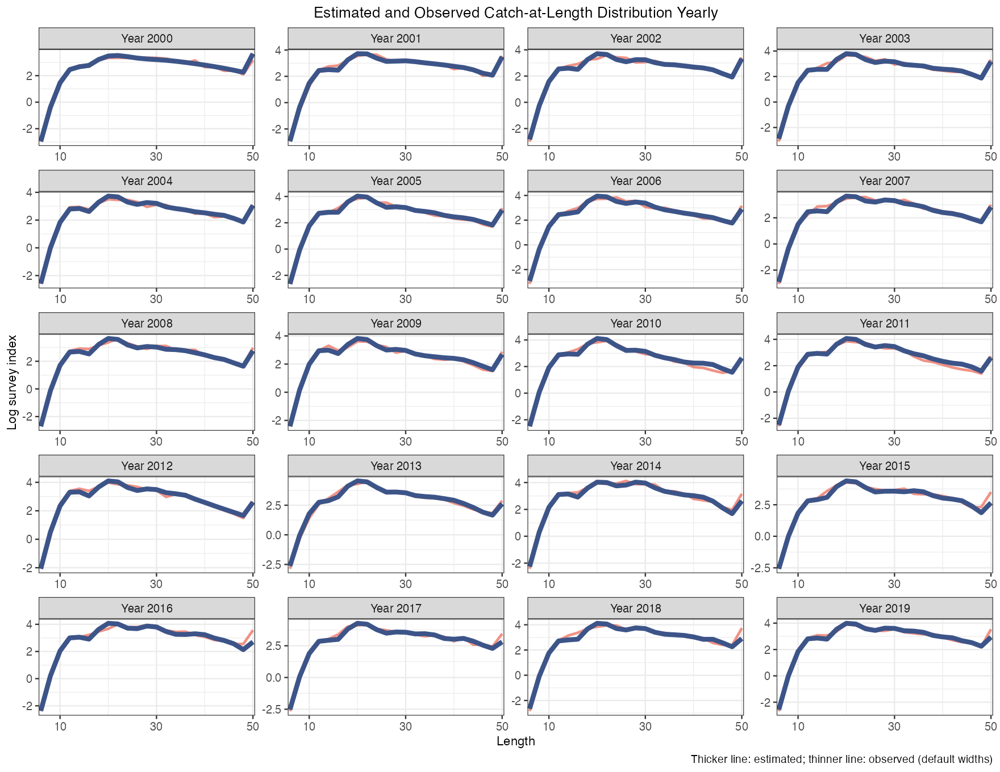](figures/ytf/CatL_year_FALSE.png)

朱红色为观测对数，深蓝色为拟合的 Elog_index。

Vermilion curves are log observations; navy curves show fitted Elog_index.

[参数及默认值 / Arguments and defaults](FUNCTION_REFERENCE.md#plot_CatL)

<a id="CatL_year_TRUE"></a>
## 4. 调查拟合 year 原尺度 / Survey fit year original scale

```r
# 绘制本图 / Draw this figure
plot_CatL(b, type = "year", exp_transform = TRUE, facet_ncol = 4,
  point_size = 1, line_size = 0.6,
  x_breaks = c(10, 30, 50),
  ylab = "Survey index")
```

[](figures/ytf/CatL_year_TRUE.png)

原尺度曲线为 exp(Elog_index)，即对数正态中位数。

Original-scale curves are lognormal medians, exp(Elog_index).

[参数及默认值 / Arguments and defaults](FUNCTION_REFERENCE.md#plot_CatL)

<a id="plot_abundance"></a>

<a id="plot_abundance_N"></a>
## 5. 丰度 N / Abundance N

```r
# 绘制本图 / Draw this figure
plot_abundance(b, type = "N", se = TRUE, facet_ncol = 3,
  line_size = 0.6)
```

[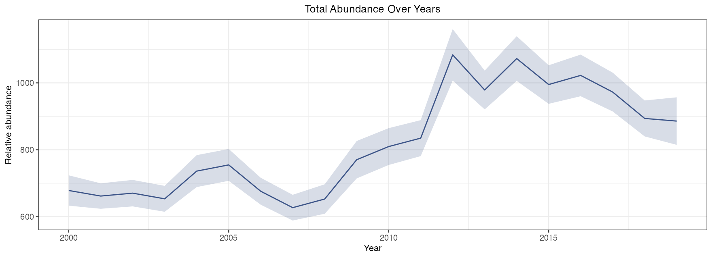](figures/ytf/plot_abundance_N.png)

ALSCL 示例；A 表示年龄组，L 表示长度组。有可用标准误时显示近似 95% 区间。 总量图显示各组之和；分面图的纵轴按组调整。

ALSCL example: A denotes age, L length. Approximate 95% intervals appear where standard errors are available. Totals sum across groups; faceted y axes adjust to each group.

[参数及默认值 / Arguments and defaults](FUNCTION_REFERENCE.md#plot_abundance)

<a id="plot_abundance_NA"></a>
## 6. 丰度 NA / Abundance NA

```r
# 绘制本图 / Draw this figure
plot_abundance(b, type = "NA", se = TRUE, facet_ncol = 3,
  line_size = 0.6)
```

[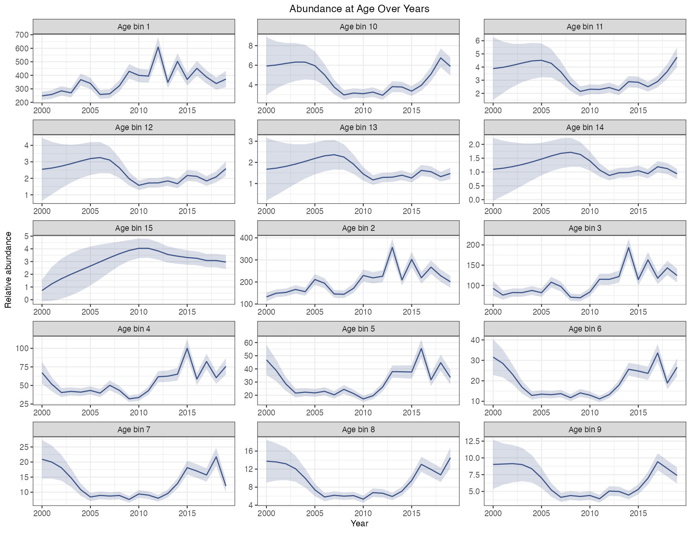](figures/ytf/plot_abundance_NA.png)

ALSCL 示例；A 表示年龄组，L 表示长度组。有可用标准误时显示近似 95% 区间。 总量图显示各组之和；分面图的纵轴按组调整。

ALSCL example: A denotes age, L length. Approximate 95% intervals appear where standard errors are available. Totals sum across groups; faceted y axes adjust to each group.

[参数及默认值 / Arguments and defaults](FUNCTION_REFERENCE.md#plot_abundance)

<a id="plot_abundance_NL"></a>
## 7. 丰度 NL / Abundance NL

```r
# 绘制本图 / Draw this figure
plot_abundance(b, type = "NL", se = TRUE, facet_ncol = 3,
  line_size = 0.6)
```

[](figures/ytf/plot_abundance_NL.png)

ALSCL 示例；A 表示年龄组，L 表示长度组。有可用标准误时显示近似 95% 区间。 总量图显示各组之和；分面图的纵轴按组调整。

ALSCL example: A denotes age, L length. Approximate 95% intervals appear where standard errors are available. Totals sum across groups; faceted y axes adjust to each group.

[参数及默认值 / Arguments and defaults](FUNCTION_REFERENCE.md#plot_abundance)

<a id="plot_biomass"></a>

<a id="plot_biomass_B"></a>
## 8. 生物量 B / Biomass B

```r
# 绘制本图 / Draw this figure
plot_biomass(b, type = "B", se = TRUE, facet_ncol = 3,
  line_size = 0.6)
```

[](figures/ytf/plot_biomass_B.png)

ALSCL 示例；A 表示年龄组，L 表示长度组。有可用标准误时显示近似 95% 区间。 总量图显示各组之和；分面图的纵轴按组调整。

ALSCL example: A denotes age, L length. Approximate 95% intervals appear where standard errors are available. Totals sum across groups; faceted y axes adjust to each group.

[参数及默认值 / Arguments and defaults](FUNCTION_REFERENCE.md#plot_biomass)

<a id="plot_biomass_BA"></a>
## 9. 生物量 BA / Biomass BA

```r
# 绘制本图 / Draw this figure
plot_biomass(b, type = "BA", se = TRUE, facet_ncol = 3,
  line_size = 0.6)
```

[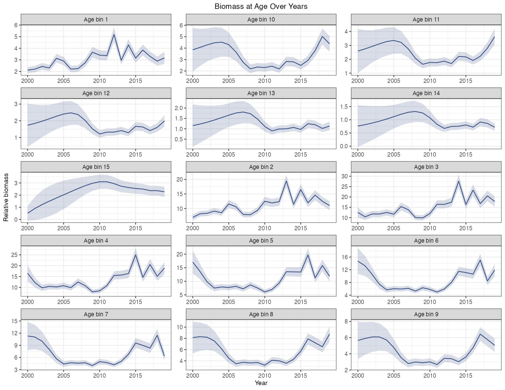](figures/ytf/plot_biomass_BA.png)

ALSCL 示例；A 表示年龄组，L 表示长度组。有可用标准误时显示近似 95% 区间。 总量图显示各组之和；分面图的纵轴按组调整。

ALSCL example: A denotes age, L length. Approximate 95% intervals appear where standard errors are available. Totals sum across groups; faceted y axes adjust to each group.

[参数及默认值 / Arguments and defaults](FUNCTION_REFERENCE.md#plot_biomass)

<a id="plot_biomass_BL"></a>
## 10. 生物量 BL / Biomass BL

```r
# 绘制本图 / Draw this figure
plot_biomass(b, type = "BL", se = TRUE, facet_ncol = 3,
  line_size = 0.6)
```

[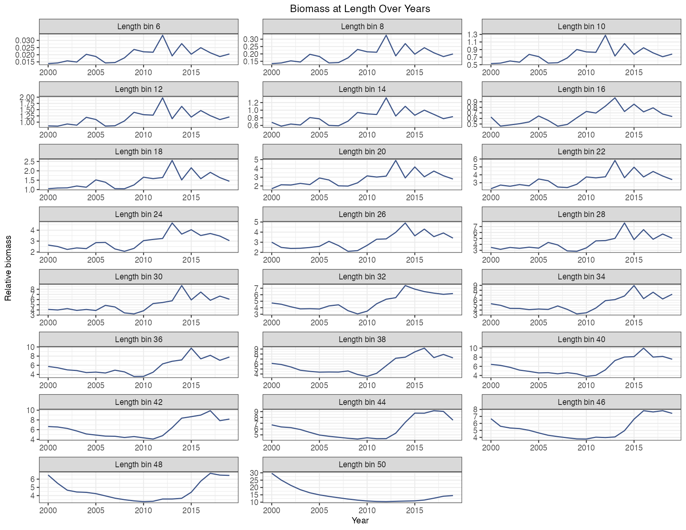](figures/ytf/plot_biomass_BL.png)

ALSCL 示例；A 表示年龄组，L 表示长度组。有可用标准误时显示近似 95% 区间。 总量图显示各组之和；分面图的纵轴按组调整。

ALSCL example: A denotes age, L length. Approximate 95% intervals appear where standard errors are available. Totals sum across groups; faceted y axes adjust to each group.

[参数及默认值 / Arguments and defaults](FUNCTION_REFERENCE.md#plot_biomass)

<a id="plot_SSB"></a>

<a id="plot_SSB_SSB"></a>
## 11. 产卵生物量 SSB / Spawning biomass SSB

```r
# 绘制本图 / Draw this figure
plot_SSB(b, type = "SSB", se = TRUE, facet_ncol = 3,
  line_size = 0.6)
```

[](figures/ytf/plot_SSB_SSB.png)

ALSCL 示例；A 表示年龄组，L 表示长度组。有可用标准误时显示近似 95% 区间。 总量图显示各组之和；分面图的纵轴按组调整。

ALSCL example: A denotes age, L length. Approximate 95% intervals appear where standard errors are available. Totals sum across groups; faceted y axes adjust to each group.

[参数及默认值 / Arguments and defaults](FUNCTION_REFERENCE.md#plot_SSB)

<a id="plot_SSB_SBA"></a>
## 12. 产卵生物量 SBA / Spawning biomass SBA

```r
# 绘制本图 / Draw this figure
plot_SSB(b, type = "SBA", se = TRUE, facet_ncol = 3,
  line_size = 0.6)
```

[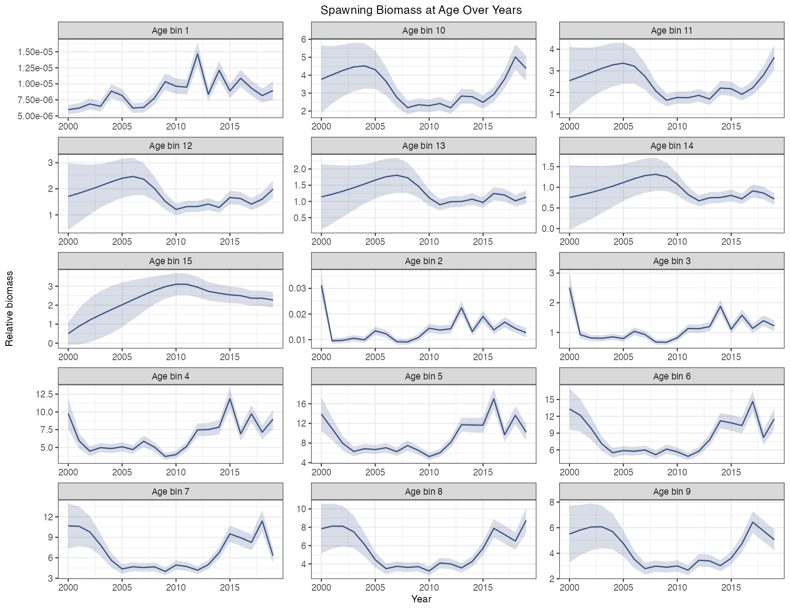](figures/ytf/plot_SSB_SBA.png)

ALSCL 示例；A 表示年龄组，L 表示长度组。有可用标准误时显示近似 95% 区间。 总量图显示各组之和；分面图的纵轴按组调整。

ALSCL example: A denotes age, L length. Approximate 95% intervals appear where standard errors are available. Totals sum across groups; faceted y axes adjust to each group.

[参数及默认值 / Arguments and defaults](FUNCTION_REFERENCE.md#plot_SSB)

<a id="plot_SSB_SBL"></a>
## 13. 产卵生物量 SBL / Spawning biomass SBL

```r
# 绘制本图 / Draw this figure
plot_SSB(b, type = "SBL", se = TRUE, facet_ncol = 3,
  line_size = 0.6)
```

[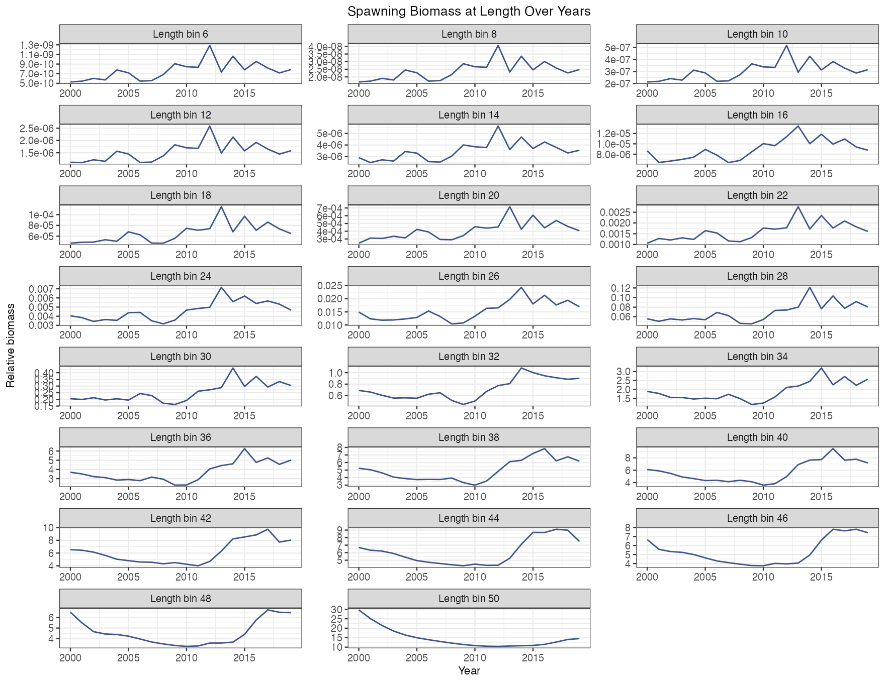](figures/ytf/plot_SSB_SBL.png)

ALSCL 示例；A 表示年龄组，L 表示长度组。有可用标准误时显示近似 95% 区间。 总量图显示各组之和；分面图的纵轴按组调整。

ALSCL example: A denotes age, L length. Approximate 95% intervals appear where standard errors are available. Totals sum across groups; faceted y axes adjust to each group.

[参数及默认值 / Arguments and defaults](FUNCTION_REFERENCE.md#plot_SSB)

<a id="plot_catch"></a>

<a id="plot_catch_CN"></a>
## 14. 捕获尾数 CN / Catch numbers CN

```r
# 绘制本图 / Draw this figure
plot_catch(b, type = "CN", se = TRUE, facet_ncol = 3,
  line_size = 0.6)
```

[](figures/ytf/plot_catch_CN.png)

ALSCL 示例；A 表示年龄组，L 表示长度组。有可用标准误时显示近似 95% 区间。 捕获尾数是模型推算的渔业捕获，不是调查指数。

ALSCL example: A denotes age, L length. Approximate 95% intervals appear where standard errors are available. These are model-derived fishery catches, not survey indices.

[参数及默认值 / Arguments and defaults](FUNCTION_REFERENCE.md#plot_catch)

<a id="plot_catch_CNA"></a>
## 15. 捕获尾数 CNA / Catch numbers CNA

```r
# 绘制本图 / Draw this figure
plot_catch(b, type = "CNA", se = TRUE, facet_ncol = 3,
  line_size = 0.6)
```

[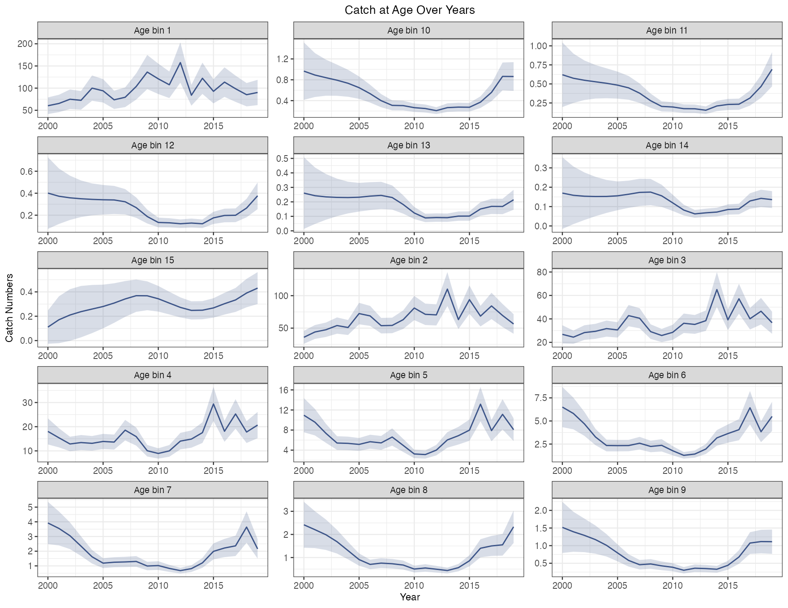](figures/ytf/plot_catch_CNA.png)

ALSCL 示例；A 表示年龄组，L 表示长度组。有可用标准误时显示近似 95% 区间。 捕获尾数是模型推算的渔业捕获，不是调查指数。

ALSCL example: A denotes age, L length. Approximate 95% intervals appear where standard errors are available. These are model-derived fishery catches, not survey indices.

[参数及默认值 / Arguments and defaults](FUNCTION_REFERENCE.md#plot_catch)

<a id="plot_catch_CNL"></a>
## 16. 捕获尾数 CNL / Catch numbers CNL

```r
# 绘制本图 / Draw this figure
plot_catch(b, type = "CNL", se = TRUE, facet_ncol = 3,
  line_size = 0.6)
```

[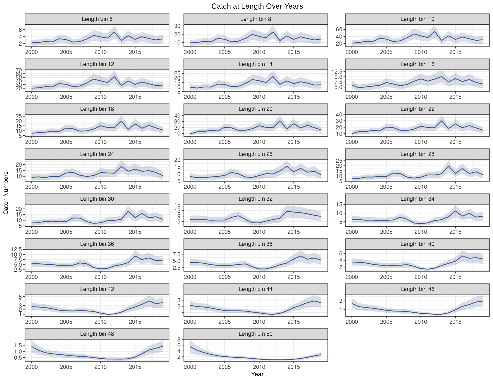](figures/ytf/plot_catch_CNL.png)

ALSCL 示例；A 表示年龄组，L 表示长度组。有可用标准误时显示近似 95% 区间。 捕获尾数是模型推算的渔业捕获，不是调查指数。

ALSCL example: A denotes age, L length. Approximate 95% intervals appear where standard errors are available. These are model-derived fishery catches, not survey indices.

[参数及默认值 / Arguments and defaults](FUNCTION_REFERENCE.md#plot_catch)

<a id="plot_recruitment"></a>

<a id="recruitment"></a>
## 17. 补充量 / Recruitment

```r
# 绘制本图 / Draw this figure
plot_recruitment(b, se = TRUE)
```

[](figures/ytf/recruitment.png)

补充量对应最小年龄组；受设定的补充年龄和时间步长影响。

Recruitment enters the youngest age class; its interpretation depends on recruitment age and time step.

[参数及默认值 / Arguments and defaults](FUNCTION_REFERENCE.md#plot_recruitment)

<a id="plot_SSB_Rec"></a>

<a id="SSB_Rec"></a>
## 18. 亲体与补充关系 / Spawning biomass and recruitment

```r
# 绘制本图 / Draw this figure
plot_SSB_Rec(b, age_at_recruitment = 1)
```

[](figures/ytf/SSB_Rec.png)

横轴与补充量错开 1 个观测步长。这里只画散点，不拟合资源补充函数。

Recruitment is shifted by one observation step. This is a scatter plot, not a fitted stock recruitment curve.

[参数及默认值 / Arguments and defaults](FUNCTION_REFERENCE.md#plot_SSB_Rec)

<a id="plot_VB"></a>

<a id="VB"></a>
## 19. 生长曲线与区间 / Growth curve and interval

```r
# 绘制本图 / Draw this figure
plot_VB(b, age_range = c(1, 15), se = TRUE)
```

[](figures/ytf/VB.png)

生长参数在本例中固定，区间退化为曲线；释放参数后区间才反映估计不确定性，不是个体长度分布。

Growth is fixed in this example, so its interval collapses. With estimated growth, intervals reflect parameter uncertainty, not individual length variation.

[参数及默认值 / Arguments and defaults](FUNCTION_REFERENCE.md#plot_VB)

<a id="plot_pla"></a>

<a id="pla"></a>
## 20. 年龄长度转换 / Age length conversion

```r
# 绘制本图 / Draw this figure
plot_pla(b) + scale_x_discrete(labels = as.character(1:15))
```

[](figures/ytf/pla.png)

色值是长度组给定年龄的概率；不是增长转移矩阵 G。年龄标签为组序号。

Cells are length-bin probabilities conditional on age, not the growth transition matrix G. Age labels are class indices.

[参数及默认值 / Arguments and defaults](FUNCTION_REFERENCE.md#plot_pla)

<a id="plot_fishing_mortality"></a>

<a id="F_ACL_year"></a>
## 21. ACL 捕捞死亡率 year / ACL fishing mortality year

```r
# 绘制本图 / Draw this figure
plot_fishing_mortality(a, type = "year",
  se = TRUE, facet_ncol = 4, line_size = 0.6)
```

[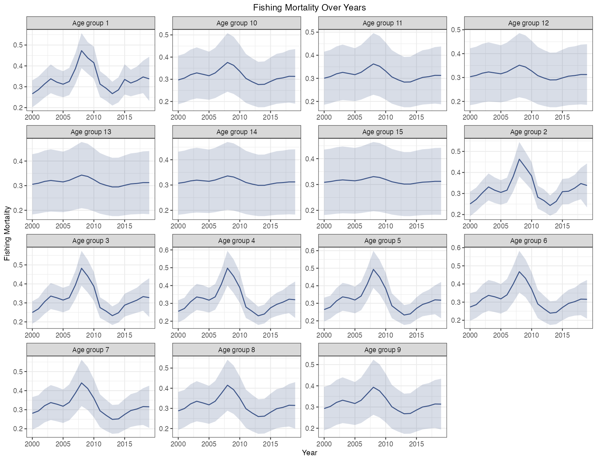](figures/ytf/F_ACL_year.png)

年度示例的 F 为每年瞬时率；季度数据得到每季度率。不同模型的原生 F 维度不同。

F is an instantaneous rate per model step. Native F dimensions differ between the models.

[参数及默认值 / Arguments and defaults](FUNCTION_REFERENCE.md#plot_fishing_mortality)

<a id="F_ACL_age"></a>
## 22. ACL 捕捞死亡率 age / ACL fishing mortality age

```r
# 绘制本图 / Draw this figure
plot_fishing_mortality(a, type = "age",
  se = TRUE, facet_ncol = 4, line_size = 0.6)
```

[](figures/ytf/F_ACL_age.png)

年度示例的 F 为每年瞬时率；季度数据得到每季度率。不同模型的原生 F 维度不同。

F is an instantaneous rate per model step. Native F dimensions differ between the models.

[参数及默认值 / Arguments and defaults](FUNCTION_REFERENCE.md#plot_fishing_mortality)

<a id="F_ACL_length"></a>
## 23. ACL 捕捞死亡率 length / ACL fishing mortality length

```r
# 绘制本图 / Draw this figure
plot_fishing_mortality(a, type = "length",
  se = TRUE, facet_ncol = 4, line_size = 0.6)
```

[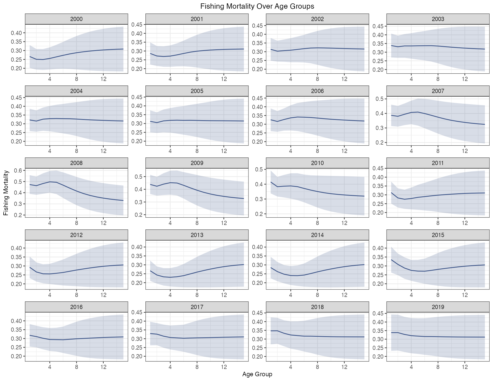](figures/ytf/F_ACL_length.png)

当前 ACL 的 length 分支与 age 分支相同，仍是年龄曲线，不能作为长度别 F。

In this version, ACL length is an alias of age; the output is still age-specific F.

[参数及默认值 / Arguments and defaults](FUNCTION_REFERENCE.md#plot_fishing_mortality)

<a id="F_ALSCL_year"></a>
## 24. ALSCL 捕捞死亡率 year / ALSCL fishing mortality year

```r
# 绘制本图 / Draw this figure
plot_fishing_mortality(b, type = "year",
  se = TRUE, facet_ncol = 4, line_size = 0.6)
```

[](figures/ytf/F_ALSCL_year.png)

年度示例的 F 为每年瞬时率；季度数据得到每季度率。不同模型的原生 F 维度不同。

F is an instantaneous rate per model step. Native F dimensions differ between the models.

[参数及默认值 / Arguments and defaults](FUNCTION_REFERENCE.md#plot_fishing_mortality)

<a id="F_ALSCL_age"></a>
## 25. ALSCL 捕捞死亡率 age / ALSCL fishing mortality age

```r
# 绘制本图 / Draw this figure
plot_fishing_mortality(b, type = "age",
  se = TRUE, facet_ncol = 4, line_size = 0.6)
```

[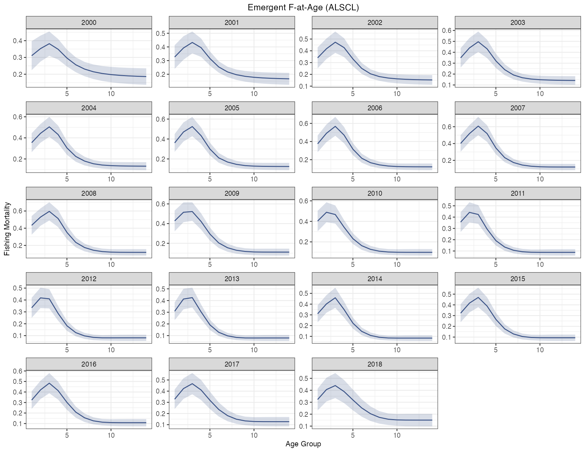](figures/ytf/F_ALSCL_age.png)

年度示例的 F 为每年瞬时率；季度数据得到每季度率。不同模型的原生 F 维度不同。

F is an instantaneous rate per model step. Native F dimensions differ between the models.

[参数及默认值 / Arguments and defaults](FUNCTION_REFERENCE.md#plot_fishing_mortality)

<a id="F_ALSCL_length"></a>
## 26. ALSCL 捕捞死亡率 length / ALSCL fishing mortality length

```r
# 绘制本图 / Draw this figure
plot_fishing_mortality(b, type = "length",
  se = TRUE, facet_ncol = 4, line_size = 0.6)
```

[](figures/ytf/F_ALSCL_length.png)

年度示例的 F 为每年瞬时率；季度数据得到每季度率。不同模型的原生 F 维度不同。

F is an instantaneous rate per model step. Native F dimensions differ between the models.

[参数及默认值 / Arguments and defaults](FUNCTION_REFERENCE.md#plot_fishing_mortality)

<a id="plot_residuals"></a>

<a id="residuals_length"></a>
## 27. 对数残差 length / Log residuals length

```r
# 绘制本图 / Draw this figure
plot_residuals(b, type = "length", facet_ncol = 4, line_size = 0.6,
  x_breaks = c(2000, 2010, 2015))
```

[](figures/ytf/residuals_length.png)

观测对数减预测对数；未经标准差标准化。平滑线用于发现结构，不是显著性检验。

Observed minus fitted log index, without standardization. Smooth curves reveal structure, not significance.

[参数及默认值 / Arguments and defaults](FUNCTION_REFERENCE.md#plot_residuals)

<a id="residuals_year"></a>
## 28. 对数残差 year / Log residuals year

```r
# 绘制本图 / Draw this figure
plot_residuals(b, type = "year", facet_ncol = 4, line_size = 0.6,
  x_breaks = c(10, 30, 50))
```

[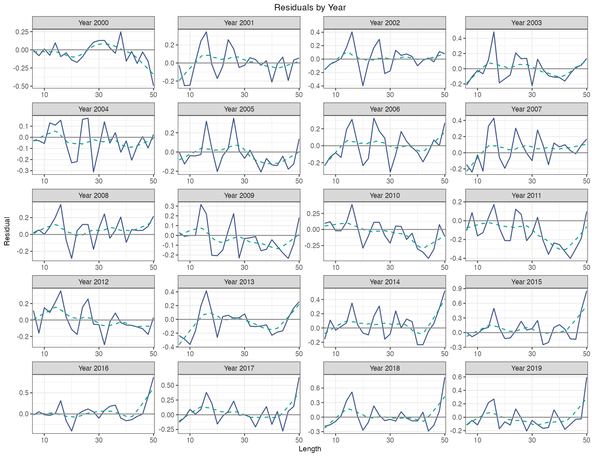](figures/ytf/residuals_year.png)

观测对数减预测对数；未经标准差标准化。平滑线用于发现结构，不是显著性检验。

Observed minus fitted log index, without standardization. Smooth curves reveal structure, not significance.

[参数及默认值 / Arguments and defaults](FUNCTION_REFERENCE.md#plot_residuals)

<a id="plot_deviance"></a>

<a id="deviation_R_TRUE"></a>
## 29. 过程偏差 R TRUE / Process deviations R TRUE

```r
# 绘制本图 / Draw this figure
plot_deviance(b, type = "R", log = TRUE, se = TRUE,
  facet_ncol = 3, point_size = 1.2, line_size = 0.5) +
  scale_x_continuous(breaks = c(2000, 2010, 2019), expand = expansion(mult = 0.04))
```

[](figures/ytf/deviation_R_TRUE.png)

对数过程偏差以 0 为参照。这不是似然偏差统计量。

Log process deviations use zero as reference; these are not likelihood deviance statistics.

[参数及默认值 / Arguments and defaults](FUNCTION_REFERENCE.md#plot_deviance)

<a id="deviation_R_FALSE"></a>
## 30. 过程偏差 R FALSE / Process deviations R FALSE

```r
# 绘制本图 / Draw this figure
plot_deviance(b, type = "R", log = FALSE, se = TRUE,
  facet_ncol = 3, point_size = 1.2, line_size = 0.5) +
  scale_x_continuous(breaks = c(2000, 2010, 2019), expand = expansion(mult = 0.04))
```

[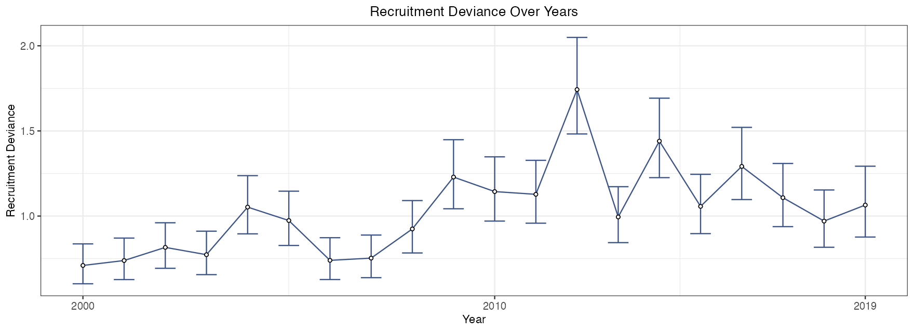](figures/ytf/deviation_R_FALSE.png)

指数转换后以 1 为参照，区间不对称。这不是原尺度残差。

Exponentiated deviations use one as reference and asymmetric intervals; these are not original-scale residuals.

[参数及默认值 / Arguments and defaults](FUNCTION_REFERENCE.md#plot_deviance)

<a id="deviation_F_TRUE"></a>
## 31. 过程偏差 F TRUE / Process deviations F TRUE

```r
# 绘制本图 / Draw this figure
plot_deviance(b, type = "F", log = TRUE, se = TRUE,
  facet_ncol = 3, point_size = 1.2, line_size = 0.5) +
  scale_x_continuous(breaks = c(2000, 2010, 2019), expand = expansion(mult = 0.04))
```

[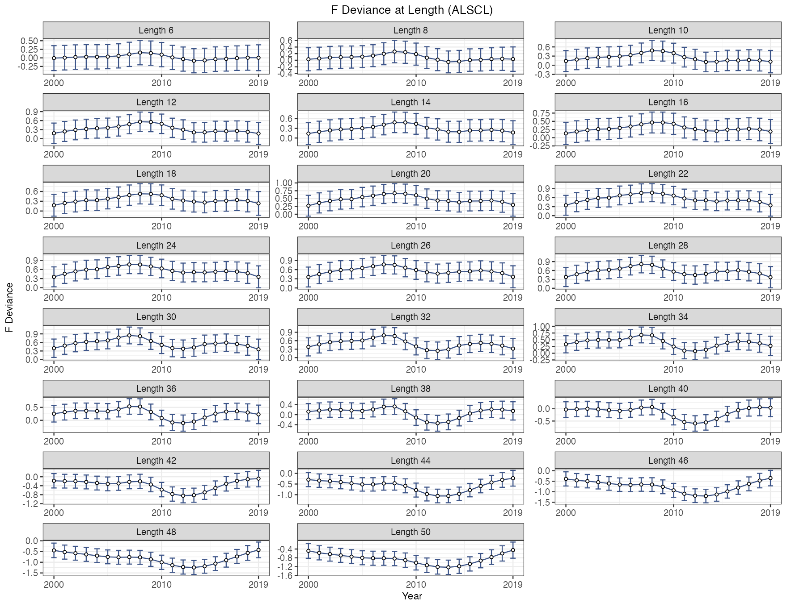](figures/ytf/deviation_F_TRUE.png)

对数过程偏差以 0 为参照。这不是似然偏差统计量。

Log process deviations use zero as reference; these are not likelihood deviance statistics.

[参数及默认值 / Arguments and defaults](FUNCTION_REFERENCE.md#plot_deviance)

<a id="deviation_F_FALSE"></a>
## 32. 过程偏差 F FALSE / Process deviations F FALSE

```r
# 绘制本图 / Draw this figure
plot_deviance(b, type = "F", log = FALSE, se = TRUE,
  facet_ncol = 3, point_size = 1.2, line_size = 0.5) +
  scale_x_continuous(breaks = c(2000, 2010, 2019), expand = expansion(mult = 0.04))
```

[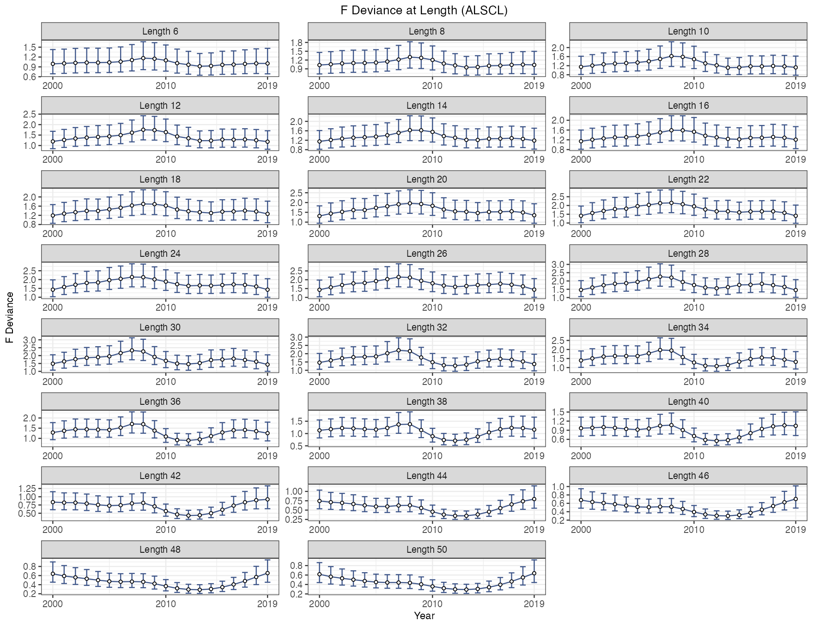](figures/ytf/deviation_F_FALSE.png)

指数转换后以 1 为参照，区间不对称。这不是原尺度残差。

Exponentiated deviations use one as reference and asymmetric intervals; these are not original-scale residuals.

[参数及默认值 / Arguments and defaults](FUNCTION_REFERENCE.md#plot_deviance)

<a id="plot_ridges"></a>

<a id="ridges"></a>
## 33. 长度组成山脊图 / Length composition ridges

```r
# 绘制本图 / Draw this figure
plot_ridges(b) # 默认 viridis 渐变 / Default viridis gradient
```

[](figures/ytf/ridges.png)

每期分别归一化；左为观测，右为拟合。不能由此读出总丰度趋势。需当前会话中的 obj。

Each period is normalized separately: observations left, fit right. This does not show total abundance trends. A live obj is required.

[参数及默认值 / Arguments and defaults](FUNCTION_REFERENCE.md#plot_ridges)

<a id="plot_compare_ts"></a>

<a id="compare_ts"></a>
## 34. 种群时间序列比较 / Population time series comparison

```r
# 绘制本图 / Draw this figure
plot_compare_ts(a, b, se = TRUE, ncol = 2)
```

[](figures/ytf/compare_ts.png)

只比较共同输出与相同时间窗；自由纵轴不能直接比较不同量的振幅。

Compare common quantities over the same time window. Free y axes preclude amplitude comparisons across quantities.

[参数及默认值 / Arguments and defaults](FUNCTION_REFERENCE.md#plot_compare_ts)

<a id="plot_compare_F"></a>

<a id="compare_F"></a>
## 35. 死亡率矩阵比较 / Fishing mortality matrices

```r
# 绘制本图 / Draw this figure
plot_compare_F(a, b) + scale_x_continuous(breaks = c(2000, 2010, 2019))
```

[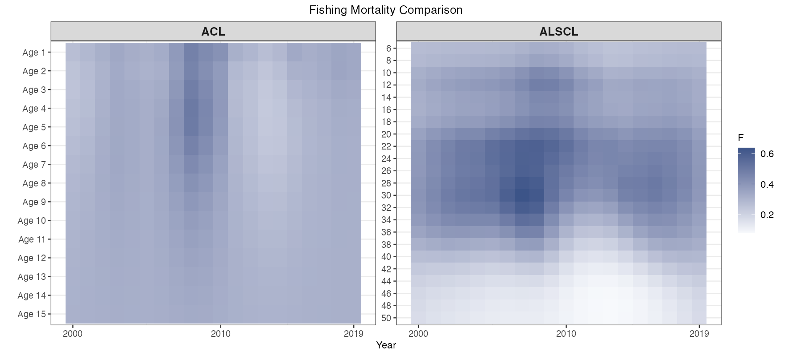](figures/ytf/compare_F.png)

ACL 纵轴是年龄，ALSCL 纵轴是长度；颜色可辅助观察，但两行不逐格对应。

ACL uses age and ALSCL length on the vertical axis; cells do not correspond one to one.

[参数及默认值 / Arguments and defaults](FUNCTION_REFERENCE.md#plot_compare_F)

<a id="plot_compare_residuals"></a>

<a id="compare_residuals"></a>
## 36. 残差联合诊断 / Combined residual diagnostics

```r
# 绘制本图 / Draw this figure
plot_compare_residuals(a, b, dat)
```

[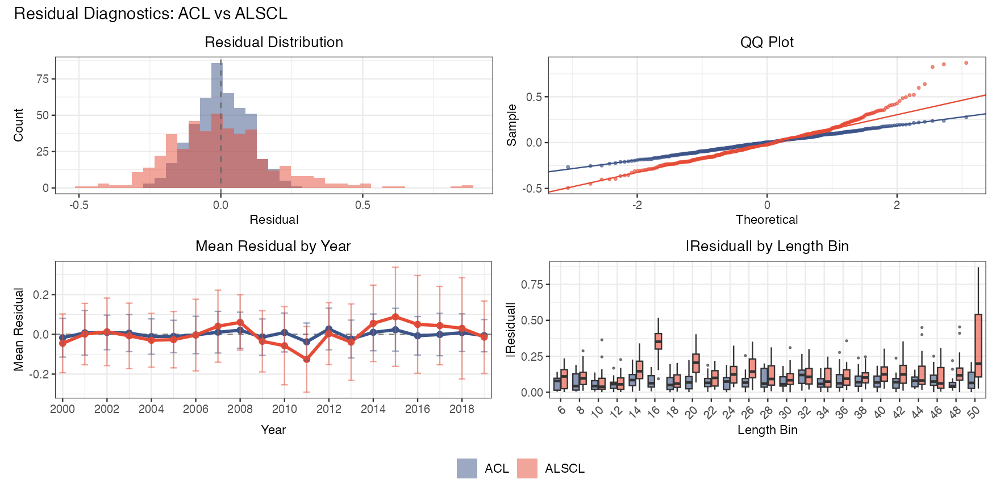](figures/ytf/compare_residuals.png)

包括直方图、QQ 图、年度残差和长度组箱线图。年度误差棒是标准差，不是置信区间。

Includes histograms, QQ plots, annual residuals and length-bin boxplots. Annual error bars represent SD, not confidence intervals.

[参数及默认值 / Arguments and defaults](FUNCTION_REFERENCE.md#plot_compare_residuals)

<a id="plot_compare_growth"></a>

<a id="compare_growth"></a>
## 37. 生长与外部参照接口 / Growth and reference-data interface

参考数据与排版辅助函数 / Reference data and layout helper:

```r
# 模拟参考生长点，并非论文实测 / Synthetic reference points, not paper observations
set.seed(42)
ref <- data.frame(Age = rep(1:15, each = 5))
ref$Length <- VB_func(60, .2, 1/60, ref$Age) + rnorm(nrow(ref), 0, 2)
growth_display <- function(p) {
  p[[1]] <- p[[1]] + labs(subtitle = paste(strsplit(
    p[[1]]$labels$subtitle, " | ", fixed=TRUE)[[1]], collapse="\n")) +
    theme(legend.text=element_text(size=7))
  p[[2]] <- p[[2]] + scale_x_continuous(breaks=c(1,5,10,15))
  p
}
```

```r
# 绘制本图 / Draw this figure
growth_display(plot_compare_growth(a, b, age_range = c(1, 15), ref_data = ref, ref_name = "Synthetic reference",
    nls_start = list(Linf = 60, k = 0.2, t0 = 1/60)))
```

[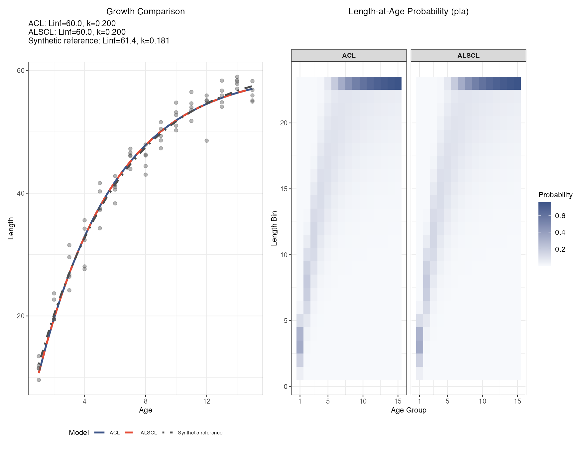](figures/ytf/compare_growth.png)

灰色参照曲线来自模拟 Age 与 Length；不代表论文实测生长。

The reference curve uses synthetic Age and Length data, not empirical measurements from the paper.

[参数及默认值 / Arguments and defaults](FUNCTION_REFERENCE.md#plot_compare_growth)

<a id="plot_compare_CatL"></a>

<a id="compare_CatL"></a>
## 38. 两模型调查拟合 / Survey fits from both models

```r
# 绘制本图 / Draw this figure
plot_compare_CatL(a, b, dat, years = c(2000, 2005, 2010, 2015), ncol = 2)
```

[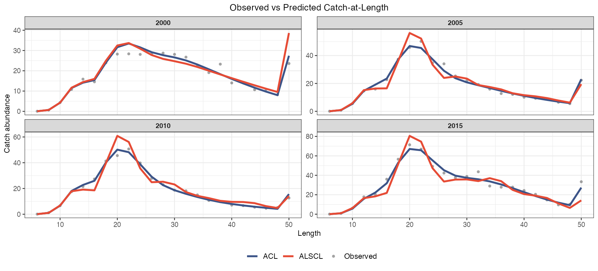](figures/ytf/compare_CatL.png)

显示 4 个指定年份；省略 years 将显示全部年份。点为调查数据，线为拟合中位数。

Four selected years are shown. Omit years to show all periods. Points are observations and curves fitted medians.

[参数及默认值 / Arguments and defaults](FUNCTION_REFERENCE.md#plot_compare_CatL)

<a id="plot_compare_metrics"></a>

<a id="compare_metrics"></a>
## 39. 拟合指标比较 / Fit metric comparison

```r
# 绘制本图 / Draw this figure
plot_compare_metrics(a, b, dat, ncol = 2) & scale_y_continuous(expand = expansion(mult = c(0,
    0.3)))
```

[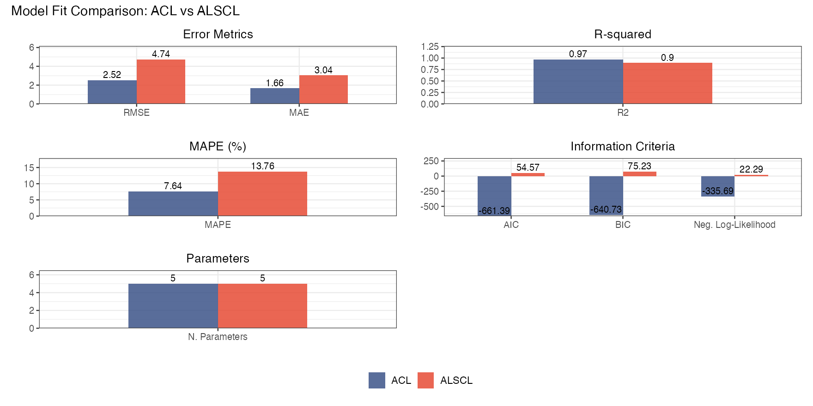](figures/ytf/compare_metrics.png)

当前数据由年龄模型生成。图示差异不能证明任一模型普遍较优；IC 还需要相同数据与似然口径。

The generating model is age based. This comparison cannot establish universal superiority; information criteria also require comparable data and likelihoods.

[参数及默认值 / Arguments and defaults](FUNCTION_REFERENCE.md#plot_compare_metrics)

<a id="plot_compare_selectivity"></a>

<a id="compare_selectivity"></a>
## 40. 固定调查可捕性 / Fixed survey catchability

```r
# 绘制本图 / Draw this figure
plot_compare_selectivity(a, b)
```

[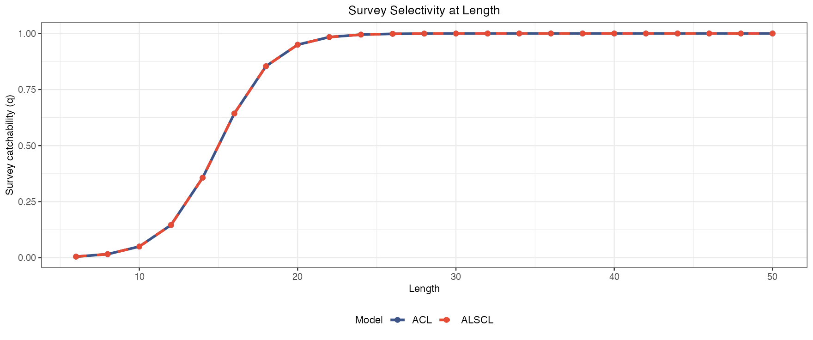](figures/ytf/compare_selectivity.png)

当前函数展示输入 q 的连接线，不是估计的渔业选择性。两模型使用同一输入，曲线重合。

This function connects the input survey q; it does not estimate fishery selectivity. Identical inputs produce overlapping curves.

[参数及默认值 / Arguments and defaults](FUNCTION_REFERENCE.md#plot_compare_selectivity)

<a id="plot_compare_annual_F"></a>

<a id="compare_F_apical"></a>
## 41. 总体 F 比较 apical / Summary F comparison apical

```r
# 绘制本图 / Draw this figure
plot_compare_annual_F(a, b, method = "apical") +
  labs(title = "Apical fishing mortality")
```

[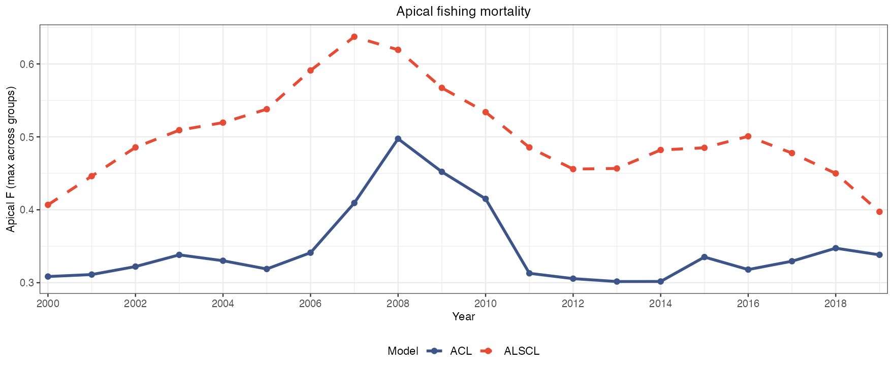](figures/ytf/compare_F_apical.png)

apical 取最大值，mean 取组间算术平均，均非丰度加权。函数名称含 annual，但不会自动把季度率年化。

Apical is the maximum; mean is an unweighted group average. Despite its name, the function does not annualize quarterly rates.

[参数及默认值 / Arguments and defaults](FUNCTION_REFERENCE.md#plot_compare_annual_F)

<a id="compare_F_mean"></a>
## 42. 总体 F 比较 mean / Summary F comparison mean

```r
# 绘制本图 / Draw this figure
plot_compare_annual_F(a, b, method = "mean") +
  labs(title = "Mean fishing mortality")
```

[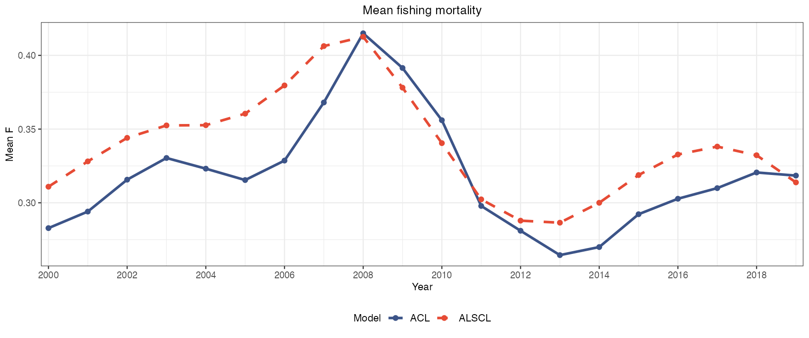](figures/ytf/compare_F_mean.png)

apical 取最大值，mean 取组间算术平均，均非丰度加权。函数名称含 annual，但不会自动把季度率年化。

Apical is the maximum; mean is an unweighted group average. Despite its name, the function does not annualize quarterly rates.

[参数及默认值 / Arguments and defaults](FUNCTION_REFERENCE.md#plot_compare_annual_F)

<a id="plot_retro"></a>

<a id="retro_ACL"></a>
## 43. ACL 回溯分析 / ACL retrospective analysis

```r
# 绘制本图 / Draw this figure
plot_retro(ra, facet_col = 2, rho_digits = 3, rho_size = 3, point_size = 1, line_size = 0.6)
```

[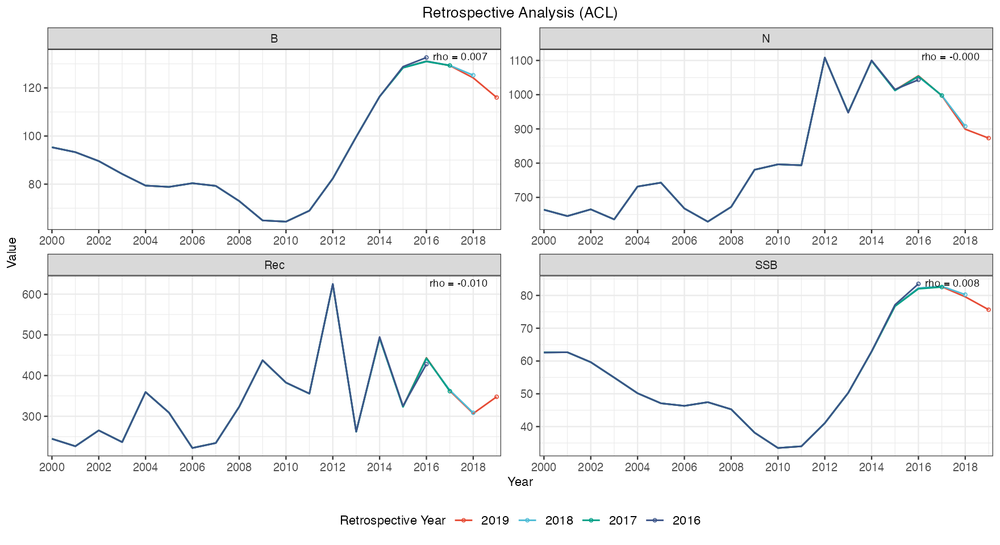](figures/ytf/retro_ACL.png)


逐步删除末端观测并重拟合；各颜色代表不同截止期。 / Successively peel terminal observations and refit; colors indicate different terminal periods.

[参数及默认值 / Arguments and defaults](FUNCTION_REFERENCE.md#plot_retro)

<a id="retro_ALSCL"></a>
## 44. ALSCL 回溯分析 / ALSCL retrospective analysis

```r
# 绘制本图 / Draw this figure
plot_retro(rb, facet_col = 2, rho_digits = 3, rho_size = 3, point_size = 1, line_size = 0.6)
```

[](figures/ytf/retro_ALSCL.png)


逐步删除末端观测并重拟合；各颜色代表不同截止期。 / Successively peel terminal observations and refit; colors indicate different terminal periods.

[参数及默认值 / Arguments and defaults](FUNCTION_REFERENCE.md#plot_retro)

<a id="truth"></a>
## 45. 模拟真值与条件估计 / Simulation truth and conditional estimates

```r
# 将生成真值与报告中的估计对齐 / Align truth and fitted reports
years <- a$year
truth <- data.frame(Year=rep(years,3),
  Quantity=rep(c("B","SSB","Rec"),each=length(years)),
  Truth=c(x$truth$TB,x$truth$SSB,x$truth$Rec))
estimates <- rbind(
  data.frame(Year=rep(years,3),Quantity=truth$Quantity,
    Value=c(a$report$B,a$report$SSB,a$report$Rec),Model="ACL"),
  data.frame(Year=rep(years,3),Quantity=truth$Quantity,
    Value=c(b$report$B,b$report$SSB,b$report$Rec),Model="ALSCL"))
```

```r
# 绘制本图 / Draw this figure
ggplot(estimates, aes(Year, Value, color = Model)) + geom_line() + scale_color_manual(values = setNames(acl_theme("compare_colors"),
    c("ACL", "ALSCL"))) + geom_line(data = truth, aes(Year, Truth), inherit.aes = FALSE, linetype = 2) +
    facet_wrap(~Quantity, scales = "free_y", ncol = 1) + theme_bw() + labs(y = NULL)
```

[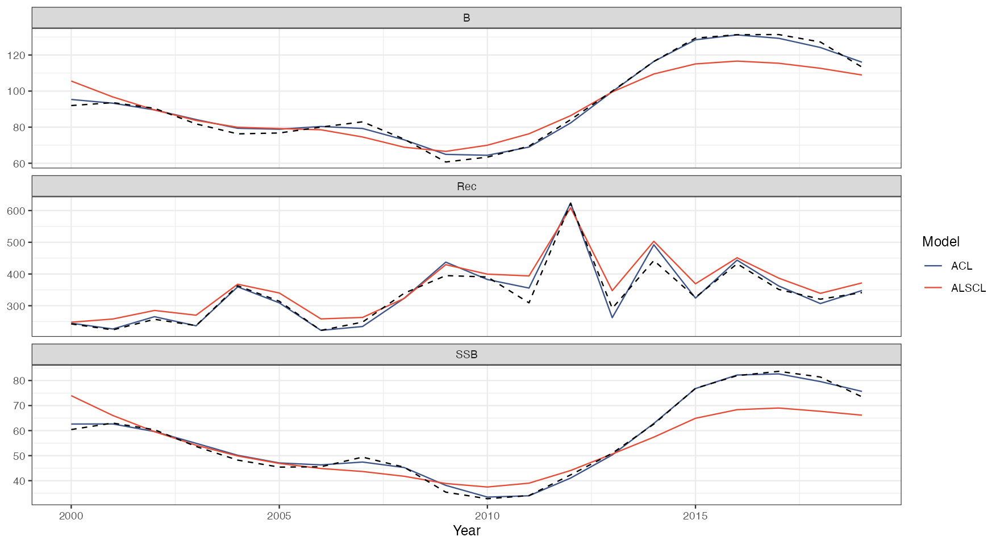](figures/ytf/truth.png)

黑虚线为生成真值；固定生物参数，且模拟与拟合的补充过程不同。

Black dashed curves are generating truth. Biology is fixed; recruitment processes differ.
