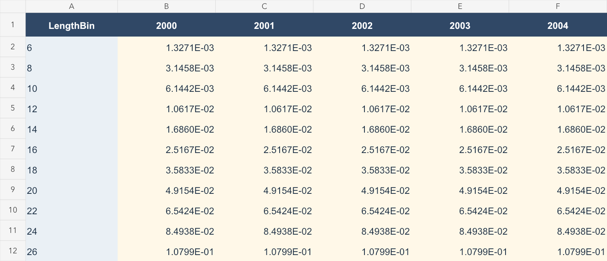
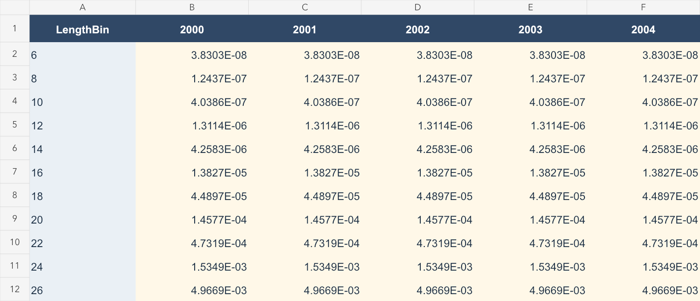

# ALSCL 使用指南 · User guide

**从模拟案例到自己的调查体长数据。From simulation examples to your own survey length data.**

适用版本：ALSCL 2.0.0。本指南中的 R 代码从仓库根目录执行；先安装包。代码注释使用简体中文和英文，所有拟合图使用内置 `YTF_example`。

For ALSCL 2.0.0. Run scripts from the repository root after installing the package. Comments are bilingual; all fitted-model figures use the bundled `YTF_example`.

[首页 / Home](../README.md) · [43 个函数及参数 / API](FUNCTION_REFERENCE.md) · [45 张示例图 / Gallery](PLOT_GALLERY.md) · [Excel 示例 / Workbook](data/ALSCL_Data_Entry_Example.xlsx)

| 学习模块 / Module | 你会完成什么 / Outcome |
|---|---|
| [1. 原理 / Theory](#theory) | 理解 ACL、ALSCL、调查指数和参数尺度 / Understand model structure and scales |
| [2. 内置案例 / Built-in data](#builtin) | 载入 YTF，拟合两个模型 / Load YTF inputs and fit both models |
| [3. 模拟实验 / Simulation](#simulation) | 简单模拟、两个完整案例、真值与批量实验 / Simple and full simulations, truth and replicates |
| [4. Excel 填表 / Spreadsheet](#excel) | 按行列规则准备三张输入表 / Prepare the three aligned tables |
| [5. 实测导入 / Observations](#observations) | 读取自己的 Excel/CSV 并检查数据 / Import and validate your data |
| [6. 拟合设置 / Fitting](#fitting) | 调整初值、边界、固定参数及时间步长 / Set starts, bounds, maps and time steps |
| [7. 诊断 / Diagnostics](#diagnostics) | 检查数值状态、残差及模型比较 / Check numerical status and residuals |
| [8. 绘图 / Plotting](#plotting) | 选择全部绘图类型并调整样式 / Use all plotting families |
| [9. 回溯与复现 / Retrospectives](#retrospective) | 删除末端观测重新拟合、重建图谱 / Peel terminal observations and reproduce outputs |

<a id="theory"></a>
## 1. 数学原理 / Mathematical Framework

ALSCL 包提供 ACL（年龄结构）和 ALSCL（年龄—体长联合结构）两个调查体长评估模型。下式采用 Zhang & Cadigan (2022) 的模型框架，并明确本包的时间单位和随机效应参数化。

The ALSCL package provides an age-structured model (ACL) and a joint age–length model (ALSCL) for survey catch-at-length assessment. The framework follows [Zhang & Cadigan (2022)](https://doi.org/10.1111/faf.12673), with time units and random-effect parameterization stated explicitly below.

### 种群动态 / Population dynamics

令 $`i=1,\ldots,A`$ 为年龄组索引，$`a_i=a_{rec}+(i-1)\Delta t`$ 为实际年龄，$`t`$ 为模型时间步。ACL 在年龄维度推进存活；补充量进入第一组，最大年龄组为加组：

Let $`i=1,\ldots,A`$ index age classes, with actual age $`a_i=a_{rec}+(i-1)\Delta t`$, and let $`t`$ index model steps. ACL advances survivors by age, introduces recruitment in the first class, and retains survivors in the oldest plus group:

```math
N_{1,t}=R_t,\qquad Z_{i,t}=M+F_{i,t},
```

```math
N_{i+1,t+1}=N_{i,t}\exp(-Z_{i,t}),\qquad i=1,\ldots,A-2,
```

```math
N_{A,t+1}=N_{A-1,t}\exp(-Z_{A-1,t})+N_{A,t}\exp(-Z_{A,t}).
```

`M` 和 F 是**每个模型时间步**的瞬时死亡率；季度模型的 `growth_step=0.25`，M 和 F 也须使用季度率。生长参数 $`k`$ 按年定义。

M and F are instantaneous rates **per model step**. A quarterly model uses `growth_step=0.25` and quarterly mortality rates; growth parameter $`k`$ is annual.

### 捕捞死亡率 / Fishing mortality structure

ACL 按年龄估计 F，ALSCL 按体长估计 F。以 $`s`$ 表示相应的年龄或体长组，两个模型均使用可分离的 AR(1) × AR(1) 对数 F 偏差：

ACL estimates F by age, whereas ALSCL estimates F by length. With $`s`$ denoting the corresponding age or length class, both use separable AR(1) × AR(1) deviations in log F:

```math
F_{s,t}=\exp(\mu_F+d_{s,t}),\qquad
\mathrm{Cov}(d_{s,t},d_{s-h,t-j})=\sigma_F^2\phi_S^{|h|}\phi_T^{|j|}.
```

这里 $`\sigma_F`$ 是 TMB `SCALE(SEPARABLE(AR1(),AR1()), sigma_F)` 中的**边际标准差**；$`\phi_S`$、$`\phi_T`$ 分别控制组间和时间相关性。若用创新方差定义 AR(1)，协方差公式的尺度会不同；不能在本式中再除以两个 $`1-\phi^2`$ 因子。自然死亡率 M 作为已知输入。

Here $`\sigma_F`$ is the **marginal SD** in TMB's scaled, separable AR(1) density. The correlation parameters describe dependence across groups and time. Innovation-variance parameterizations use a different scaling; dividing this expression again by two $`1-\phi^2`$ factors would be incorrect. Natural mortality M is supplied as known.

### 补充量 / Recruitment

拟合模型用 AR(1) 对数偏差描述补充量。下面写成与边际标准差 $`\sigma_R`$ 一致的平稳形式：

The fitted models use AR(1) log recruitment deviations. The following stationary representation uses marginal SD $`\sigma_R`$:

```math
R_t=\exp(\mu_R+r_t),\qquad
r_1\sim N(0,\sigma_R^2),\qquad
r_{t+1}=\phi_R r_t+\eta_t,\quad
\eta_t\sim N\!\left(0,\sigma_R^2(1-\phi_R^2)\right).
```

$`\exp(\mu_R)`$ 是补充量的中位尺度，不是包含随机变异后的算术均值。完整模拟器 `sim_data()` 使用 Beverton–Holt 亲体补充关系及随机偏差；模拟器与拟合器的补充过程应分别理解。

$`\exp(\mu_R)`$ is the median recruitment scale, not the arithmetic mean including stochastic variation. The full `sim_data()` operating model uses Beverton–Holt stock–recruitment with random deviations; its recruitment process differs from the fitted model.

### 初始条件 / Initial conditions

第一期最小年龄组由 $`R_1`$ 给定，其余年龄组按初始死亡率与逐组扰动递推：

Initial recruitment defines the youngest class; older classes follow a recursive decline with an initial mortality rate and class-to-class deviations:

```math
\log N_{1,1}=\log R_1,\qquad
\log N_{i,1}=\log N_{i-1,1}-Z_{init}+u_{i-1},\quad
u_{i-1}\sim N(0,\sigma_{N0}^2).
```

因此 $`\log N_{i,1}=\log R_1-(i-1)Z_{init}+\sum_{j=1}^{i-1}u_j`$。扰动沿年龄组累积；不能把每个年龄的总扰动误当作相互独立。ALSCL 再用初始年龄—体长概率分配这些个体。

Thus the initial log abundance contains the cumulative sum of earlier class deviations. The total deviations at different ages are not independent. ALSCL allocates these initial numbers across length using age–length probabilities.

### 年龄—体长转换 / Age-to-length conversion (ACL)

给定年龄的长度服从均值由 von Bertalanffy 曲线决定的正态分布：

Length conditional on age follows a normal distribution whose mean is defined by the von Bertalanffy curve:

```math
\mu_i=L_\infty\left[1-e^{-k(a_i-t_0)}\right],\qquad
\sigma_i=CV_L\mu_i,
```

```math
p_{l|i}=\Phi\!\left(\frac{UB_l-\mu_i}{\sigma_i}\right)
       -\Phi\!\left(\frac{LB_l-\mu_i}{\sigma_i}\right),\qquad
N_{l,t}=\sum_i p_{l|i}N_{i,t}.
```

`pla` 表示这个年龄—体长概率矩阵，`plot_pla()` 用热图展示。实现使用支持自动微分的正态 CDF 差，并通过右尾对称计算和归一化处理数值稳定性。长度边界必须与调查分组一致。论文 Appendix S1 给出的固定阶 Taylor 近似是另一种积分近似，本包使用上述 CDF 实现。

`pla` is the age–length probability matrix shown by `plot_pla()`. Differentiable normal CDF differences, symmetric right-tail calculations and normalization provide the implemented numerical treatment. Boundaries must match survey bins. Appendix S1 describes a fixed-order Taylor approximation; the package uses the CDF formulation above.

### 生长转移矩阵 / Growth transition matrix (ALSCL)

ALSCL 保留 $`N_{l,i,t}`$ 的体长、年龄、时间三个维度。$`G_{j,l}`$ 表示从源体长组 $`l`$ 转入目的体长组 $`j`$ 的概率。普通年龄组的存活与增长为：

ALSCL retains length, age and time in $`N_{l,i,t}`$. Entry $`G_{j,l}`$ is the probability of moving from source length bin $`l`$ to destination bin $`j`$. Survival and growth for ordinary age classes follow:

```math
N_{j,i+1,t+1}=\sum_l G_{j,l}N_{l,i,t}\exp[-(M+F_{l,t})].
```

加组累加前一年龄组和原最大年龄组的存活及增长；补充量按最小年龄的长度分布进入第一年龄组。G 的各列和为 1，不允许缩短，最大体长组吸收右尾概率。长度变化仍可能留在同一分组内。

The plus group combines survivors and growth from the preceding and oldest age classes. Recruitment enters the youngest class with its length distribution. Columns of G sum to one, shrinkage is excluded, and the largest bin absorbs right-tail probability. Growth can still leave an individual within its original bin.

增长增量使用下面的平滑下降函数，标准差为 $`CV_G\mu_{\Delta L}`$：

Growth increments use the following smooth decreasing mean, with SD $`CV_G\mu_{\Delta L}`$:

```math
\mu_{\Delta L}(L)=\frac{\Delta t(1-e^{-k})L_\infty}
{1+\exp\!\left(-\log(19)\frac{L-0.5L_\infty}{0.05L_\infty-0.5L_\infty}\right)}.
```

此函数不是精确的任意时间步 VB 增量 $`(L_\infty-L)(1-e^{-k\Delta t})`$。`pla` 是给定年龄的长度分布，G 是给定源长度的一步转移概率，两者不能互换。`FL` 是长度别 F，`FA` 则由原队列的存活率推导。

This is not the exact arbitrary-step VB increment $`(L_\infty-L)(1-e^{-k\Delta t})`$. `pla` describes length given age, while G describes a one-step transition given source length. They are not interchangeable. `FL` is length-specific F; `FA` is derived from original-cohort survival.

### 派生量 / Derived quantities

输入的平均个体重量 $`w_{l,t}`$ 和成熟比例 $`m_{l,t}`$ 用于计算体长别生物量、成熟生物量及总量：

Mean individual weight $`w_{l,t}`$ and maturity proportion $`m_{l,t}`$ convert abundance into length-specific biomass, spawning biomass and totals:

```math
b_{l,t}=N_{l,t}w_{l,t},\qquad sb_{l,t}=b_{l,t}m_{l,t},\qquad
B_t=\sum_l b_{l,t},\qquad SSB_t=\sum_l sb_{l,t}.
```

`CN`、`CB` 是模型推算的渔业捕获尾数与重量，区别于输入的调查数量指数。生物量单位由个体重量和调查数量尺度共同决定。

`CN` and `CB` are derived fishery catch numbers and biomass, distinct from the input survey number index. Biomass units depend on weight units and the abundance scale.

### 调查观测 / Survey observations

令 $`I_{l,t}`$ 为调查数量指数，$`N_{l,t}`$ 为种群尾数。调查观测使用对数正态模型：

Let $`I_{l,t}`$ denote the survey number index and $`N_{l,t}`$ population abundance. Survey observations follow a lognormal model:

```math
\log I_{l,t}=\log q_l+\log N_{l,t}+\epsilon_{l,t},\qquad
\epsilon_{l,t}\sim N(0,\sigma_I^2),
```

```math
q_l=\left[1+\exp\!\left(-\log(19)\frac{L_l-L_{50}}{L_{95}-L_{50}}\right)\right]^{-1}.
```

`sel_L50`、`sel_L95` 固定调查可捕性 q，在两个指定体长处分别取 0.5 和 0.95；它们不是估计出来的渔业选择性。绝对丰度依赖 q、M 等假设。`exp(report$Elog_index)` 给出原尺度的中位数，算术均值还需乘以 $`\exp(\sigma_I^2/2)`$。

`sel_L50` and `sel_L95` fix survey catchability at 0.5 and 0.95 at the specified lengths; they are not estimated fishery selectivity. Absolute abundance depends on q, M and related assumptions. `exp(report$Elog_index)` is the original-scale median; the arithmetic mean also includes $`\exp(\sigma_I^2/2)`$.

### 估计与区间 / Estimation and uncertainty

TMB 用自动微分计算目标函数及导数，对随机效应采用 Laplace 近似；R 的 `nlminb()` 优化固定效应。`sdreport()` 使用局部曲率及 delta 方法给出近似标准误。绘图中的约 95% 区间是逐点区间；固定参数不贡献估计不确定性。

TMB uses automatic differentiation and a Laplace approximation for random effects; R's `nlminb()` optimizes fixed effects. `sdreport()` obtains approximate standard errors from local curvature and the delta method. Plotted 95% intervals are pointwise, and parameters held fixed do not contribute estimation uncertainty.

<a id="builtin"></a>
## 2. 内置数据与第一个拟合 / Built-in data and first fit

```r
install.packages("remotes")
remotes::install_github("Linbojun99/ALSCL")
library(ALSCL)
data("YTF_example")
x <- YTF_example
inputs <- x[c("data.CatL", "data.wgt", "data.mat")]
# 检查维度与来源 / Inspect dimensions and provenance
str(inputs)
x$provenance
# 两模型使用相同观测及条件设置 / Same observations and conditional settings
a <- do.call(run_acl, c(inputs, x$fit_args, x$fit_config$acl,
                       list(train_times = 2, silent = TRUE)))
b <- do.call(run_alscl, c(inputs, x$fit_args, x$fit_config$alscl,
                         list(train_times = 2, silent = TRUE)))
plot_compare_ts(a, b, quantities = c("B", "SSB", "Rec"), se = TRUE)
```


| 对象 / Object | 内容和适用方式 / Contents and use |
|---|---|
| `YTF` | 原有 26 项参数列表，无 `data.CatL` / Original 26-element biological parameter list, no survey table |
| `YTF_example` | 23 个体长组 × 20 期；三张表、参数、模拟真值、拟合设置、来源 / 23 bins × 20 periods, three tables, parameters, truth, fit settings and provenance |
| `example_data` | 从原 ALSCL 保留的 9 组 × 21 年三张表；来源待核实 / Legacy ALSCL tables, 9 bins × 21 years, provenance unverified |

`YTF_example` 复用 `YTF` 的共有参数，特别是调查对数 SD = 0.1；其余采用 flatfish 模拟预设。随机种子 4，预热 80 年、保留 20 年；2000–2019 仅为示意年份。教学单位约定为 cm、kg，数据不是论文实测样本。调用 [data-raw/YTF_example.R](../data-raw/YTF_example.R) 可重建 `.rda`，脚本恢复调用者的随机状态。

`YTF_example` reuses shared YTF parameters, including survey log SD 0.1, with remaining flatfish defaults. Seed 4, 80 burn-in years and 20 retained years are used. Dates are illustrative; cm and kg are teaching conventions. These are not empirical paper data. The data-raw script rebuilds the object and restores the caller's RNG state.

`x$fit_config` 固定已知生长、部分过程误差及相关参数，让示例聚焦工作流程。区间是在这些固定参数条件下的近似区间，不包含全部生物不确定性。这种教学拟合不能证明同时估计所有参数时可识别。

`x$fit_config` fixes known growth and selected process/correlation parameters. Intervals are conditional on these assumptions and omit their uncertainty. The example does not establish identifiability when all parameters are estimated together.

<a id="simulation"></a>
## 3. 如何模拟自己的案例 / Simulating new examples

### 3.1 快速生成三张表 / Quick input-table simulator

```r
# 简单年度模拟，可直接导出 CSV / Simple annual simulation with CSV export
quick <- simulate_example_data(
  years = 2000:2019, seed = 42, bin_breaks = seq(5, 51, 2),
  Linf = 60, vbk = 0.2, t0 = 1/60, M = 0.2, nage = 15,
  L50_sel = 15, L95_sel = 20, L50_mat = 35, L95_mat = 40,
  wgt_a = exp(-12), wgt_b = 3, mean_F = 0.3,
  cv_catch = 0.2, rec_sigma = 0.3,
  save_csv = TRUE, output_dir = "my_simulation")
str(quick)
```

`years` 必须是连续年度，不能通过写季度列名把该简易模拟器变成季度模型。`cv_catch` 控制调查观测 CV；`rec_sigma` 控制对数补充变异；该函数使用简化的共同 F、独立补充扰动及固定长度 CV = 0.1。它不等于完整 Beverton–Holt 模拟器，也不等于内置 `YTF_example` 的生成流程。

Use consecutive annual `years`. Changing labels does not create quarterly dynamics. `cv_catch` controls survey observation CV and `rec_sigma` log recruitment variation. This simplified simulator uses common F, independent recruitment perturbations and fixed length CV 0.1; it differs from both the full operating model and the bundled YTF generation recipe.

### 3.2 完整模拟器与两个案例 / Full simulator and two cases

两个预设的 seed 4 数据、三张 CSV 和完整真值对象已随文档保存：[下载及读取方法 / Download and read the two saved cases](data/cases/README.md)。

```r
# 参数 → 生物量表 → 随机模拟 / Parameters → biological arrays → simulation
pa <- initialize_params(species = "flatfish", observation_error = "independent")
bio <- sim_cal(pa)
sm <- sim_data(bio, pa, iter_range = 4:5, return_iter = 4,
               output_dir = "simulation_examples/flatfish")
# 长度型季度案例 / Length-based quarterly case
tuna_pa <- initialize_params(species = "tuna")
tuna <- sim_data(sim_cal(tuna_pa), tuna_pa, iter_range = 4:5,
                 return_iter = 4, output_dir = "simulation_examples/tuna")
# 将模拟矩阵变成模型输入 / Convert simulated matrices to input tables
source("scripts/simulation_workflow.R", encoding = "UTF-8")
flatfish_inputs <- simulation_to_tables(sm, pa)
tuna_inputs <- simulation_to_tables(tuna, tuna_pa)
```

| 设置 / Setting | flatfish / YTF 风格 | tuna / 金枪鱼风格 |
|---|---|---|
| 生成模型 / Operating model | 年龄型 / Age-based | 年龄与长度联合 / Joint age-length |
| `growth_step` | 1 年 / year | 0.25 年 / year |
| `nyear`, `burn_in` | 100, 80 年 / years | 100, 95 年 / years |
| 保留观测 / Retained observations | 20 年度 / annual steps | 20 季度 / quarterly steps |
| `nage`, `rec.age` | 15, 1 年 / year | 20, 0.25 年 / year |
| `Linf`, `vbk` | 60, 0.2/年 / year | 152, 0.38/年 / year |
| `M`, `F_mean` | 0.2, 0.3 每年 / per step | 0.2, 0.2 每季度 / per step |

这是包内的两个模拟预设案例，不能当成已取得论文两个案例的原始观测。完整参数见 [initialize_params](FUNCTION_REFERENCE.md#initialize_params)。`nyear`、`burn_in`、`sim_year` 的单位是**年**；返回 `sm$nyear` 是保留的**时间步数**。`SN_at_len` 是时间 × 长度，导入时要转置；`weight` 和 `mat` 已是长度 × 时间。

These are the two package simulation presets, not recovered empirical datasets from the paper. Duration arguments are in **years**, whereas returned `sm$nyear` counts retained **steps**. Transpose `SN_at_len` (time × length); weight and maturity are already length × time.

`iter_range` 同时指定重复编号和随机种子；`return_iter` 选择在内存中返回哪次重复。每个 `sim_rep4` 等文件由 `save()` 写出，应用 `load()`，不是 `readRDS()`。`observation_error="independent"` 让每个长度与时间单元有独立扰动；`"shared_time"` 让同一期的长度组共享扰动，适合专门的误差结构实验。

`iter_range` provides replicate IDs and seeds; `return_iter` selects the in-memory replicate. `sim_rep*` files use `save()/load()`, not RDS. Independent error varies across cells, while shared-time error applies the same perturbation to all length bins in a period.

```r
# 同时生成两个案例及 CSV、真值文件 / Generate both cases, CSV and truth files
cases <- run_simulation_examples(out = "simulation_examples", fit_batch = FALSE)
# 加上两个 ACL 重复拟合，保存失败诊断 / Add two ACL fits and retain failures
# run_simulation_examples(out = "simulation_examples", fit_batch = TRUE)
e <- new.env()
load("simulation_examples/flatfish/sim_rep4", envir = e)
str(e$sim.data)
```

批量入口 `sim_acl()` 仅拟合 ACL；ALSCL 可对各重复转表后循环调用 `run_alscl()`。生成器与拟合器的参数名不完全一致，不要直接把 `pa` 整表传入 `parameters`。两个重复只用于确认流程；正式性能实验应增加重复、保存真值并报告偏差、RMSE、区间覆盖率以及拟合失败率，不能只分析成功的重复。

`sim_acl()` fits ACL only. For ALSCL, convert each replicate then call `run_alscl()` in a loop. Generator and estimator parameter names differ. Two replicates only verify the workflow; performance studies need more replicates, retained truth, bias, RMSE, coverage and failure rates.

<a id="excel"></a>
## 4. Excel 每行每列填什么 / What to enter in Excel

下载 [ALSCL_Data_Entry_Example.xlsx](data/ALSCL_Data_Entry_Example.xlsx)。工作簿的 `Instructions` 是双语说明页；其余三张表已填入与 `YTF_example` 相同的数值。请另存副本再替换数据。

Download the workbook. `Instructions` contains bilingual directions, and the other three sheets contain the exact YTF example. Save a copy before replacing values.

| 位置 / Location | 填写规则 / Entry rule |
|---|---|
| 工作表名 / Sheet names | 必须为 `data.CatL`、`data.wgt`、`data.mat` / Use these exact names |
| A1 | `LengthBin`，不要在表头上方加标题 / No title rows above the header |
| A2:A… | 每行一个体长组；示例为中心值 6、8、…、50 / One length-bin label per row; example uses midpoints |
| B1、C1、… | 递增数字年份，如 2000、2001；季度如 2000、2000.25 / Increasing numeric time headers |
| B2 等数值单元 / Numeric cells | 对应这一体长组、这一期的值 / Value for that bin and period |
| 三表顺序 / Alignment | 体长组、时间、行列顺序必须完全相同 / Exact same bins, periods and order |

**调查数量指数 `data.CatL` / Survey number index**


填数量或已标准化为可比尺度的数量指数；若使用 CPUE，各期努力量、单位和标准化方式必须一致。正数可为小数。未知调查单元留空或填 `NA`；不要用 0、破折号、`<1` 或“未测”代替缺失值。

Enter counts or a consistently standardized number index. For CPUE, maintain comparable effort, units and standardization. Decimals are valid. Use blank/`NA` for unknown observations; do not use zero, dashes, `<1` or text labels as missing-value substitutes.

**平均个体重量 `data.wgt` / Mean individual weight**



填每组每期的平均单尾重量，不是该组总重。选择同一重量单位并记录在说明页。没有逐年数据时，可以在有依据的条件下重复同一长度重量关系，但要在分析报告说明。不得留缺失值。

Enter mean weight per fish, not the total weight in the bin. Use one unit and document it separately. Repeating a defensible length-weight relationship across periods is possible but must be reported. Missing weights are not accepted.

**成熟比例 `data.mat` / Maturity proportion**



填写 0–1，例如 60% 填 `0.6`，不要填 `60`。0 和 1 在成熟表中是合法值；不要将“调查零值”的规则误用于成熟表。三张表的数据区不要插入单位行、合计、合并单元格或解释文字。

Enter proportions in [0,1], e.g. `0.6` for 60%. Both 0 and 1 are valid maturity values. Do not insert units, totals, merged cells or prose inside the three data grids.

Excel 使用科学记数显示小数，例如 `5.1361E-02` 等于 `0.051361`；显示精度不会改变保存的底层数值。 / Scientific notation avoids displaying tiny positive values as zero; it does not round the stored values.

**体长边界与缺测期 / Bin boundaries and missing periods.** 本示例中心值是 6:50，每隔 2 cm；拟合时显式传入 22 个内部边界 7:49，首尾尾部按模型约定处理。自己的不等宽组应提供真实边界。区间标签如 `0-20`、`20-25` 要连续且不重叠；原标签若为 `0-20`、`21-25`，不能未经核实就消除间隙。缺整个年度时保留对应列并在调查表填 NA，重量和成熟表仍需完整；不要删掉这一列而假装时间间隔没变。

The example uses midpoints 6:50 by 2 and 22 explicit internal boundaries 7:49. Supply the actual boundaries for unequal bins. Interval labels must be contiguous and non-overlapping; do not silently close gaps in legacy labels. Retain an entirely missing period as an NA survey column while supplying weight and maturity, so the temporal grid remains regular.

<a id="observations"></a>
## 5. 导入自己的实测数据 / Importing your observations

[real_data_workflow.R](../scripts/real_data_workflow.R) 提供指南辅助函数，需 `source()`，不属于包的导出 API。Excel 读取采用 [readxl::read_excel](https://readxl.tidyverse.org/reference/read_excel.html)，保留原始年份表头并显式转换数值。

These are guide helpers, sourced from the repository, not package exports. The Excel reader preserves original time headers and converts numeric cells explicitly.

```r
install.packages("readxl") # 只需安装一次 / Install once
source("scripts/real_data_workflow.R", encoding = "UTF-8")
# 先用附带工作簿练习 / Start with the supplied workbook
my_inputs <- read_survey_excel("docs/data/ALSCL_Data_Entry_Example.xlsx")
validate_survey_tables(my_inputs, growth_step = 1, zero_action = "error")
# CSV 也可以，目录内需有三张同名 CSV / Three named CSV files also work
csv_inputs <- read_survey_csv("docs/data")
# 教学工作簿使用其对应的生物设定 / Use the workbook's matching biology
config <- c(YTF_example$fit_args, YTF_example$fit_config$alscl,
            list(zero_action = "error", train_times = 2, silent = TRUE))
# 真正重新拟合；需要编译环境 / This refits and requires a compiler
my_fit <- fit_survey_tables(my_inputs, config, model_type = "alscl")
```

换成自己的文件时，替换路径，并依据自己的物种设置 `rec.age`、`nage`、`M`、`sel_L50`、`sel_L95`、`growth_step`、边界及拟合初值/固定参数。不能因为输入表尺寸相同，就沿用 YTF 的生物参数或固定参数表。生长、长度重量关系、成熟信息和调查可捕性应有独立依据。

For your own workbook, replace the path and supply species-specific biology, boundaries, starts and fixed parameters. Equal table dimensions do not justify reusing YTF biology. Growth, weight, maturity and survey catchability need independent support.

`validate_survey_tables()` 默认遇到调查零值报错，要求先确认其含义。包的拟合入口默认 `zero_action="missing"`，把零值从对数似然中排除。如果零是真实的无捕获结果，排除它会改变推断；本包没有提供零膨胀观测模型，不应随意加小常数伪装为正数。

The guide validator rejects survey zeros by default. Package fits retain the historical default `zero_action="missing"`, excluding zeros from the log likelihood. Excluding genuine zero catches changes inference. This package does not implement a zero-inflated observation model; arbitrary small constants are not a principled substitute.

### 5.1 原有 `example_data` / Legacy data inspection

```r
data("example_data")
names(example_data)
head(example_data$data.CatL)
# 查看标签与零值，暂不盲目拟合 / Inspect bins and zeros before fitting
example_data$data.CatL[[1]]
sum(as.matrix(example_data$data.CatL[-1]) == 0, na.rm = TRUE)
```

这三张表从原 ALSCL 仓库原样保留，原说明称匿名调查数据，列为 2001–2021，9 个长度组。物种、单位、原始出处和零值含义没有得到核实，而且 `0-20`、`21-25` 等标签存在间隔。当前长度检查会拒绝这些不连续区间。读者应先补齐元数据和真实分组边界，不能把它标注成本文论文的已核实实测数据，也不能擅自改标签后给出正式评估。

The legacy tables are preserved unchanged from ALSCL. Their old help calls them anonymized survey data, but species, units, original source and zero meanings are unverified. Their gapped interval labels are rejected by the current bin parser. Recover metadata and actual boundaries before assessment; these are not verified empirical data from the cited paper.

<a id="fitting"></a>
## 6. 可以调节哪些拟合设置 / Adjustable fitting settings

| 设置 / Setting | 怎么调整及影响 / Meaning and effect |
|---|---|
| `rec.age`, `nage` | 起始年龄（年）和年龄组数；年龄网格为 rec.age + (0:nage-1) × growth_step / Recruitment age and number of age classes |
| `growth_step` | 每步多少年；ACL 的 NULL 按 rec.age<1 时取 rec.age、否则取 1，ALSCL 默认 1，季度应显式设 0.25 / Years per step; specify 0.25 for quarterly ALSCL |
| `M` | 每模型步长自然死亡瞬时率；年率转季度需相应换算 / Instantaneous natural mortality per model step |
| `sel_L50`, `sel_L95` | 固定调查 q 的位置和斜率，L95 必须大于 L50 / Fixed survey catchability locations |
| `len_mid`, `len_border` | 组中心及内部边界；ALSCL 还提供 `len_lower/len_upper` / Midpoints and internal boundaries; ALSCL also offers outer bounds |
| `parameters`, `.L`, `.U` | 命名初值、下界、上界；在程序参数化尺度上提供 / Named starting values and bounds on the optimizer scale |
| `map` | 固定或释放参数；固定值来自 `parameters` / Fix or release parameters at their supplied values |
| `train_times` | 从优化结果继续优化的次数，并非随机多起点 / Successive optimization passes, not independent random starts |
| `control` | 传给 `nlminb` 的控制项，如 `eval.max`、`iter.max` / Optimizer controls |
| `ncores` | 单次拟合为独立初始点数，使用 socket 并行并扰动自由参数；批量/回溯为外层并行数 / Independent fit starts versus outer replicate/peel workers |
| `output` | FALSE 不写文件，TRUE 在 output 目录导出诊断与图 / Export diagnostics and plots under output when TRUE |

`initialize_params(species=...)` 建立模拟参数；`create_parameters(model_type=..., species=...)` 建立估计初值及边界。后者的物种预设不会自动替你更改 `run_*` 的 M、年龄、调查 q 或数据。

Simulation presets and estimation starts are separate. Choosing a species in `create_parameters()` does not automatically change the biological arguments passed to `run_*()`.

```r
p <- create_parameters(model_type = "acl", species = "flatfish")
names(p) # 查看初值及上下界列表 / Inspect start and bound components
# 明确固定参数；不同模型参数名不同 / Explicit fixed parameters, model-specific names
fixed <- list(log_Linf = factor(NA), log_vbk = factor(NA))
# factor(NA) 固定；映射中的 NULL 可释放默认固定项 / NULL releases a default fixed item
released <- generate_map(list(logit_log_F_y = NULL))
VB_func(Linf = 60, k = 0.2, t0 = 1/60, age = 1:15)
mat_func(L50 = 35, L95 = 40, length = seq(6, 50, 2))
```

| 生物含义 / Meaning | ACL 参数名 / Name | ALSCL 参数名 / Name |
|---|---|---|
| 生长 / Growth | `log_Linf`, `log_vbk`, `t0` | `log_Linf`, `log_vbk`, `log_t0` |
| 长度离散 / Length dispersion | `log_cv_len` | `log_cv_len`, `log_cv_grow` |
| 过程 SD / Process SD | `log_std_log_R`, `log_std_log_F`, `log_std_log_N0` | `log_sigma_log_R`, `log_sigma_log_F`, `log_sigma_log_N0` |
| F 相关 / F correlation | `logit_log_F_a`, `logit_log_F_y` | `logit_log_F_l`, `logit_log_F_y` |
| 补充相关 / Recruitment correlation | `logit_log_R` | `logit_log_R` |

`log_` 参数通常用 `log(自然尺度值)`，相关系数的变换必须以对应模板为准。尤其 ACL 的 `t0` 是原尺度，而 ALSCL 的 `log_t0` 经 exp 变换，因此本版 ALSCL 的该参数化不支持负 t0。不要将 ACL 参数表直接用于 ALSCL。全部 14/15 个估计参数的名称、变换及上下界查询方法见 [初值列表参考](FUNCTION_REFERENCE.md#estimation_parameters)。

Most `log_` parameters use log-transformed values; correlation transforms must match the template. ACL `t0` is untransformed, while ALSCL exponentiates `log_t0`, preventing negative t0 in this parameterization. Do not interchange their parameter lists.

<a id="diagnostics"></a>
## 7. 怎样判断结果可用 / Assessing results

```r
# 数值检查 / Numerical checks
c(code = b$convergence_code, gradient = b$max_abs_gradient,
  pdHess = b$pdHess, boundary = b$bound_hit)
diagnose_model(x$data.CatL, b)
diagnostic_metrics(x$data.CatL, b)
comparison <- compare_models(a, b, x$data.CatL)
comparison$fit_metrics
comparison$correlation # 包括 Ratio_Mean / Includes Ratio_Mean
plot_residuals(b, type = "length", facet_ncol = 4)
plot_compare_residuals(a, b, x$data.CatL)
```

本次 YTF 主拟合的优化码均为 0，最大绝对梯度约为 ACL `1.22e-4`、ALSCL `5.75e-9`，Hessian 均正定，没有检测到边界命中。结果记录见 [convergence.csv](results/convergence.csv)。梯度 < 0.001 是本教学流程的数值筛查阈值，不是适用于所有模型的科学有效性标准。

Both example fits returned code 0, positive-definite Hessians and no detected bound hits. Maximum absolute gradients were about `1.22e-4` and `5.75e-9`. The tutorial's 0.001 screening threshold is not a universal validity criterion.

还需查看残差结构、不同初值和固定参数假设的敏感性、时间末端稳定性以及生物合理性。图中残差是“观测对数 − 预测对数”，没有除以观测 SD；`plot_deviance` 展示的是过程偏差，不是似然 deviance。AIC/BIC 比较需使用相同观测与可比似然口径；当前由年龄模型生成的一个样本不能证明 ACL 或 ALSCL 普遍更好。

Also assess residual structure, sensitivity to starts and fixed assumptions, terminal stability and biological plausibility. Plotted residuals are raw log residuals, and process-deviation plots are not likelihood deviance. Information criteria require comparable observations and likelihoods; one age-generated sample cannot establish general model superiority.

<a id="plotting"></a>
## 8. 绘图模块与样式 / Plotting modules and styling

默认采用 ggsci NPG；[色板、覆盖优先级和导出示例 / Palettes, overrides and export](PLOT_STYLE.md)。

[完整图谱](PLOT_GALLERY.md) 包含 45 张实际生成的图、22 个公开绘图函数及主要类型。每张图有中英文解读及具体调用；全部使用同一 YTF 数据，外部生长参照点也是明确标注的模拟值。

The gallery contains 45 rendered figures covering all 22 public plotting functions and major variants, with calls and bilingual interpretation. All use the same YTF inputs; external growth reference points are explicitly synthetic.

| 目的 / Purpose | 函数 / Functions |
|---|---|
| 调查拟合 / Survey fit | `plot_CatL`, `plot_compare_CatL` |
| 数量、生物量、产卵量、捕获 / Population and catch | `plot_abundance`, `plot_biomass`, `plot_SSB`, `plot_catch`, `plot_compare_ts` |
| 补充与亲体关系 / Recruitment | `plot_recruitment`, `plot_SSB_Rec` |
| 生长、长度组成 / Growth and composition | `plot_VB`, `plot_pla`, `plot_ridges`, `plot_compare_growth` |
| 死亡率 / Mortality | `plot_fishing_mortality`, `plot_compare_F`, `plot_compare_annual_F` |
| 残差、偏差、指标 / Diagnostics | `plot_residuals`, `plot_deviance`, `plot_compare_residuals`, `plot_compare_metrics` |
| 调查 q / Survey q | `plot_compare_selectivity`（历史名称 / historical name） |
| 回溯 / Retrospectives | `plot_retro` |

```r
# 全局样式；NULL 参数通常继承全局值 / Global style; NULL usually inherits
acl_theme_set(base_theme = "bw", font_family = "sans", title_size = 13,
              palette = "npg")
acl_theme("line_color")
p <- plot_abundance(b, type = "NL", se = TRUE, facet_ncol = 3,
                    line_size = 0.8)
ggplot2::ggsave("abundance_by_length.png", p, width = 11, height = 8.5, dpi = 300)
# 取回绘图数据 / Retrieve plotting data
pd <- plot_abundance(b, type = "NL", return_data = TRUE)
names(pd) # plot、data / plot and data
acl_theme_reset()
```

各函数的可调样式参数并不完全相同：单模型常用 `line_size`，比较图常用 `linewidth`；分面可能叫 `facet_ncol` 或 `ncol`。请用[逐函数参数表](FUNCTION_REFERENCE.md)核对，不要把一组参数传给所有图。`plot_CatL(return_data=TRUE)` 返回 `plot/data1/data2`，与普通 `plot/data` 接口不同。

Style arguments differ among functions: e.g. `line_size` versus `linewidth`, and `facet_ncol` versus `ncol`. Consult the per-function tables. `plot_CatL(return_data=TRUE)` returns `plot/data1/data2`, unlike the usual `plot/data` pair.

<a id="retrospective"></a>
## 9. 回溯分析和复现整套教程 / Retrospectives and reproduction

```r
# 删除最后 1、2、3 个时间步后分别重拟合 / Refit after peeling 1, 2 and 3 steps
ra <- do.call(retro_acl, c(inputs, x$fit_args, x$fit_config$acl,
                          list(nyear = 3, train_times = 2, silent = TRUE)))
rb <- do.call(retro_alscl, c(inputs, x$fit_args, x$fit_config$alscl,
                            list(nyear = 3, train_times = 2, silent = TRUE)))
plot_retro(rb, facet_col = 2, rho_digits = 3)
rb$rho_text
```

这里 `nyear` 是删除的**末端时间步数**，季度数据中 4 步才是一年。保留至少两个观测期，各次回溯使用一致的生物假设与固定参数。Mohn's rho 衡量末端修订方向和幅度，不是未来预测准确率，也不能替代检查每次拟合的数值状态。

Here `nyear` counts terminal **steps**: four quarterly steps equal one year. Retain at least two observations and keep assumptions consistent across peels. Mohn's rho measures retrospective revision, not forecast accuracy; inspect each fit's numerical status.


```r
# 从仓库根目录重建图、结果 CSV 和会话记录 / Rebuild figures, CSV and session record
source("scripts/ytf_workflow.R", encoding = "UTF-8")
result <- run_ytf_guide(out = "my_ytf_guide", npeels = 3)
# 保留活跃结果用于需要 TMB 对象的图 / Keep live fits for TMB-dependent plots
plot_ridges(result$alscl)
```

默认输出目录为 `docs`，会覆盖同名图和结果文件；使用自己的目录可保留仓库版本。工作流依赖 `ggplot2`、`patchwork`、`jsonlite`。首次 TMB 编译需要编译器，回溯要执行多次优化。可设置 `options(ALSCL.tmb.cache="可写路径")`；保存 `.rds` 不能保证其中 TMB 外部指针跨会话有效，重新打开 R 后应重拟合依赖活跃 `obj` 的操作。

The default output is `docs` and overwrites matching outputs; choose another folder to preserve bundled files. The workflow requires ggplot2, patchwork and jsonlite. Initial compilation needs a compiler, and retrospectives involve multiple fits. A writable TMB cache can be configured. Saved R objects do not preserve usable TMB external pointers across sessions; refit for operations requiring a live `obj`.

## 10. 常见问题 / Troubleshooting

| 现象 / Symptom | 处理 / Action |
|---|---|
| `YTF$data.CatL` 是 NULL | 载入 `YTF_example`；YTF 是参数列表 / Load the input-data object |
| Excel 年份变成 X2000 | 用指南读取函数或 `check.names=FALSE` / Preserve original headers |
| 长度边界不连续 | 核对真实测量定义，不要自动消除间隙 / Verify actual bin definitions |
| 出现零调查值 | 判断真实零还是缺失编码，再明确 `zero_action` / Establish meaning before excluding zeros |
| 体重/成熟缺失 | 依据可靠资料补全并记录方法 / Supply defensible complete biology |
| 优化码非 0、梯度大、Hessian 非正定 | 检查尺度、边界、初值和可识别性；不能只增加次数 / Investigate data and parameterization |
| 季度 F 看起来偏小 | 输出是每步瞬时率；`annual_F` 名称不意味着自动年化 / Rates are per step, not auto-annualized |
| ACL 的 F 图 `type="length"` | 当前兼容分支仍输出年龄曲线；真正长度别 F 用 ALSCL / Current ACL compatibility alias plots age-specific F |
| 生长区间退化为线 | 本例固定生长参数，属于预期行为 / Expected when growth parameters are fixed |

本文的可执行脚本和实际数值结果随仓库发布；所有图应结合模型假设与数据来源解释。

Executable scripts and numerical results accompany the guide. Interpret figures in light of model assumptions and data provenance.
